<h2 align="center">ibm's Continuous Integration / Continuous Delivery</h2>

<p align="center"><b>(by Coursera/CD0215en)</b></p>
<!--~~~~~~~~~~~~~~~~~~~~~~~~~~~~~~~~~~~~~~~~~~~~~~~~~~~~~~~~~~~~~~~~~~~~~~~~~~~~~~~~~~~~~~~~~~~~-->
<!--~~~~~~~~~~~~~~~~~~~~~~~~~~~~ readme.md of ibm-ci-cd.bauska.org ~~~~~~~~~~~~~~~~~~~~~~~~~~~~~-->
<!--~~~~~~~~~~~~~~~~~~~~~~~~~~~~~~~~~~~~~~~~~~~~~~~~~~~~~~~~~~~~~~~~~~~~~~~~~~~~~~~~~~~~~~~~~~~~-->
<p align="center">
  

<!-- {width="2.0in" height="1.094737532808399in"} -->

<h3>About this course</h3>

Continuous Integration and Continuous Delivery (CI/CD) is a key skill
that every modern-day Software and DevOps Engineer should know. This
course provides a practical introduction to CI/CD, an automated approach
to software development.

Many Organizations are adopting CI/CD practices to ship software faster
and more efficiently. CI/CD focuses on frequent and reliable software
delivery processes using automation to ensure code quality. This
practice requires automation that continuously integrates code changes
and continuously delivers those changes to a production environment.

In this course, you'll examine the key features of CI and practice
social coding using the Git Feature Branch Workflow. You will also learn
about standard CI tools and gain a deep understanding of GitHub Actions
workflows and their components. You'll also review CD and its goals,
benefits, and best practices. And you will learn the requirements of a
CI/CD pipeline and discover standard CD tools.

You will explore Tekton and discover how its components work together to
create a CD pipeline. You will learn how to build a pipeline, pass
parameters to a pipeline, build triggers to start pipeline runs,
implement reusable tasks, and create custom tasks. For your final
project, you will complete your CD pipeline by building a container
image and deploying your application to an OpenShift Kubernetes cluster.

Throughout this course, you'll demonstrate your CI/CD skills by
completing several hands-on labs with real-world tools used by DevOps
professionals.

<h3>Recommended Background</h3>

Basic computer operating skills, including using a web browser.

<h3>Course Learning Objectives and Syllabus</h3>

<h3>Course Learning Objectives:</h3>

-   Explain Infrastructure as Code, describe tools used, and create
    Infrastructure as Code scripts using Terraform.

-   Describe cloud platforms and automation, and automatic CI/CD tasks
    using Jenkins and GitHub.

-   Define Continuous Integration (CI) and list some examples of tools
    used for CI.

-   Describe the process of Continuous Development (CD), run test cases,
    and deploy to cloud using tools including Chef and Puppet.

<h3>Syllabus</h3>

<h3>Module 1: Introduction to CI/CD</h3>

1.  Module 1 - Introduction to CI/CD (06)

2.  What Is CI/CD? (08)

3.  Platform and Tools (17)

4.  What Is Infrastructure as Code? (21)

> Summary, Highlights & Quiz

<h3>Module 2: Continuous Integration</h3>

1.  Module 2 - Continuous Integration (32)

2.  What Is Continuous Integration (CI)? (33)

3.  Benefits of Continuous Integration (CI) (41)

4.  Social Coding (52)

5.  Git Feature Branch Workflow: Working in Branches (57)

6.  Git Feature Branch Workflow: Making a Pull Request (69)

7.  Tools of Continuous Integration (CI) (75)

> Summary & Highlights: Understanding Continuous Integration (CI) (88)

8.  GitHub - Getting Started (89)

9.  Introduction to GitHub Actions (98)

10. Deeper Dive into GitHub Actions: Part 1 (101)

> LTI Item: Using GitHub Actions - Part 1 (109)

11. Deeper Dive into GitHub Actions: Part 2 (110)

> LTI Item: Using GitHub Actions - Part 2 (122)
>
> Reading: Summary & Highlights: Implementing Continuous Integration
> (CI) (122)

<h3>Module 3: Continuous Delivery (CD) (123)</h3>

1.  Module 3 - Continuous Delivery (124)

2.  What Is Continuous Delivery (CD)? (125)

3.  Continuous Delivery Key Principles (130)

4.  Continuous Delivery Practices (134)

5.  Tools of Continuous Delivery (CD) (138)

> Reading: Summary & Highlights: Understanding Continuous Delivery (145)

6.  Introduction to Tekton and Pipelines (146)

7.  Building a Tekton Pipeline (151)

> Hands-on Lab: Build a Tekton Pipeline

8.  Creating Tekton Triggers (162)

> Hands-on Lab: Adding GitHub Triggers

9.  Leveraging the Tekton Catalog

> Hands-on Lab: Use Tekton Continuous Delivery (CD) Catalog

10. Creating Tasks for Quality Checks and Testing

> LTI Item: Integrating Unit Test Automation

11. Building an Image

> Hands-on Lab: Building an Image

12. Deploying to Kubernetes 

> Hands-on Lab:  Deploy to Kubernetes/OpenShift 
>
> Reading: Summary & Highlights: Implementing Pipelines with Tekton

<h3>Module 4: Final Exam</h3>

1.  Module 4 Introduction - Final Exam

> Quiz: Final Exam

<h3>Course Wrap-up:</h3>

> Reading: Congrats & Next Steps
>
> Reading: Thanks, from the Course Team

<h3>Course Introduction</h3>

<!--~~~~~~~~~~~~~~~~~~~~~~~~~~~~~~~~~~~~~~~~~~~~~~~~~~~~~~~~~~~~~~~~~~~~~~~~~~~~~~~~~~~~~~~~~~~~-->
<p align="center">
  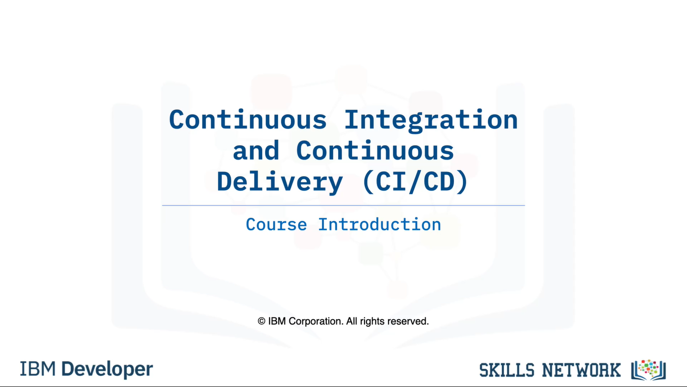
</p>
<!-- {width="4.0in" height="2.2529910323709537in"} -->

Hi, I'd like to welcome you to Continuous Integration and Continuous
Delivery (or CI/CD as it's commonly referred to).

This course will give you the skills you need to create automated
pipelines for continuously integrating all of your code changes and
continuously delivering those changes into an environment.

I will teach you the workflows and techniques that I use every day as a
software engineer at IBM.
<!--~~~~~~~~~~~~~~~~~~~~~~~~~~~~~~~~~~~~~~~~~~~~~~~~~~~~~~~~~~~~~~~~~~~~~~~~~~~~~~~~~~~~~~~~~~~~-->
<p align="center">
  
</p>
<!-- {width="4.0in" height="2.2829057305336833in"} -->

Ever since John Allspaw and Paul Hammond gave their now famous talk at
the 2009 Velocity conference, 10+ Deploys Per Day:

Dev and Ops Cooperation at Flickr, companies have been trying to figure
out how to deploy faster and with greater reliability.

Today, there are companies that deploy changes hundreds of times per day
to their many dev, test, and production environments.

How are they doing this?

They have embraced the DevOps mindset, and one of the fundamental tenets
of DevOps is to automate software delivery.

But the numbers are meaningless.

The goal should be to deploy at the speed of need.

You should be able to deploy as often as it makes sense for your
business.

But that deployment needs to be reliable and repeatable, and that
requires automation.

That's where CI/CD comes in.

It may seem overwhelming at first but as the old saying goes, "How do
you eat an elephant? One bite at a time!"

This course will break down the seemingly daunting task of setting up a
CI/CD pipeline into consumable, bite-size chunks and take you
step-by-step along the way. CI/CD is all about mean lead time, which is
how long it takes to go from idea to production.

And this mean lead time is gated by release frequency, which is how
often you can deliver a change.

We'll start with Continuous Integration, or CI.

That's the process of continuously integrating every developer change
into the main branch after a set of tests have been passed, resulting in
potentially deployable code. You'll learn the benefits of social coding
and how to use the Git Feature Branch Workflow. You\'ll get an overview
of some popular CI tools and then dive deep into how to use GitHub
Actions to create your CI pipeline.

Then we'll move on to Continuous Delivery, or CD.

CD is a software development discipline designed to ensure that code can
be rapidly and safely deployed to production at any time by delivering
every change to a production-like environment. This means that your main
branch should always be ready for deployment. In the CD module, you'll
learn about the benefits of CD and get an overview of some popular CD
tools.

Then we will dive deep into how to build a pipeline, task by task, using
a technology called Tekton. With Tekton, you can automate your
deployments right inside your Kubernetes cluster, and in the labs,
you'll deploy your pipeline to OpenShift.

So, join me in learning how to automate your software delivery practices
to achieve repeatable and reproducible delivery of your code every time
you deploy. Read the modules, immerse yourself in the labs, take the
quizzes, and interact with your peers on the forums because software
engineering is a team sport and collaboration is encouraged.

Please read on.

<h3>Pre-requisites</h3>

Before you take this course, you should know about the following topics:

-   [IT and cloud computing
    fundamentals  ](https://www.edx.org/course/introduction-to-cloud-computing-6)

-   [DevOps
    principles  ](https://www.edx.org/course/devops-basics-for-everyone)

-   [Containers and Kubernetes
    fundamentals  ](https://www.edx.org/course/introduction-to-containers-kubernetes-and-openshift?index=product_value_experiment_a&queryID=4e6974fe286fe5396bb65ecdc87f0b1b&position=1&linked_from=autocomplete&c=autocomplete)

-   [Linux
    commands  ](https://www.edx.org/course/linux-commands-shell-scripting?index=product_value_experiment_a&queryID=315e67a884ae7a79e62d72416cc7531c&position=1&linked_from=autocomplete&c=autocomplete)

-   [Git and
    GitHub  ](https://www.edx.org/course/introduction-to-git-and-github?index=product_value_experiment_a&queryID=29caf3aae9771d2d1fb0c1e5c46f9d4b&position=4&linked_from=autocomplete&c=autocomplete)

If you do not have this level of knowledge, click the links above to
view courses that can help you gain the skills required.

<h2 id="1-01">Module 1-01. Introduction to CI/CD</h2>

<!--~~~~~~~~~~~~~~~~~~~~~~~~~~~~~~~~~~~~~~~~~~~~~~~~~~~~~~~~~~~~~~~~~~~~~~~~~~~~~~~~~~~~~~~~~~~~-->
<p align="center">
  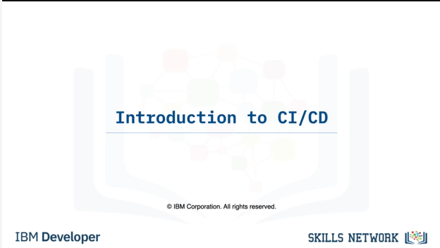
</p>
<!-- {width="4.0in" height="2.256410761154856in"} -->

<h3>Module Introduction</h3>

This module introduces you to Continuous Integration and Continuous
Delivery (CI/CD), an automated approach to software development. You'll
discover what CI and CD are and the benefits they bring to the DevOps
pipeline. You'll explore popular CI/CD tools and see why it's acceptable
for different teams within an organization to use different CI/CD tools.
You'll also learn about Infrastructure as Code (IaC), the process by
which you use code to automate the provision and management of your
infrastructure. 

<h3>Learning Objectives</h3>

-   Define Continuous Integration (CI) and Continuous Delivery (CD) and
    describe the key differences between them.

-   Identify common tools for CI/CD.

-   Define Infrastructure as Code (IaC) and explain its benefits for
    DevOps.

<h3>Welcome to Module 1, Introduction to CI/CD</h3>

In this module, you will get a broad introduction to Continuous
Integration and Continuous Delivery, or CI/CD as it is commonly referred
to, which is an automated approach to developing and delivering software
with repeatability and reliability.

You'll discover what CI and CD are and the benefits they bring when
implemented properly in your DevOps pipeline.

You'll explore popular CI/CD tools and see why it's acceptable for
different teams within an organization to use different CI/CD tools, as
long as they are eliminating manual procedures.

You'll also learn about Infrastructure as Code (or IaC), which is the
process by which you use code to automate the provisioning and the
management of your infrastructure.

IaC is a foundational concept for implementing automation.

There are no labs in this first module.

The goal is to gain a high-level understanding of what CI/CD is before
we dive deep into each topic individually.

Let\'s get started.

<h2 id="1-02">Module 1-02. What is CI/CD? (5:39)</h2>

Welcome to 'What Is CI/CD?'
<!--~~~~~~~~~~~~~~~~~~~~~~~~~~~~~~~~~~~~~~~~~~~~~~~~~~~~~~~~~~~~~~~~~~~~~~~~~~~~~~~~~~~~~~~~~~~~-->
<p align="center">
  
</p>
<!-- {width="4.0in" height="2.102564523184602in"} -->

After reading this chapter (2), you will be able to:

-   Explain what Continuous Integration and Continuous Delivery are,

-   Describe the key differences between Continuous Integration and
    Continuous Delivery, and

-   Explain the main benefits of CI/CD.

<!--~~~~~~~~~~~~~~~~~~~~~~~~~~~~~~~~~~~~~~~~~~~~~~~~~~~~~~~~~~~~~~~~~~~~~~~~~~~~~~~~~~~~~~~~~~~~-->
<p align="center">
  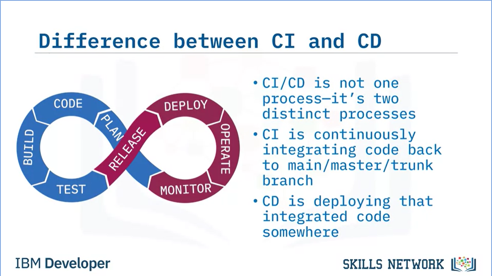
</p>
<!-- {width="4.0in" height="2.250426509186352in"} -->

It's important to understand the difference between Continuous
Integration and Continuous Delivery, because a lot of times, people say
'CI/CD' like it\'s one process, but it\'s not.

It's two separate and distinct processes that happen right after each
other.
<!--~~~~~~~~~~~~~~~~~~~~~~~~~~~~~~~~~~~~~~~~~~~~~~~~~~~~~~~~~~~~~~~~~~~~~~~~~~~~~~~~~~~~~~~~~~~~-->
<p align="center">
  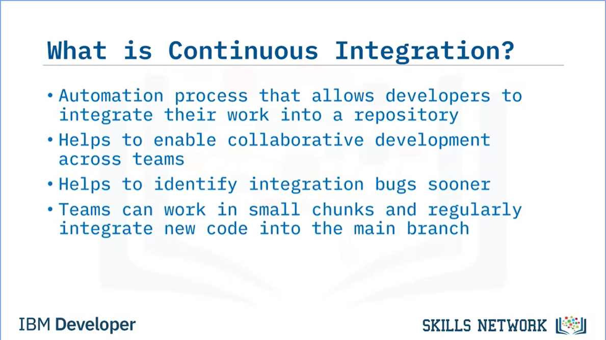
</p>
<!-- {width="4.0in" height="2.250426509186352in"} -->

Continuous Integration is continuously integrating your code back into
the main or master or trunk branch, so it shouldn\'t diverge too far
before you merge changes back into the main branch to make sure that it
works.

You are continuously integrating your code with the main codebase.

Whereas Continuous Delivery is then taking that integrated code and
deploying it somewhere.

You may deploy it every time you integrate it, or you may not deploy it
every time you integrate it.

You may have Continuous Integration on one loop testing branches and
pull requests.

And then, when you finally merge to main, you kick off the Continuous
Delivery part.

To define Continuous Integration, we say that CI is an automation
process that allows you to integrate your work into your repository.

You can also work as a team for the development of your application, and
you can easily identify bugs and errors in your application very
quickly.

Your team can work in small chunks in different areas of your
application and then easily and regularly merge the code into the
main branch.
<!--~~~~~~~~~~~~~~~~~~~~~~~~~~~~~~~~~~~~~~~~~~~~~~~~~~~~~~~~~~~~~~~~~~~~~~~~~~~~~~~~~~~~~~~~~~~~-->
<p align="center">
  
</p>
<!-- {width="4.0in" height="2.250426509186352in"} -->

Continuous Delivery is the next phase after Continuous Integration.

It prepares the code for the release of your application, and automates
the process that is required to deploy and build your application.
<!--~~~~~~~~~~~~~~~~~~~~~~~~~~~~~~~~~~~~~~~~~~~~~~~~~~~~~~~~~~~~~~~~~~~~~~~~~~~~~~~~~~~~~~~~~~~~-->
<p align="center">
  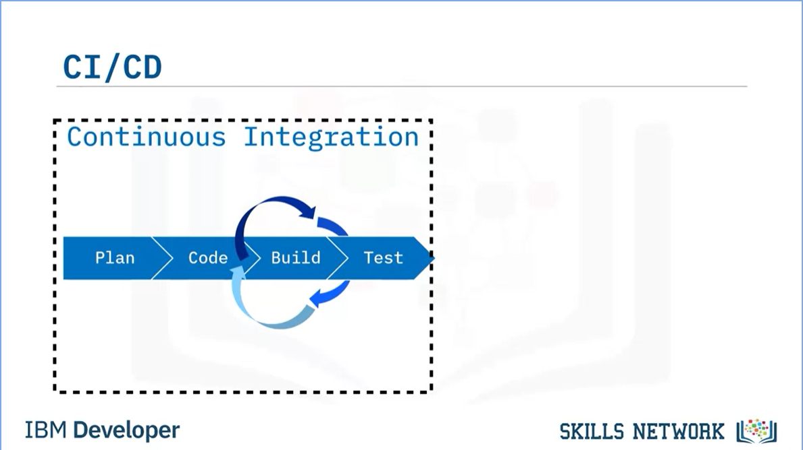
</p>
<!-- {width="4.0in" height="2.247435476815398in"} -->

Continuous Integration and Continuous Delivery are broken into several
distinct phases.

Continuous Integration consists of the Plan, Code, Build, and Test
phases.

This is where developers plan and then code the solution, and then build
it and test it in several repeating cycles until it's complete.

And then the solution is ready to be delivered.
<!--~~~~~~~~~~~~~~~~~~~~~~~~~~~~~~~~~~~~~~~~~~~~~~~~~~~~~~~~~~~~~~~~~~~~~~~~~~~~~~~~~~~~~~~~~~~~-->
<p align="center">
  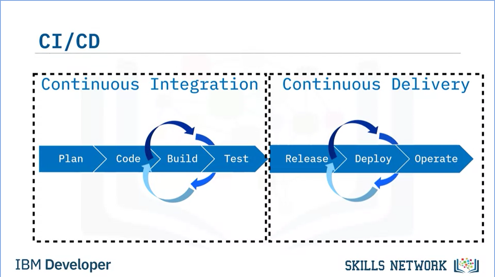
</p>
<!-- {width="4.0in" height="2.247435476815398in"} -->

While Continuous Delivery is made up of Release, Deploy, and Operate
phases, where the solution is released, and the binaries are deployed
into a given environment in repeating cycles, and the solution is then
in live operation from that point on.

It's important to differentiate them as we discuss CI/CD because they
are two very distinct processes that cover very different phases.

<!--~~~~~~~~~~~~~~~~~~~~~~~~~~~~~~~~~~~~~~~~~~~~~~~~~~~~~~~~~~~~~~~~~~~~~~~~~~~~~~~~~~~~~~~~~~~~-->
<p align="center">
  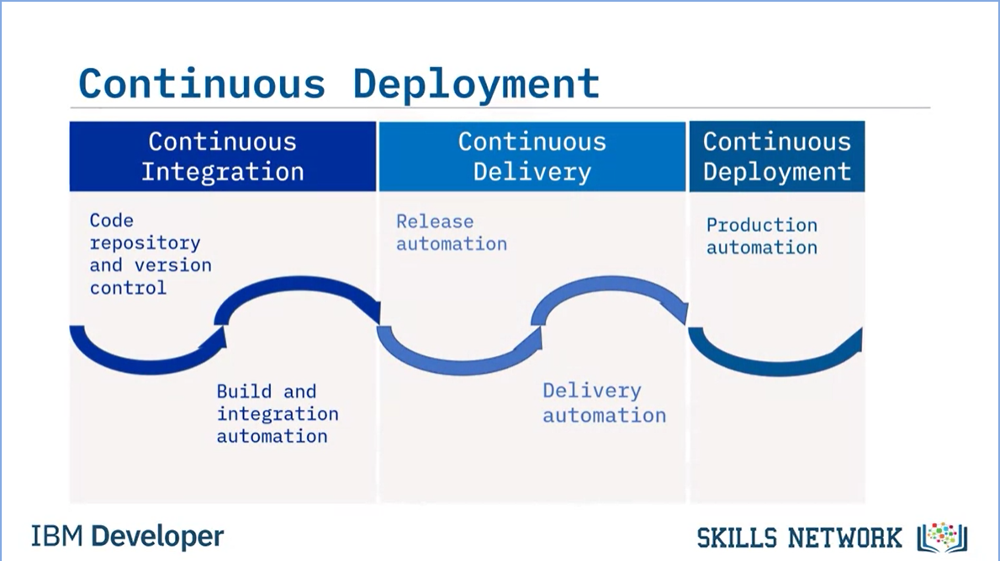
</p>
<!-- {width="4.0in" height="2.247435476815398in"} -->

There's also a third concept called Continuous Deployment, which should
maybe be called Continuous Release or something to make it less
confusing because of the existing CI/CD terminology.

The difference is subtle and so when someone says 'Continuous Delivery',
you usually know what they mean.

But when someone says 'Continuous Deployment', you have to ask them, do
you really mean 'deploying to production?'

Because that\'s what most people think of when you use the term
continuous deployment.
<!--~~~~~~~~~~~~~~~~~~~~~~~~~~~~~~~~~~~~~~~~~~~~~~~~~~~~~~~~~~~~~~~~~~~~~~~~~~~~~~~~~~~~~~~~~~~~-->
<p align="center">
  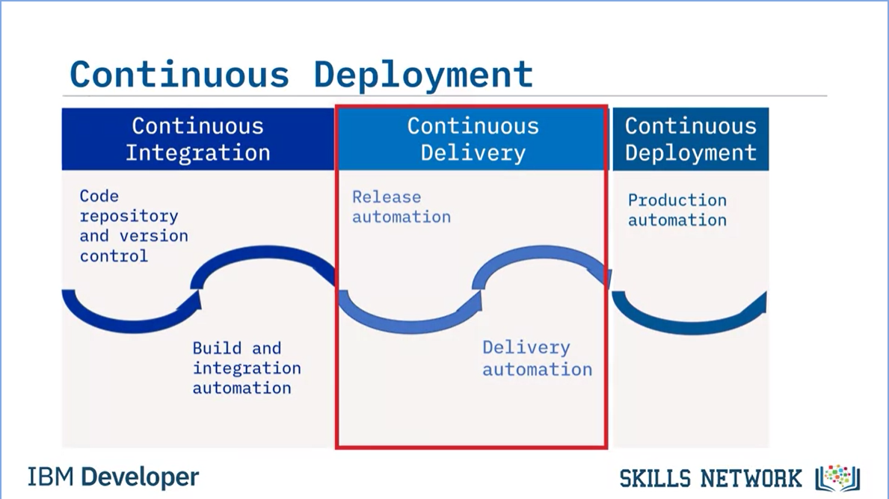
</p>
<!-- {width="4.0in" height="2.247435476815398in"} -->

To avoid confusion, remember that 'Continuous Delivery' is when you
deploy it somewhere, like a development server, a staging server, a test
server, or a pre-production server,
<!--~~~~~~~~~~~~~~~~~~~~~~~~~~~~~~~~~~~~~~~~~~~~~~~~~~~~~~~~~~~~~~~~~~~~~~~~~~~~~~~~~~~~~~~~~~~~-->
<p align="center">
  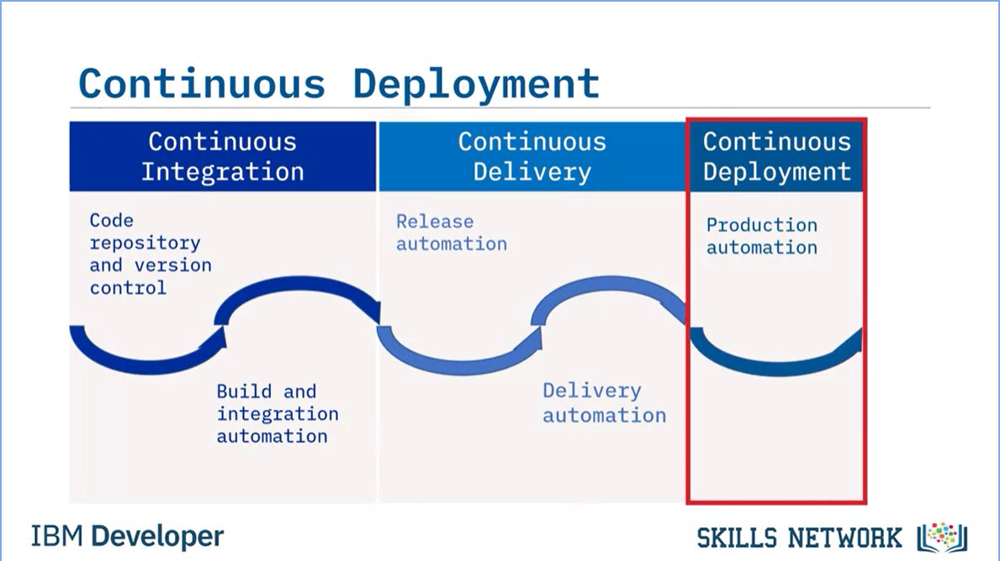
</p>
<!-- {width="4.0in" height="2.247435476815398in"} -->

whereas 'Continuous Deployment' is reserved for when you actually
continuously push to production.

So, you\'ll hear these two terms, 'Continuous Delivery' and 'Continuous
Deployment,' and it's important to understand that they don't mean the
same thing.

'Continuous Delivery' is delivering it somewhere other than production,
and 'Continuous Deployment' is delivering it to production.
<!--~~~~~~~~~~~~~~~~~~~~~~~~~~~~~~~~~~~~~~~~~~~~~~~~~~~~~~~~~~~~~~~~~~~~~~~~~~~~~~~~~~~~~~~~~~~~-->
<p align="center">
  
</p>
<!-- {width="4.0in" height="2.2538462379702535in"} -->

It's also important to understand where CI/CD sits in terms of the
DevOps pipeline.

The DevOps pipeline consists of Plan, Develop, Build, Test, and Deploy
phases, and so, when we talk about CI/CD,
<!--~~~~~~~~~~~~~~~~~~~~~~~~~~~~~~~~~~~~~~~~~~~~~~~~~~~~~~~~~~~~~~~~~~~~~~~~~~~~~~~~~~~~~~~~~~~~-->
<p align="center">
  
</p>
<!-- {width="4.0in" height="2.2538462379702535in"} -->

we\'re in the Build and Test phases of the DevOps pipeline.
<!--~~~~~~~~~~~~~~~~~~~~~~~~~~~~~~~~~~~~~~~~~~~~~~~~~~~~~~~~~~~~~~~~~~~~~~~~~~~~~~~~~~~~~~~~~~~~-->
<p align="center">
  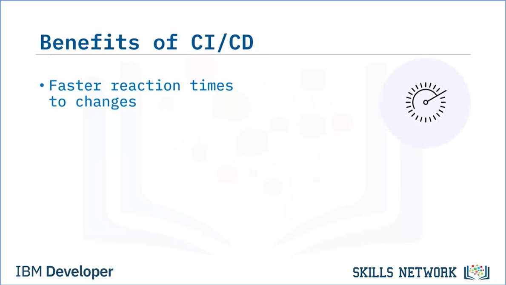
</p>
<!-- {width="4.0in" height="2.2538462379702535in"} -->

There are several key benefits to CI/CD.

The first benefit is that you'll get faster reaction times to code
changes.

You're no longer waiting to see the effects of a change.

It automatically gets built and tested and deployed.
<!--~~~~~~~~~~~~~~~~~~~~~~~~~~~~~~~~~~~~~~~~~~~~~~~~~~~~~~~~~~~~~~~~~~~~~~~~~~~~~~~~~~~~~~~~~~~~-->
<p align="center">
  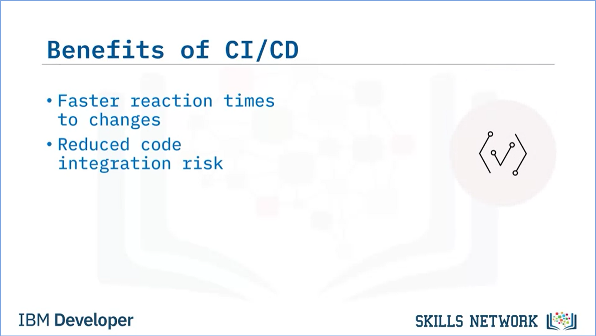
</p>
<!-- {width="4.0in" height="2.2538462379702535in"} -->

You'll also get the benefit of reduced code integration risk.

The more often you integrate, the less time there is for change.

So, integrating more often means less risk of something breaking.
<!--~~~~~~~~~~~~~~~~~~~~~~~~~~~~~~~~~~~~~~~~~~~~~~~~~~~~~~~~~~~~~~~~~~~~~~~~~~~~~~~~~~~~~~~~~~~~-->
<p align="center">
  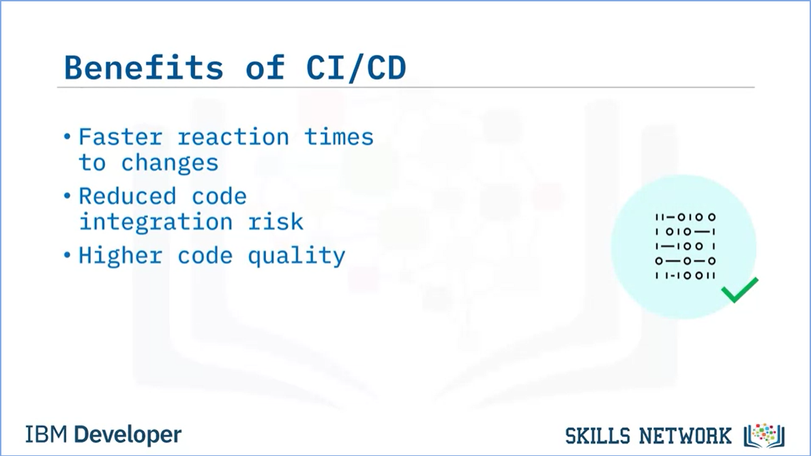
</p>
<!-- {width="4.0in" height="2.2538462379702535in"} -->

Another benefit is that you get higher code quality with CI/CD, because
things are constantly being reviewed and constantly being tested, and
every pull request is an opportunity for a code review.
<!--~~~~~~~~~~~~~~~~~~~~~~~~~~~~~~~~~~~~~~~~~~~~~~~~~~~~~~~~~~~~~~~~~~~~~~~~~~~~~~~~~~~~~~~~~~~~-->
<p align="center">
  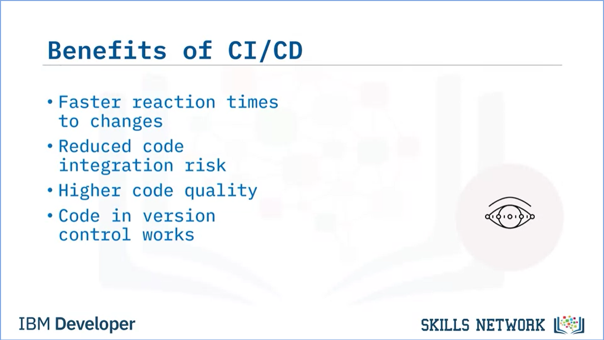
</p>
<!-- {width="4.0in" height="2.2538462379702535in"} -->

You also know the code in version control works.

It's a common practice to ensure that the code in the main or master
branch is always deployable.
<!--~~~~~~~~~~~~~~~~~~~~~~~~~~~~~~~~~~~~~~~~~~~~~~~~~~~~~~~~~~~~~~~~~~~~~~~~~~~~~~~~~~~~~~~~~~~~-->
<p align="center">
  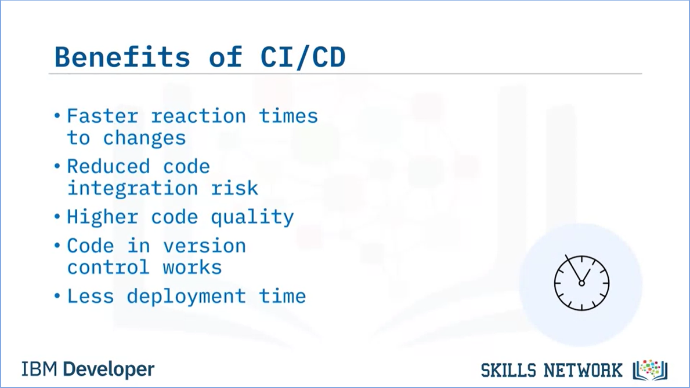
</p>
<!-- {width="4.0in" height="2.2538462379702535in"} -->

And lastly, CI/CD takes less deployment time because everything is
already tested, and deployments are automated, so they happen faster
with greater repeatability.

<!--~~~~~~~~~~~~~~~~~~~~~~~~~~~~~~~~~~~~~~~~~~~~~~~~~~~~~~~~~~~~~~~~~~~~~~~~~~~~~~~~~~~~~~~~~~~~-->
<p align="center">
  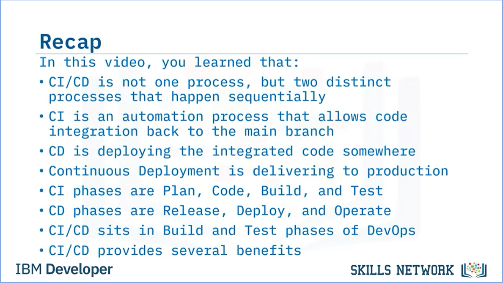
</p>
<!-- {width="4.0in" height="2.2538462379702535in"} -->

In this module (2), you learned that:

-   CI/CD is not one process, it's two separate and distinct processes
    that happen sequentially.

-   Continuous Integration is an automation process that allows
    developers to continuously integrate their code back into the main
    or master branch,

-   Continuous Delivery is the next phase after CI, that takes
    integrated code and deploys it somewhere like a staging, testing, or
    preproduction server,

-   Continuous Deployment is delivering the code to production,

-   CI consists of the Plan, Code, Build, and Test phases,

-   CD consists of the Release, Deploy, and Operate phases,

-   CI/CD sits in the Build and Test phases of the DevOps pipeline, and

-   There are several benefits to CI/CD.

<h2 id="1-03">Module 1-03. Platform and Tools (3:01)</h2>

Welcome to 'Platform and Tools'.

<!--~~~~~~~~~~~~~~~~~~~~~~~~~~~~~~~~~~~~~~~~~~~~~~~~~~~~~~~~~~~~~~~~~~~~~~~~~~~~~~~~~~~~~~~~~~~~-->
<p align="center">
  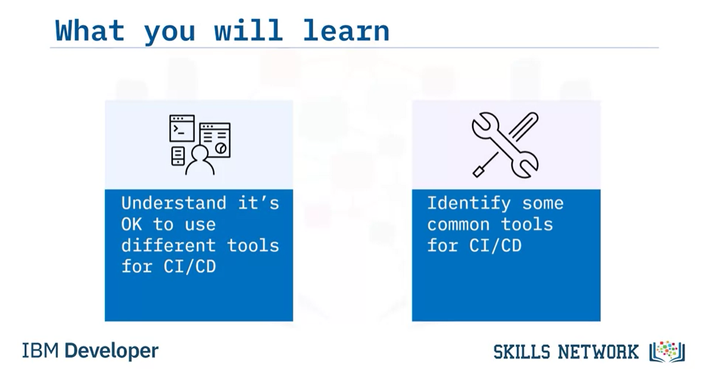
</p>
<!-- {width="4.0in" height="2.095726159230096in"} -->

After this module, you will be able to:

Understand it's Ok to use different tools for CI/CD, and identify some
common tools for CI/CD.

<!--~~~~~~~~~~~~~~~~~~~~~~~~~~~~~~~~~~~~~~~~~~~~~~~~~~~~~~~~~~~~~~~~~~~~~~~~~~~~~~~~~~~~~~~~~~~~-->
<p align="center">
  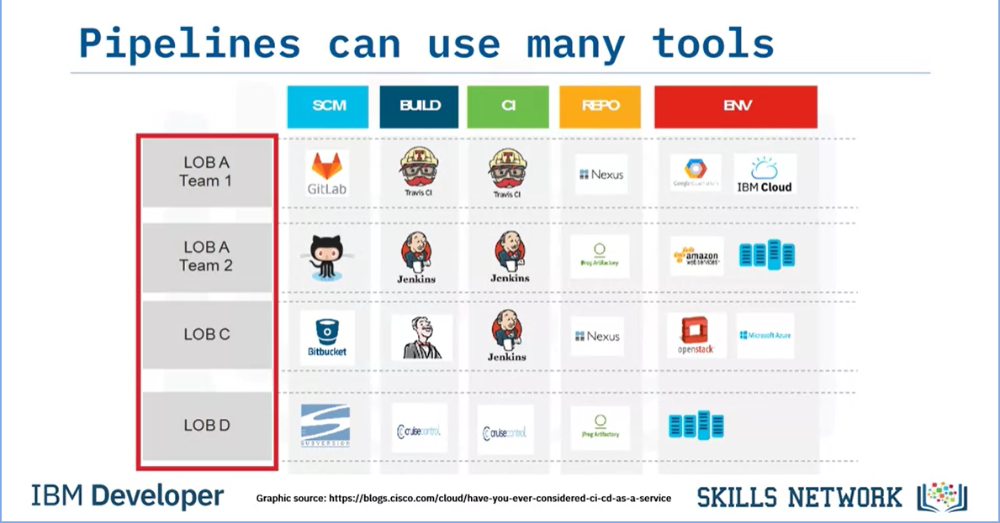
</p>
<!-- {width="4.0in" height="2.095726159230096in"} -->

There are lots of tools your pipelines can use even within the same
company.

Different line of business applications (or LOBs) within a single
organization being run by different teams, might be using different
tools, and it doesn't matter that they use different tools.

So, their source code management systems, their build systems, their
continuous integration systems, their repositories, and so on, might be
running on different tools.

Maybe there's Jenkins, there's Travis, there's Nexus and there's JFrog
Artifactory, but the specific tool being used isn't important.

What matters is that they're using a tool to automate these processes
instead of doing them manually.

<!--~~~~~~~~~~~~~~~~~~~~~~~~~~~~~~~~~~~~~~~~~~~~~~~~~~~~~~~~~~~~~~~~~~~~~~~~~~~~~~~~~~~~~~~~~~~~-->
<p align="center">
  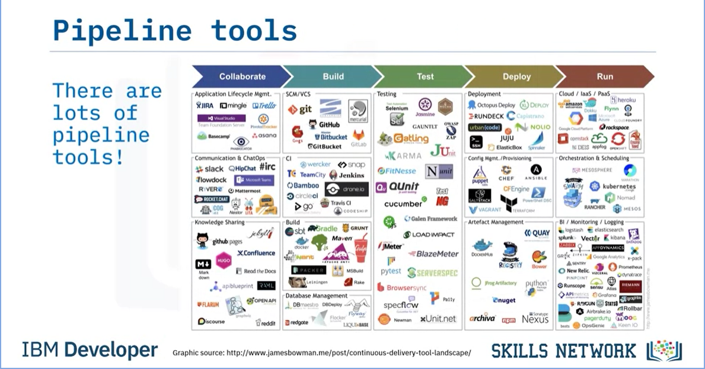
</p>
<!-- {width="4.0in" height="2.095727252843395in"} -->

In fact, there\'s a plethora of tools for CI/CD you can choose from.

<!--~~~~~~~~~~~~~~~~~~~~~~~~~~~~~~~~~~~~~~~~~~~~~~~~~~~~~~~~~~~~~~~~~~~~~~~~~~~~~~~~~~~~~~~~~~~~-->
<p align="center">
  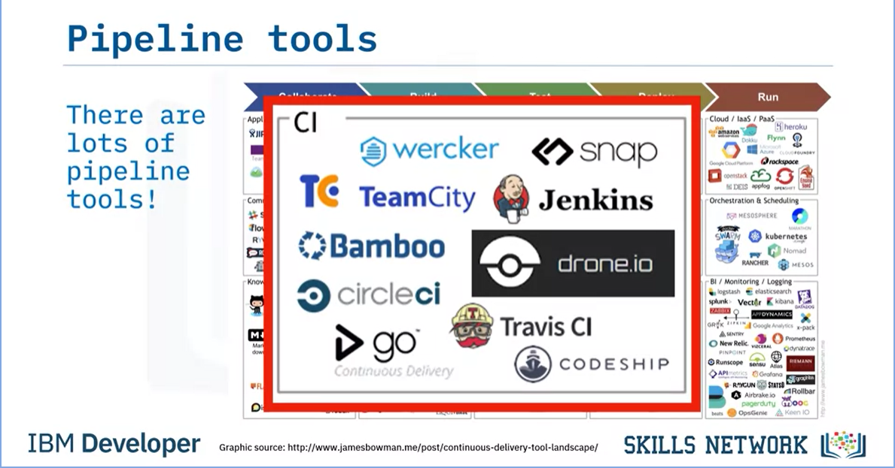
</p>
<!-- {width="4.0in" height="2.095726159230096in"} -->

For example, if you look at just the 'CI' box in the 'Build' column of
this diagram of pipeline tools, you can see Team City, Jenkins, Travis
CI, Bamboo, Codeship, Snap, and Go, to name but a few.

And you will find that most of the top ones all seem similar and have
similar ways of working and similar concepts.

So, if you try out a tool, and decide that you don\'t like it, you can
just keep trying new ones until you find a tool that you like to use.

<!--~~~~~~~~~~~~~~~~~~~~~~~~~~~~~~~~~~~~~~~~~~~~~~~~~~~~~~~~~~~~~~~~~~~~~~~~~~~~~~~~~~~~~~~~~~~~-->
<p align="center">
  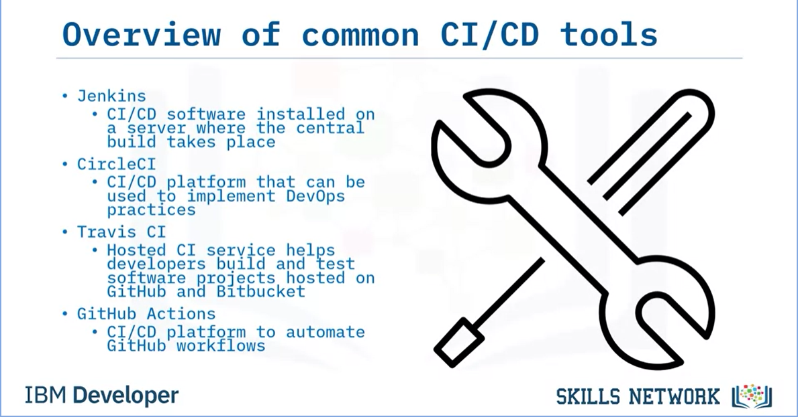
</p>
<!-- {width="4.0in" height="2.095726159230096in"} -->

Let's have a brief overview of some of the common tools for CI/CD.

Jenkins is CI/CD software that is installed on a server where the
central build will take place.

It is one of the oldest, most popular, and most complex of all the CI/CD
tools.

Circle CI is a CI/CD platform that can be used to implement DevOps
practices.

It performs deployments for Continuous Delivery and you define workflows
inside a 'circle.yaml' file.

Travis CI is a hosted CI service that helps developers build and test
software projects hosted on GitHub and Bitbucket.

Travis CI was the first CI service to provide free services to
open-source projects.

It also performs deployments for Continuous Delivery and you define a
workflow inside a '. travis.yaml' file.

GitHub Actions is a CI/CD platform that enables you to automate your
build, test, and deploy GitHub workflows. Unlike other tools, it only
works with GitHub.

<!--~~~~~~~~~~~~~~~~~~~~~~~~~~~~~~~~~~~~~~~~~~~~~~~~~~~~~~~~~~~~~~~~~~~~~~~~~~~~~~~~~~~~~~~~~~~~-->
<p align="center">
  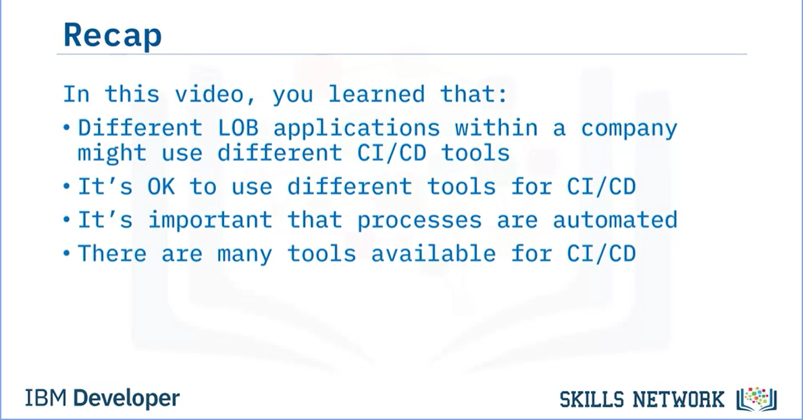
</p>
<!-- {width="4.0in" height="2.095726159230096in"} -->

In this chapter (3), you learned that different line of business
applications within the same organization may have many teams each using
different tools.

It's OK to use different tools for CI/CD, what's important is that the
processes are being automated instead of being done manually, and there
are a lot of tools out there for CI/CD and you can keep trying new ones
until you find one that you like to use.

<h2 id="1-04">Module 1-04. What is Infrastructure as Code? (8:25)</h2>

Welcome to Infrastructure as Code.

<!--~~~~~~~~~~~~~~~~~~~~~~~~~~~~~~~~~~~~~~~~~~~~~~~~~~~~~~~~~~~~~~~~~~~~~~~~~~~~~~~~~~~~~~~~~~~~-->
<p align="center">
  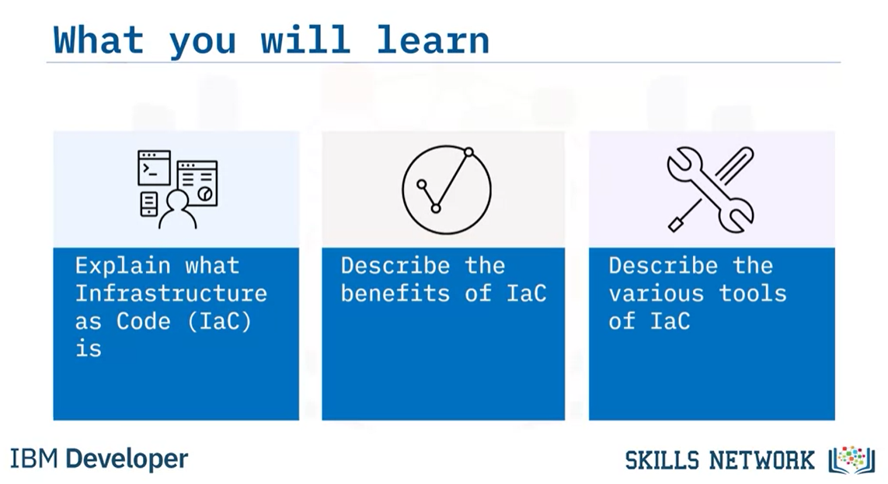
</p>
<!-- {width="4.0in" height="2.18034230096238in"} -->

After this chapter (4), you will be able to explain what Infrastructure
as Code is, describe the benefits of IaC, and describe the various tools
of IaC.

<!--~~~~~~~~~~~~~~~~~~~~~~~~~~~~~~~~~~~~~~~~~~~~~~~~~~~~~~~~~~~~~~~~~~~~~~~~~~~~~~~~~~~~~~~~~~~~-->
<p align="center">
  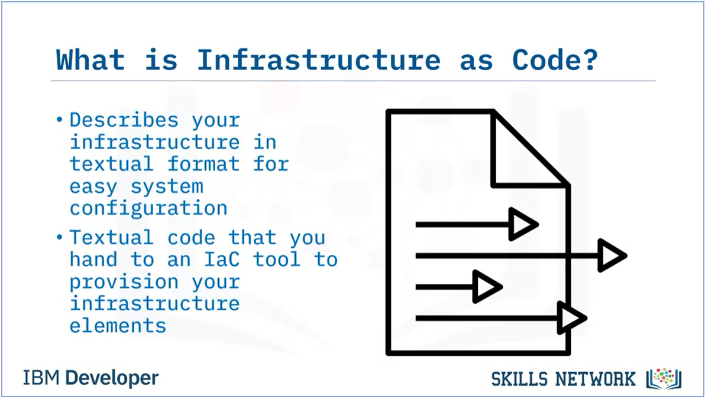
</p>
<!-- {width="4.0in" height="2.258546587926509in"} -->

Let's discuss what we mean by Infrastructure as Code, or IaC.

It provides a great way for you to describe your infrastructure in a
textual format.

But I\'m not referring to a word processing document.

We're talking about a textual file format that you could actually use to
configure your systems much like code.

We're talking about textual code that you can hand to an IaC tool.

That tool reads the code and then builds your servers, and networks, and
storage, etc.---essentially the core infrastructure elements that you
need.

Using these tools with this textual code means that everyone gets the
same environment every time, so it's consistent and repeatable.

Textual code is normally written in the YAML format, which is a very
common way to write and declare IaC.

<!--~~~~~~~~~~~~~~~~~~~~~~~~~~~~~~~~~~~~~~~~~~~~~~~~~~~~~~~~~~~~~~~~~~~~~~~~~~~~~~~~~~~~~~~~~~~~-->
<p align="center">
  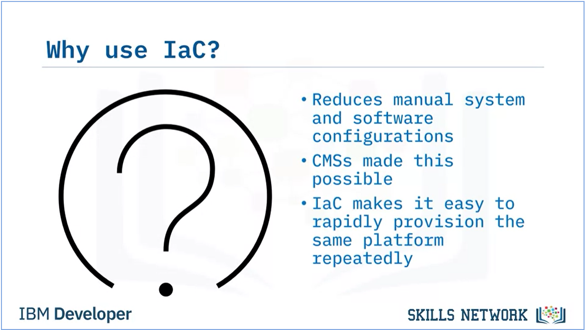
</p>
<!-- {width="4.0in" height="2.258546587926509in"} -->

So, why are we discussing Infrastructure as Code in this course?

Well, performing these system configurations manually is error-prone,
not to mention, time-consuming.

You can use templates or commands to describe how to install
and configure the system according to your needs, how much storage you
want, how much processing power you want, and so on.

In the early days of DevOps, Configuration Management Systems (or CMSs)
made this possible, and they predated the newer IaC tools, so they were
all you had to perform tasks with.

We'll discuss CMSs in more detail later.

Due to repeatable configuration, you can rapidly provision the same
platform over and over again and be sure that it will be in the same
state every time.

<!--~~~~~~~~~~~~~~~~~~~~~~~~~~~~~~~~~~~~~~~~~~~~~~~~~~~~~~~~~~~~~~~~~~~~~~~~~~~~~~~~~~~~~~~~~~~~-->
<p align="center">
  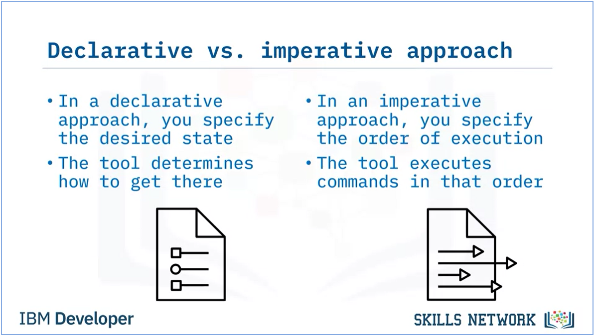
</p>
<!-- {width="4.0in" height="2.258546587926509in"} -->

Infrastructure as code tools can be either declarative or imperative.

With the declarative approach, you specify the desired state of the
infrastructure resources you want to provision, and then the IaC tool
determines how to achieve this state.

It handles dependencies and executes commands in the proper order
without you having to specify the order of execution.

Tools that use this approach include Terraform, Puppet, SaltStack,
CloudFormation, and to some extent, Ansible.

The imperative approach, in contrast, requires that you define the
specific order of the commands needed to achieve the desired state.

It's up to you to get the dependencies correct as the tool will execute
commands in the order you specify.

Tools like Chef are imperative and to some extent, Ansible can be as
well.

<!--~~~~~~~~~~~~~~~~~~~~~~~~~~~~~~~~~~~~~~~~~~~~~~~~~~~~~~~~~~~~~~~~~~~~~~~~~~~~~~~~~~~~~~~~~~~~-->
<p align="center">
  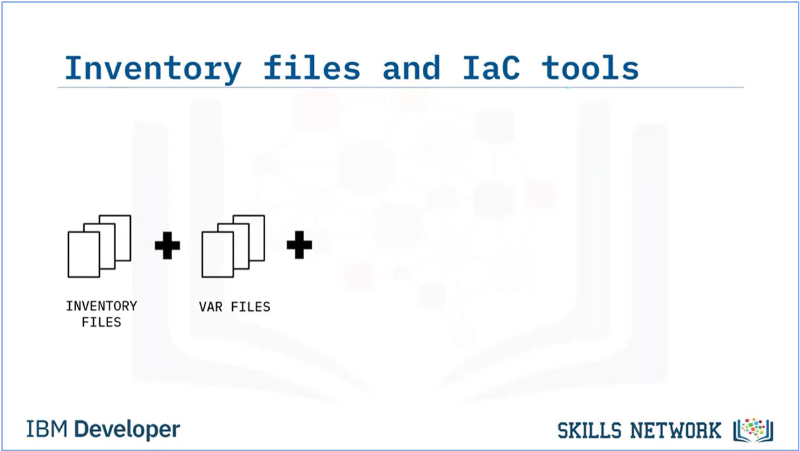
</p>
<!-- {width="4.0in" height="2.258546587926509in"} -->

Let's take a look at how Ansible uses inventory files, and VAR files, to
see how they work as an IaC tool.

Here, we are using Ansible playbooks as an illustrative example, but the
process is essentially the same with other IaC tools.

Chef has cookbooks and recipes, Ansible has Playbooks and Plays.

They are essentially the same thing.

Inventory files have a list of servers or devices that can be in the
form of IP addresses or hostnames.

They can also specify groupings of servers like all of the web servers
or all of the database servers.

This is how Ansible knows what to operate on.

There are also VAR files contain the relevant variables that may be
needed whenever a playbook is run on a device or group of devices.

You can control how Ansible interacts with remote hosts or devices based
on how you define variables.

The inventory files make up the most basic building block of Ansible
architecture.

You must reference the inventory files when executing Ansible or an
Ansible playbook.

<!--~~~~~~~~~~~~~~~~~~~~~~~~~~~~~~~~~~~~~~~~~~~~~~~~~~~~~~~~~~~~~~~~~~~~~~~~~~~~~~~~~~~~~~~~~~~~-->
<p align="center">
  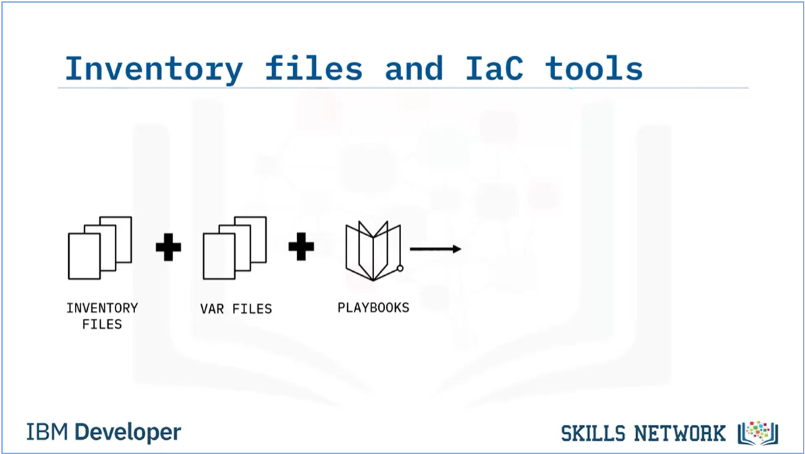
</p>
<!-- {width="4.0in" height="2.258546587926509in"} -->

So, Ansible has this notion of a playbook that contains any number of
plays.

Plays contain the instructions to be carried out on each server or
device.

Plays can also be targeted at specific groups of servers, like all of
the web servers or all of the database servers.

So, a playbook is a collection reusable plays that are instructions that
you give to Ansible to carry out.

<!--~~~~~~~~~~~~~~~~~~~~~~~~~~~~~~~~~~~~~~~~~~~~~~~~~~~~~~~~~~~~~~~~~~~~~~~~~~~~~~~~~~~~~~~~~~~~-->
<p align="center">
  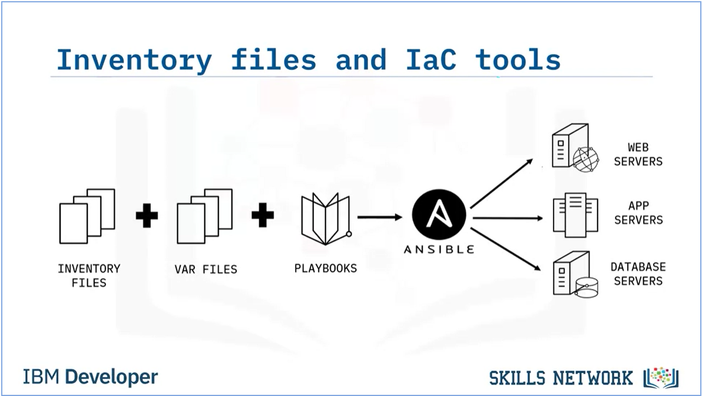
</p>
<!-- {width="4.0in" height="2.258546587926509in"} -->

Ansible will read the playbook, determine which servers from the
inventory that the plays are appropriate for, and execute the plays on
each of these servers.

So, you could determine that you need to set up a web server, an app
server, and a database server, or maybe two web servers, and three app
servers, or maybe even change the existing configuration of a server.

Whatever you need to do, Ansible will make all of the necessary
configuration changes and provision all the things you need for your
infrastructure.

It\'s also important to note that Ansible is idempotent.

It will not affect a server if it is already in the desired state.

This allows you to be able to reapply a playbook and not worry about it
installing things twice.

Ansible will take care not to do that if it isn\'t needed.

<!--~~~~~~~~~~~~~~~~~~~~~~~~~~~~~~~~~~~~~~~~~~~~~~~~~~~~~~~~~~~~~~~~~~~~~~~~~~~~~~~~~~~~~~~~~~~~-->
<p align="center">
  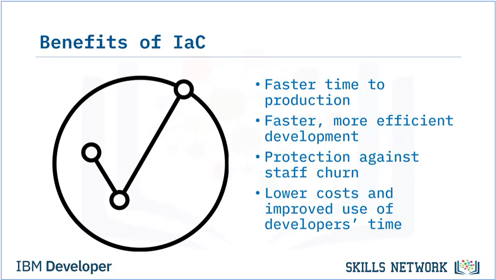
</p>
<!-- {width="4.0in" height="2.258546587926509in"} -->

So, what are the benefits of using IaC?

IaC automation dramatically speeds up the process of provisioning
infrastructure for development, tests, and production (and for scaling
or taking down production infrastructure as needed).

It can even automate the provisioning of legacy infrastructure, which
might otherwise be governed by time-consuming processes like requiring
you to open a ticket and waiting for someone to manually do it.

Developers can quickly provision sandboxes and Continuous
Integration/Continuous Delivery environments, and QA can quickly provide
full-fidelity test environments.

IaC ensures that provisioning intelligence always remains with the
organization.

In the past, the knowledge of how to configure servers may have been
known by only a few people in your organization.

Once you codify this knowledge using infrastructure as code, everyone is
able to provision what they need, and the fear of losing tribal
knowledge through staff churn is no longer an issue.

Finally, IaC lets organizations take maximum advantage of cloud
computing\'s consumption-based cost structure.

It reduces the time, effort, and specialized skill required to provision
and scale infrastructure.

It also enables developers to spend less time on plumbing and more time
on mission-critical software solutions.

<!--~~~~~~~~~~~~~~~~~~~~~~~~~~~~~~~~~~~~~~~~~~~~~~~~~~~~~~~~~~~~~~~~~~~~~~~~~~~~~~~~~~~~~~~~~~~~-->
<p align="center">
  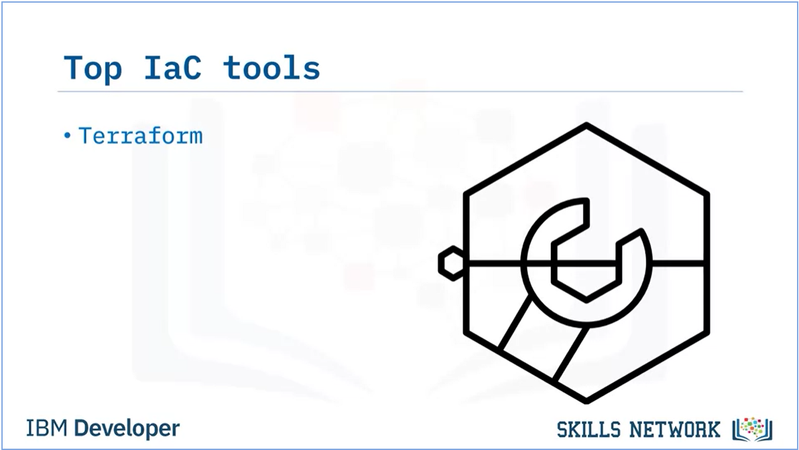
</p>
<!-- {width="4.0in" height="2.258546587926509in"} -->

Now, let's briefly discuss some of the main IaC tools available.

Terraform is an IaC tool by Hashi Corp that is free and open source.

It uses a declarative approach to IaC with a pre-execution check to
ensure that it will do what you expect it to do.

You can use Terraform as a base tool in combination with Ansible where
Terraform provisions the base infrastructure and Ansible configures the
software on top of it.

It is a very popular tool for cloud provisioning.

<!--~~~~~~~~~~~~~~~~~~~~~~~~~~~~~~~~~~~~~~~~~~~~~~~~~~~~~~~~~~~~~~~~~~~~~~~~~~~~~~~~~~~~~~~~~~~~-->
<p align="center">
  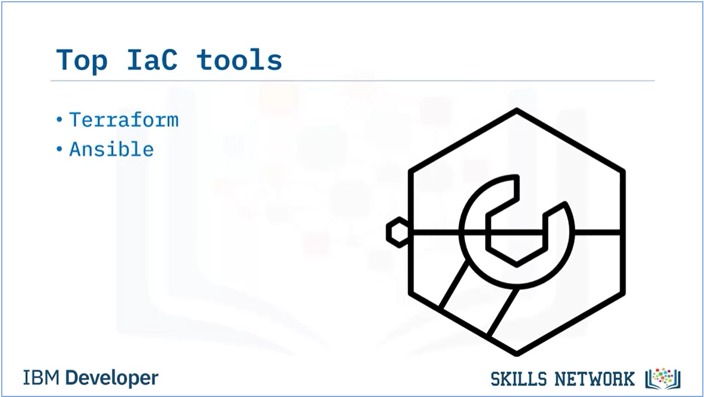
</p>
<!-- {width="4.0in" height="2.258546587926509in"} -->

Ansible is an open-source tool that automates IT tools such as
intra-service orchestration, application deployment, cloud provisioning,
and more.

It uses familiar YAML files to describe the state that you want to
achieve.

Ansible is simple to set up because it doesn\'t require any client-side
agents or bespoke security infrastructure, and it works by simply
delivering modules to clients.

This makes it ideal for memory-constrained environments like configuring
Internet of Things devices.

These modules are run on the client side and the results are sent back
to the Ansible server.

<!--~~~~~~~~~~~~~~~~~~~~~~~~~~~~~~~~~~~~~~~~~~~~~~~~~~~~~~~~~~~~~~~~~~~~~~~~~~~~~~~~~~~~~~~~~~~~-->
<p align="center">
  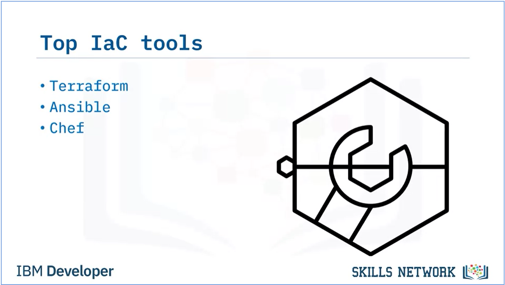
</p>
<!-- {width="4.0in" height="2.258546587926509in"} -->

Chef describes the necessary steps to reach a final state rather than
describing the state itself.

Using "Cookbooks," you can describe various processes by which you can
configure a system to achieve the desired state.

One of the strengths of Chef is that it's a popular tool and has lots of
support but one of the drawbacks is that cookbooks are written in Ruby
so you need to have Ruby skills on your team.

<!--~~~~~~~~~~~~~~~~~~~~~~~~~~~~~~~~~~~~~~~~~~~~~~~~~~~~~~~~~~~~~~~~~~~~~~~~~~~~~~~~~~~~~~~~~~~~-->
<p align="center">
  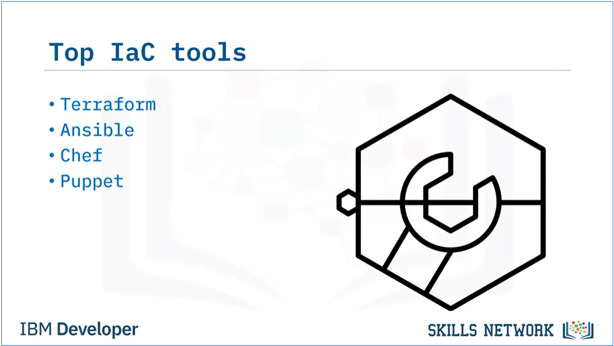
</p>
<!-- {width="4.0in" height="2.258546587926509in"} -->

With Puppet, you can use any existing platform.

The main difference between Puppet and Chef is that Puppet is
declarative, which some consider to be a preferred method.

<!--~~~~~~~~~~~~~~~~~~~~~~~~~~~~~~~~~~~~~~~~~~~~~~~~~~~~~~~~~~~~~~~~~~~~~~~~~~~~~~~~~~~~~~~~~~~~-->
<p align="center">
  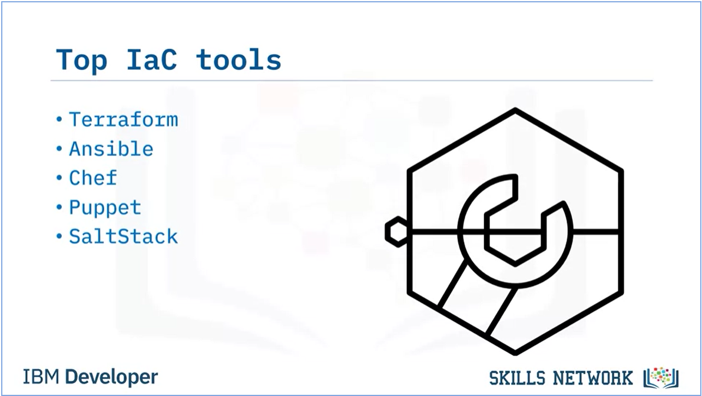
</p>
<!-- {width="4.0in" height="2.258546587926509in"} -->

SaltStack's remote execution capabilities allow administrators to run
commands on various machines in parallel with a flexible targeting
system.

SaltStack is designed to allow users to explicitly target and issue
commands to multiple machines directly.

<!--~~~~~~~~~~~~~~~~~~~~~~~~~~~~~~~~~~~~~~~~~~~~~~~~~~~~~~~~~~~~~~~~~~~~~~~~~~~~~~~~~~~~~~~~~~~~-->
<p align="center">
  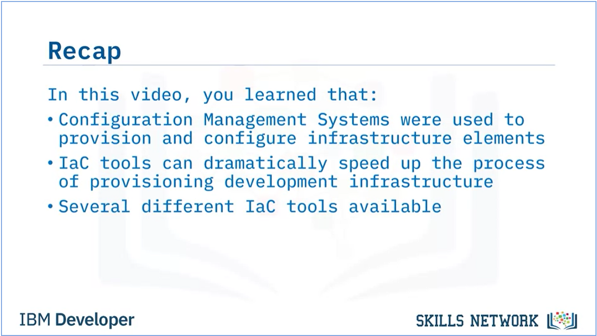
</p>
<!-- {width="4.0in" height="2.258546587926509in"} -->

In this module, you learned that;

-   Configuration Management Systems were really the only tools
    available to configure infrastructure systems before IaC tools
    became available,

-   IaC tools can dramatically speed up the process of provisioning your
    development environment's infrastructure, and

-   There are several different flavors of IaC tools available.

<h3>Reading: Summary & Highlights</h3>

Congratulations! You have completed this lesson. At this point in the
course, you know:

-   Continuous Integration (CI) and Continuous Delivery (CD) are two
    separate and distinct processes that occur sequentially. 

-   CI is an automation process by which developers continuously
    integrate code into the main branch. 

-   CD automatically deploys this integrated code somewhere like a
    staging, testing, or preproduction server. 

-   CI consists of the Plan, Code, Build, and Test phases. 

-   CD consists of the Release, Deploy, and Operate phases. 

-   It's acceptable for different teams within an organization to use
    different tools for CI/CD. What's important is that the processes
    are automated. 

-   You can choose the CI/CD tool that works best for you. 

-   Infrastructure as Code (IaC) tools can dramatically speed up the
    provisioning and management of your development environment's
    infrastructure. 

-   You can choose from a wide array of IaC tools. 

<h1>Module 2. Continuous Integration - Introduction and Learning Objectives</h1>

<h3>Module Introduction</h3>

This module provides an overview of Continuous Integration (CI). You
will learn the features of CI and its benefits for DevOps. You will
explore social coding, a core concept underlying CI, and the four steps
for conducting it. You will learn about Git, the version control system
(VCS) that enables DevOps. You will examine the five steps of the Git
Feature Branch Workflow and the Git commands essential for performing
them. You will then learn about standard CI tools, starting with
Jenkins, CircleCI, and Travis CI. You will explore another CI tool,
GitHub Actions, in greater depth. You will discover the features and
benefits it provides for CI. You will learn about GitHub Actions
workflows and their essential components: events, runners, jobs, steps,
and actions. You'll even practice using GitHub Actions to set up and
trigger a CI workflow and automate code coverage reporting. 

<h3>Learning Objectives</h3>

-   Describe the essential features of Continuous Integration (CI).

-   Discuss the key benefits of CI for DevOps.

-   Define social coding and summarize how it works in practice.

-   Explain Git and its Feature Branch Workflow.

-   Describe Git's pull request workflow.

-   Discuss how to implement Jenkins, CircleCI, and Travis CI in a CI
    workflow.

-   Summarize the features of, and concepts behind, GitHub Actions.

-   Explain the event and job components of GitHub Actions.

-   Explain the runner, step, and action components of GitHub Actions.

-   Construct and trigger a CI workflow using GitHub Actions.

-   Integrate automatic code coverage reporting into a CI workflow in
    GitHub Actions.

<h2 id="2-01">Module 2-01. Continuous Integration (1:50)</h2>

Welcome to Module 2, Continuous Integration.

This module will give you a broad overview of Continuous Integration (or
CI).

You'll start with learning the features of CI and the benefits it has
for DevOps.

You'll explore social coding, a practice that is widely used in the
open-source community and is being adopted for inner source by many
companies who want to gain the efficiency and benefits it has to offer.

In support of that, you'll learn about the Git version control system,
how to practice the Git Feature Branch Workflow, and the essential
commands required to manage it.

This workflow will ensure you are following good DevOps practices and
working in small batches so that your development work never strays too
far from the main codebase.

Then, we'll look at some popular CI tools like Jenkins, CircleCI, and
Travis CI to compare the similarities and differences.

But the tool that you will dive deep into is GitHub Actions.

It's a relatively new tool that is rapidly gaining popularity and is
available on every GitHub repository.

We'll go into great detail on the events, runners, jobs, steps, and
actions that are the essential components of the GitHub Actions
workflow.

In the hands-on labs, you'll fork a repo and set up your own GitHub
Actions workflow to check out your code, perform quality checks and unit
tests, and report code coverage automatically every time a pull request
or push is made to the main branch.

This is not some \"hello world\" lab; this is a real-world example from
one of my personal projects.

You should be able to take what you\'ve learned in the lab and
immediately apply it to your own project.

So, let\'s get started.

<h2 id="2-02">Module 2-02. What is Continuous Integration? (CI) (5:13)</h2>

Welcome to 'What Is Continuous Integration?'

<!--~~~~~~~~~~~~~~~~~~~~~~~~~~~~~~~~~~~~~~~~~~~~~~~~~~~~~~~~~~~~~~~~~~~~~~~~~~~~~~~~~~~~~~~~~~~~-->
<p align="center">
  
</p>
<!-- {width="4.0in" height="2.2572648731408576in"} -->

After this module, you will be able to:

Define Continuous Integration, or CI, describe the main features of CI,
and explain the differences between CI-based and traditional
development.

<!--~~~~~~~~~~~~~~~~~~~~~~~~~~~~~~~~~~~~~~~~~~~~~~~~~~~~~~~~~~~~~~~~~~~~~~~~~~~~~~~~~~~~~~~~~~~~-->
<p align="center">
  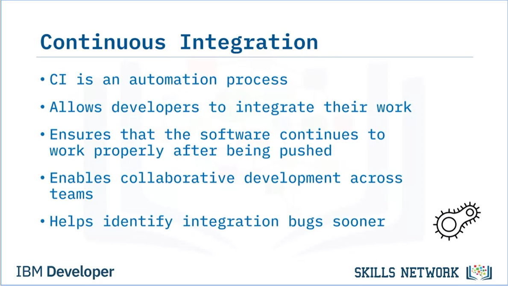
</p>
<!-- {width="4.0in" height="2.2572648731408576in"} -->

Continuous Integration (or CI) is an automation process that, as its
name implies, enables the continuous integration of code changes back
into the main codebase.

It allows developers to regularly integrate their work into a repository
so that their changes don't drift too far from the master, or main,
branch.

When a developer pushes their work into the source code repository, it
ensures that the software continues working properly by automatically
running a series of tests to detect any breakage.

CI helps to enable collaborative development across the teams because
even if a developer forgets to run their unit tests, the CI process will
run the tests for them and alert them of any failures.

And this helps to identify any integration bugs sooner rather than
later.

<!--~~~~~~~~~~~~~~~~~~~~~~~~~~~~~~~~~~~~~~~~~~~~~~~~~~~~~~~~~~~~~~~~~~~~~~~~~~~~~~~~~~~~~~~~~~~~-->
<p align="center">
  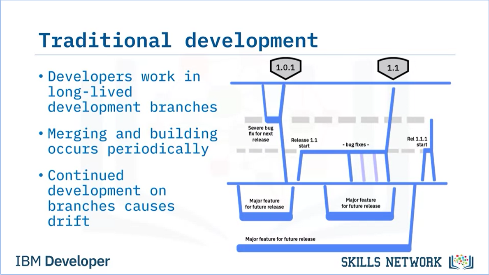
</p>
<!-- {width="4.0in" height="2.2572648731408576in"} -->

Before diving into CI, you need to first understand traditional
development.

Traditionally, developers work on large features or fixes and commit
them into their own development branches.

These branches can exist for a long time, have a large scope, and
generally require many code changes and edits.

When development is completed on these branches, only then are they
tested and merged into the main branch and built for production.

This development method can cause drift between the main branch and the
development branch, among other issues.

<!--~~~~~~~~~~~~~~~~~~~~~~~~~~~~~~~~~~~~~~~~~~~~~~~~~~~~~~~~~~~~~~~~~~~~~~~~~~~~~~~~~~~~~~~~~~~~-->
<p align="center">
  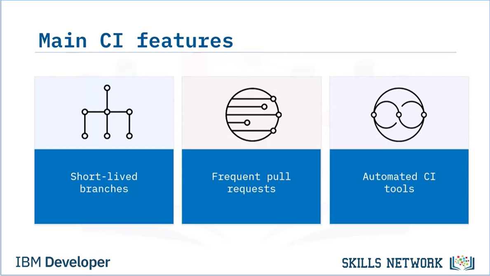
</p>
<!-- {width="4.0in" height="2.2572648731408576in"} -->

The main features of CI are:

Short-lived branches, frequent pull requests, and automated CI tools.

<!--~~~~~~~~~~~~~~~~~~~~~~~~~~~~~~~~~~~~~~~~~~~~~~~~~~~~~~~~~~~~~~~~~~~~~~~~~~~~~~~~~~~~~~~~~~~~-->
<p align="center">
  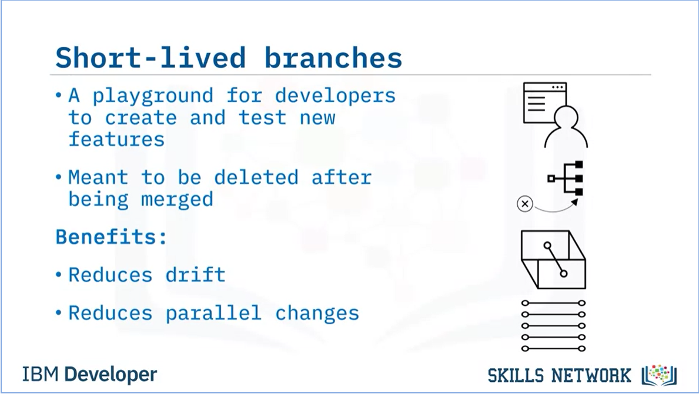
</p>
<!-- {width="4.0in" height="2.2572648731408576in"} -->

In CI, developers work in short-lived feature branches where they
develop their code.

These branches are only meant for developing small features that
contribute to the code so they can be merged back into the main or
master branch quickly.

The branch is deleted after it's merged as its only purpose was to
develop that small feature.

This provides a couple of main benefits:

It reduces drift that may occur between feature branches and the main
branch.

And critical or essential fixes may be implemented differently by
multiple developers when working on their features.

But with CI, developers can quickly implement a single fix that will be
tested and merged, reducing parallel changes.

Ultimately, this means you can deploy your code faster overall, as you
don't need to run through a large code review because you have been
checking the changes every time they've been pushed.

<!--~~~~~~~~~~~~~~~~~~~~~~~~~~~~~~~~~~~~~~~~~~~~~~~~~~~~~~~~~~~~~~~~~~~~~~~~~~~~~~~~~~~~~~~~~~~~-->
<p align="center">
  
</p>
<!-- {width="4.0in" height="2.2572648731408576in"} -->

Making frequent pull requests back to the master or main branch is a
best practice.

These pull requests are meant to contain code updates that serve a
specific purpose.

It makes code changes cleaner and easier to understand.

<!--~~~~~~~~~~~~~~~~~~~~~~~~~~~~~~~~~~~~~~~~~~~~~~~~~~~~~~~~~~~~~~~~~~~~~~~~~~~~~~~~~~~~~~~~~~~~-->
<p align="center">
  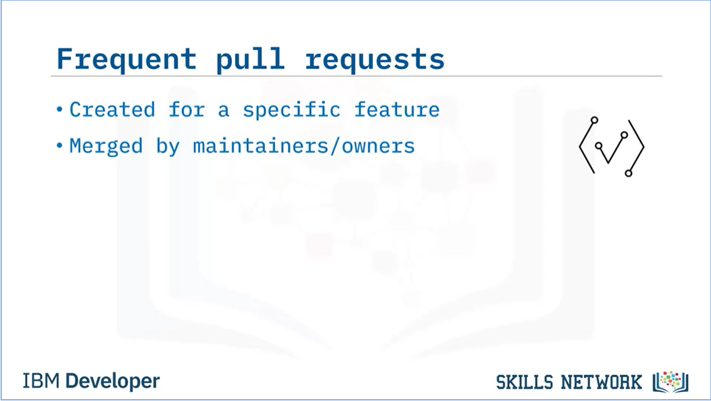
</p>
<!-- {width="4.0in" height="2.2572648731408576in"} -->

A pull request requires approval from a repository maintainer or owner
to be successfully merged.

At a minimum, no one should be able to approve their own pull request.

You want to ensure that every change has at least two sets of eyes on
it.

<!--~~~~~~~~~~~~~~~~~~~~~~~~~~~~~~~~~~~~~~~~~~~~~~~~~~~~~~~~~~~~~~~~~~~~~~~~~~~~~~~~~~~~~~~~~~~~-->
<p align="center">
  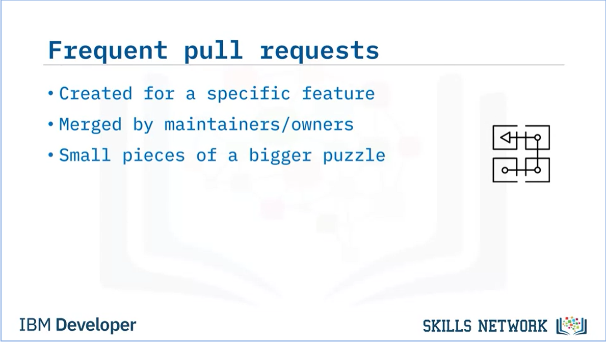
</p>
<!-- {width="4.0in" height="2.2572648731408576in"} -->

These frequent pull requests serve as small pieces of a much bigger
puzzle, making it easy to build upon the most updated code.

This function brings along with it many benefits:

<!--~~~~~~~~~~~~~~~~~~~~~~~~~~~~~~~~~~~~~~~~~~~~~~~~~~~~~~~~~~~~~~~~~~~~~~~~~~~~~~~~~~~~~~~~~~~~-->
<p align="center">
  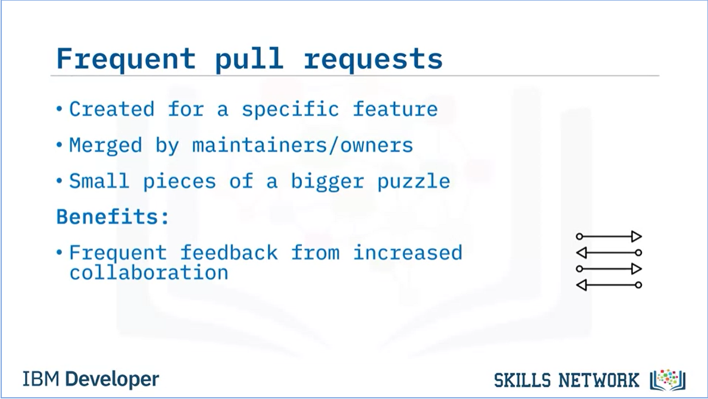
</p>
<!-- {width="4.0in" height="2.2572648731408576in"} -->

Each pull request needs to be reviewed, which facilitates increased
collaboration among developers.

<!--~~~~~~~~~~~~~~~~~~~~~~~~~~~~~~~~~~~~~~~~~~~~~~~~~~~~~~~~~~~~~~~~~~~~~~~~~~~~~~~~~~~~~~~~~~~~-->
<p align="center">
  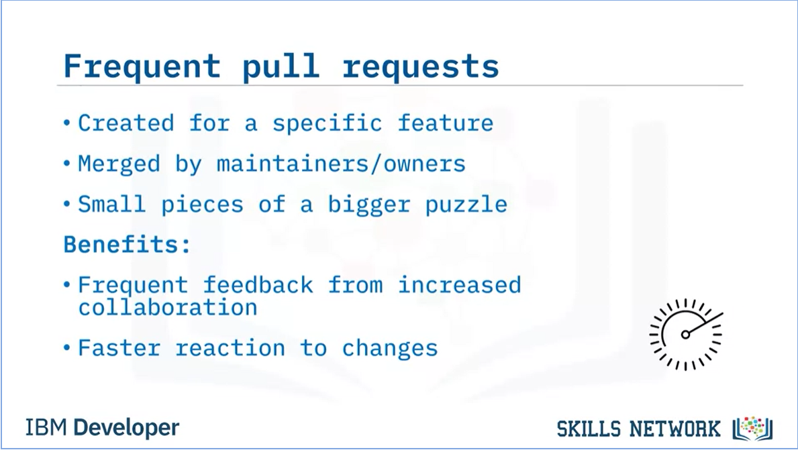
</p>
<!-- {width="4.0in" height="2.2572648731408576in"} -->

It also enables developers to react quickly.

Required changes can be tested and put into production faster, so
solutions can get to the customer faster.

<!--~~~~~~~~~~~~~~~~~~~~~~~~~~~~~~~~~~~~~~~~~~~~~~~~~~~~~~~~~~~~~~~~~~~~~~~~~~~~~~~~~~~~~~~~~~~~-->
<p align="center">
  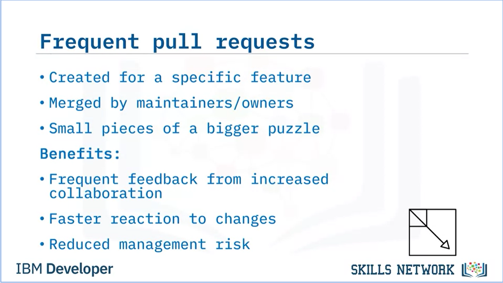
</p>
<!-- {width="4.0in" height="2.2572648731408576in"} -->

And due to the frequency of Continuous Integration, you know exactly how
much functionality you have built to date, reducing management risk.

It improves your ability to predict when and if you will deliver the
necessary functionality on time.

<!--~~~~~~~~~~~~~~~~~~~~~~~~~~~~~~~~~~~~~~~~~~~~~~~~~~~~~~~~~~~~~~~~~~~~~~~~~~~~~~~~~~~~~~~~~~~~-->
<p align="center">
  
</p>
<!-- {width="4.0in" height="2.2572648731408576in"} -->

Continuous Integration can be automated. But what does that mean?

Automated CI tools (like those on the right) subscribe to events such as
pull requests and file changes using webhooks that can then trigger a
workflow.

That workflow can be anything, such as building an application.

Once complete, these tools report back with messages of a successful or
failed build.

<!--~~~~~~~~~~~~~~~~~~~~~~~~~~~~~~~~~~~~~~~~~~~~~~~~~~~~~~~~~~~~~~~~~~~~~~~~~~~~~~~~~~~~~~~~~~~~-->
<p align="center">
  
</p>
<!-- {width="4.0in" height="2.2572648731408576in"} -->

These tools can run tests that ensure your file changes or pull requests
don't break the entire application.

<!--~~~~~~~~~~~~~~~~~~~~~~~~~~~~~~~~~~~~~~~~~~~~~~~~~~~~~~~~~~~~~~~~~~~~~~~~~~~~~~~~~~~~~~~~~~~~-->
<p align="center">
  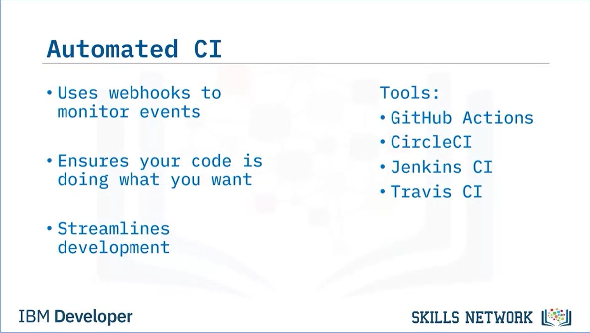
</p>
<!-- {width="4.0in" height="2.2572648731408576in"} -->

With these automation tools, you can streamline your development process
so that testing and checking your code is never tedious.

<!--~~~~~~~~~~~~~~~~~~~~~~~~~~~~~~~~~~~~~~~~~~~~~~~~~~~~~~~~~~~~~~~~~~~~~~~~~~~~~~~~~~~~~~~~~~~~-->
<p align="center">
  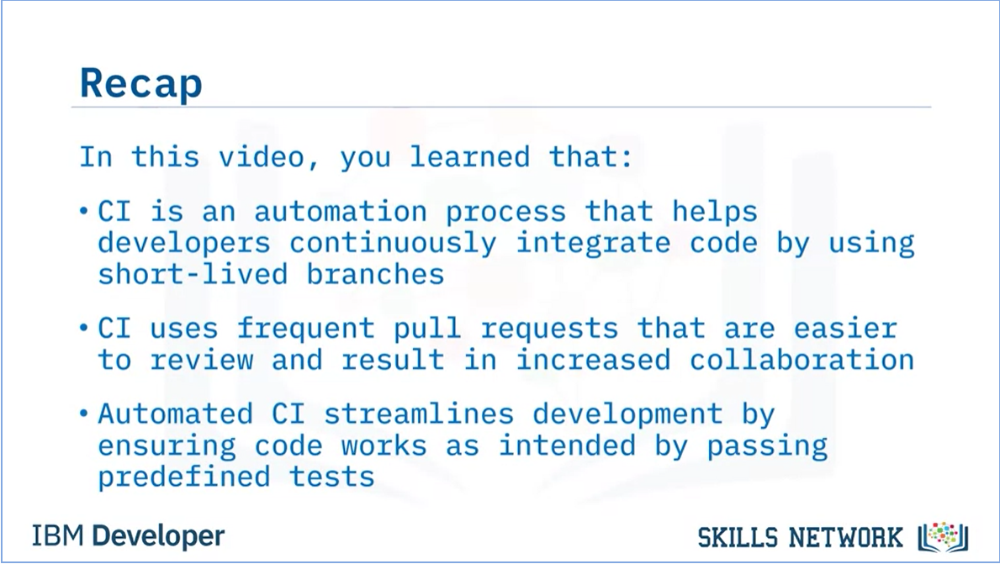
</p>
<!-- {width="4.0in" height="2.2572648731408576in"} -->

In this module, you learned that:

CI is the process used to integrate code in small pieces frequently,
taking advantage of short-lived branches.

This encourages collaboration between developers, who frequently discuss
pull requests for concise changes, and there are tools that make
implementing CI easy, by streamlining development and testing.

<h2 id="2-03">Module 2-03. Benefits of Continuous Integration (4:30)</h2>

Welcome to 'Benefits of CI'.

<!--~~~~~~~~~~~~~~~~~~~~~~~~~~~~~~~~~~~~~~~~~~~~~~~~~~~~~~~~~~~~~~~~~~~~~~~~~~~~~~~~~~~~~~~~~~~~-->
<p align="center">
  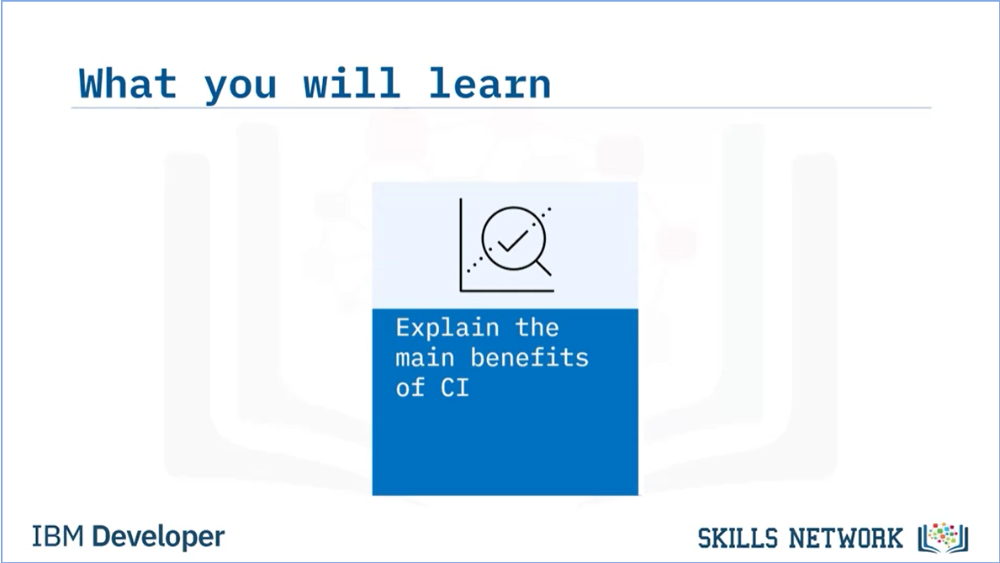
</p>
<!-- {width="4.0in" height="2.2538462379702535in"} -->

After this module, you will be able to: explain the main benefits of
Continuous Integration.

<!--~~~~~~~~~~~~~~~~~~~~~~~~~~~~~~~~~~~~~~~~~~~~~~~~~~~~~~~~~~~~~~~~~~~~~~~~~~~~~~~~~~~~~~~~~~~~-->
<p align="center">
  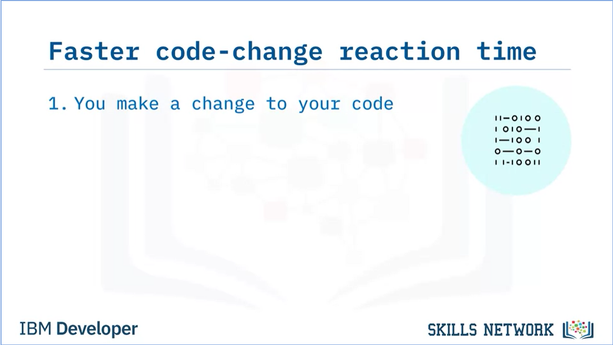
</p>
<!-- {width="4.0in" height="2.2538462379702535in"} -->

The first benefit of CI/CD is that you get faster reaction times to code
changes.

Because every time you make a change to your code and push it to a
remote branch,

<!--~~~~~~~~~~~~~~~~~~~~~~~~~~~~~~~~~~~~~~~~~~~~~~~~~~~~~~~~~~~~~~~~~~~~~~~~~~~~~~~~~~~~~~~~~~~~-->
<p align="center">
  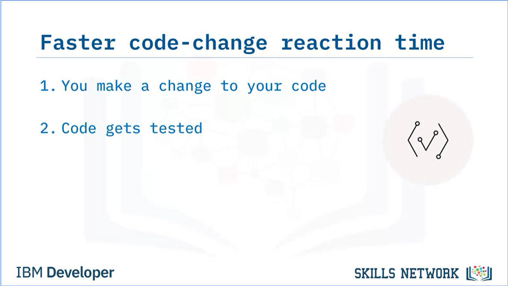
</p>
<!-- {width="4.0in" height="2.2538462379702535in"} -->

the change gets tested, so even if you forgot to run the tests, the CI
tool will test it.

<!--~~~~~~~~~~~~~~~~~~~~~~~~~~~~~~~~~~~~~~~~~~~~~~~~~~~~~~~~~~~~~~~~~~~~~~~~~~~~~~~~~~~~~~~~~~~~-->
<p align="center">
  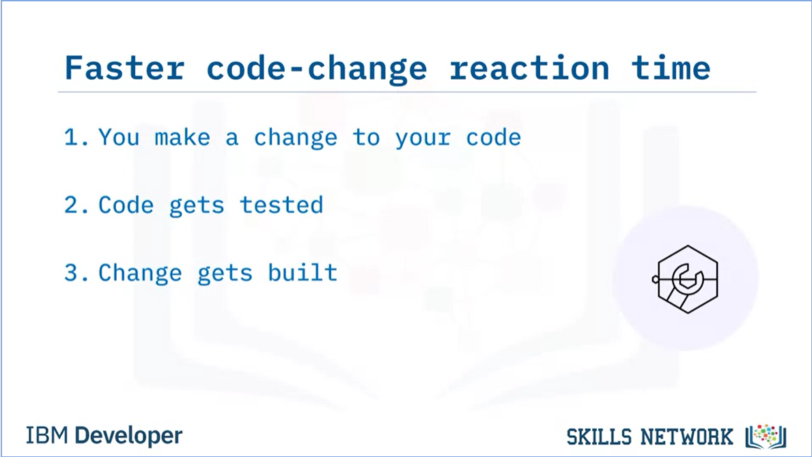
</p>
<!-- {width="4.0in" height="2.2538462379702535in"} -->

Then, the change gets built, so even if you forgot to check if the build
works, the CI tool will check it.

<!--~~~~~~~~~~~~~~~~~~~~~~~~~~~~~~~~~~~~~~~~~~~~~~~~~~~~~~~~~~~~~~~~~~~~~~~~~~~~~~~~~~~~~~~~~~~~-->
<p align="center">
  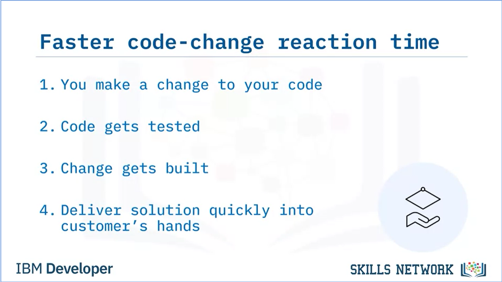
</p>
<!-- {width="4.0in" height="2.2538462379702535in"} -->

And then you can deliver the solution into your customers' hands more
quickly, knowing that all of the tests have passed, and the build is not
broken.

<!--~~~~~~~~~~~~~~~~~~~~~~~~~~~~~~~~~~~~~~~~~~~~~~~~~~~~~~~~~~~~~~~~~~~~~~~~~~~~~~~~~~~~~~~~~~~~-->
<p align="center">
  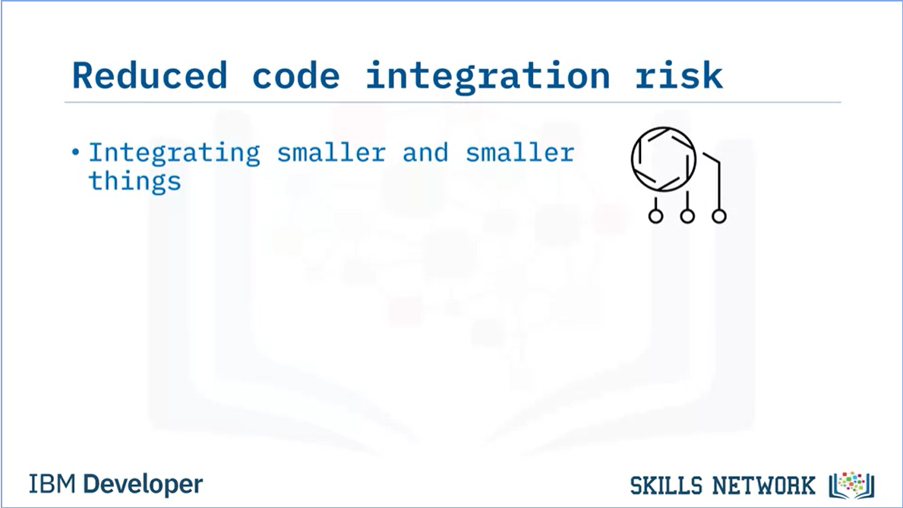
</p>
<!-- {width="4.0in" height="2.2538462379702535in"} -->

You also get the benefit of reduced code integration risk.

Because you\'re integrating smaller and smaller things.

Smaller changes mean less risk of something going wrong.

<!--~~~~~~~~~~~~~~~~~~~~~~~~~~~~~~~~~~~~~~~~~~~~~~~~~~~~~~~~~~~~~~~~~~~~~~~~~~~~~~~~~~~~~~~~~~~~-->
<p align="center">
  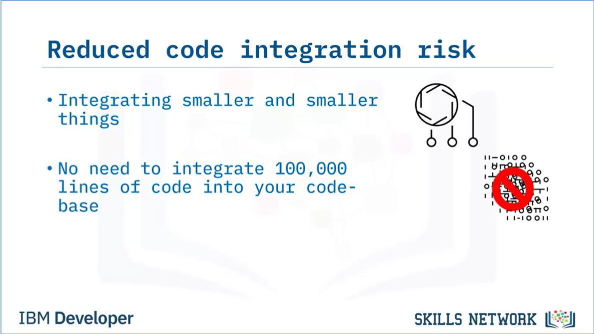
</p>
<!-- {width="4.0in" height="2.2538462379702535in"} -->

So, you\'re not having to integrate 100,000 lines of code into your
millions of lines of code in your code-base.

Those days are over.

<!--~~~~~~~~~~~~~~~~~~~~~~~~~~~~~~~~~~~~~~~~~~~~~~~~~~~~~~~~~~~~~~~~~~~~~~~~~~~~~~~~~~~~~~~~~~~~-->
<p align="center">
  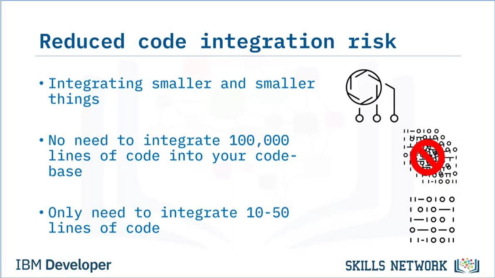
</p>
<!-- {width="4.0in" height="2.2538462379702535in"} -->

You're only having to integrate maybe 10, 20, 30, or 50 lines of code
for example, so you're not looking at a lot of code to handle.

Remember, less change means less risk.

Another benefit is that you get higher code quality with CI/CD, because
things are constantly being reviewed and constantly being tested.

<!--~~~~~~~~~~~~~~~~~~~~~~~~~~~~~~~~~~~~~~~~~~~~~~~~~~~~~~~~~~~~~~~~~~~~~~~~~~~~~~~~~~~~~~~~~~~~-->
<p align="center">
  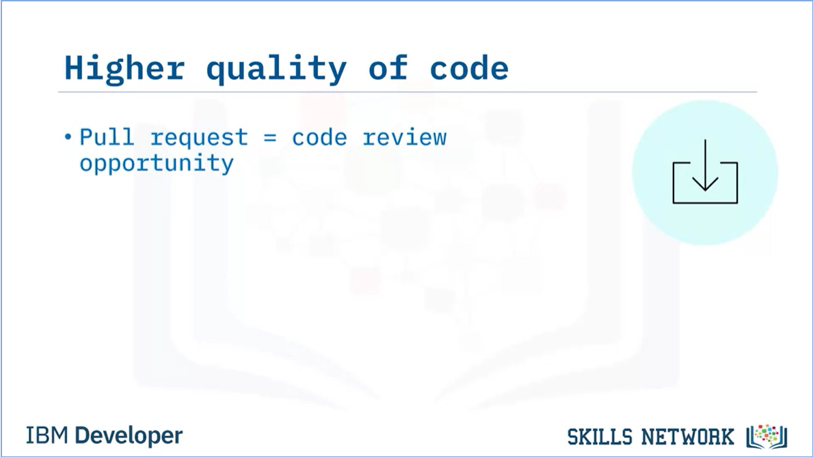
</p>
<!-- {width="4.0in" height="2.2538462379702535in"} -->

Every pull request is an opportunity for a code review.

Forget about scheduling code reviews as a separate task.

<!--~~~~~~~~~~~~~~~~~~~~~~~~~~~~~~~~~~~~~~~~~~~~~~~~~~~~~~~~~~~~~~~~~~~~~~~~~~~~~~~~~~~~~~~~~~~~-->
<p align="center">
  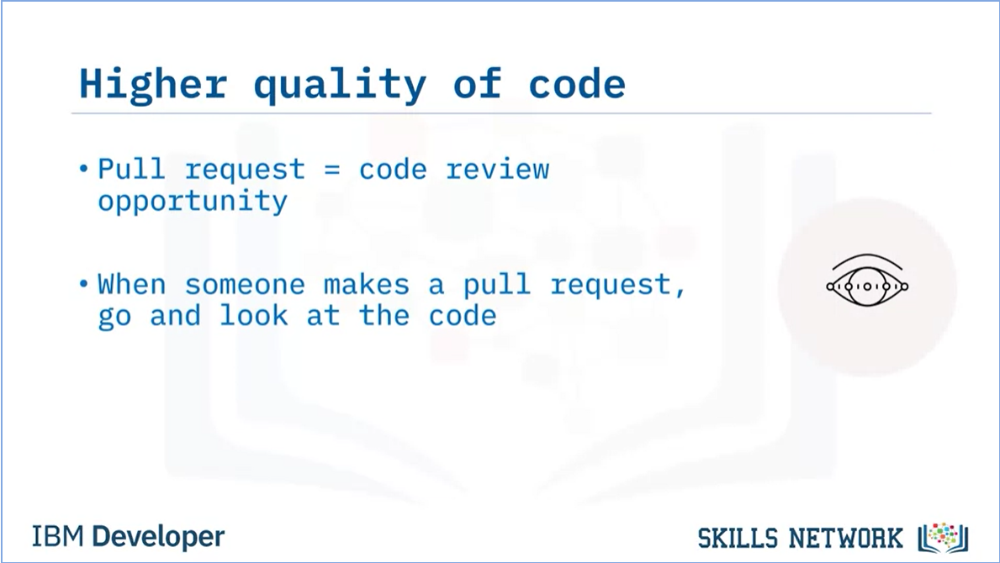
</p>
<!-- {width="4.0in" height="2.2538462379702535in"} -->

One of the things you should be doing as a best practice is, when
someone makes a pull request, you should go and look at the code.

Having another set of eyes looking at what was changed while you\'re
waiting for the test to pass is always going to be a good thing.

<!--~~~~~~~~~~~~~~~~~~~~~~~~~~~~~~~~~~~~~~~~~~~~~~~~~~~~~~~~~~~~~~~~~~~~~~~~~~~~~~~~~~~~~~~~~~~~-->
<p align="center">
  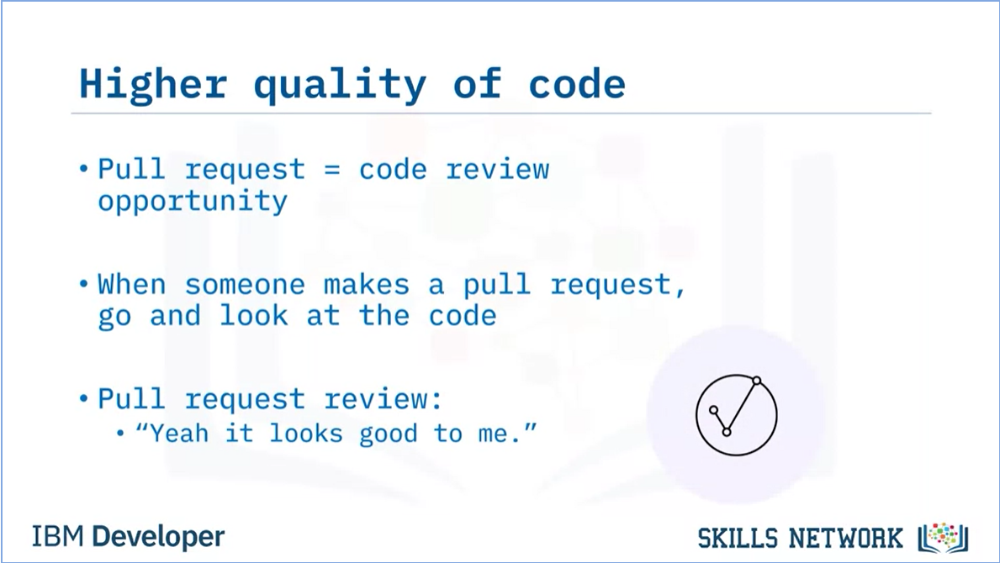
</p>
<!-- {width="4.0in" height="2.2538462379702535in"} -->

During your review of the pull request, you can either say "yeah it
looks good to me",

<!--~~~~~~~~~~~~~~~~~~~~~~~~~~~~~~~~~~~~~~~~~~~~~~~~~~~~~~~~~~~~~~~~~~~~~~~~~~~~~~~~~~~~~~~~~~~~-->
<p align="center">
  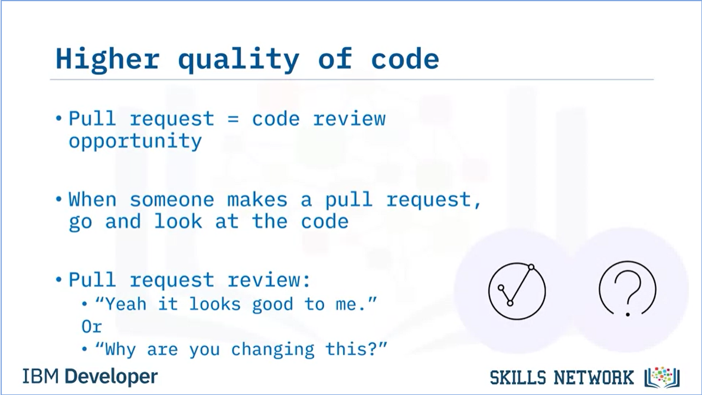
</p>
<!-- {width="4.0in" height="2.2538462379702535in"} -->

or maybe you look at the title and it says, the code needs to do this,
but then you see some piece of the code and realize that this code has
nothing to do with that, so you can ask, "why are you changing this?".

<!--~~~~~~~~~~~~~~~~~~~~~~~~~~~~~~~~~~~~~~~~~~~~~~~~~~~~~~~~~~~~~~~~~~~~~~~~~~~~~~~~~~~~~~~~~~~~-->
<p align="center">
  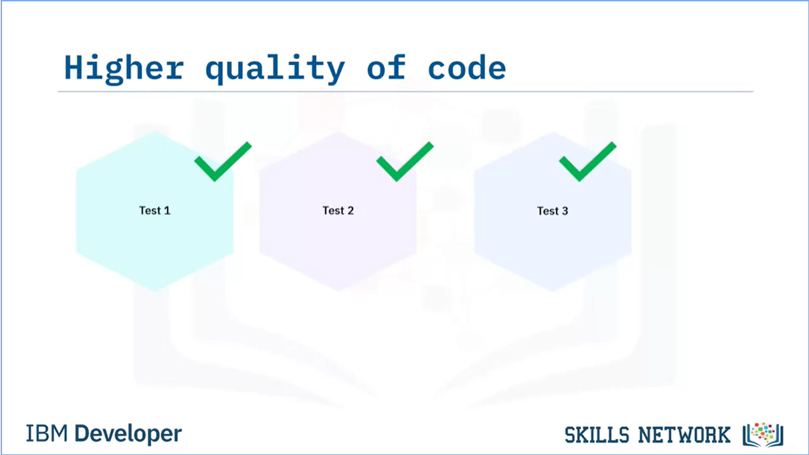
</p>
<!-- {width="4.0in" height="2.2538462379702535in"} -->

You should also look at the tests and see if all the tests passed.

Look at the code coverage.

Let's say the code coverage went down.

<!--~~~~~~~~~~~~~~~~~~~~~~~~~~~~~~~~~~~~~~~~~~~~~~~~~~~~~~~~~~~~~~~~~~~~~~~~~~~~~~~~~~~~~~~~~~~~-->
<p align="center">
  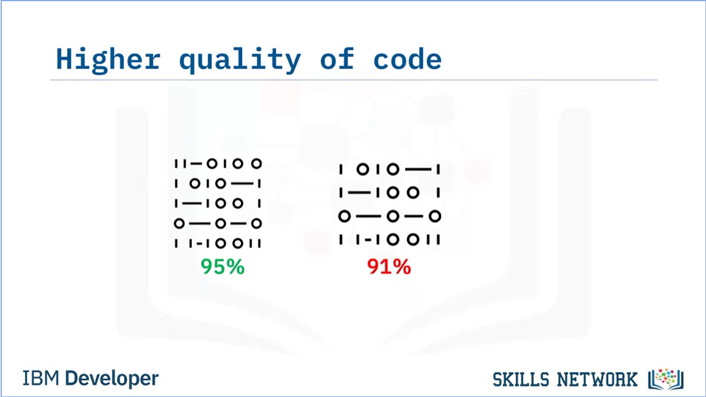
</p>
<!-- {width="4.0in" height="2.2538462379702535in"} -->

Your team has a standard of 95% code coverage, but code coverage was
only at 91%.

So, what happened?

<!--~~~~~~~~~~~~~~~~~~~~~~~~~~~~~~~~~~~~~~~~~~~~~~~~~~~~~~~~~~~~~~~~~~~~~~~~~~~~~~~~~~~~~~~~~~~~-->
<p align="center">
  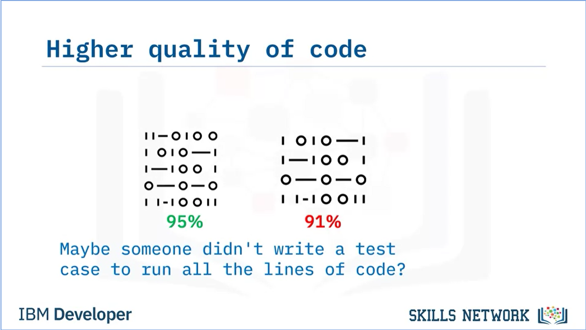
</p>
<!-- {width="4.0in" height="2.2538462379702535in"} -->

Maybe somebody wrote code, but they didn\'t write a test case to run all
the lines of code.

<!--~~~~~~~~~~~~~~~~~~~~~~~~~~~~~~~~~~~~~~~~~~~~~~~~~~~~~~~~~~~~~~~~~~~~~~~~~~~~~~~~~~~~~~~~~~~~-->
<p align="center">
  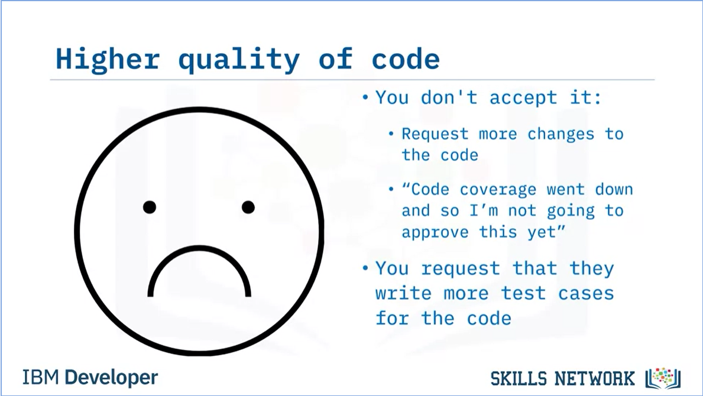
</p>
<!-- {width="4.0in" height="2.2538462379702535in"} -->

So, in your review of the pull request, you can simply say that you
don\'t accept it, and you can request more changes to the code.

You could say "the code coverage went down and so I'm not going to
approve this yet", and you can request that they write more test cases
for the code.

<!--~~~~~~~~~~~~~~~~~~~~~~~~~~~~~~~~~~~~~~~~~~~~~~~~~~~~~~~~~~~~~~~~~~~~~~~~~~~~~~~~~~~~~~~~~~~~-->
<p align="center">
  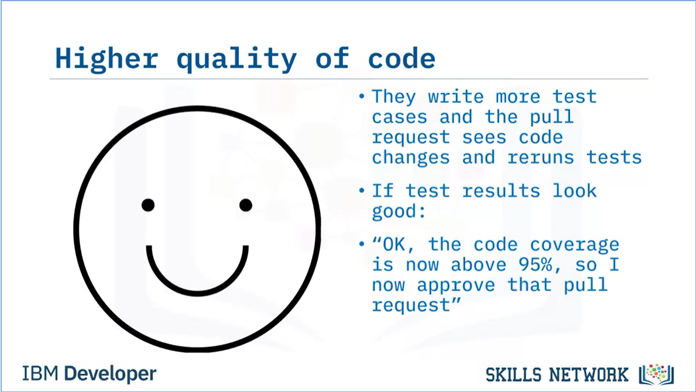
</p>
<!-- {width="4.0in" height="2.2538462379702535in"} -->

And then they can go and write more test cases, and the pull request
will see the code changes and rerun the tests. If those test results
look good to you now, you can say, "Ok, the code coverage is now above
95%, so now I approve that pull request."

<!--~~~~~~~~~~~~~~~~~~~~~~~~~~~~~~~~~~~~~~~~~~~~~~~~~~~~~~~~~~~~~~~~~~~~~~~~~~~~~~~~~~~~~~~~~~~~-->
<p align="center">
  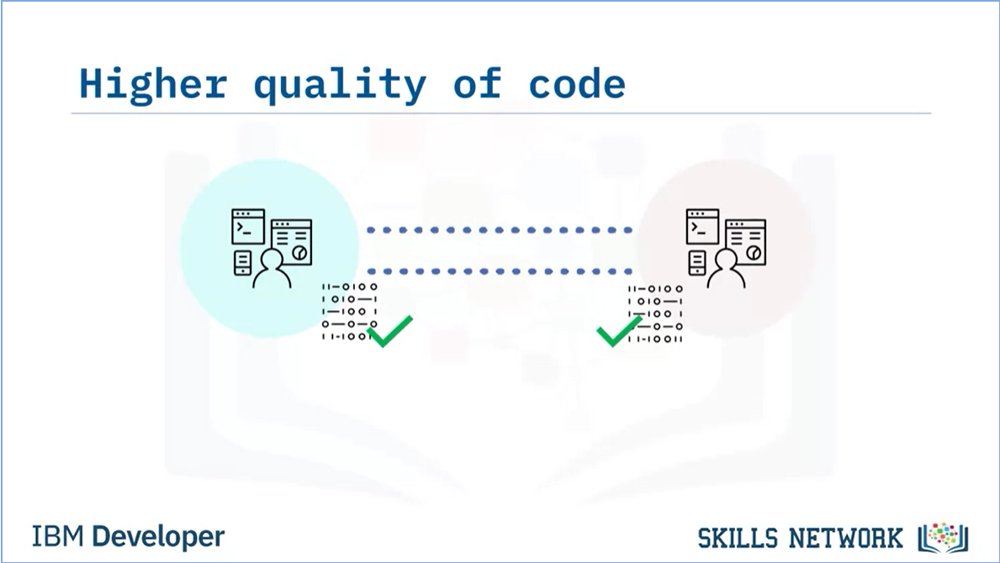
</p>
<!-- {width="4.0in" height="2.2538462379702535in"} -->

This kind of monitoring of each other's work is what you should expect
from your development teams; this is what you want them to be doing.

You want them to be monitoring each other, helping each other, looking
at each other\'s code and doing many code reviews.

Because it\'s a lot easier to do code reviews on 20 lines of code than
20,000 lines of code.

<!--~~~~~~~~~~~~~~~~~~~~~~~~~~~~~~~~~~~~~~~~~~~~~~~~~~~~~~~~~~~~~~~~~~~~~~~~~~~~~~~~~~~~~~~~~~~~-->
<p align="center">
  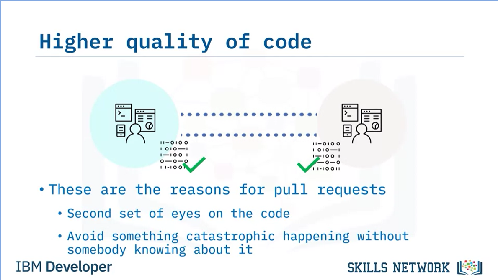
</p>
<!-- {width="4.0in" height="2.2538462379702535in"} -->

These are the reasons that you do pull requests; you get a second set of
eyes on the code and avoid something catastrophic happening without
somebody knowing about it.

You also know the code in version control works.

Because, how are you going to do continuous delivery?

Think about this for a moment.

<!--~~~~~~~~~~~~~~~~~~~~~~~~~~~~~~~~~~~~~~~~~~~~~~~~~~~~~~~~~~~~~~~~~~~~~~~~~~~~~~~~~~~~~~~~~~~~-->
<p align="center">
  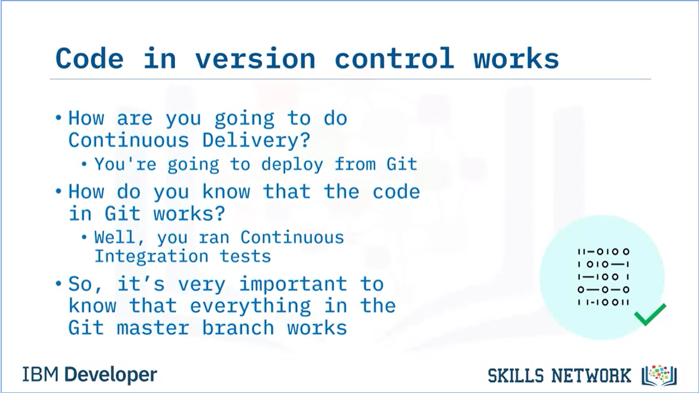
</p>
<!-- {width="4.0in" height="2.2538462379702535in"} -->

You\'re going to deploy from Git or some other source control management
system where you keep your code.

How do you know that the code in Git works?

The answer should be:

Well, you ran your continuous integration tests and they all passed.

Unless you test every change, you could be deploying broken code into
production.

So, it's very important to know that, yes, everything that\'s in that
master branch in Git works.

<!--~~~~~~~~~~~~~~~~~~~~~~~~~~~~~~~~~~~~~~~~~~~~~~~~~~~~~~~~~~~~~~~~~~~~~~~~~~~~~~~~~~~~~~~~~~~~-->
<p align="center">
  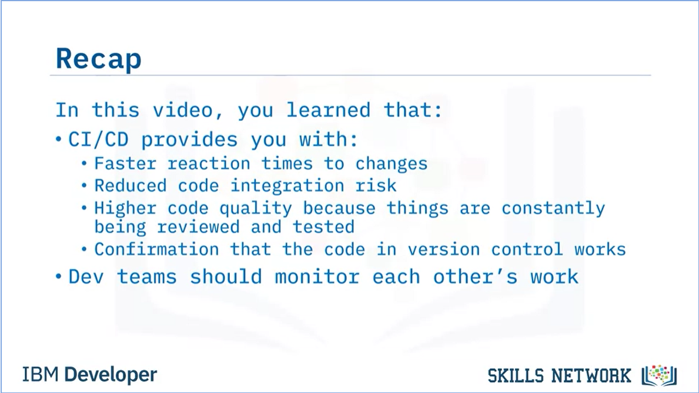
</p>
<!-- {width="4.0in" height="2.2538462379702535in"} -->

In this module, you learned that:

CI/CD provides you with faster reaction times to changes, reduced code
integration risk, higher code quality because things are constantly
being reviewed and tested, and confirmation that the code in version
control works.

You also learned that your development teams should regularly monitor
each other's work.

<h2 id="2-04">Module 2-04. Social Coding (3:44)</h2>

Welcome to Social Coding.

<!--~~~~~~~~~~~~~~~~~~~~~~~~~~~~~~~~~~~~~~~~~~~~~~~~~~~~~~~~~~~~~~~~~~~~~~~~~~~~~~~~~~~~~~~~~~~~-->
<p align="center">
  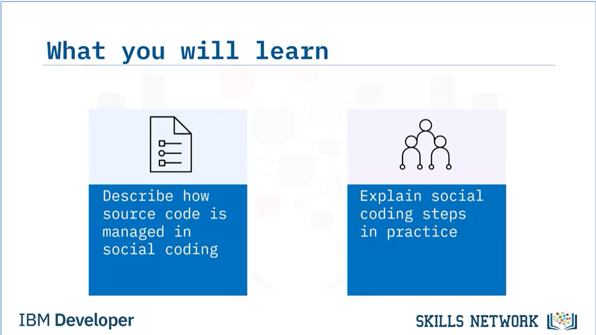
</p>
<!-- {width="4.0in" height="2.2538462379702535in"} -->

After this module, you will be able to:

Describe how source code is managed in social coding, and explain social
coding steps in practice.

<!--~~~~~~~~~~~~~~~~~~~~~~~~~~~~~~~~~~~~~~~~~~~~~~~~~~~~~~~~~~~~~~~~~~~~~~~~~~~~~~~~~~~~~~~~~~~~-->
<p align="center">
  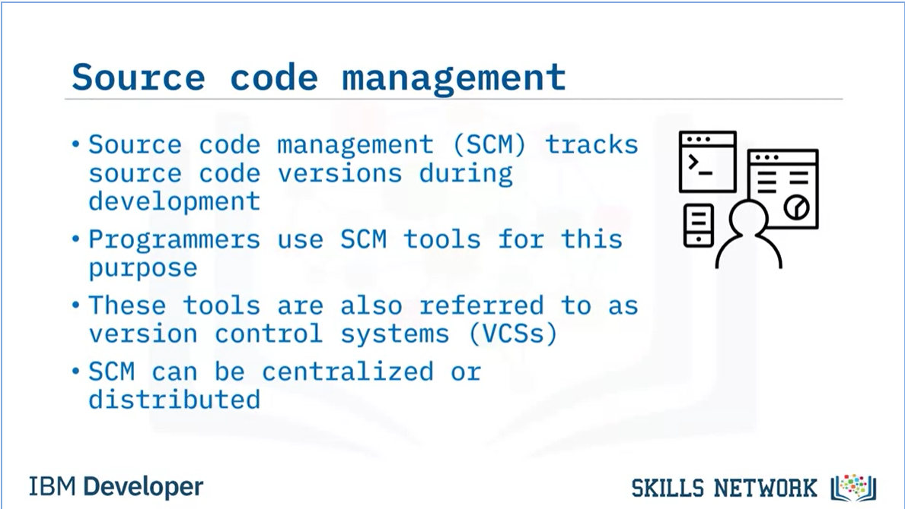
</p>
<!-- {width="4.0in" height="2.2538462379702535in"} -->

Source code management (or SCM) is the practice of tracking versions of
source code as it is developed.

This makes it easy to roll back to a previous version if errors occur.

It also allows multiple people to work on different parts of the code
and merge these changes into a single source of truth.

Programmers use SCM tools to manage source code.

These tools are also referred to as version control systems (or VCSs).

You can use these two terms interchangeably when referring to software
systems.

SCMs can be centralized or distributed.

<!--~~~~~~~~~~~~~~~~~~~~~~~~~~~~~~~~~~~~~~~~~~~~~~~~~~~~~~~~~~~~~~~~~~~~~~~~~~~~~~~~~~~~~~~~~~~~-->
<p align="center">
  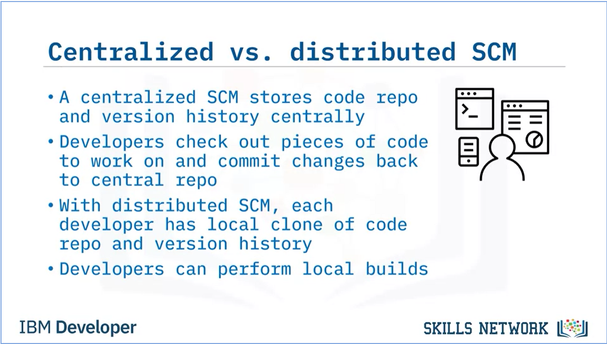
</p>
<!-- {width="4.0in" height="2.2641021434820647in"} -->

A centralized SCM stores the code repository and version history
centrally, and developers check out pieces of the code and work on it
and commit changes back to the central repository.

Builds must be done at the central repository because that's the only
place that all of the code exists.

With a distributed SCM, each developer has a local clone of the entire
code repository and version history.

This means they can perform local builds because each developer has the
complete code locally.

<!--~~~~~~~~~~~~~~~~~~~~~~~~~~~~~~~~~~~~~~~~~~~~~~~~~~~~~~~~~~~~~~~~~~~~~~~~~~~~~~~~~~~~~~~~~~~~-->
<p align="center">
  
</p>
<!-- {width="4.0in" height="2.2641021434820647in"} -->

What is social coding?

It can be referred to as \"open source for inner source.\"

Social coding is something that open-source communities have been doing
for years.

What's new is bringing these concepts into the enterprise and coding as
a community on internal projects.

In the past, developers worked in private repositories (or repos) with
limited 'need to know' access and limited communications.

This meant no possibility of reusing code and as a result, enterprises
were continually reinventing the wheel because no one knew the wheel had
already been built.

With social coding, all repositories are public, and everyone is
encouraged to fork the code and contribute.

This is a vastly different way of thinking.

Development teams love to think \"this is my code and no one can touch
it\" but they need to get over that for the good of the company.

You would think that anarchy would ensue, but actually it works quite
well because it's controlled by the repository owner.

The person who owns the repository is still in complete control of the
contributions.

<!--~~~~~~~~~~~~~~~~~~~~~~~~~~~~~~~~~~~~~~~~~~~~~~~~~~~~~~~~~~~~~~~~~~~~~~~~~~~~~~~~~~~~~~~~~~~~-->
<p align="center">
  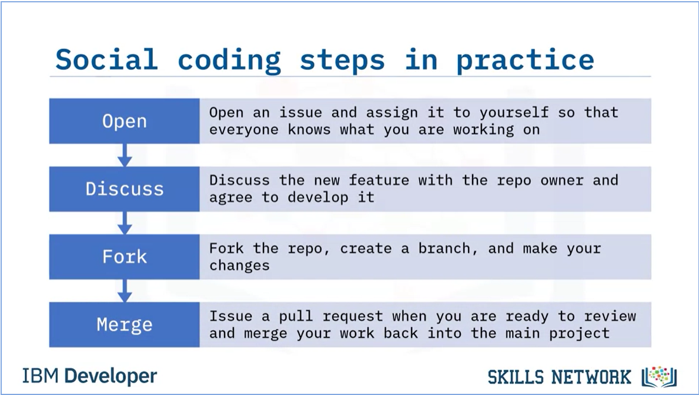
</p>
<!-- {width="4.0in" height="2.2641021434820647in"} -->

This is how social coding works in practice.

You open a GitHub issue and assign it to yourself so that everyone knows
you're working on it.

You discuss the new feature with the repo owner, and you agree to
develop it for them.

This allows you to leverage everything that they\'ve done and add the
feature that you need.

Then you fork the repo, create a branch, and make your changes.

When you're all done and have something to contribute, you issue a pull
request signaling that you are ready for a review and the repo owner can
decide whether to merge your code into the main project.

<!--~~~~~~~~~~~~~~~~~~~~~~~~~~~~~~~~~~~~~~~~~~~~~~~~~~~~~~~~~~~~~~~~~~~~~~~~~~~~~~~~~~~~~~~~~~~~-->
<p align="center">
  
</p>
<!-- {width="4.0in" height="2.2641021434820647in"} -->

The repo owners are in full control.

They can ask for changes because they merge the code.

They can ask you to write more test cases if you don't have adequate
test coverage.

They consider you an equal team member and this is a win-win situation.

You get to leverage another team's code and functionality, and the other
team gets a new feature added for free.

The company saves money because code is being reused instead of
rewritten and everyone is happy.

This is how open-source works and this is how companies should treat
their inner source.

<!--~~~~~~~~~~~~~~~~~~~~~~~~~~~~~~~~~~~~~~~~~~~~~~~~~~~~~~~~~~~~~~~~~~~~~~~~~~~~~~~~~~~~~~~~~~~~-->
<p align="center">
  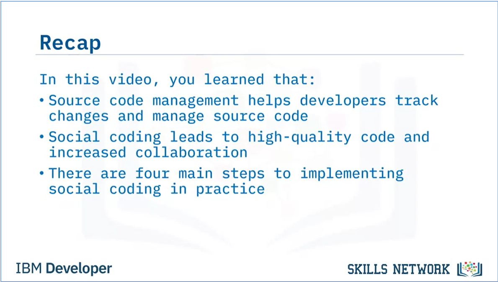
</p>
<!-- {width="4.0in" height="2.2641021434820647in"} -->

In this module, you learned that source code management helps developers
track changes and manage their source code,

social coding is a practice that leads to high-quality code and
increased collaboration, and

there are four main steps to implementing social coding in practice, and
each step flows into the next.

<h2 id="2-05">Module 2-05. Git Feature Branch Workflow: Working in Branches (7:24)</h2>

Welcome to Git Feature Branch Workflow -- Working in Branches.

<!--~~~~~~~~~~~~~~~~~~~~~~~~~~~~~~~~~~~~~~~~~~~~~~~~~~~~~~~~~~~~~~~~~~~~~~~~~~~~~~~~~~~~~~~~~~~~-->
<p align="center">
  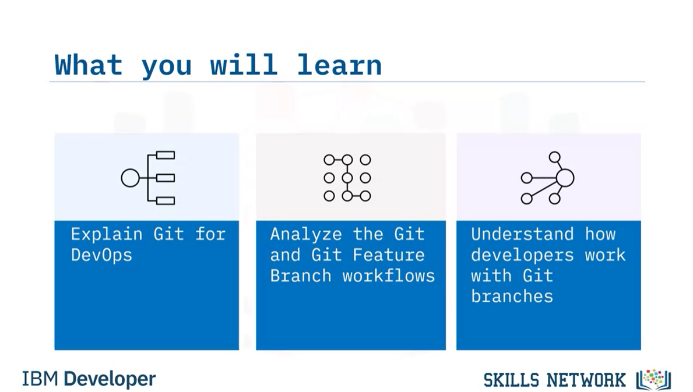
</p>
<!-- {width="4.0in" height="2.2641021434820647in"} -->

After this module, you will be able to explain what Git is and why it's
used for DevOps, analyze the workflow of working with Git and the Git
Feature Branch workflow, and understand how developers work within Git
branches when creating a new feature.

<!--~~~~~~~~~~~~~~~~~~~~~~~~~~~~~~~~~~~~~~~~~~~~~~~~~~~~~~~~~~~~~~~~~~~~~~~~~~~~~~~~~~~~~~~~~~~~-->
<p align="center">
  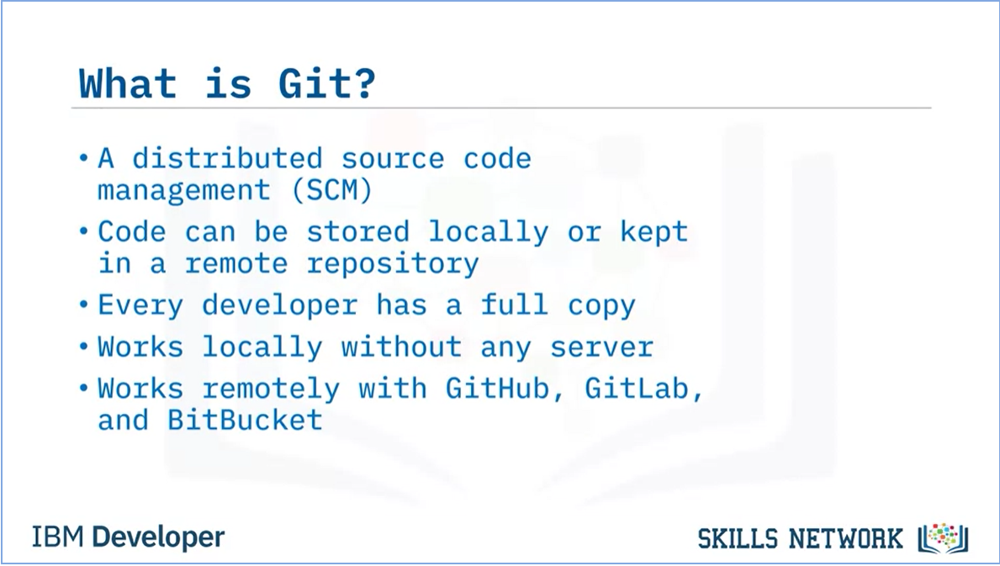
</p>
<!-- {width="4.0in" height="2.2641021434820647in"} -->

Git is a distributed source code management tool used by developers
worldwide.

It was invented by Linus Torvalds in 2005 for Linux kernel development
and is now the most widely used version control system.

Code can be completely local, or it can be kept in a remote repository
so that developers can collaborate.

Every developer also has a full copy of the code.

This differs from other version control systems that may only have
developers check out the part of the code they are working on.

This means that developers can work locally and track changes without
having to contact a central repository every time.

If something were to happen to the central repo, you would still have an
entire copy locally to rebuild from.

There are many ways to use Git in practice.

Some of the most popular repository hosts are GitHub, GitLab, and
BitBucket.

<!--~~~~~~~~~~~~~~~~~~~~~~~~~~~~~~~~~~~~~~~~~~~~~~~~~~~~~~~~~~~~~~~~~~~~~~~~~~~~~~~~~~~~~~~~~~~~-->
<p align="center">
  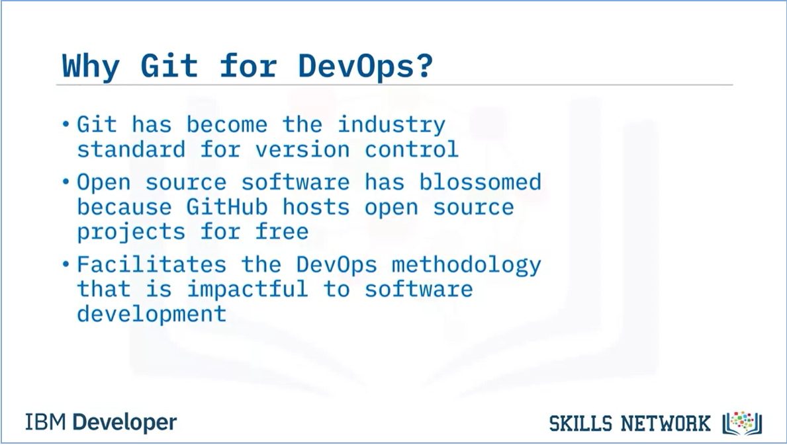
</p>
<!-- {width="4.0in" height="2.2641021434820647in"} -->

Git is the current standard for version control software.

It completely changed how developers do their job, allowing them greater
control over their code, and the ability to roll back changes precisely
if needed.

GitHub is one of the largest platforms that developers can use to
implement Git into their workflow as GitHub hosts open-source projects
for free.

This has enabled Developer Operations (or DevOps) methodologies that
previously lacked a good way to implement them.

DevOps benefits from Git because it can handle projects of all sizes,
enables non-linear collaboration, and tracks version control to ensure
code quality.

<!--~~~~~~~~~~~~~~~~~~~~~~~~~~~~~~~~~~~~~~~~~~~~~~~~~~~~~~~~~~~~~~~~~~~~~~~~~~~~~~~~~~~~~~~~~~~~-->
<p align="center">
  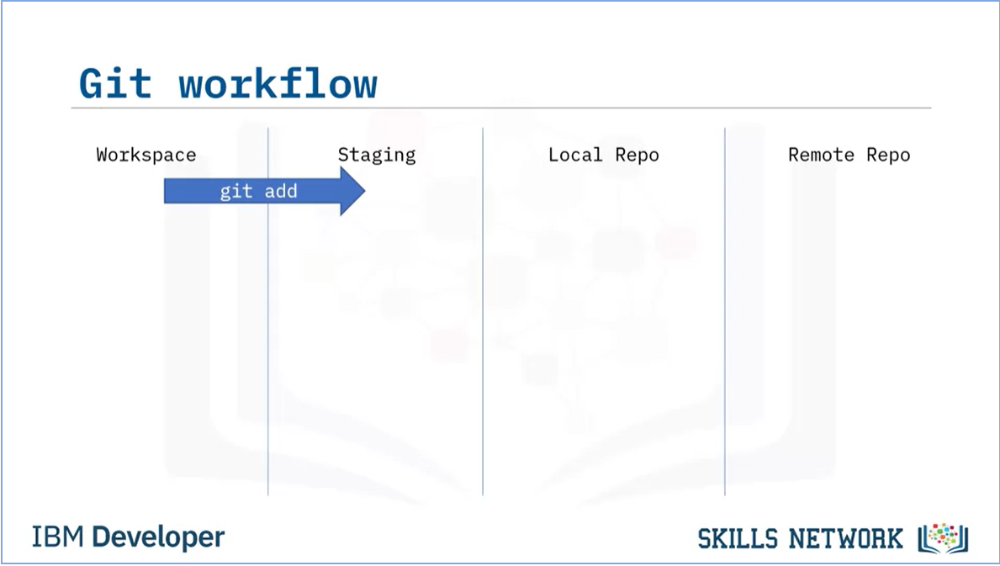
</p>
<!-- {width="4.0in" height="2.2641021434820647in"} -->

Let's look at how Git is used in practice.

Here, we'll demonstrate some of the most important steps and commands in
an example Git workflow.

Teams are free to adapt other workflows as well.

Once a developer has made changes on their local clone of the code
repository, they can run \`git add\` to move those changes to a staging
area.

The staging area allows developers to clearly separate the changes they
want to commit, which may not be all their changes.

I like to think of it as a shopping list.

What do I need to buy the next time I go to the store?

The staging area is your commit list.

What file changes do I want to persist the next time I make a commit?

This gives developers an area to double-check they have exactly what
they want to change ready to push.

<!--~~~~~~~~~~~~~~~~~~~~~~~~~~~~~~~~~~~~~~~~~~~~~~~~~~~~~~~~~~~~~~~~~~~~~~~~~~~~~~~~~~~~~~~~~~~~-->
<p align="center">
  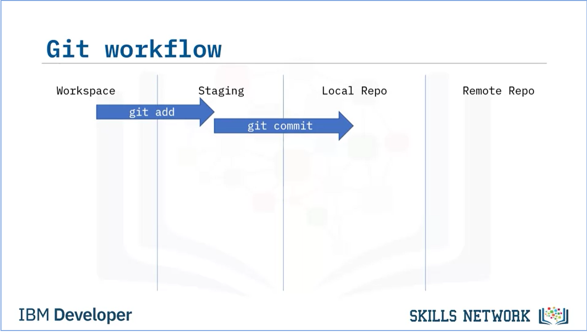
</p>
<!-- {width="4.0in" height="2.2641021434820647in"} -->

They can then run \`git commit\` to commit those changes to the version
history of their local repo.

This doesn't affect anyone else. It just changes the local repo.

<!--~~~~~~~~~~~~~~~~~~~~~~~~~~~~~~~~~~~~~~~~~~~~~~~~~~~~~~~~~~~~~~~~~~~~~~~~~~~~~~~~~~~~~~~~~~~~-->
<p align="center">
  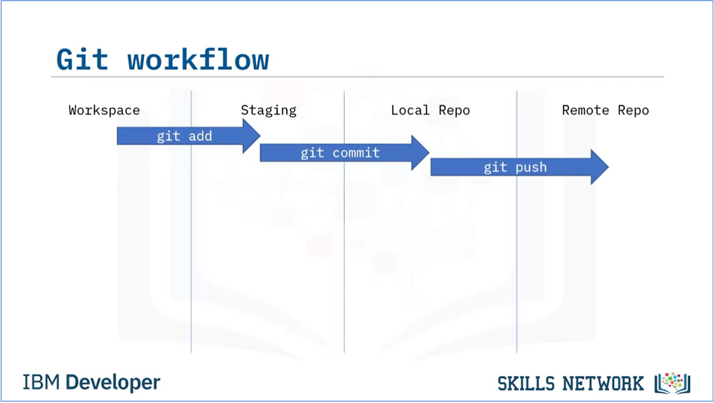
</p>
<!-- {width="4.0in" height="2.2641021434820647in"} -->

From there, the developer can continue working, or finally push their
changes to the remote repo using \`git push\`, where everyone can see
and access those changes.

<!--~~~~~~~~~~~~~~~~~~~~~~~~~~~~~~~~~~~~~~~~~~~~~~~~~~~~~~~~~~~~~~~~~~~~~~~~~~~~~~~~~~~~~~~~~~~~-->
<p align="center">
  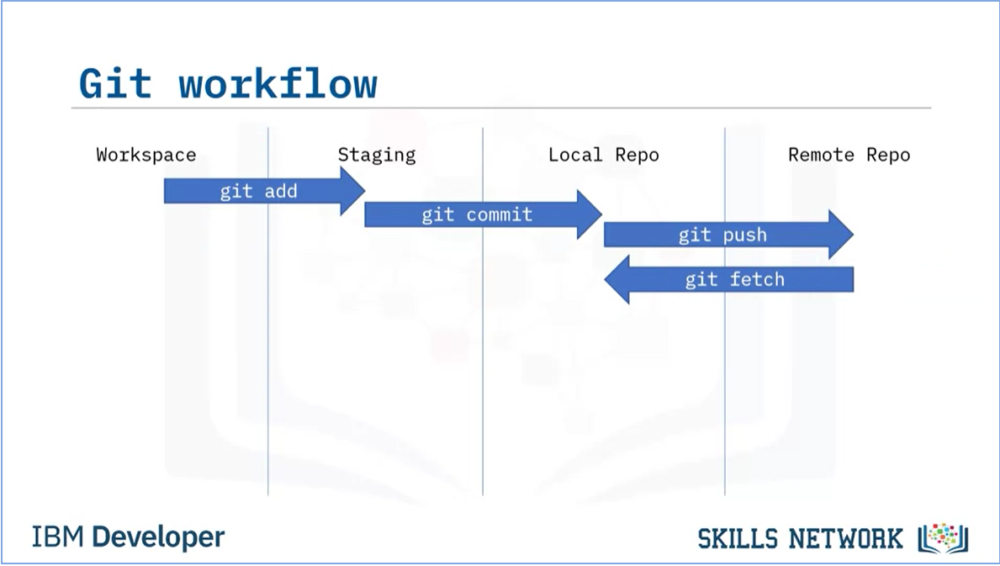
</p>
<!-- {width="4.0in" height="2.2641021434820647in"} -->

For another developer to get those changes locally, they can run \`git
fetch\`, to fetch the most recent metadata of the remote repo, which
describes all the version history and branch information, but it does
not actually pull the newest code changes.

It allows developers to check if there are any changes without actually
pulling any changes.

This is so developers can avoid any potential merge conflicts.

<!--~~~~~~~~~~~~~~~~~~~~~~~~~~~~~~~~~~~~~~~~~~~~~~~~~~~~~~~~~~~~~~~~~~~~~~~~~~~~~~~~~~~~~~~~~~~~-->
<p align="center">
  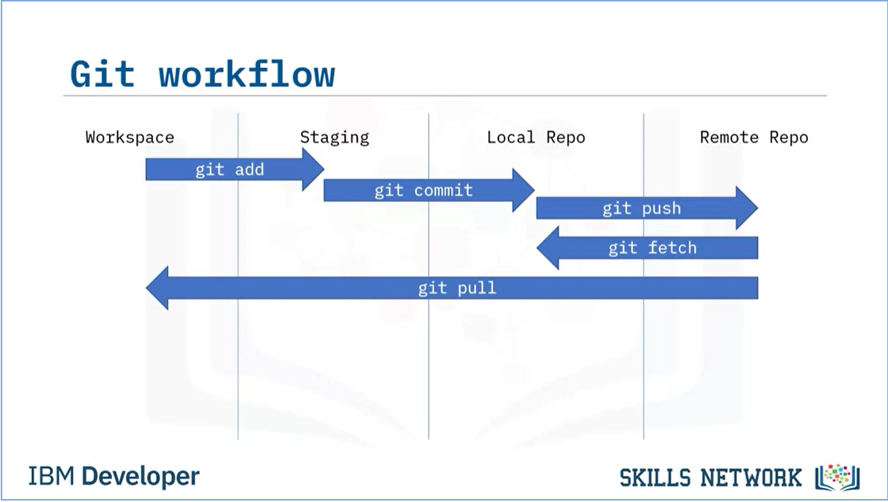
</p>
<!-- {width="4.0in" height="2.2641021434820647in"} -->

To get the actual changes, and to download and merge their changes into
their own workspace, they can run \`git pull,\` which will pull the most
recent version metadata and any changes.

<!--~~~~~~~~~~~~~~~~~~~~~~~~~~~~~~~~~~~~~~~~~~~~~~~~~~~~~~~~~~~~~~~~~~~~~~~~~~~~~~~~~~~~~~~~~~~~-->
<p align="center">
  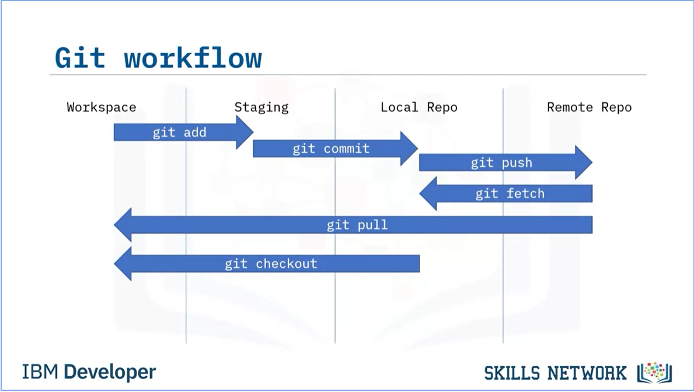
</p>
<!-- {width="4.0in" height="2.2641021434820647in"} -->

If a developer wants to work on a specific branch of code locally, they
can run \`git checkout\` to switch their workspace from one branch to
another.

Git looks in the metadata and makes changes to your local repository to
show you exactly that branch's code.

You can also use \`git checkout\` to get back to a previous commit.

So, this is great if you've gone down a path, you've made some changes,
and then you decide this isn't working for me, I want to get back to the
last thing I committed.

Just do a \`git checkout period\` and that will get you back to your
last commit.

<!--~~~~~~~~~~~~~~~~~~~~~~~~~~~~~~~~~~~~~~~~~~~~~~~~~~~~~~~~~~~~~~~~~~~~~~~~~~~~~~~~~~~~~~~~~~~~-->
<p align="center">
  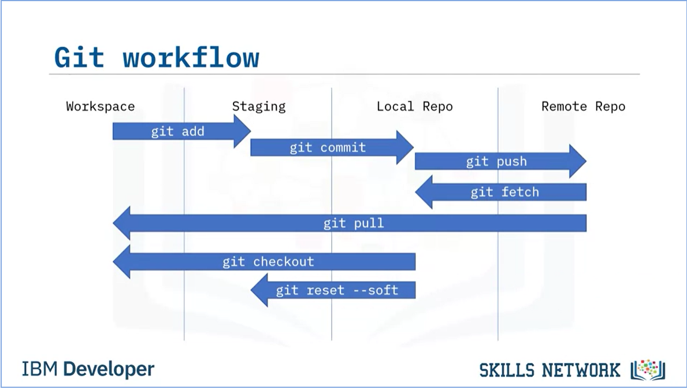
</p>
<!-- {width="4.0in" height="2.2641021434820647in"} -->

If a developer has made a commit but realized that their changes are
incomplete or incorrect,

they can run \`git reset \--soft\` to undo that commit but keep their
changes in the staging area.

Once they've made the necessary fixes, they can commit those changes
once again.

<!--~~~~~~~~~~~~~~~~~~~~~~~~~~~~~~~~~~~~~~~~~~~~~~~~~~~~~~~~~~~~~~~~~~~~~~~~~~~~~~~~~~~~~~~~~~~~-->
<p align="center">
  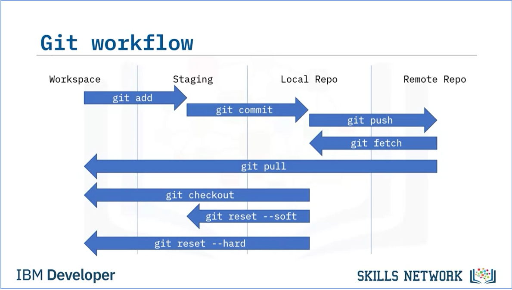
</p>
<!-- {width="4.0in" height="2.2641021434820647in"} -->

The last command is \`git reset \-\--hard\`.

It's a very powerful and dangerous command.

It will erase all changes made locally to a specific commit.

So be mindful when using this command.

This slide shows you the power of Git and how it can be used in a
development process.

<!--~~~~~~~~~~~~~~~~~~~~~~~~~~~~~~~~~~~~~~~~~~~~~~~~~~~~~~~~~~~~~~~~~~~~~~~~~~~~~~~~~~~~~~~~~~~~-->
<p align="center">
  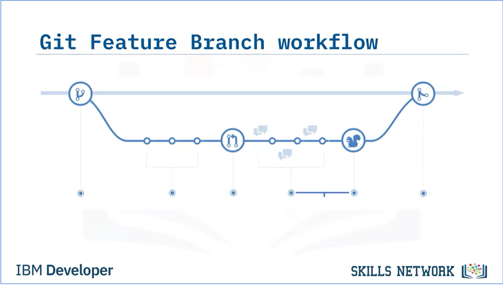
</p>
<!-- {width="4.0in" height="2.2641021434820647in"} -->

Now that you understand the Git command workflow, we can look at how the
Git Feature Branch workflow is used in social coding, visually.

<!--~~~~~~~~~~~~~~~~~~~~~~~~~~~~~~~~~~~~~~~~~~~~~~~~~~~~~~~~~~~~~~~~~~~~~~~~~~~~~~~~~~~~~~~~~~~~-->
<p align="center">
  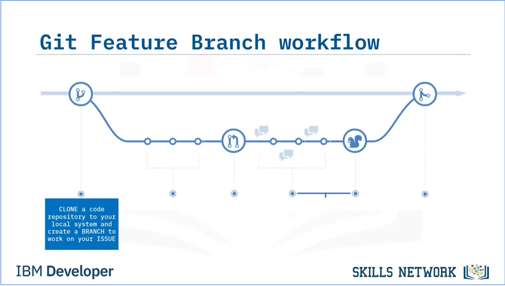
</p>
<!-- {width="4.0in" height="2.2641021434820647in"} -->

You start by cloning the repo (if you don\'t have it on your local
computer), and then creating a branch.

You want to make sure that you create a new branch for every new feature
that you work on.

<!--~~~~~~~~~~~~~~~~~~~~~~~~~~~~~~~~~~~~~~~~~~~~~~~~~~~~~~~~~~~~~~~~~~~~~~~~~~~~~~~~~~~~~~~~~~~~-->
<p align="center">
  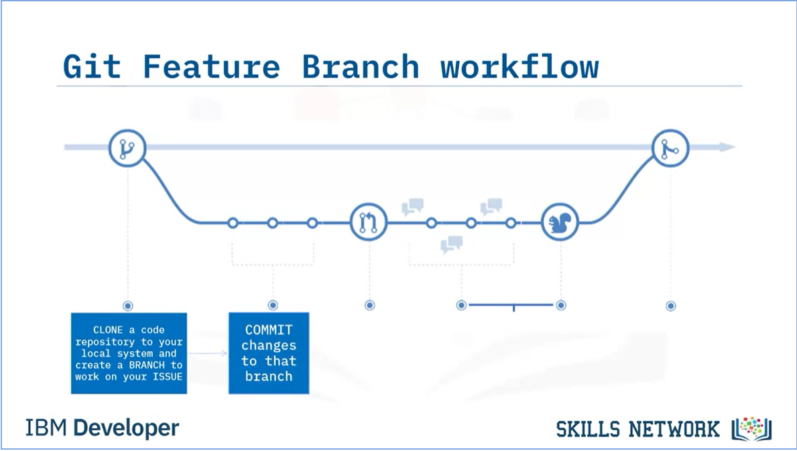
</p>
<!-- {width="4.0in" height="2.2641021434820647in"} -->

Then as you\'re working on your code making changes, you'll want to
commit those changes.

A commit gives you a checkpoint to go back to, so don\'t be afraid to
make as many commits as you need.

<!--~~~~~~~~~~~~~~~~~~~~~~~~~~~~~~~~~~~~~~~~~~~~~~~~~~~~~~~~~~~~~~~~~~~~~~~~~~~~~~~~~~~~~~~~~~~~-->
<p align="center">
  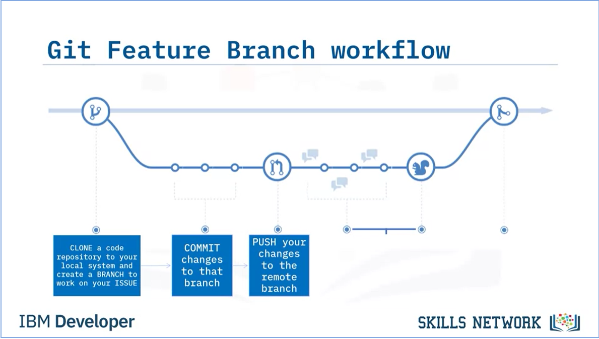
</p>
<!-- {width="4.0in" height="2.2641021434820647in"} -->

At some point, you\'re going to want to push those changes to a remote
branch.

This is like having a remote backup, so it's recommended you push your
changes to a remote branch as often as needed; at least once a day.

<!--~~~~~~~~~~~~~~~~~~~~~~~~~~~~~~~~~~~~~~~~~~~~~~~~~~~~~~~~~~~~~~~~~~~~~~~~~~~~~~~~~~~~~~~~~~~~-->
<p align="center">
  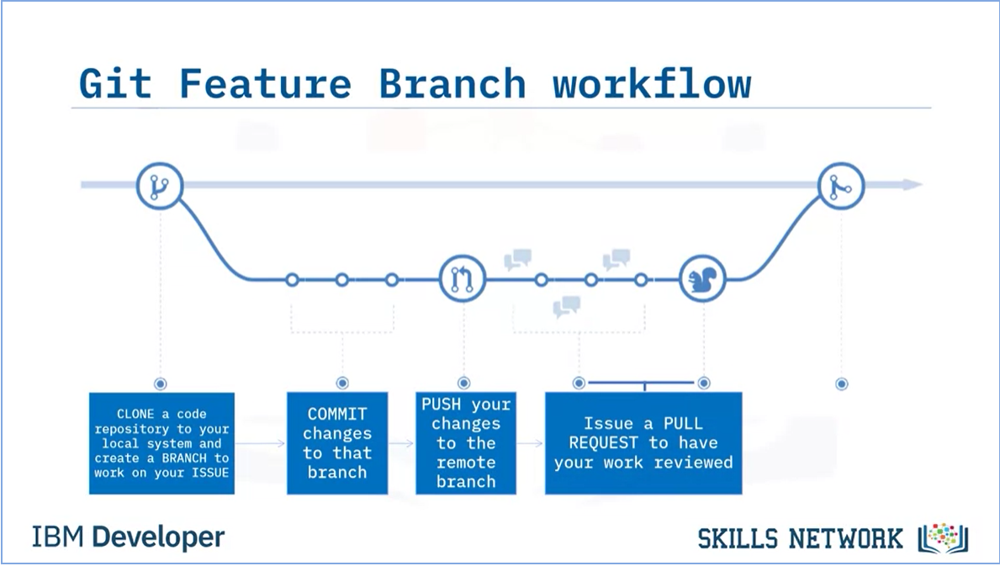
</p>
<!-- {width="4.0in" height="2.2641021434820647in"} -->

Then you open a pull request.

It might be when you\'re finished, or it might be in the middle of doing
development because you need to show people your code and ask questions.

This is where discuss and review comes into play.

This is all part of social coding.

<!--~~~~~~~~~~~~~~~~~~~~~~~~~~~~~~~~~~~~~~~~~~~~~~~~~~~~~~~~~~~~~~~~~~~~~~~~~~~~~~~~~~~~~~~~~~~~-->
<p align="center">
  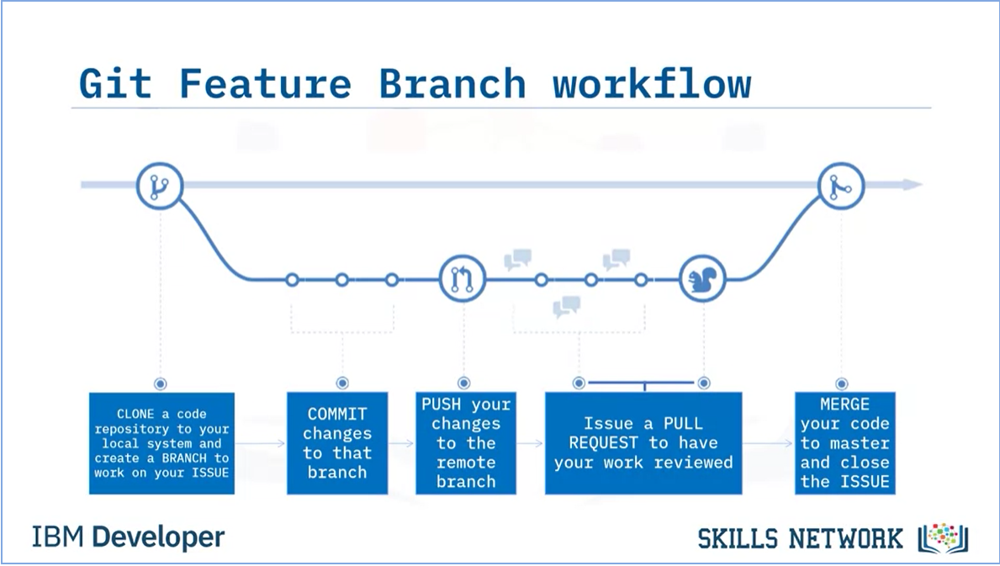
</p>
<!-- {width="4.0in"
height="2.2641021434820647in"} -->

Once your changes have been reviewed, they will then get deployed to
testing.

And once all the tests have passed, then you could merge the code back
into the main or master branch.

<!--~~~~~~~~~~~~~~~~~~~~~~~~~~~~~~~~~~~~~~~~~~~~~~~~~~~~~~~~~~~~~~~~~~~~~~~~~~~~~~~~~~~~~~~~~~~~-->
<p align="center">
  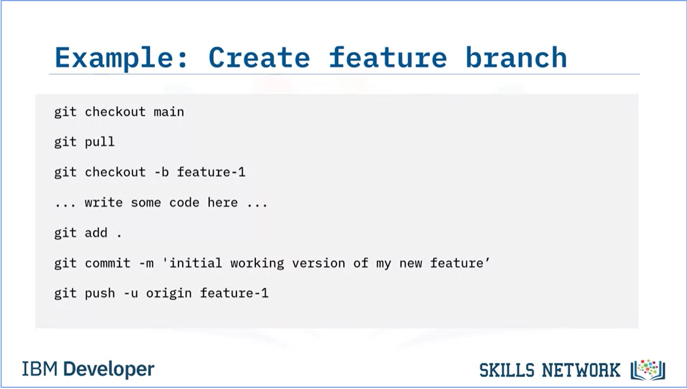
</p>
<!-- {width="4.0in" height="2.2641021434820647in"} -->

Here's a sample workflow that developers may go through when starting
development on a new feature.

When using Git, always make sure you start off with the latest code.

Check out the main branch and pull the new changes to your local
workspace.

When working on a new feature, make sure to create a new branch to work
from.

This is when a developer is ready to start developing that new feature.

Once you're finished with your changes, you should stage your changes
using the \`git add filename\` or \`git add period\` command and commit
them with a good, descriptive message.

Be careful with 'git add period'.

Make sure you have a good .gitignore file otherwise you may check in
files that you didn't intend to.

You can always use 'git status' to see what's going to be committed.

Only after that can you push your changes to the remote repo and track
the branch that your changes are on.

The 'dash u' option followed by the remote branch name are only needed
the first time to create the remote branch, and any subsequent commits
can be pushed without them.

<!--~~~~~~~~~~~~~~~~~~~~~~~~~~~~~~~~~~~~~~~~~~~~~~~~~~~~~~~~~~~~~~~~~~~~~~~~~~~~~~~~~~~~~~~~~~~~-->
<p align="center">
  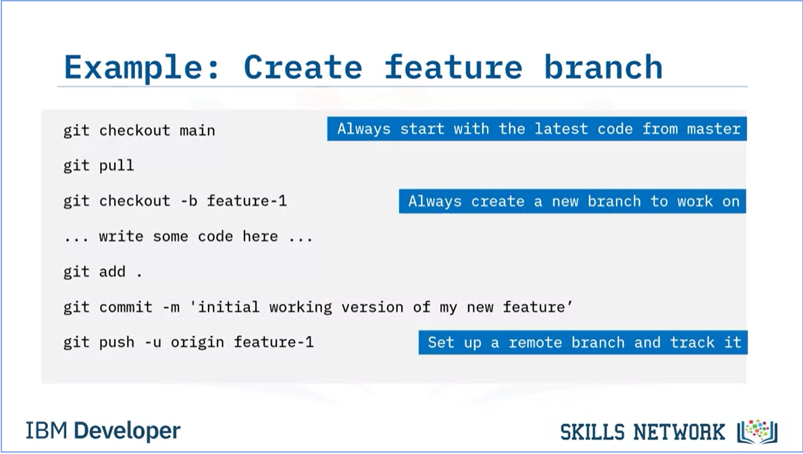
</p>
<!-- {width="4.0in" height="2.2641021434820647in"} -->

The whole process has three key components.

We want to work off the latest code available, create a new branch to
store our changes, and set up a remote branch to push our changes to.

<!--~~~~~~~~~~~~~~~~~~~~~~~~~~~~~~~~~~~~~~~~~~~~~~~~~~~~~~~~~~~~~~~~~~~~~~~~~~~~~~~~~~~~~~~~~~~~-->
<p align="center">
  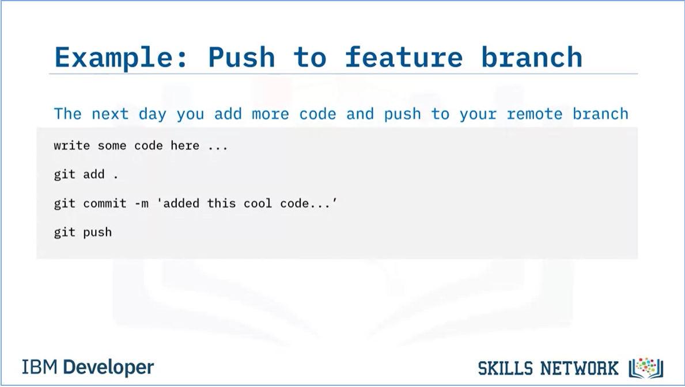
</p>
<!-- {width="4.0in" height="2.2641021434820647in"} -->

Say the next day you did some more work and now you have new changes to
push.

You would perform the same process as before.

Add your code to the staging area, commit it with a descriptive message,
and push that code to the remote repository.

<!--~~~~~~~~~~~~~~~~~~~~~~~~~~~~~~~~~~~~~~~~~~~~~~~~~~~~~~~~~~~~~~~~~~~~~~~~~~~~~~~~~~~~~~~~~~~~-->
<p align="center">
  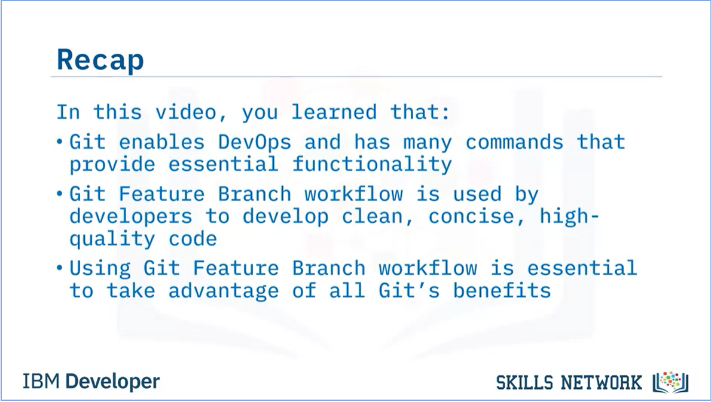
</p>
<!-- {width="4.0in" height="2.2641021434820647in"} -->

In this module, you learned that Git is an essential tool that enables
DevOps and has many commands that provide essential functionality, the
Git Feature Branch workflow is a process that many developers use in
their job to develop clean, concise, and high-quality code, and as a
developer, using the Git Feature Branch workflow is essential if you
want to take advantage of all the benefits Git can provide.

<h2 id="2-06">Module 2-06. Git Feature Workflow: Making a Pull Request (2:49)</h2>

Welcome to Git Feature Branch Workflow: Making Pull Requests.

<!--~~~~~~~~~~~~~~~~~~~~~~~~~~~~~~~~~~~~~~~~~~~~~~~~~~~~~~~~~~~~~~~~~~~~~~~~~~~~~~~~~~~~~~~~~~~~-->
<p align="center">
  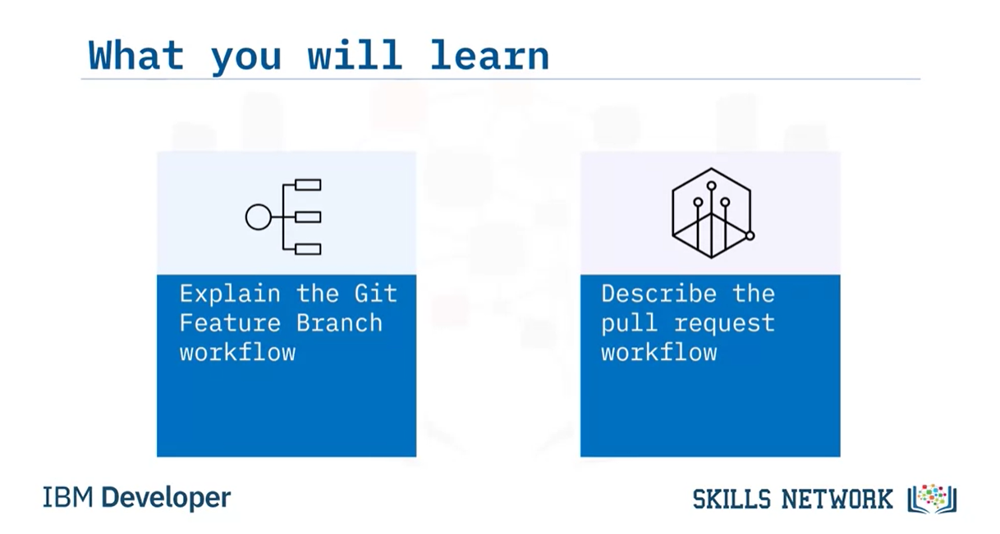
</p>
<!-- {width="4.0in" height="2.138033683289589in"} -->

After this module, you will be able to explain what the Git Feature
Branch workflow looks like in practice, and describe the pull request
workflow.

<!--~~~~~~~~~~~~~~~~~~~~~~~~~~~~~~~~~~~~~~~~~~~~~~~~~~~~~~~~~~~~~~~~~~~~~~~~~~~~~~~~~~~~~~~~~~~~-->
<p align="center">
  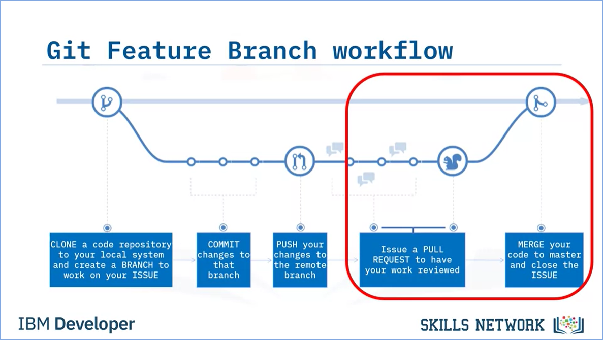
</p>
<!-- {width="4.0in" height="2.2538462379702535in"} -->

If you recall in the Git Feature Branch workflow from a previous module,
you are now on the final two steps of the process where you must first
issue a pull request, and then merge your code.

<!--~~~~~~~~~~~~~~~~~~~~~~~~~~~~~~~~~~~~~~~~~~~~~~~~~~~~~~~~~~~~~~~~~~~~~~~~~~~~~~~~~~~~~~~~~~~~-->
<p align="center">
  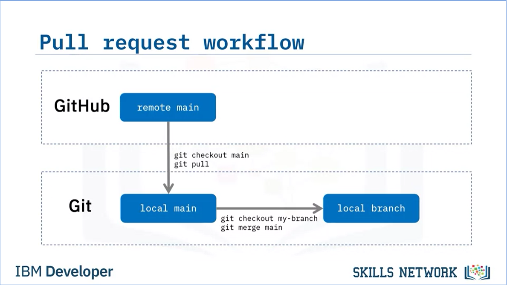
</p>
<!-- {width="4.0in" height="2.2538462379702535in"} -->

Let's review the pull request process.

You start by checking out the main branch and pulling any new changes to
the code to your local workspace.

You can then switch to the feature branch that you've been making
changes to, and merge in any new code from the main branch.

This ensures that you have the latest changes from the main branch
included in your branch.

<!--~~~~~~~~~~~~~~~~~~~~~~~~~~~~~~~~~~~~~~~~~~~~~~~~~~~~~~~~~~~~~~~~~~~~~~~~~~~~~~~~~~~~~~~~~~~~-->
<p align="center">
  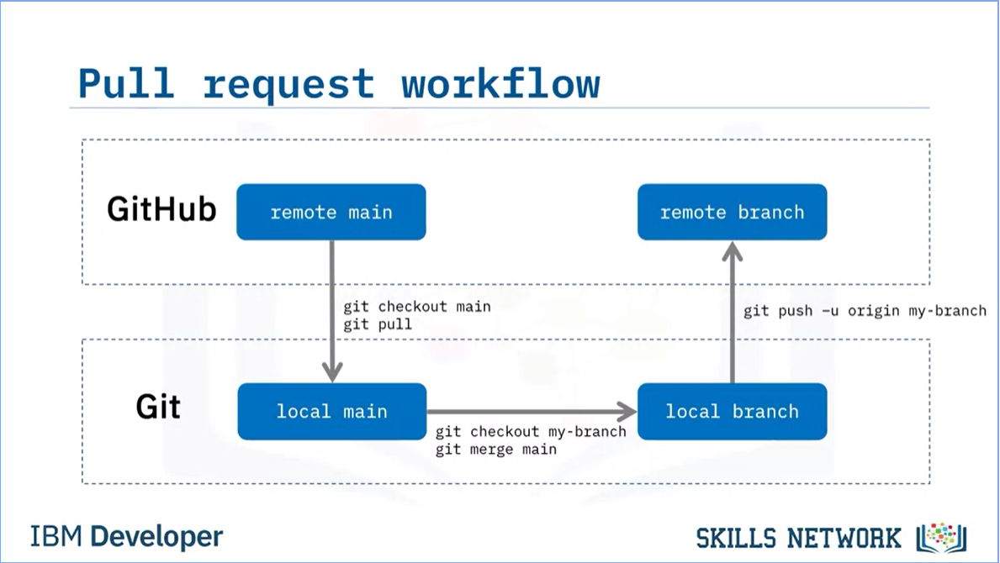
</p>
<!-- {width="4.0in" height="2.2538462379702535in"} -->

Once any merge conflicts have been resolved and this process is
complete, you can push your local branch to your remote repo. With this
simple command, you can create and set a new branch in the remote repo
to track your local branch.

<!--~~~~~~~~~~~~~~~~~~~~~~~~~~~~~~~~~~~~~~~~~~~~~~~~~~~~~~~~~~~~~~~~~~~~~~~~~~~~~~~~~~~~~~~~~~~~-->
<p align="center">
  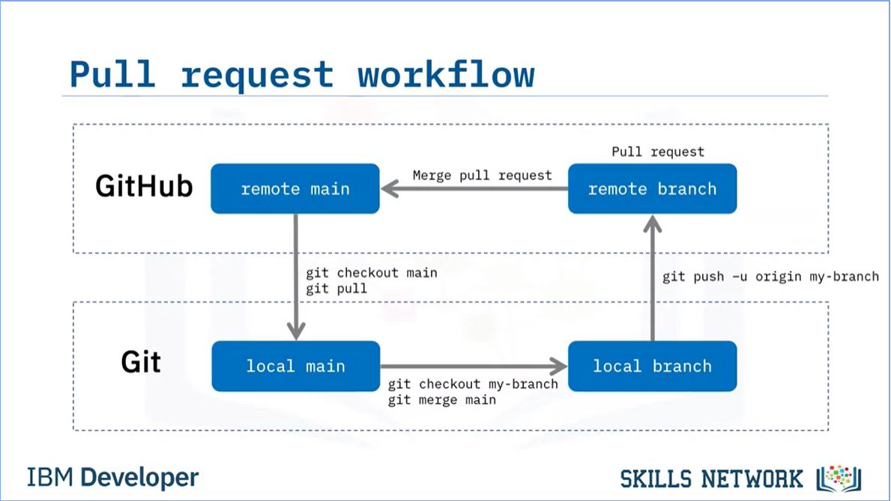
</p>
<!-- {width="4.0in" height="2.2538462379702535in"} -->

Finally, you can create a pull request and have it reviewed and merged
into the remote repository.

<!--~~~~~~~~~~~~~~~~~~~~~~~~~~~~~~~~~~~~~~~~~~~~~~~~~~~~~~~~~~~~~~~~~~~~~~~~~~~~~~~~~~~~~~~~~~~~-->
<p align="center">
  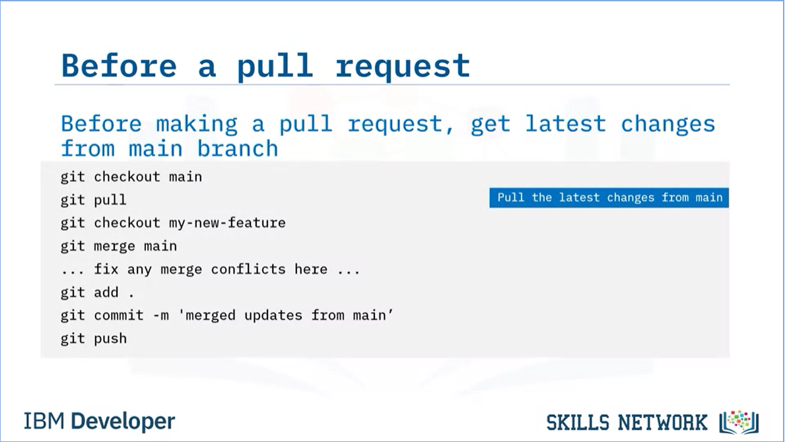
</p>
<!-- {width="4.0in" height="2.2538462379702535in"} -->

Before you make a pull request, be sure to complete the following tasks.

First, make sure you switch to the main branch before you run \`git
pull\` so you have the most recent code for the main branch in your
local workspace.

Remember that the main branch contains the most current code because
after changes are made, developers always merge back into it.

<!--~~~~~~~~~~~~~~~~~~~~~~~~~~~~~~~~~~~~~~~~~~~~~~~~~~~~~~~~~~~~~~~~~~~~~~~~~~~~~~~~~~~~~~~~~~~~-->
<p align="center">
  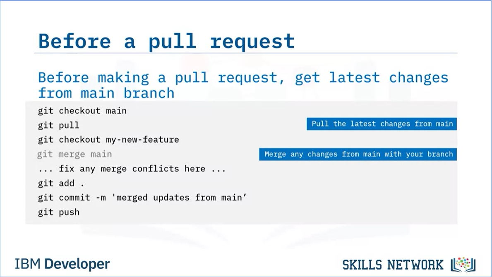
</p>
<!-- {width="4.0in" height="2.2538462379702535in"} -->

Next, merge the updated main branch into your working branch so that it
also has the most current code as well.

This may cause merge conflicts that you'll have to resolve manually.

<!--~~~~~~~~~~~~~~~~~~~~~~~~~~~~~~~~~~~~~~~~~~~~~~~~~~~~~~~~~~~~~~~~~~~~~~~~~~~~~~~~~~~~~~~~~~~~-->
<p align="center">
  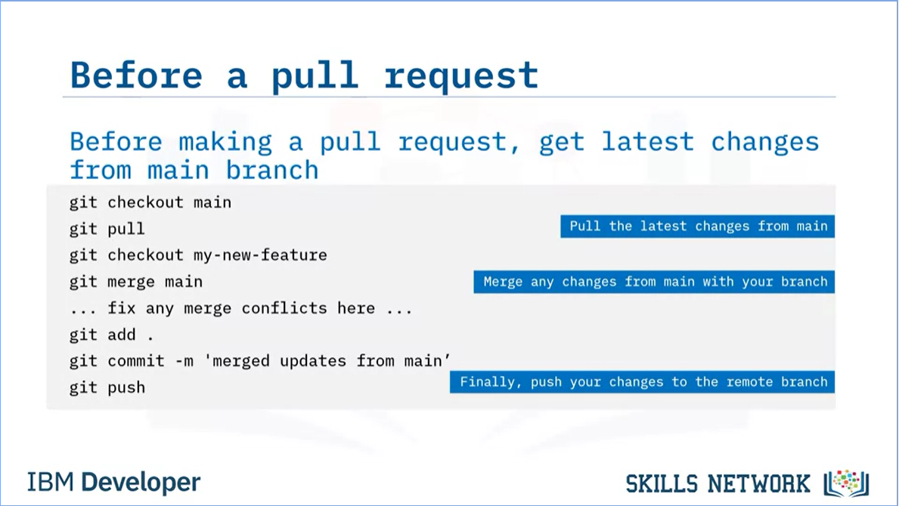
</p>
<!-- {width="4.0in" height="2.2538462379702535in"} -->

Finally, you can push your updated branch to the remote repo, which is
now ready to be merged back into the main branch.

<!--~~~~~~~~~~~~~~~~~~~~~~~~~~~~~~~~~~~~~~~~~~~~~~~~~~~~~~~~~~~~~~~~~~~~~~~~~~~~~~~~~~~~~~~~~~~~-->
<p align="center">
  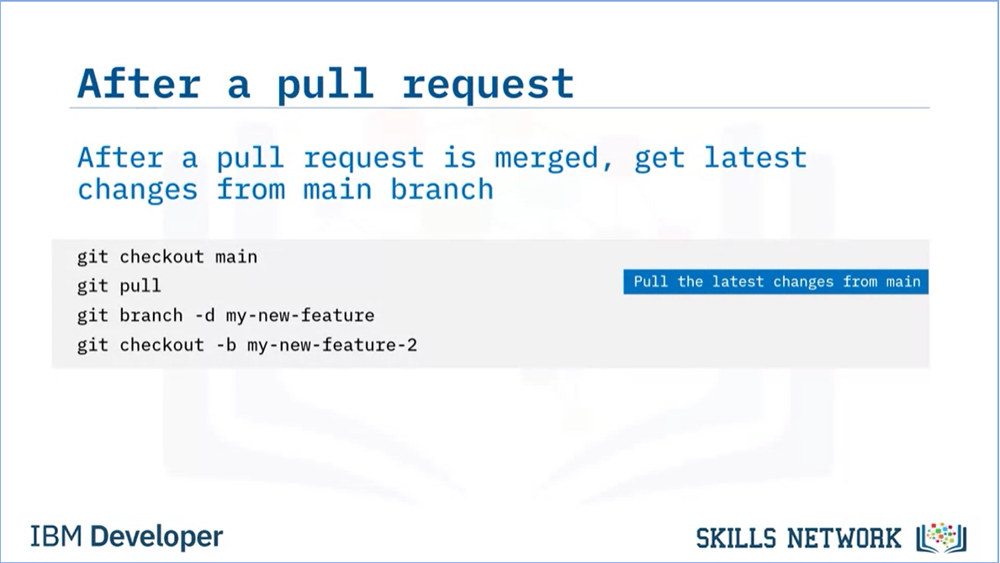
</p>
<!-- {width="4.0in" height="2.2538462379702535in"} -->

After your pull request has been merged, you should switch to the main
branch and pull the most current code, which now includes your latest
changes.

<!--~~~~~~~~~~~~~~~~~~~~~~~~~~~~~~~~~~~~~~~~~~~~~~~~~~~~~~~~~~~~~~~~~~~~~~~~~~~~~~~~~~~~~~~~~~~~-->
<p align="center">
  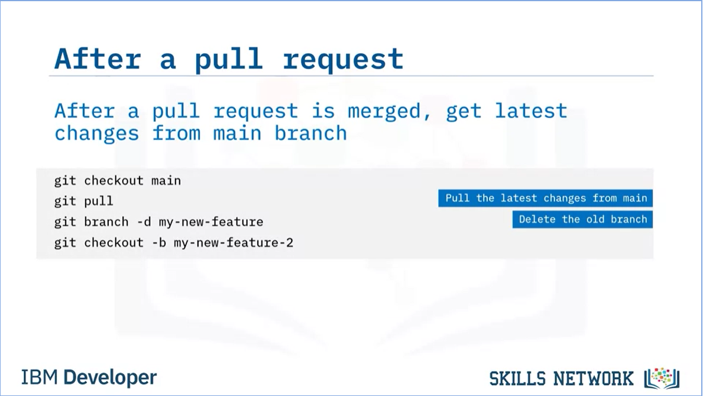
</p>
<!-- {width="4.0in" height="2.2538462379702535in"} -->

To start fresh, delete the old feature branch you worked on, as the
changes there have already been merged into the main branch.

<!--~~~~~~~~~~~~~~~~~~~~~~~~~~~~~~~~~~~~~~~~~~~~~~~~~~~~~~~~~~~~~~~~~~~~~~~~~~~~~~~~~~~~~~~~~~~~-->
<p align="center">
  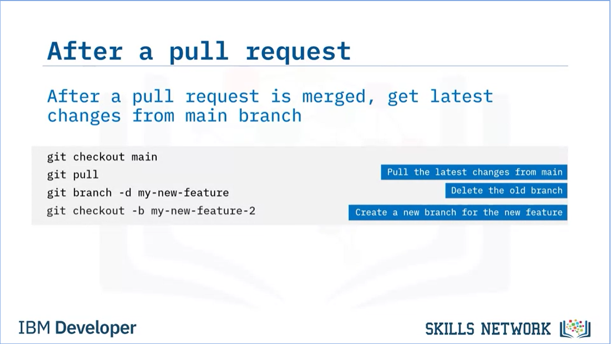
</p>
<!-- {width="4.0in" height="2.2538462379702535in"} -->

You can start developing on a new feature branch by creating it and
checking it out.

<!--~~~~~~~~~~~~~~~~~~~~~~~~~~~~~~~~~~~~~~~~~~~~~~~~~~~~~~~~~~~~~~~~~~~~~~~~~~~~~~~~~~~~~~~~~~~~-->
<p align="center">
  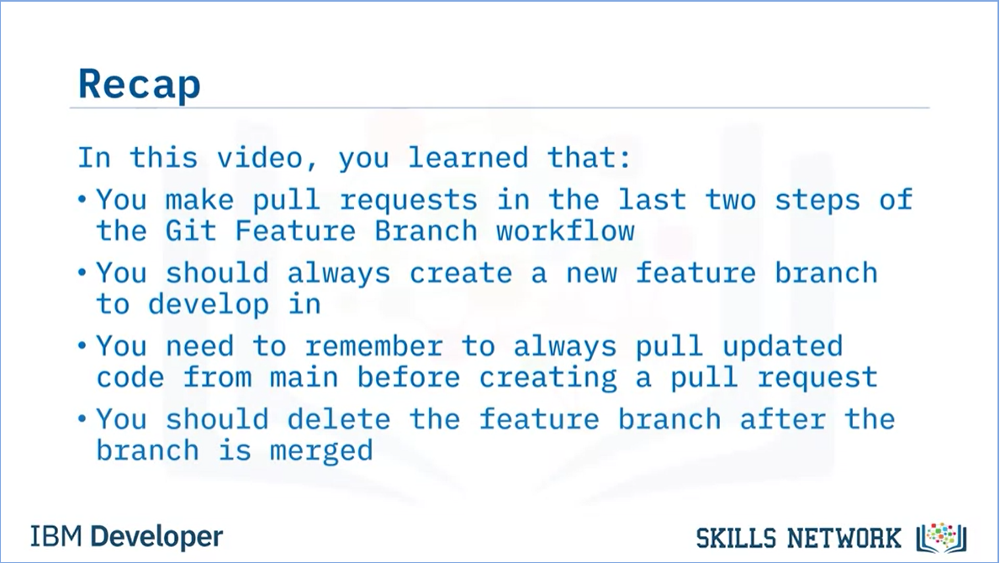
</p>
<!-- {width="4.0in" height="2.2538462379702535in"} -->

In this module, you learned that you make pull requests in the last two
steps of the Git Feature Branch workflow, you should always create a new
feature branch to develop in, you need to remember to always pull
updated code from the main branch before creating making a pull request,
and you should delete the feature branch after the branch is merged.

<h2 id="2-07">Module 2-07. Tools of Continuous Integration (8:59)</h2>

Welcome to Tools of Continuous Integration.

<!--~~~~~~~~~~~~~~~~~~~~~~~~~~~~~~~~~~~~~~~~~~~~~~~~~~~~~~~~~~~~~~~~~~~~~~~~~~~~~~~~~~~~~~~~~~~~-->
<p align="center">
  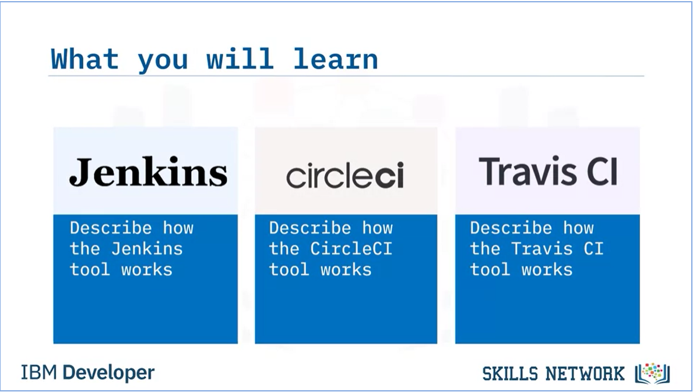
</p>
<!-- {width="4.0in" height="2.267521872265967in"} -->

After this module, you will be able to describe how the Jenkins tool
works, describe how the CircleCI tool works, and describe how the Travis
CI tool works.

<!--~~~~~~~~~~~~~~~~~~~~~~~~~~~~~~~~~~~~~~~~~~~~~~~~~~~~~~~~~~~~~~~~~~~~~~~~~~~~~~~~~~~~~~~~~~~~-->
<p align="center">
  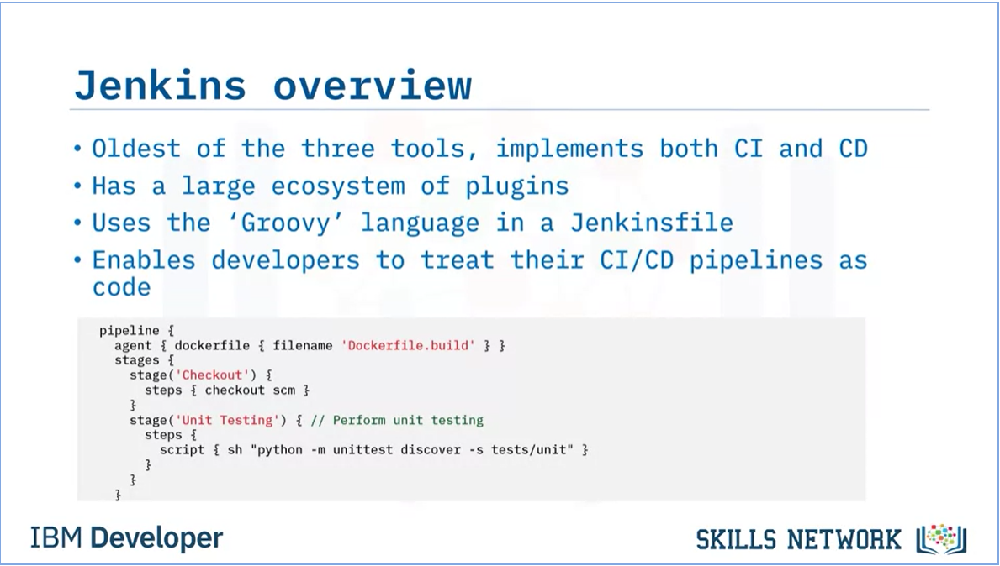
</p>
<!-- {width="4.0in" height="2.267521872265967in"} -->

Jenkins, the oldest of the three tools, implements both Continuous
Integration and Continuous Delivery.

It used to be the cream of the crop in this space.

One of the things that made it so popular was that it is open source,
and you can run your own Jenkins servers.

Jenkins has a large ecosystem of plugins to integrate with other tools
such as Docker, Jira, and Maven, but the downside is this means there
are many plugins to manage.

You have to spend a lot of time making sure that all the plugins are up
to date and secure, as well as compatible with all the other plugins.

It describes the CI pipeline using the 'Groovy' language in a
Jenkinsfile.

This requires users to understand a bit of Groovy to use it.

The Jenkinsfile enables developers to treat their CI/CD pipelines as
code, as you can see in this short example.

It describes a simple pipeline with two stages to check out and test the
code.

<!--~~~~~~~~~~~~~~~~~~~~~~~~~~~~~~~~~~~~~~~~~~~~~~~~~~~~~~~~~~~~~~~~~~~~~~~~~~~~~~~~~~~~~~~~~~~~-->
<p align="center">
  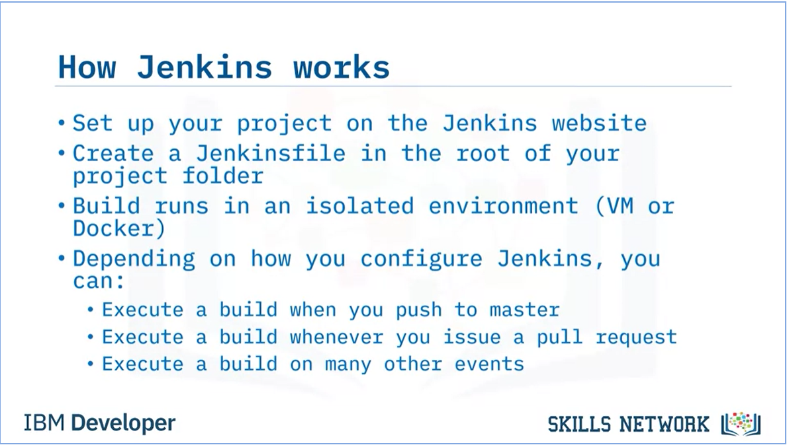
</p>
<!-- {width="4.0in" height="2.267521872265967in"} -->

To implement Jenkins into your workflow, you first need to set up your
project on the Jenkins website.

This is a drawback.

As you will see, other tools allow you to specify a pipeline simply by
adding a file to your repository, making them very repeatable.

Requiring you to use a website for some configuration means manual steps
that are not automatable and may not be reproducible.

There are two ways to use Jenkins.

We're going to cover the Jenkins Pipeline workflow.

To set up your repository for Jenkins Pipeline, you need to create a
Jenkinsfile to specify the CI instructions and place it in the root of
your project repository.

These instructions tell Jenkins how to run the pipeline to build and
test your code.

Jenkins can build your code in a virtual machine or inside a Docker
container.

You can also specify what actions trigger a build.

Unfortunately, you can't do this in the Jenkinsfile; you must configure
this on the Jenkins server using the user interface.

You can specify to execute a build when you push to the master branch,
whenever you issue a pull request, or on the occurrence of many other
events.

<!--~~~~~~~~~~~~~~~~~~~~~~~~~~~~~~~~~~~~~~~~~~~~~~~~~~~~~~~~~~~~~~~~~~~~~~~~~~~~~~~~~~~~~~~~~~~~-->
<p align="center">
  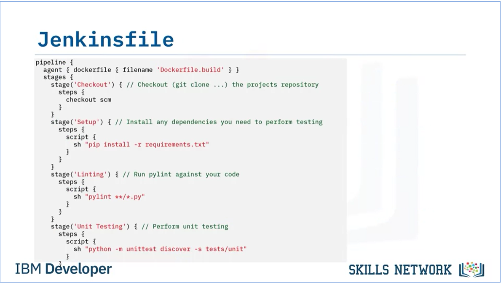
</p>
<!-- {width="4.0in" height="2.267522965879265in"} -->

Now let's take a look at a realistic example of a Jenkinsfile.

This example Jenkinsfile runs unit tests on a Python project.

It has four stages.

<!--~~~~~~~~~~~~~~~~~~~~~~~~~~~~~~~~~~~~~~~~~~~~~~~~~~~~~~~~~~~~~~~~~~~~~~~~~~~~~~~~~~~~~~~~~~~~-->
<p align="center">
  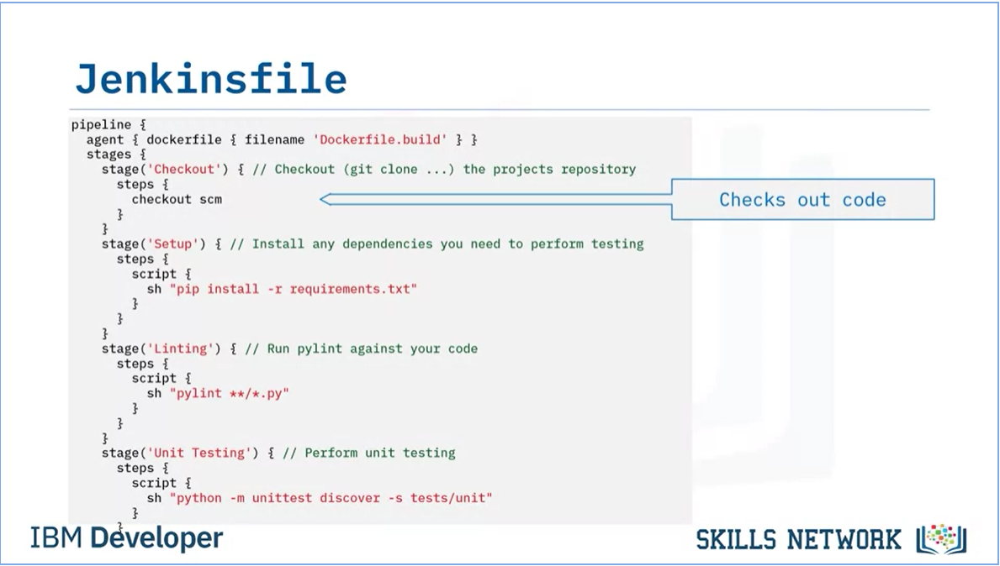
</p>
<!-- {width="4.0in" height="2.267521872265967in"} -->

When Jenkins is notified by a webhook, it runs through the Jenkinsfile.

At the top, it sets up the code to run in a Docker environment.

The pipeline first checks out the code.

<!--~~~~~~~~~~~~~~~~~~~~~~~~~~~~~~~~~~~~~~~~~~~~~~~~~~~~~~~~~~~~~~~~~~~~~~~~~~~~~~~~~~~~~~~~~~~~-->
<p align="center">
  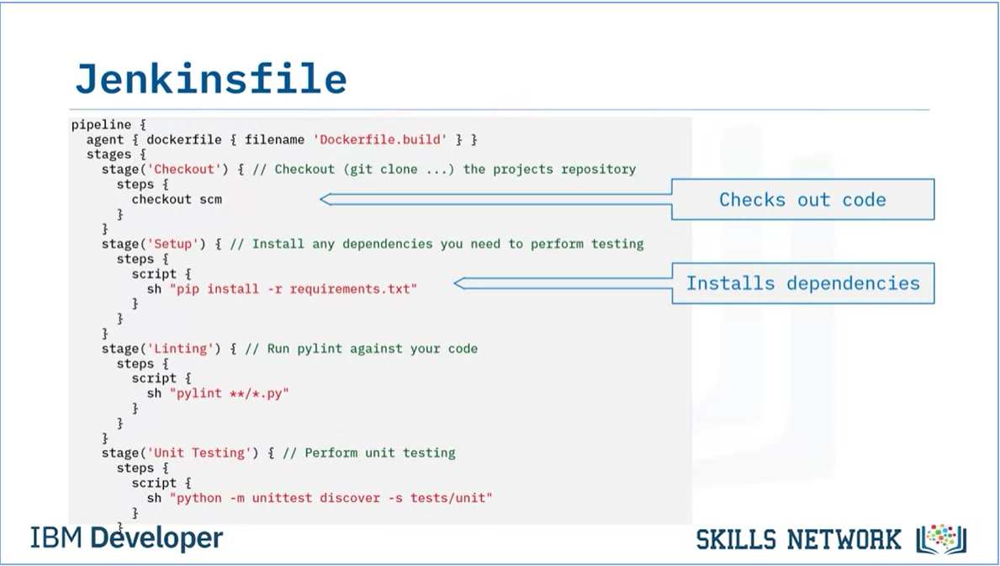
</p>
<!-- {width="4.0in" height="2.2675207786526683in"} -->

The next step in this pipeline installs any specified Python package
dependencies.

<!--~~~~~~~~~~~~~~~~~~~~~~~~~~~~~~~~~~~~~~~~~~~~~~~~~~~~~~~~~~~~~~~~~~~~~~~~~~~~~~~~~~~~~~~~~~~~-->
<p align="center">
  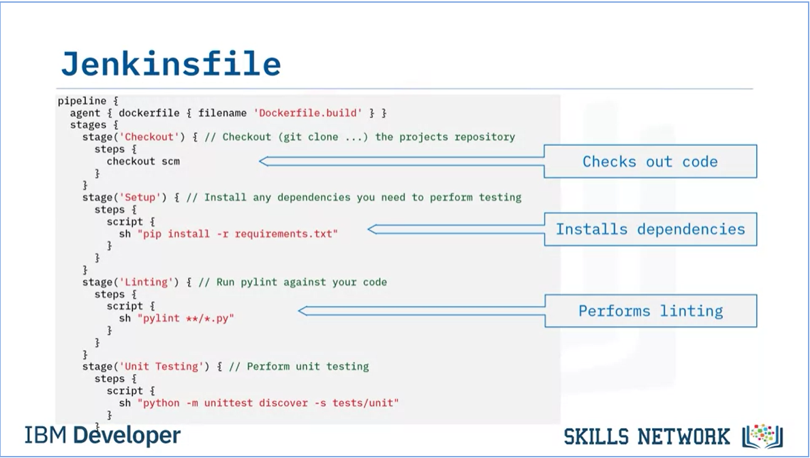
</p>
<!-- {width="4.0in" height="2.2675207786526683in"} -->

Next, it lints every Python module in your code.

This means it goes into your code and checks that it follows best coding
practices.

<!--~~~~~~~~~~~~~~~~~~~~~~~~~~~~~~~~~~~~~~~~~~~~~~~~~~~~~~~~~~~~~~~~~~~~~~~~~~~~~~~~~~~~~~~~~~~~-->
<p align="center">
  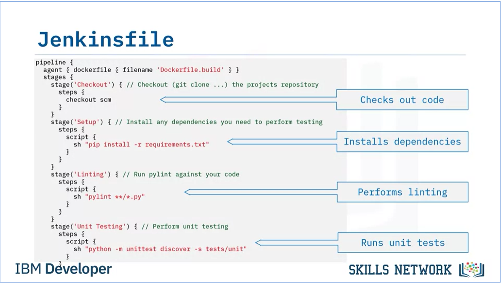
</p>
<!-- {width="4.0in" height="2.2675207786526683in"} -->

And lastly, it runs unit tests on your code.

The process is straightforward and works similarly in other CI tools.

<!--~~~~~~~~~~~~~~~~~~~~~~~~~~~~~~~~~~~~~~~~~~~~~~~~~~~~~~~~~~~~~~~~~~~~~~~~~~~~~~~~~~~~~~~~~~~~-->
<p align="center">
  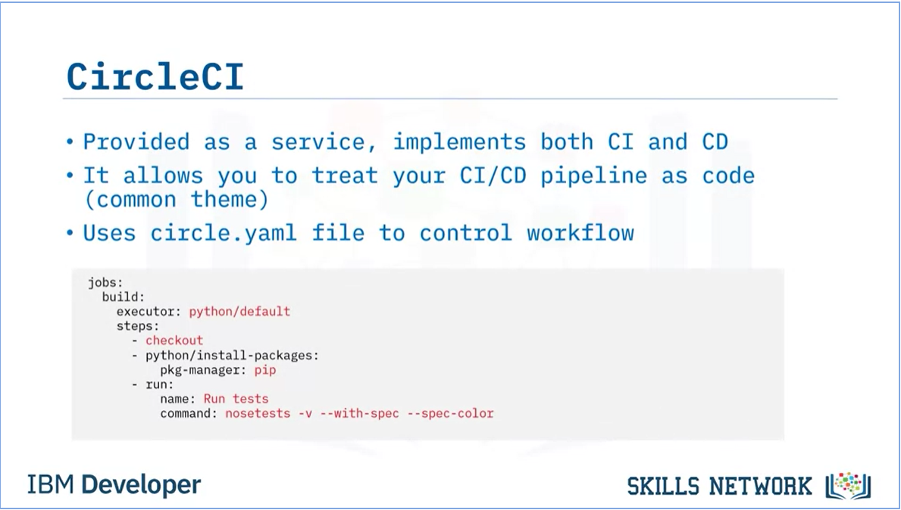
</p>
<!-- {width="4.0in" height="2.267521872265967in"} -->

CircleCI is provided as a service, and implements both CI and CD.

Because it's a service, you can't run this on your own server like you
can with

Jenkins, and it's not open source.

It enables developers to treat their CI/CD pipelines as code, which is a
common theme you'll see with all these tools.

Similar to the Jenkinsfile with Jenkins, CircleCI uses a YAML file to
specify the CI process, as seen in this short example that checks out
the code, installs Python package dependencies, and runs some unit
tests.

The advantage of using YAML is that it is easily readable by both humans
and machines and is a very popular format for configuring systems and
services.

<!--~~~~~~~~~~~~~~~~~~~~~~~~~~~~~~~~~~~~~~~~~~~~~~~~~~~~~~~~~~~~~~~~~~~~~~~~~~~~~~~~~~~~~~~~~~~~-->
<p align="center">
  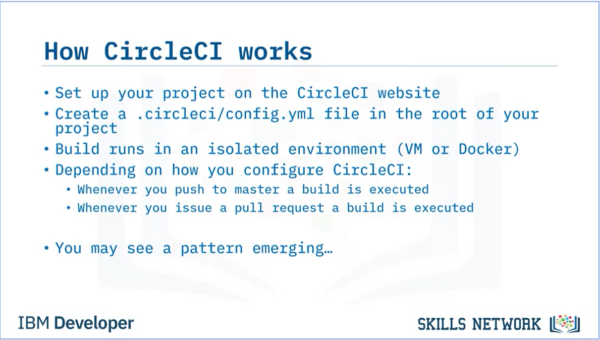
</p>
<!-- {width="4.0in" height="2.267521872265967in"} -->

To implement CircleCI into your workflow, you need to first set up your
project on the CircleCI website.

Unfortunately, this is a manual step.

To set up your repository for CircleCI, you need to create a config file
to specify the CI instructions.

These instructions tell CircleCI when and how you want your code built.

It can build your code in a virtual machine or inside a Docker
container.

You can also specify what actions trigger a build.

You may see a pattern emerging; all of these tools in this lesson
support both native and

Docker builds and specify the pipeline instructions as code, like in the
Jenkinsfile in Jenkins.

<!--~~~~~~~~~~~~~~~~~~~~~~~~~~~~~~~~~~~~~~~~~~~~~~~~~~~~~~~~~~~~~~~~~~~~~~~~~~~~~~~~~~~~~~~~~~~~-->
<p align="center">
  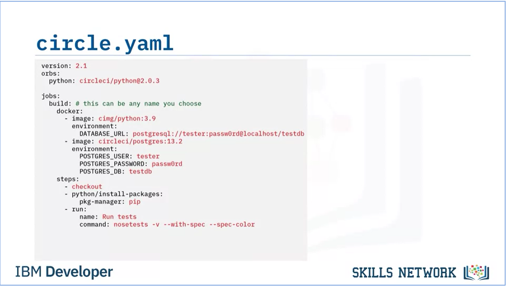
</p>
<!-- {width="4.0in" height="2.267521872265967in"} -->

So, let's take a look at an example circle.yaml file.

CircleCI natively supports languages such as Closure, Java, JavaScript,
Python, PHP, and some others.

It also supports databases such as MySQL, MongoDB, and Postgres.

And since it supports Docker, anything you can build in Docker, you can
build with CircleCI.

<!--~~~~~~~~~~~~~~~~~~~~~~~~~~~~~~~~~~~~~~~~~~~~~~~~~~~~~~~~~~~~~~~~~~~~~~~~~~~~~~~~~~~~~~~~~~~~-->
<p align="center">
  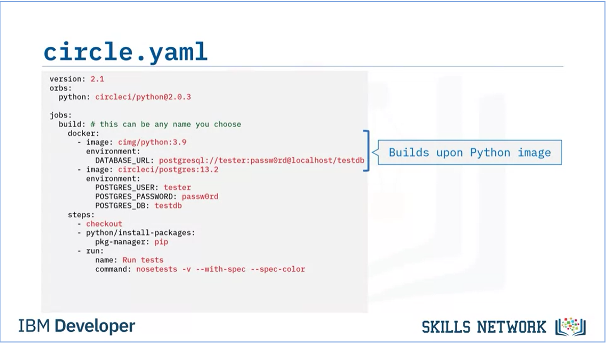
</p>
<!-- {width="4.0in" height="2.267521872265967in"} -->

This section of the YAML file asks CircleCI to get a Docker Python image
and sets an environment variable for the database URL.

<!--~~~~~~~~~~~~~~~~~~~~~~~~~~~~~~~~~~~~~~~~~~~~~~~~~~~~~~~~~~~~~~~~~~~~~~~~~~~~~~~~~~~~~~~~~~~~-->
<p align="center">
  
</p>
<!-- {width="4.0in" height="2.267521872265967in"} -->

The next section sets up PostgreSQL and several environment variables to
configure Postgres.

<!--~~~~~~~~~~~~~~~~~~~~~~~~~~~~~~~~~~~~~~~~~~~~~~~~~~~~~~~~~~~~~~~~~~~~~~~~~~~~~~~~~~~~~~~~~~~~-->
<p align="center">
  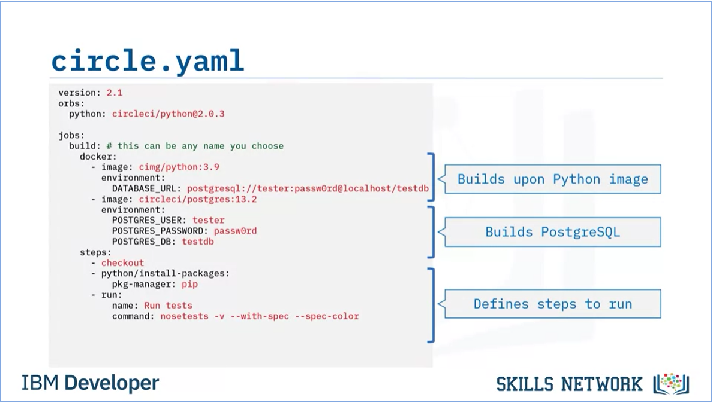
</p>
<!-- {width="4.0in" height="2.267521872265967in"} -->

Once the environment is set up, it checks out your code, installs
packages, and runs tests.

Clearly, you can see a pattern in how both Jenkins and CircleCI work.

<!--~~~~~~~~~~~~~~~~~~~~~~~~~~~~~~~~~~~~~~~~~~~~~~~~~~~~~~~~~~~~~~~~~~~~~~~~~~~~~~~~~~~~~~~~~~~~-->
<p align="center">
  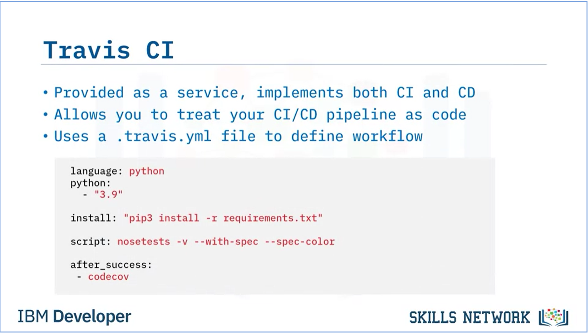
</p>
<!-- {width="4.0in" height="2.267521872265967in"} -->

Travis CI is just like the other two tools; it implements both CI and
CD.

Like CircleCI, Travis CI is a hosted service, which means you cannot run
it on your own servers.

It's only available as a service.

You can, however, get an enterprise license and run it internally in
your own company.

Also, like CircleCI and Jenkins, you must set up your project first in
their admin UI, which is a manual step.

It enables developers to treat their CI/CD pipelines as code.

Unlike CircleCI, it supports many more languages and databases natively,
as well as Docker, so you can really run anything with Travis CI.

And like CircleCI, you use a YAML file to specify the CI process, as you
can see in this example that requests a Python 3.9 environment, installs
dependencies, runs unit tests, and uploads the code coverage.

That's a lot of functionality for a little file.

<!--~~~~~~~~~~~~~~~~~~~~~~~~~~~~~~~~~~~~~~~~~~~~~~~~~~~~~~~~~~~~~~~~~~~~~~~~~~~~~~~~~~~~~~~~~~~~-->
<p align="center">
  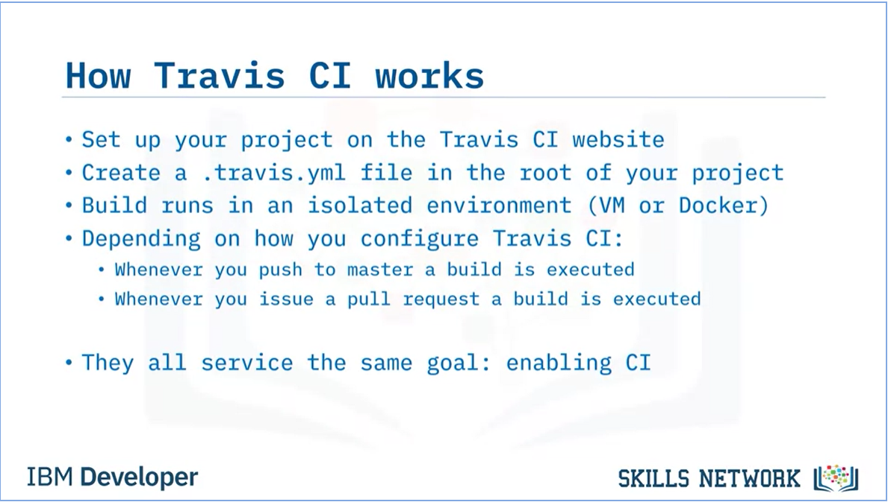
</p>
<!-- {width="4.0in" height="2.267521872265967in"} -->

To implement Travis CI into your workflow, you first need to set up your
project on the Travis CI website.

This is a manual step, but unlike Jenkins and CircleCI, Travis allows
you to enable it for all of your repositories, so it only has to be done
once for all of your repos.

Next, to set up your repository for Travis CI, you need to create a
.travis.yml file and place it in the root of your repository.

These instructions tell Travis when and how you want your code built.

You can build your code in a virtual machine or in a Docker container.

Like the other tools, you can specify what actions trigger a build, but
unlike the other tools, this is not done in the .travis.yml file.

It can only be done manually from the Travis CI admin UI, just like
Jenkins, which is a drawback.

As you can tell, each of these tools provides a means to reach the same
goal: enabling Continuous Integration of your code.

<!--~~~~~~~~~~~~~~~~~~~~~~~~~~~~~~~~~~~~~~~~~~~~~~~~~~~~~~~~~~~~~~~~~~~~~~~~~~~~~~~~~~~~~~~~~~~~-->
<p align="center">
  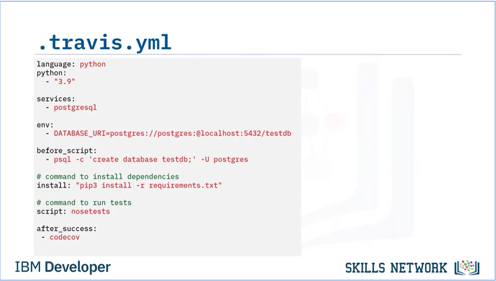
</p>
<!-- {width="4.0in" height="2.267521872265967in"} -->

Let's take a look at an example Travis YAML file.

Like the other two tools, the .travis.yml file defines the instructions
to run the build.

<!--~~~~~~~~~~~~~~~~~~~~~~~~~~~~~~~~~~~~~~~~~~~~~~~~~~~~~~~~~~~~~~~~~~~~~~~~~~~~~~~~~~~~~~~~~~~~-->
<p align="center">
  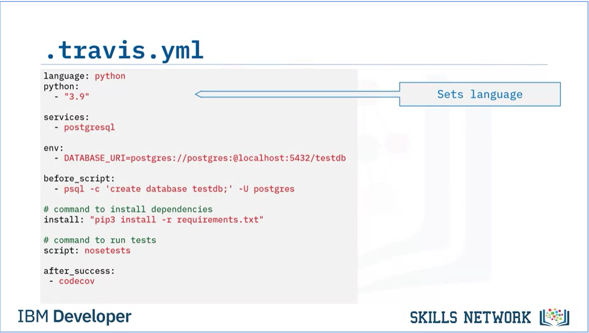
</p>
<!-- {width="4.0in" height="2.267521872265967in"} -->

The top of this file specifies the language to use to build the code.

<!--~~~~~~~~~~~~~~~~~~~~~~~~~~~~~~~~~~~~~~~~~~~~~~~~~~~~~~~~~~~~~~~~~~~~~~~~~~~~~~~~~~~~~~~~~~~~-->
<p align="center">
  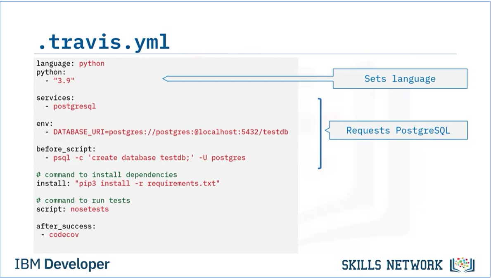
</p>
<!-- {width="4.0in" height="2.267521872265967in"} -->

Then, it requests a PostgreSQL database, sets an environment variable to
the database URL, and provisions a test database to run the tests with.

<!--~~~~~~~~~~~~~~~~~~~~~~~~~~~~~~~~~~~~~~~~~~~~~~~~~~~~~~~~~~~~~~~~~~~~~~~~~~~~~~~~~~~~~~~~~~~~-->
<p align="center">
  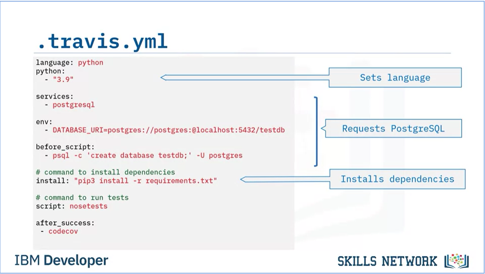
</p>
<!-- {width="4.0in" height="2.267521872265967in"} -->

After that, it installs the required Python dependency packages.

<!--~~~~~~~~~~~~~~~~~~~~~~~~~~~~~~~~~~~~~~~~~~~~~~~~~~~~~~~~~~~~~~~~~~~~~~~~~~~~~~~~~~~~~~~~~~~~-->
<p align="center">
  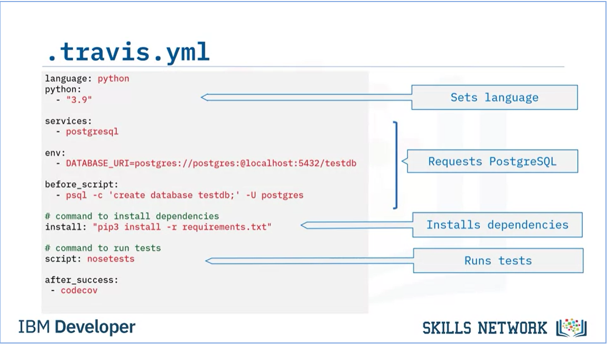
</p>
<!-- {width="4.0in" height="2.267521872265967in"} -->

Once the environment is set up, this script then tests the code.

<!--~~~~~~~~~~~~~~~~~~~~~~~~~~~~~~~~~~~~~~~~~~~~~~~~~~~~~~~~~~~~~~~~~~~~~~~~~~~~~~~~~~~~~~~~~~~~-->
<p align="center">
  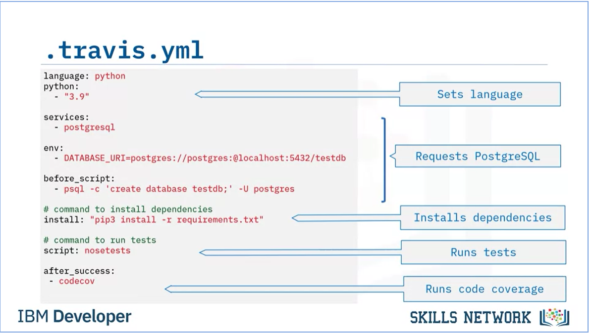
</p>
<!-- {width="4.0in" height="2.267521872265967in"} -->

And finally, it collects and uploads the test results to Codecov.io.

This is a very simple example, but it shows that it doesn't take much to
automate Continuous Integration with Travis CI.

<!--~~~~~~~~~~~~~~~~~~~~~~~~~~~~~~~~~~~~~~~~~~~~~~~~~~~~~~~~~~~~~~~~~~~~~~~~~~~~~~~~~~~~~~~~~~~~-->
<p align="center">
  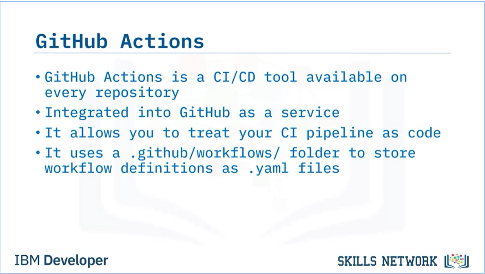
</p>
<!-- {width="4.0in" height="2.267521872265967in"} -->

There is one more tool we didn't mention in this overview, and that's
GitHub Actions.

GitHub Actions is a CI/CD tool that is available in every GitHub
repository.

It is integrated into GitHub as a service.

It allows you to fully treat your CI pipeline as code, and is controlled
by YAML files.

GitHub Actions will be covered in more depth in subsequent modules, and
it will be the tool that you use in this course.

<!--~~~~~~~~~~~~~~~~~~~~~~~~~~~~~~~~~~~~~~~~~~~~~~~~~~~~~~~~~~~~~~~~~~~~~~~~~~~~~~~~~~~~~~~~~~~~-->
<p align="center">
  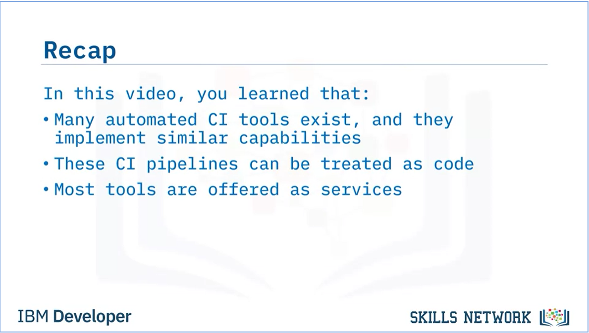
</p>
<!-- {width="4.0in" height="2.267521872265967in"} -->

In this module, you learned that;

-   There are many automated CI tools out there with different pros and
    cons, and most of them have similar characteristics,

```{=html}
<!-- -->
```
-   Each of these tools provides CI pipelines that can be written as
    code, enabling automation and repeatability, and

-   Tools such as CircleCI and Travis CI are offered as services so that
    you don't have to worry about managing them.

<h3>Reading: Summary & Highlights</h3>

Congratulations! You have completed this lesson. At this point in the
course, you know: 

-   CI is an automation process that helps developers continuously
    integrate code by using short-lived branches. 

-   CI involves frequent pull requests that are easy to review and
    encourage collaboration. 

-   CI automatically runs code through predefined tests, streamlining
    development. 

-   With CI/CD, you get: 

    -   Faster reaction times to changes 

    -   Reduced code integration risk 

    -   Higher code quality 

    -   Confirmation that the code in version control works 

-   Social coding leads to high-quality code and increased
    collaboration, saving time, effort, and money. 

-   Git enables DevOps and has many commands that provide essential
    functionality. 

-   Developers use Git'sFeature Branch Workflow to develop clean,
    concise, high-quality code. 

-   The Git Feature Branch Workflow involves five steps:

    -   Clone a repository to your local system and create a branch to
        work on your issue.

    -   Commit changes to that branch. 

    -   Push your changes to the remote branch. 

    -   Issue a pull request to have your work reviewed. 

    -   Merge your code to the main branch and close the issue. 

-   Standard CI tools include but are not limited to Jenkins, CircleCI,
    TravisCI, and GitHub Actions, and each has advantages and
    disadvantages. 

-   You can write your CI pipelines as code for your CI tool to run. 

-   Many CI tools are offered as services that you can easily run and
    scale on the cloud.

<h2 id="2-08">Module 2-08. Github - Getting Started (3:26)</h2>

<!--~~~~~~~~~~~~~~~~~~~~~~~~~~~~~~~~~~~~~~~~~~~~~~~~~~~~~~~~~~~~~~~~~~~~~~~~~~~~~~~~~~~~~~~~~~~~-->
<p align="center">
  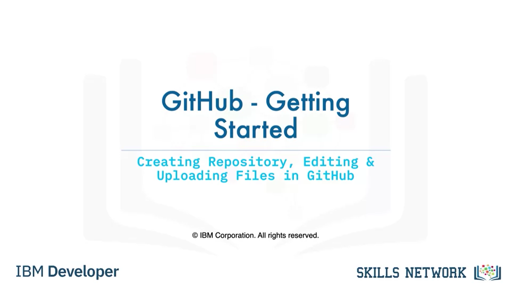
</p>
<!-- {width="4.0in" height="2.267521872265967in"} -->

In the previous module, you learned about Git and GitHub. Before you
continue with this module, register for a GitHub account and log in.
Let's start by creating a new repository.

<!--~~~~~~~~~~~~~~~~~~~~~~~~~~~~~~~~~~~~~~~~~~~~~~~~~~~~~~~~~~~~~~~~~~~~~~~~~~~~~~~~~~~~~~~~~~~~-->
<p align="center">
  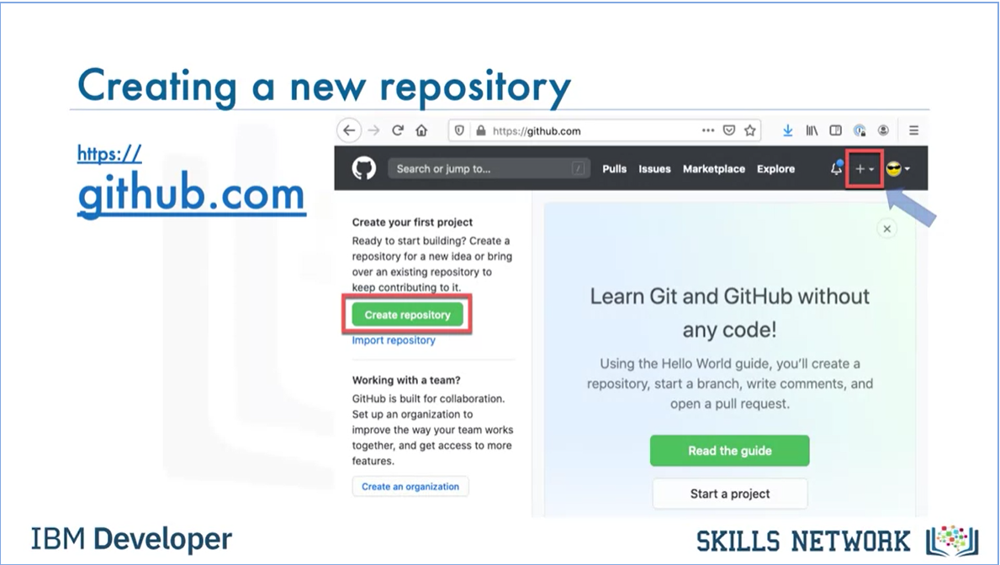
</p>
<!-- {width="4.0in" height="2.260683508311461in"} -->

Click + then click New Repository.

<!--~~~~~~~~~~~~~~~~~~~~~~~~~~~~~~~~~~~~~~~~~~~~~~~~~~~~~~~~~~~~~~~~~~~~~~~~~~~~~~~~~~~~~~~~~~~~-->
<p align="center">
  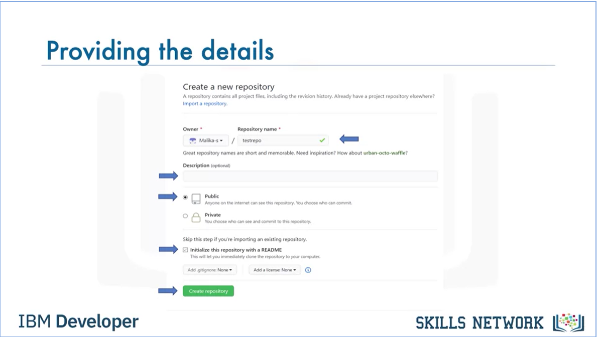
</p>
<!-- {width="4.0in" height="2.260683508311461in"} -->

To create a new repository, you need to provide these details: give your
new repository a name; optionally, add a description of your repository;

choose the repository visibility - whether you want it to be public or
private; and choose the option to Initialize this repository with readme
file. Then click Create Repository.

<!--~~~~~~~~~~~~~~~~~~~~~~~~~~~~~~~~~~~~~~~~~~~~~~~~~~~~~~~~~~~~~~~~~~~~~~~~~~~~~~~~~~~~~~~~~~~~-->
<p align="center">
  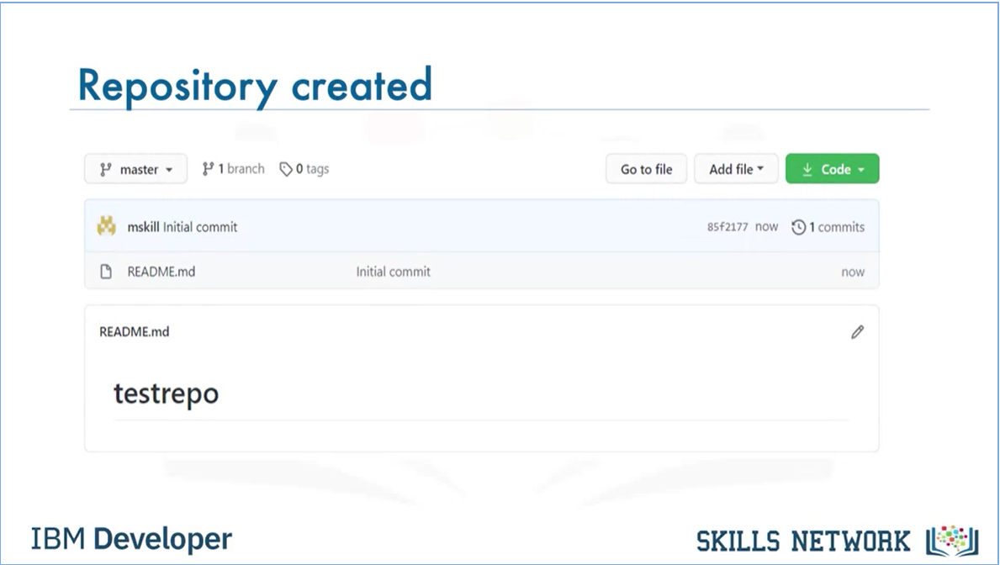
</p>
<!-- {width="4.0in" height="2.260683508311461in"} -->

You will now be redirected to the repository you have created.

The root folder of your repository is listed by default and it has just
one file ReadMe.md.

<!--~~~~~~~~~~~~~~~~~~~~~~~~~~~~~~~~~~~~~~~~~~~~~~~~~~~~~~~~~~~~~~~~~~~~~~~~~~~~~~~~~~~~~~~~~~~~-->
<p align="center">
  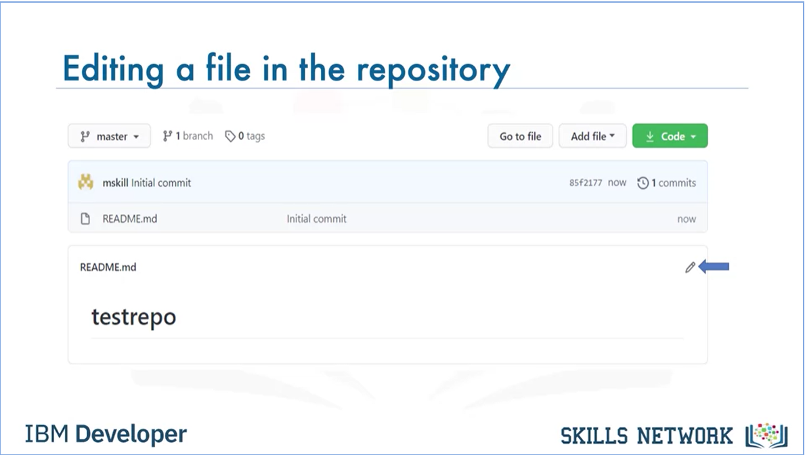
</p>
<!-- {width="4.0in" height="2.260683508311461in"} -->

Now, it's time to edit the readme. You can do this in your browser.

<!--~~~~~~~~~~~~~~~~~~~~~~~~~~~~~~~~~~~~~~~~~~~~~~~~~~~~~~~~~~~~~~~~~~~~~~~~~~~~~~~~~~~~~~~~~~~~-->
<p align="center">
  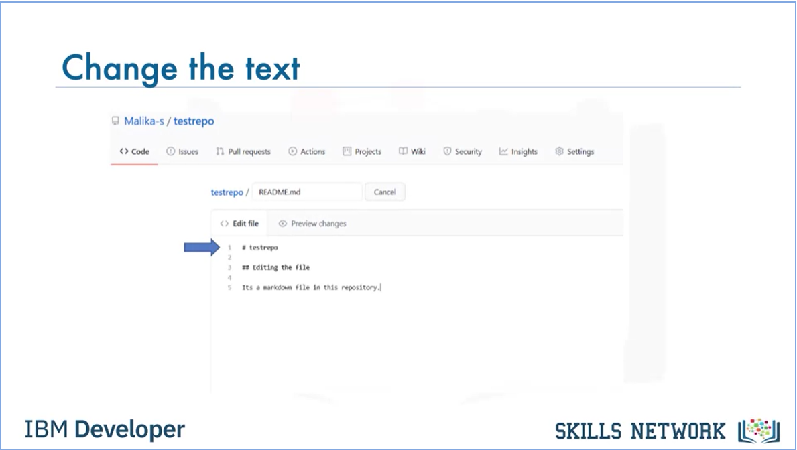
</p>
<!-- {width="4.0in" height="2.260683508311461in"} -->

Just click the pencil to open the online editor and you can change the
text of the readme. To save your changes to the repository, you must
commit them.

<!--~~~~~~~~~~~~~~~~~~~~~~~~~~~~~~~~~~~~~~~~~~~~~~~~~~~~~~~~~~~~~~~~~~~~~~~~~~~~~~~~~~~~~~~~~~~~-->
<p align="center">
  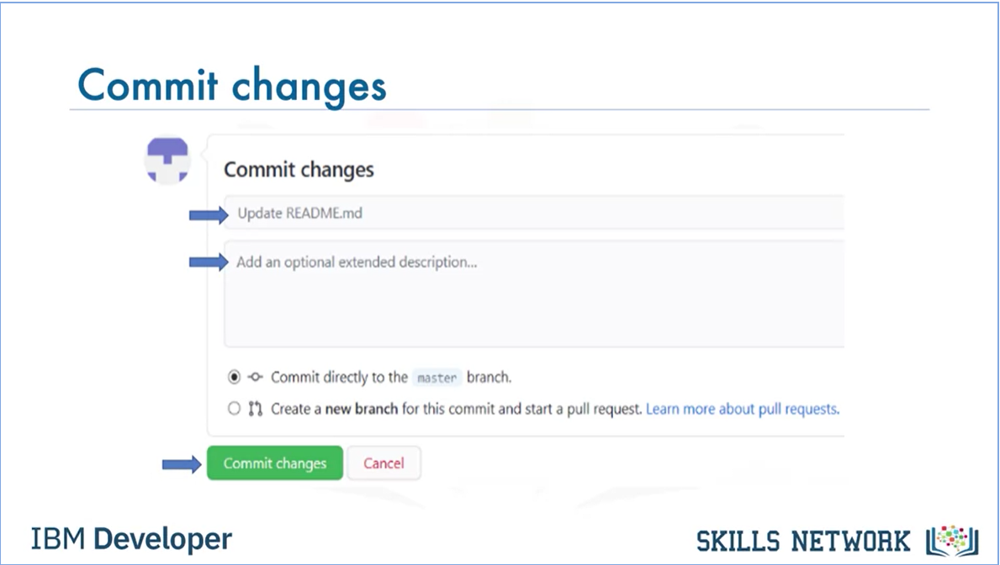
</p>
<!-- {width="4.0in" height="2.260683508311461in"} -->

After you have made your changes, scroll down to the Commit changes
section. Add a commit message and optionally add a description, then
click Commit changes. The \"commit changes\" is used to save your
changes to the repository.

<!--~~~~~~~~~~~~~~~~~~~~~~~~~~~~~~~~~~~~~~~~~~~~~~~~~~~~~~~~~~~~~~~~~~~~~~~~~~~~~~~~~~~~~~~~~~~~-->
<p align="center">
  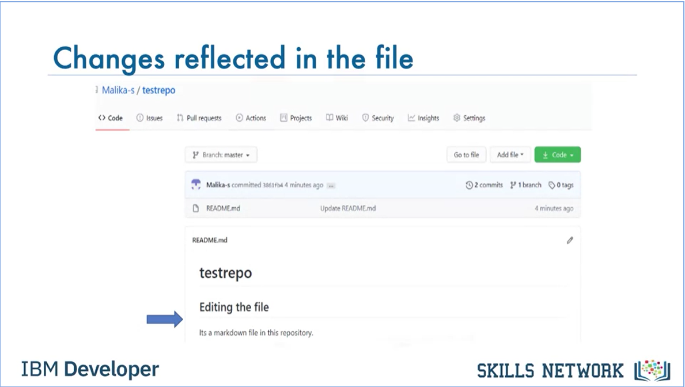
</p>
<!-- {width="4.0in" height="2.260683508311461in"} -->

Go back to the home screen by clicking the repository name link. Note
that the readme file is updated and verify your changes.

<!--~~~~~~~~~~~~~~~~~~~~~~~~~~~~~~~~~~~~~~~~~~~~~~~~~~~~~~~~~~~~~~~~~~~~~~~~~~~~~~~~~~~~~~~~~~~~-->
<p align="center">
  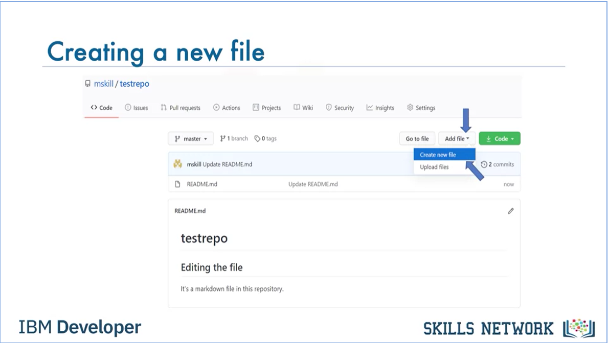
</p>
<!-- {width="4.0in" height="2.260683508311461in"} -->

Let's learn how to create a new file using the built-in web editor
provided by GitHub which runs in the browser. Click Add File, then click
Create New File to create the new file.

<!--~~~~~~~~~~~~~~~~~~~~~~~~~~~~~~~~~~~~~~~~~~~~~~~~~~~~~~~~~~~~~~~~~~~~~~~~~~~~~~~~~~~~~~~~~~~~-->
<p align="center">
  
</p>
<!-- {width="4.0in" height="2.260683508311461in"} -->

To create a python file called firstpython.py.

First, provide the file name. Next, add a comment that describes your
code, then add the code.

<!--~~~~~~~~~~~~~~~~~~~~~~~~~~~~~~~~~~~~~~~~~~~~~~~~~~~~~~~~~~~~~~~~~~~~~~~~~~~~~~~~~~~~~~~~~~~~-->
<p align="center">
  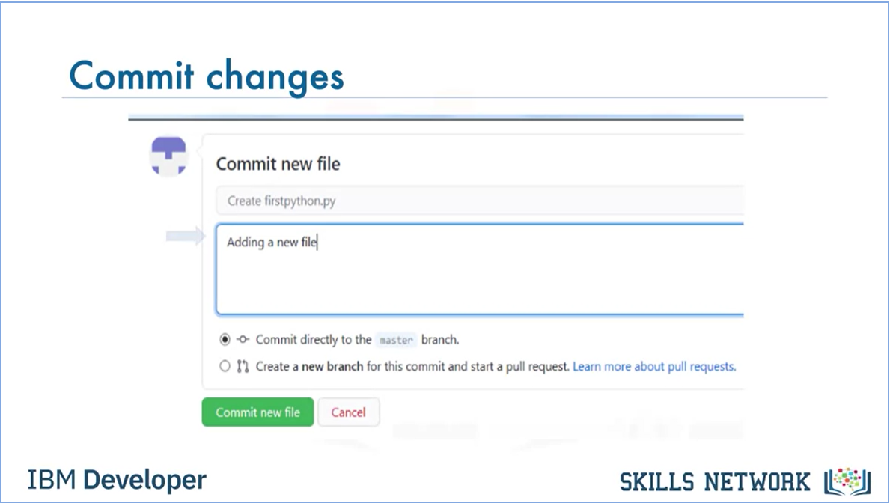
</p>
<!-- {width="4.0in" height="2.260683508311461in"} -->

Once finished, commit the change to the repository.

<!--~~~~~~~~~~~~~~~~~~~~~~~~~~~~~~~~~~~~~~~~~~~~~~~~~~~~~~~~~~~~~~~~~~~~~~~~~~~~~~~~~~~~~~~~~~~~-->
<p align="center">
  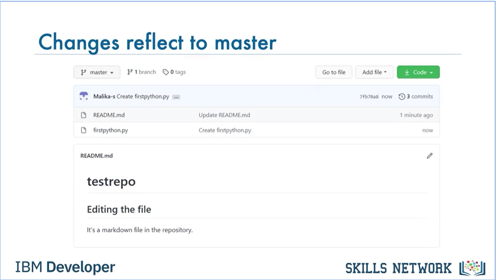
</p>
<!-- {width="4.0in" height="2.260683508311461in"} -->

You can see that your file is now added to the repository and the
repository listing shows when the file was added or changed.

<!--~~~~~~~~~~~~~~~~~~~~~~~~~~~~~~~~~~~~~~~~~~~~~~~~~~~~~~~~~~~~~~~~~~~~~~~~~~~~~~~~~~~~~~~~~~~~-->
<p align="center">
  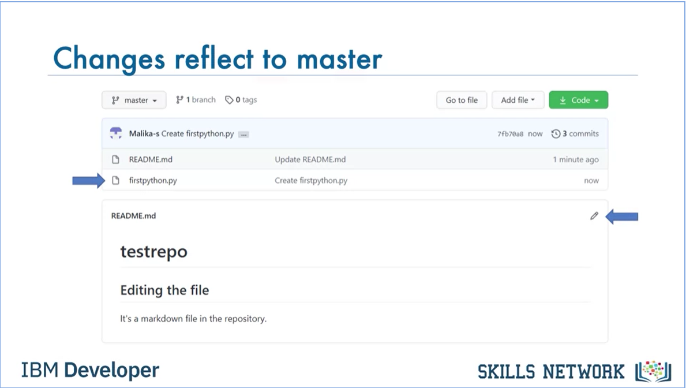
</p>
<!-- {width="4.0in" height="2.260683508311461in"} -->

When you need to change the file, you can edit it again.

Click the file name, and then click the pencil icon, make your edits and
commit the changes.

<!--~~~~~~~~~~~~~~~~~~~~~~~~~~~~~~~~~~~~~~~~~~~~~~~~~~~~~~~~~~~~~~~~~~~~~~~~~~~~~~~~~~~~~~~~~~~~-->
<p align="center">
  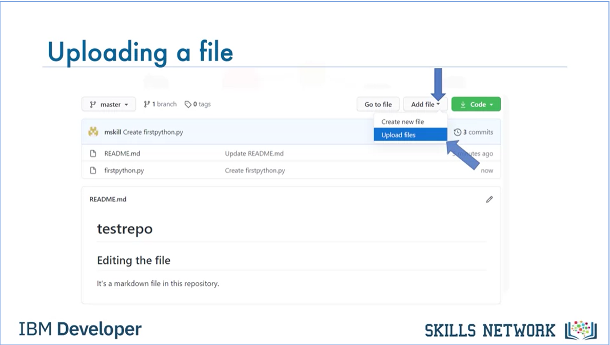
</p>
<!-- {width="4.0in" height="2.260683508311461in"} -->

You can also upload a file from your local system into the repository.

From the home screen of the repository, click Add File and choose the
Upload files option.

<!--~~~~~~~~~~~~~~~~~~~~~~~~~~~~~~~~~~~~~~~~~~~~~~~~~~~~~~~~~~~~~~~~~~~~~~~~~~~~~~~~~~~~~~~~~~~~-->
<p align="center">
  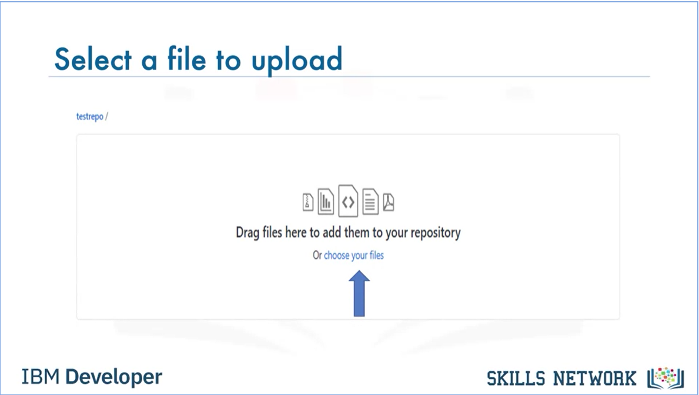
</p>
<!-- {width="4.0in" height="2.260683508311461in"} -->

Click Choose Your Files and select the files you want to upload from
your local system.

<!--~~~~~~~~~~~~~~~~~~~~~~~~~~~~~~~~~~~~~~~~~~~~~~~~~~~~~~~~~~~~~~~~~~~~~~~~~~~~~~~~~~~~~~~~~~~~-->
<p align="center">
  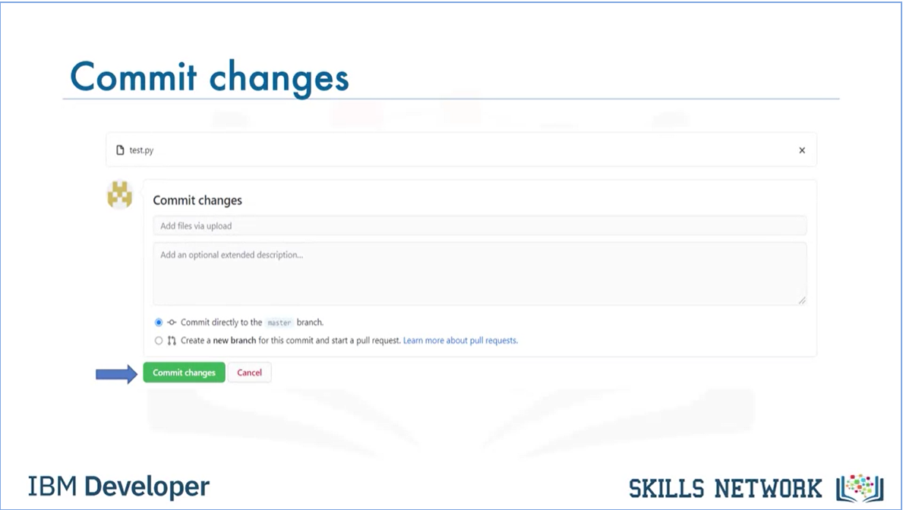
</p>
<!-- {width="4.0in" height="2.260683508311461in"} -->

The file upload process may take a short time, depending on what you are
uploading. Once the files finish uploading, click Commit Changes.

<!--~~~~~~~~~~~~~~~~~~~~~~~~~~~~~~~~~~~~~~~~~~~~~~~~~~~~~~~~~~~~~~~~~~~~~~~~~~~~~~~~~~~~~~~~~~~~-->
<p align="center">
  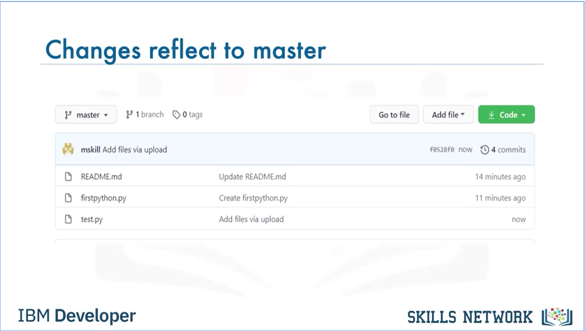
</p>
<!-- {width="4.0in" height="2.260683508311461in"} -->

The repository now reflects the files that were uploaded.

<!--~~~~~~~~~~~~~~~~~~~~~~~~~~~~~~~~~~~~~~~~~~~~~~~~~~~~~~~~~~~~~~~~~~~~~~~~~~~~~~~~~~~~~~~~~~~~-->
<p align="center">
  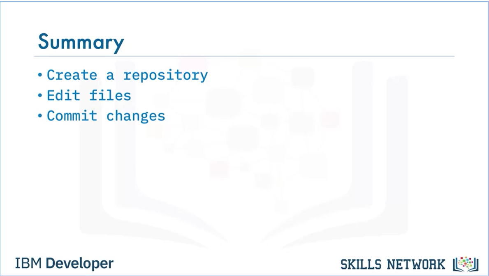
</p>
<!-- {width="4.0in" height="2.260683508311461in"} -->

In this module, you learned how to create a repository, edit files, and
commit changes using the web interface.

<h2 id="2-09">Module 2-09. Introduction to GitHub Actions (4:14)</h2>

Welcome to Introduction to GitHub Actions.

<!--~~~~~~~~~~~~~~~~~~~~~~~~~~~~~~~~~~~~~~~~~~~~~~~~~~~~~~~~~~~~~~~~~~~~~~~~~~~~~~~~~~~~~~~~~~~~-->
<p align="center">
  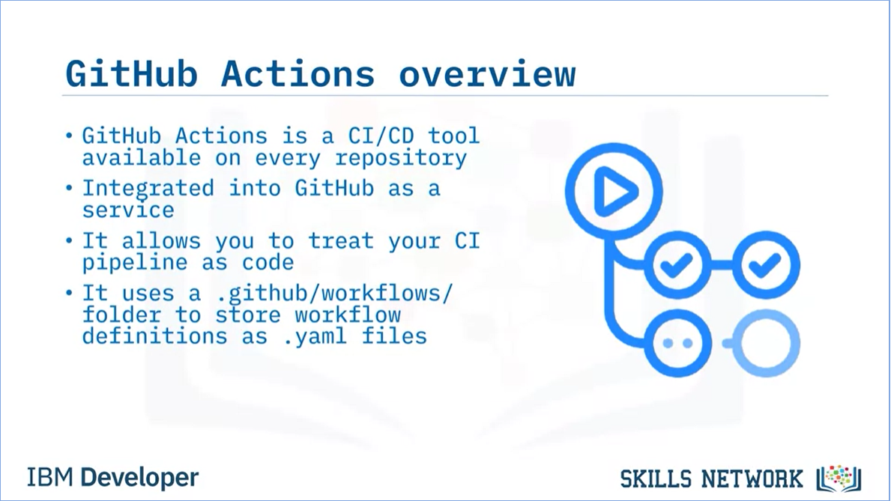
</p>
<!-- {width="4.0in" height="2.25042760279965in"} -->

After this module, you will be able to: describe the basics of the
GitHub Actions tool.​

GitHub Actions is a newcomer to the CI/CD tools field.

It\'s a CI/CD tool that is available on every repository in GitHub.

This makes it very attractive because it\'s integrated into GitHub as a
service.

There\'s nothing extra that you have to add; there\'s nothing that you
have to sign up for.

This makes it a CI/CD tool that everyone has access to.

GitHub Actions allows you to treat your CI pipeline as code just like
all the other CI/CD tools we've discussed.

Unlike other tools, all you need is a .yaml file to store the workflow
definitions in a folder called .github/workflows.

It doesn\'t matter what name you give these YAML files because each file
describes when they should be triggered.

GitHub Actions processes all the files in the workflows folder but
executes them only when the workflow's specified event happens.

<!--~~~~~~~~~~~~~~~~~~~~~~~~~~~~~~~~~~~~~~~~~~~~~~~~~~~~~~~~~~~~~~~~~~~~~~~~~~~~~~~~~~~~~~~~~~~~-->
<p align="center">
  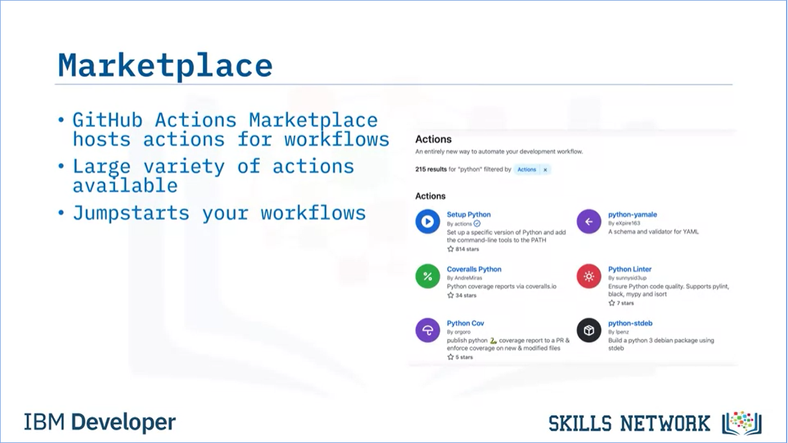
</p>
<!-- {width="4.0in" height="2.25042760279965in"} -->

Similar to Jenkins with its rich collection of plugins, GitHub Actions
has a marketplace that hosts actions that you can use in your workflows.

You can choose from a large variety of actions for almost any language
and step that you need to perform.

This really jumpstarts your workflows.

Before writing a script to perform some action, I always check the
marketplace to see if somebody has already created an action for it, and
most of the time, someone has.

<!--~~~~~~~~~~~~~~~~~~~~~~~~~~~~~~~~~~~~~~~~~~~~~~~~~~~~~~~~~~~~~~~~~~~~~~~~~~~~~~~~~~~~~~~~~~~~-->
<p align="center">
  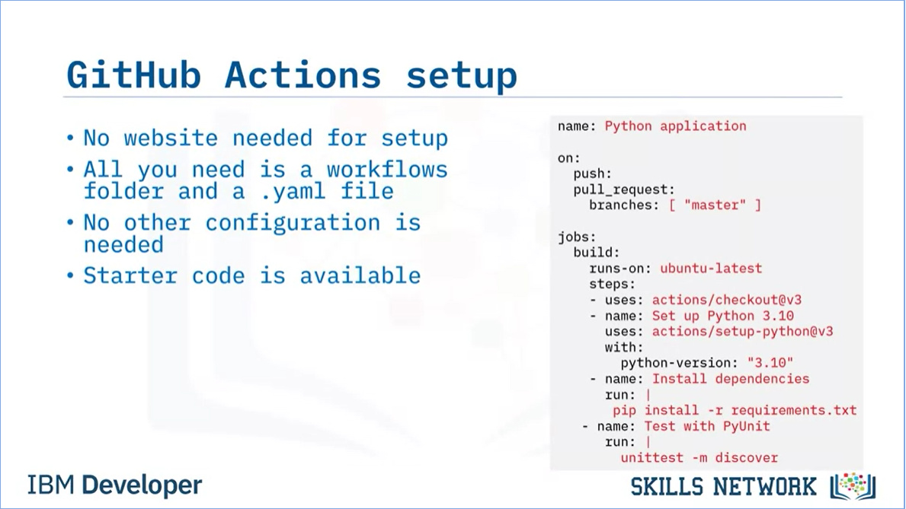
</p>
<!-- {width="4.0in" height="2.25042760279965in"} -->

One of the nice features of GitHub Actions is that, unlike many of its
competitors like Jenkins, Circle CI, and Travis CI, there\'s no website
to manually set up anything.

All you need is to create a workflows folder and add the YAML files that
represent your workflow.

No other configuration is needed.

This makes it not only simple to get started but ensures that your CI/CD
workflows are reproducible because there's no manual steps involved.

Lastly, starter code is available to get you up and running quickly.

From the Actions tab in your GitHub repo, you can select from the
functional workflow templates and edit them for your situation.

<!--~~~~~~~~~~~~~~~~~~~~~~~~~~~~~~~~~~~~~~~~~~~~~~~~~~~~~~~~~~~~~~~~~~~~~~~~~~~~~~~~~~~~~~~~~~~~-->
<p align="center">
  
</p>
<!-- {width="4.0in" height="2.25042760279965in"} -->

The basic concept in GitHub Actions is a workflow.

A workflow is a series of automated procedures represented as jobs and
steps that GitHub Actions executes.

Every repository can have any number of workflows.

You could have a workflow for Continuous Integration, another workflow
for Continuous Delivery, and another workflow that publishes artifacts.

You place whatever number of workflows you need in the workflows folder.

Each workflow has the following components:

It has an event that tells it when the workflow should run.

Events could be things like when you push to a repo, create a pull
request, or create a release, just to name a few.

Workflows use runners to execute the jobs.

There are built-in runners for different virtual environments, or you
can use a self-hosted runner in your environment.

A workflow contains one or more jobs.

You can have one job that builds your component and another job that
publishes it to an artifact repository, and still another job that
deploys it to an environment.

Each job can contain one or more steps.

One step can check out the code, another step might compile the code,
yet another step might run a linter on the code, and you\'ll probably
have a step that runs a suite of test cases to make sure that the code
works properly.

And each step can contain one or more actions or shell commands.

Actions are the lowest level of a workflow.

They perform a single task like check out code, install dependencies,
compile code, or run tests.

This hierarchy of jobs, steps, and actions allows you to logically group
the actions performed by your workflow.

<!--~~~~~~~~~~~~~~~~~~~~~~~~~~~~~~~~~~~~~~~~~~~~~~~~~~~~~~~~~~~~~~~~~~~~~~~~~~~~~~~~~~~~~~~~~~~~-->
<p align="center">
  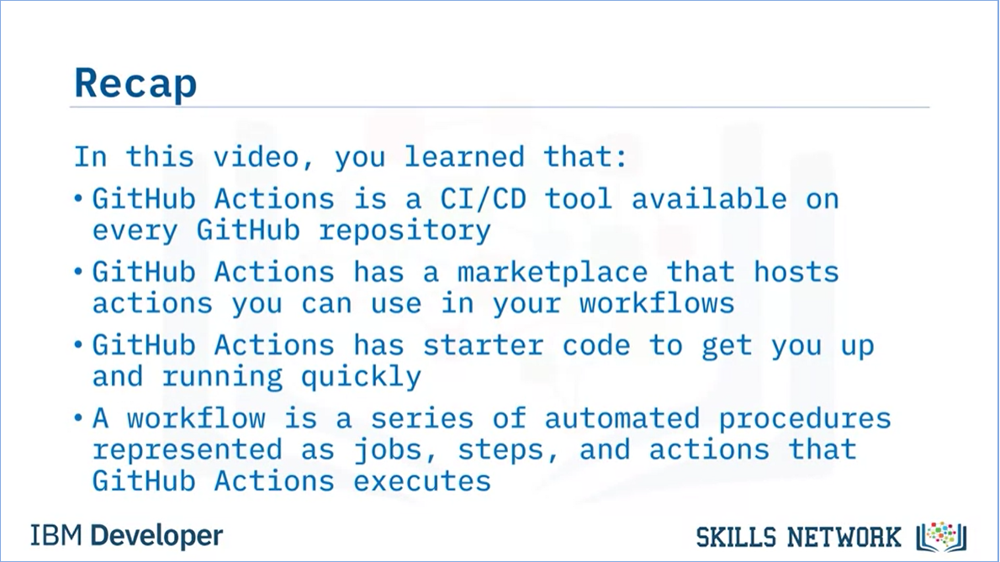
</p>
<!-- {width="4.0in" height="2.25042760279965in"} -->

In this module, you learned that:

-   GitHub Actions is a CI/CD tool that is available on every repository
    in GitHub.

-   GitHub Actions has a marketplace that hosts actions that you can use
    in your workflows.​

-   GitHub Actions has starter code available to get you up and running
    quickly.

-   And a workflow is a series of automated procedures represented as
    jobs, steps, and actions that GitHub Actions executes.

<h2 id="2-10">Module 2-10. Deeper Dive into GitHub Actions: Part 1 (6:33)</h2>

Welcome to 'Deeper Dive into GitHub Actions -- Part One.'

<!--~~~~~~~~~~~~~~~~~~~~~~~~~~~~~~~~~~~~~~~~~~~~~~~~~~~~~~~~~~~~~~~~~~~~~~~~~~~~~~~~~~~~~~~~~~~~-->
<p align="center">
  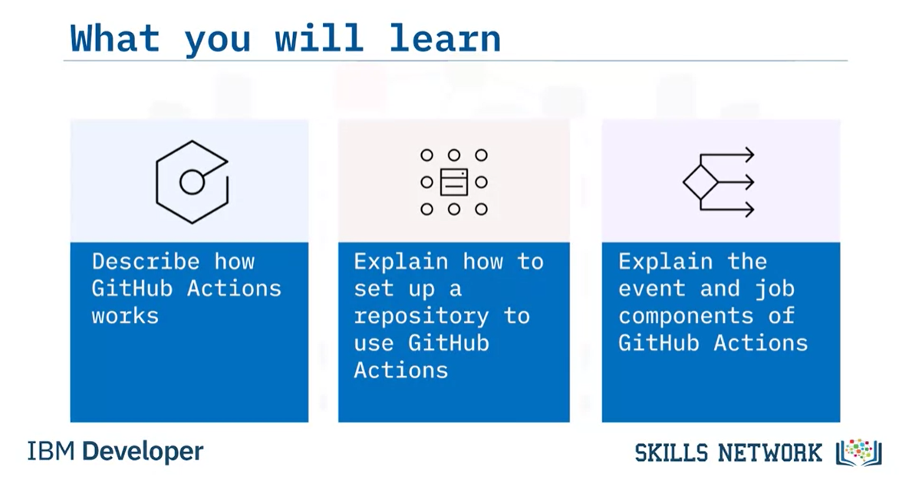
</p>
<!-- {width="4.0in" height="2.122649825021872in"} -->

After this module, you will be able to;

-   Describe how GitHub Actions works,

-   Explain how to set up a repository to use GitHub Actions, and

-   Explain the event and job components of GitHub Actions.

<!--~~~~~~~~~~~~~~~~~~~~~~~~~~~~~~~~~~~~~~~~~~~~~~~~~~~~~~~~~~~~~~~~~~~~~~~~~~~~~~~~~~~~~~~~~~~~-->
<p align="center">
  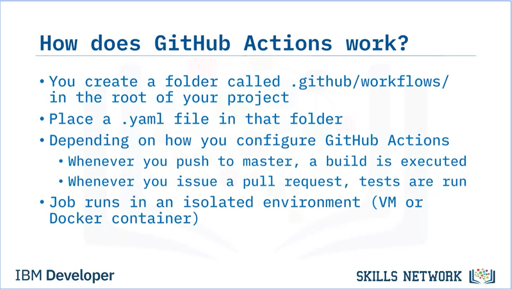
</p>
<!-- {width="4.0in" height="2.2572648731408576in"} -->

Let\'s look at how GitHub Actions works.

You create a folder called '.github/workflows' in the root of your
project.

You may already have a '.github' folder to hold your issue templates.

If so, just create a 'workflows' folder under that one.

Next, in that folder, you place at least one .yaml file that contains
the statements for your workflow.

You can have one or more workflows specified as .yaml files.

Then, depending on how you configured it, your workflow will execute
when the specified event happens.

For example, when you push to the master branch, a build may execute, or
when you issue a pull request, a test may run.

The job runs in an isolated environment, either on a virtual machine or
in a Docker container.

<!--~~~~~~~~~~~~~~~~~~~~~~~~~~~~~~~~~~~~~~~~~~~~~~~~~~~~~~~~~~~~~~~~~~~~~~~~~~~~~~~~~~~~~~~~~~~~-->
<p align="center">
  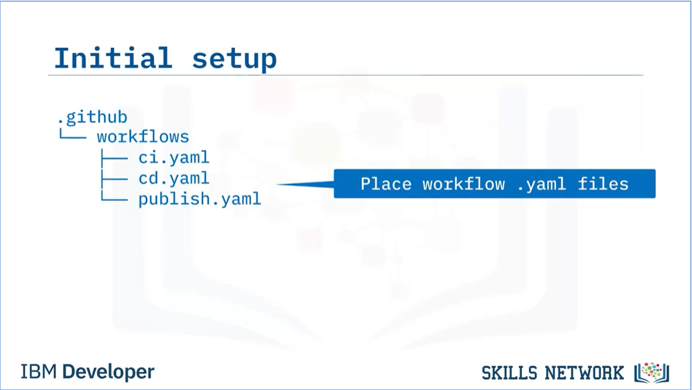
</p>
<!-- {width="4.0in" height="2.2572648731408576in"} -->

To set up for using GitHub Actions, you first create a ***'.github'***
folder (if you don't already have one).

Then, under that folder, you create a ***'workflows'*** folder to hold
all of your GitHub workflows.

And finally, you place the ***.yaml*** files representing your various
workflows into the 'workflows' folder.

And that\'s all the configuration you need.

<!--~~~~~~~~~~~~~~~~~~~~~~~~~~~~~~~~~~~~~~~~~~~~~~~~~~~~~~~~~~~~~~~~~~~~~~~~~~~~~~~~~~~~~~~~~~~~-->
<p align="center">
  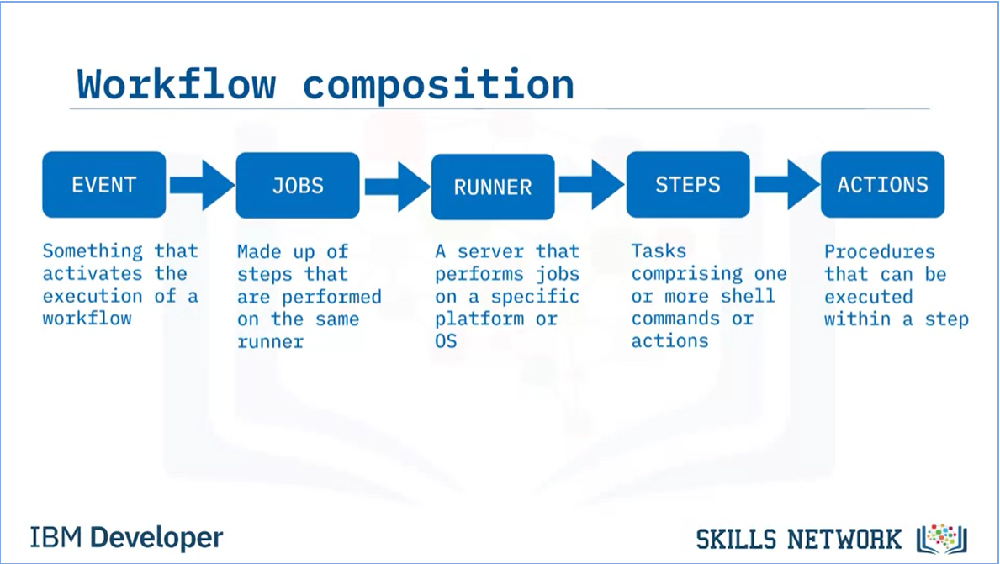
</p>
<!-- {width="4.0in" height="2.2572648731408576in"} -->

Each workflow contains the following components:

An **event** is something that activates the execution of a workflow.

There are many events to choose from, the most common being checking
code into a repository, pushing code to a branch, or making a pull
request.

Next, you have **jobs**.

Jobs are made up of steps that are performed on the same **runner**.

If a workflow has more than one job, those jobs are executed in parallel
by default.

But you can configure them to declare that one is dependent on another,
in which case the jobs will be executed serially based on their
dependencies.

Every job has a runner, which is a server that performs jobs on a
specific platform or operating system.

GitHub can host runners, or you can host your own runners on a
standalone server.

There\'s also a way to execute **steps** in a Docker container, but the
Docker container is executing on a runner. Jobs contain steps, which are
tasks comprising one or more shell commands or actions. Because all the
steps of a job are executed on the same runner, they can share data with
one another.

That means you can have a step that checks out your code, another step
that compiles your code, and yet another step that may build a Docker
container, and all of them share the same code that was checked out in
the first step.

And finally, there are **actions**, which are procedures that can be
executed within a step.

GitHub offers numerous actions through the GitHub community and in the
GitHub Actions Marketplace.

As you would expect, common tasks like checking out your code or
uploading artifacts are already available, waiting to be used in your
workflows.

Always check to see if an action exists in the marketplace before you
create one or use shell commands.

<!--~~~~~~~~~~~~~~~~~~~~~~~~~~~~~~~~~~~~~~~~~~~~~~~~~~~~~~~~~~~~~~~~~~~~~~~~~~~~~~~~~~~~~~~~~~~~-->
<p align="center">
  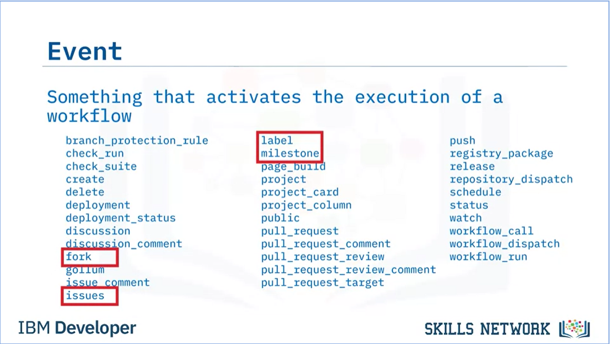
</p>
<!-- {width="4.0in" height="2.2572648731408576in"} -->

Let\'s look at the first two of these workflow components in greater
detail.

We\'ll start with events.

Remember, an event is something that activates the execution of a
workflow.

There are currently 35 different events that can trigger a workflow.

As you can see from this list, whenever you modify an issue, a label, or
a milestone, or you fork a repo, it can trigger an event.

<!--~~~~~~~~~~~~~~~~~~~~~~~~~~~~~~~~~~~~~~~~~~~~~~~~~~~~~~~~~~~~~~~~~~~~~~~~~~~~~~~~~~~~~~~~~~~~-->
<p align="center">
  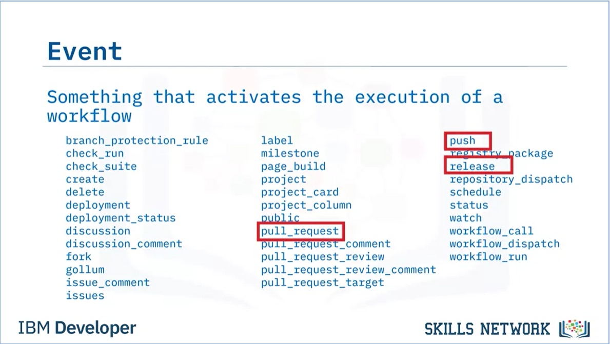
</p>
<!-- {width="4.0in" height="2.2572648731408576in"} -->

Probably the most popular events that you will use in your workflows are
performing pull requests, pushing code to a branch, or creating a new
release.

<!--~~~~~~~~~~~~~~~~~~~~~~~~~~~~~~~~~~~~~~~~~~~~~~~~~~~~~~~~~~~~~~~~~~~~~~~~~~~~~~~~~~~~~~~~~~~~-->
<p align="center">
  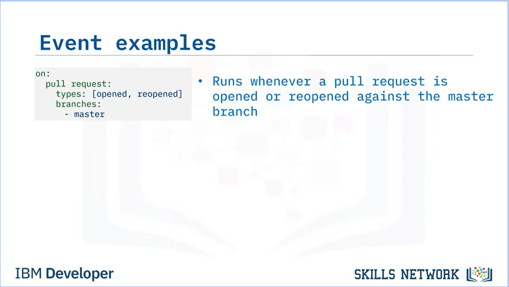
</p>
<!-- {width="4.0in" height="2.2572648731408576in"} -->

Here's an example of an event that runs whenever a pull request is
opened or reopened against the master branch.

This is great for triggering your CI pipeline.

All events start with the keyword 'on:' followed by the keyword of the
event.

In this case, 'pull request.'

Then some events have 'types.'

In this example, this event is listening for types, such as when a pull
request is opened or reopened.

Another input to the pull request event is a list of branches to
monitor.

This example designates the master branch as the target.

<!--~~~~~~~~~~~~~~~~~~~~~~~~~~~~~~~~~~~~~~~~~~~~~~~~~~~~~~~~~~~~~~~~~~~~~~~~~~~~~~~~~~~~~~~~~~~~-->
<p align="center">
  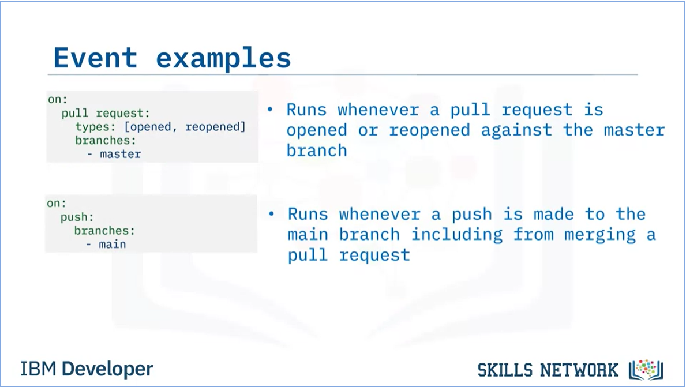
</p>
<!-- {width="4.0in" height="2.2572648731408576in"} -->

This next example runs whenever a push is made to the main branch,
including from merging a pull request.

This might be good for triggering a CD pipeline.

Again, it starts with the 'on:' keyword, followed by the keyword of the
event, which in this case is 'push.'

Then the list of branches follows, which in this example only contains
the main branch, but it could have contained more.

<!--~~~~~~~~~~~~~~~~~~~~~~~~~~~~~~~~~~~~~~~~~~~~~~~~~~~~~~~~~~~~~~~~~~~~~~~~~~~~~~~~~~~~~~~~~~~~-->
<p align="center">
  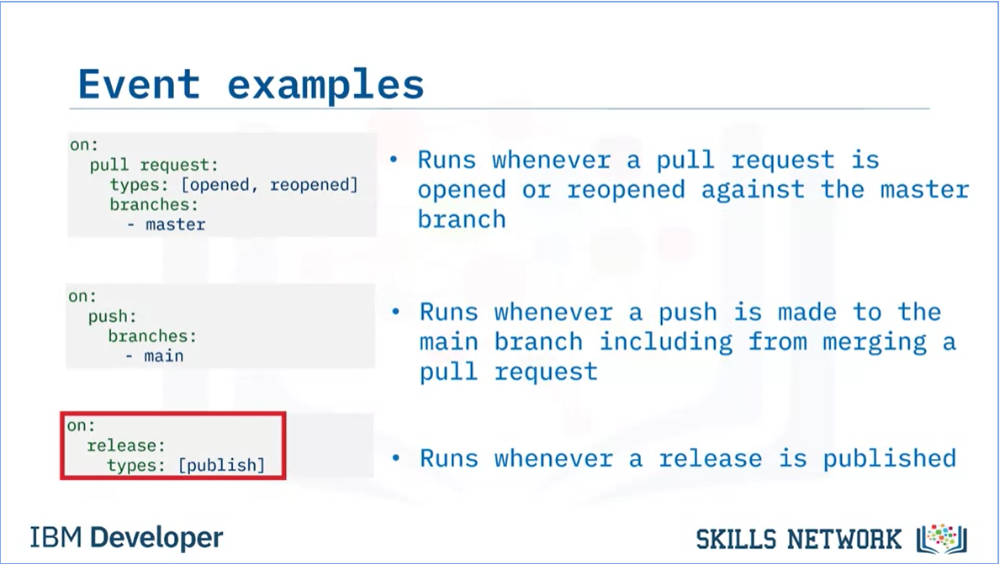
</p>
<!-- {width="4.0in" height="2.2572648731408576in"} -->

The last example will run whenever a release is published, although it
could have specified other types like when a release is created.

This type of event is great for triggering a packaging workflow.

For example, you might want to package your Python code and publish it
to PyPI.

Or you might want to take your Java code and publish it to Maven.

Or you might want to build a Docker container and publish it to Docker
Hub.

Whatever activity you want to automate when creating a release, this
event will help you get the job done.

<!--~~~~~~~~~~~~~~~~~~~~~~~~~~~~~~~~~~~~~~~~~~~~~~~~~~~~~~~~~~~~~~~~~~~~~~~~~~~~~~~~~~~~~~~~~~~~-->
<p align="center">
  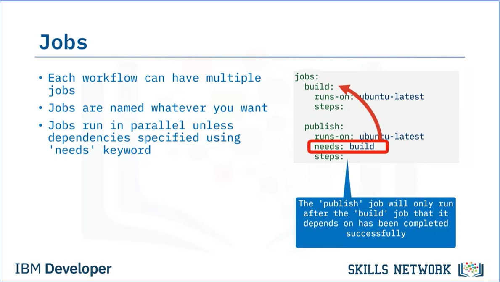
</p>
<!-- {width="4.0in" height="2.2572648731408576in"} -->

Next, you have jobs.

A job is a set of steps that use the same runner for execution.

Each workflow can have multiple jobs, so you are not limited to having
just one job per workflow.

This gives you a lot of flexibility when composing jobs and workflows.

Jobs can be named whatever you want as long as they are in proper .yaml
syntax.

In this example, there\'s a job called 'build' and a job called
'publish.'

By default, jobs run in parallel unless you specify dependencies between
them using the 'needs' keyword.

In this example, the 'publish' job uses the 'needs' keyword to specify
that it is dependent on the 'build' job.

This tells GitHub Actions to run the 'build' job first.

The 'publish' job will not run until the 'build' job, which it depends
on, has been completed successfully.

<!--~~~~~~~~~~~~~~~~~~~~~~~~~~~~~~~~~~~~~~~~~~~~~~~~~~~~~~~~~~~~~~~~~~~~~~~~~~~~~~~~~~~~~~~~~~~~-->
<p align="center">
  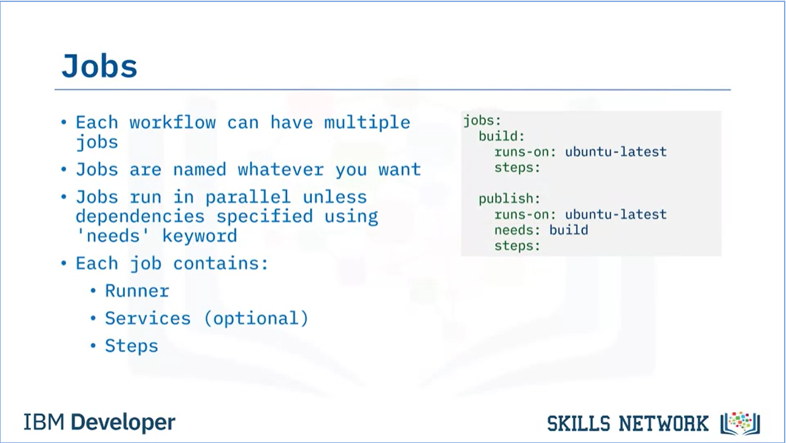
</p>
<!-- {width="4.0in" height="2.2572648731408576in"} -->

Each job contains a runner, optional required services, and a series of
steps to execute.

We'll look at these components later in this course.

<!--~~~~~~~~~~~~~~~~~~~~~~~~~~~~~~~~~~~~~~~~~~~~~~~~~~~~~~~~~~~~~~~~~~~~~~~~~~~~~~~~~~~~~~~~~~~~-->
<p align="center">
  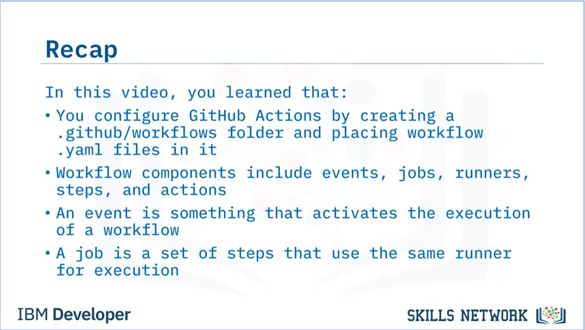
</p>
<!-- {width="4.0in" height="2.2572648731408576in"} -->

In this module, you learned that:​

-   You configure GitHub Actions by creating a .github/workflows folder
    and placing workflow .yaml files in it,

-   Workflow components include events, jobs, runners, steps, and
    actions,

-   An event is something that activates the execution of a workflow,
    and

-   A job is a set of steps that use the same runner for execution.

<h3>Lab: Using GitHub Actions - Part 1</h3>

Welcome to the hands-on lab for **Using GitHub Actions - Part 1**. In
this part, you will build a workflow in a GitHub repository using GitHub
Actions. You will create an empty workflow file in Step 1 and add events
and a job runner in the following steps. You will subsequently finish
the workflow in the next lab called **Using GitHub Actions - Part 2**.
Ensure you finish this lab completely before starting part 2.  

Skills Network Labs (SN Labs) is a virtual lab environment used in this
course.  Upon clicking the \"Open Tool\" button below, your Username and
Email will be passed to SN Labs and will be used in strict accordance
with IBM Skills Network Privacy policy, such as for communicating
important information to enhance your learning experience. 

In case you need to download the lab instructions
click [HERE ](https://cf-courses-data.s3.us.cloud-object-storage.appdomain.cloud/IBM-CD0215EN-SkillsNetwork/labs/module2/github_actions_part1.md.html)to
open a new tab (9 pages make up lab).

<h3>Using GitHub Actions - Part 1 (External resource)</h3>

Clicking on the Open Tool button below will launch the cloud-based SN
labs virtual labs environment with instructions to complete this lab.
Your username and email will be shared with SN Labs to authenticate and
provision your lab environment.

<h4>Open Tool</h4>

<h2 id="2-11">Module 2-11. Deeper Dive into GitHub Actions: Part 2 (6:50)</h2>

Welcome to 'Deeper Dive into GitHub Actions -- Part Two'.

<!--~~~~~~~~~~~~~~~~~~~~~~~~~~~~~~~~~~~~~~~~~~~~~~~~~~~~~~~~~~~~~~~~~~~~~~~~~~~~~~~~~~~~~~~~~~~~-->
<p align="center">
  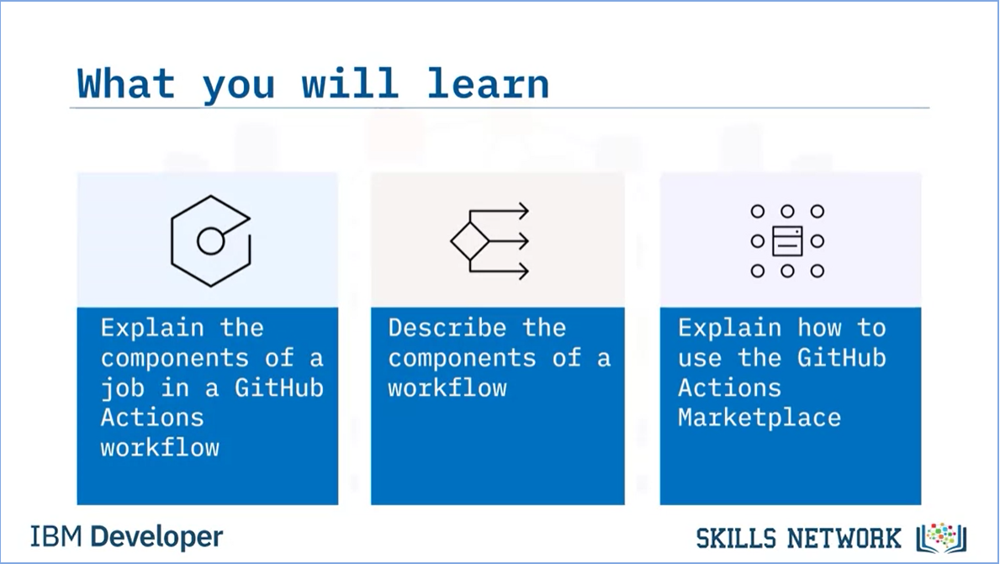
</p>
<!-- {width="4.0in" height="2.2572648731408576in"} -->

After this module, you will be able to;

-   Explain the components of a job in a GitHub Actions workflow,

-   Describe the components of a workflow, and

-   Explain how to use the GitHub Actions Marketplace.

We've already discussed events and jobs, but now let's take a closer
look at the remaining elements of a GitHub Actions workflow.

<!--~~~~~~~~~~~~~~~~~~~~~~~~~~~~~~~~~~~~~~~~~~~~~~~~~~~~~~~~~~~~~~~~~~~~~~~~~~~~~~~~~~~~~~~~~~~~-->
<p align="center">
  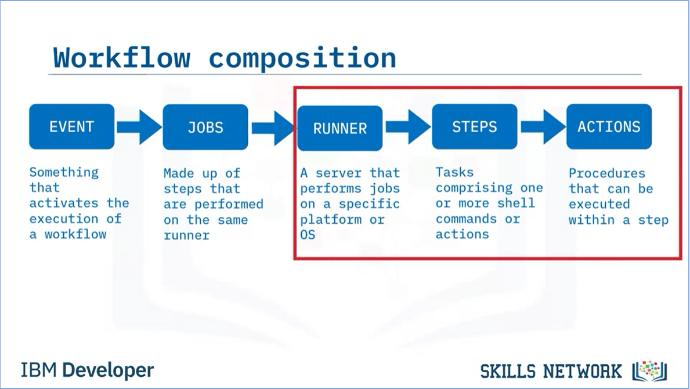
</p>
<!-- {width="4.0in" height="2.2572648731408576in"} -->

Specifically, let's discuss what constitutes a job; namely runners,
steps, and actions.

<!--~~~~~~~~~~~~~~~~~~~~~~~~~~~~~~~~~~~~~~~~~~~~~~~~~~~~~~~~~~~~~~~~~~~~~~~~~~~~~~~~~~~~~~~~~~~~-->
<p align="center">
  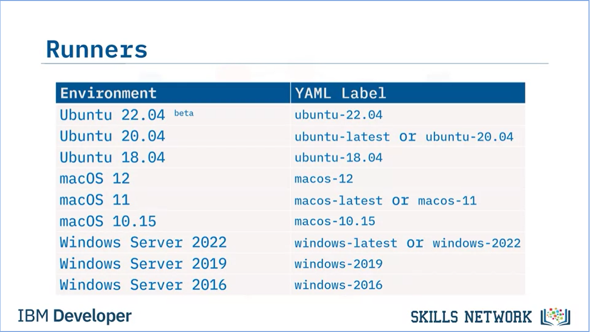
</p>
<!-- {width="4.0in" height="2.2572648731408576in"} -->

A runner is a server that performs a job on a specific platform or
operating system.

In this list, you can see all the operating systems that GitHub Actions
supports.

There are several flavors of Ubuntu, macOS, and Windows Server.

Once you specify a runner for a job, all of the steps will be executed
on that runner.

<!--~~~~~~~~~~~~~~~~~~~~~~~~~~~~~~~~~~~~~~~~~~~~~~~~~~~~~~~~~~~~~~~~~~~~~~~~~~~~~~~~~~~~~~~~~~~~-->
<p align="center">
  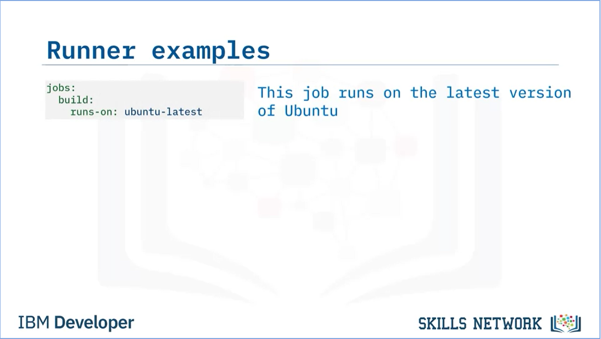
</p>
<!-- {width="4.0in" height="2.2572648731408576in"} -->

Here are some examples of runner definitions.

To specify a runner, you use the 'runs-on:' keyword.

This first job is called 'build,' and it runs on whatever the latest
version of Ubuntu is.

<!--~~~~~~~~~~~~~~~~~~~~~~~~~~~~~~~~~~~~~~~~~~~~~~~~~~~~~~~~~~~~~~~~~~~~~~~~~~~~~~~~~~~~~~~~~~~~-->
<p align="center">
  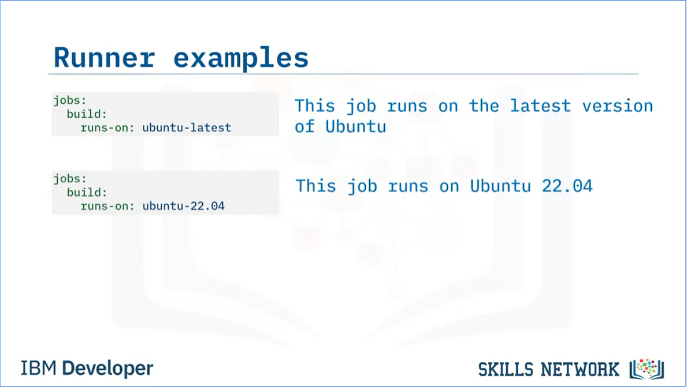
</p>
<!-- {width="4.0in" height="2.2572648731408576in"} -->

This next job is very similar, but it specifies Ubuntu 22.04, so this
job always runs on the 22.04 version of Ubuntu regardless of the latest
version.

<!--~~~~~~~~~~~~~~~~~~~~~~~~~~~~~~~~~~~~~~~~~~~~~~~~~~~~~~~~~~~~~~~~~~~~~~~~~~~~~~~~~~~~~~~~~~~~-->
<p align="center">
  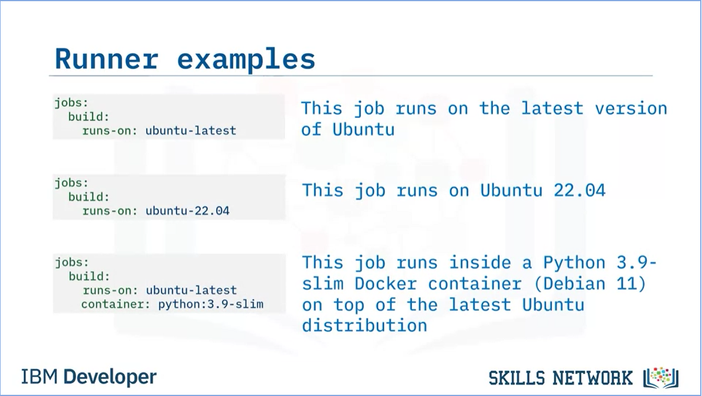
</p>
<!-- {width="4.0in" height="2.2572648731408576in"} -->

This last job runs inside of a Python 3.9-slim Docker container, which
is actually Debian 11 inside.

The container runs on top of the latest Ubuntu environment.

So, for this one, you get a virtual machine running the latest Ubuntu
version that instantiates a Docker container from the Python 3.9-slim
image to run all of your steps.

I use this one a lot because I develop in containers, and this allows me
to run my build in the same containers to minimize surprises.

Jobs can also optionally define required services for the workflow.

<!--~~~~~~~~~~~~~~~~~~~~~~~~~~~~~~~~~~~~~~~~~~~~~~~~~~~~~~~~~~~~~~~~~~~~~~~~~~~~~~~~~~~~~~~~~~~~-->
<p align="center">
  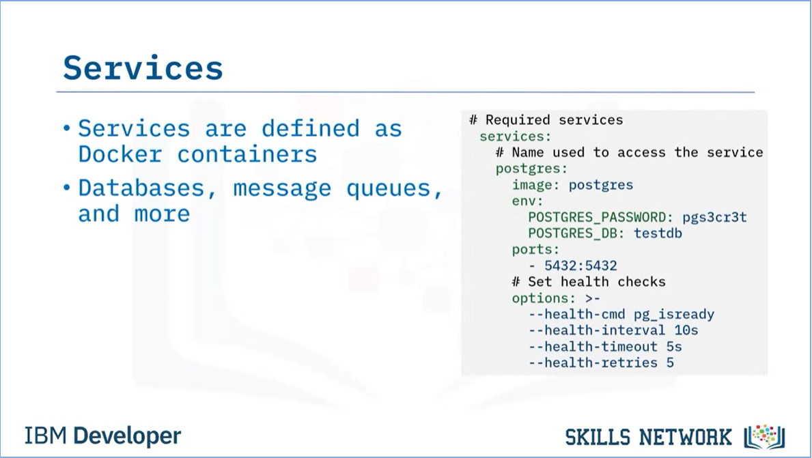
</p>
<!-- {width="4.0in" height="2.2572648731408576in"} -->

Services are defined as Docker containers.

You could use any public Docker image you\'d like to create the service,
including your own.

You can create databases, message queues, or services your workflow
needs.

This example creates a Postgres database that is required before running
some unit tests.

<!--~~~~~~~~~~~~~~~~~~~~~~~~~~~~~~~~~~~~~~~~~~~~~~~~~~~~~~~~~~~~~~~~~~~~~~~~~~~~~~~~~~~~~~~~~~~~-->
<p align="center">
  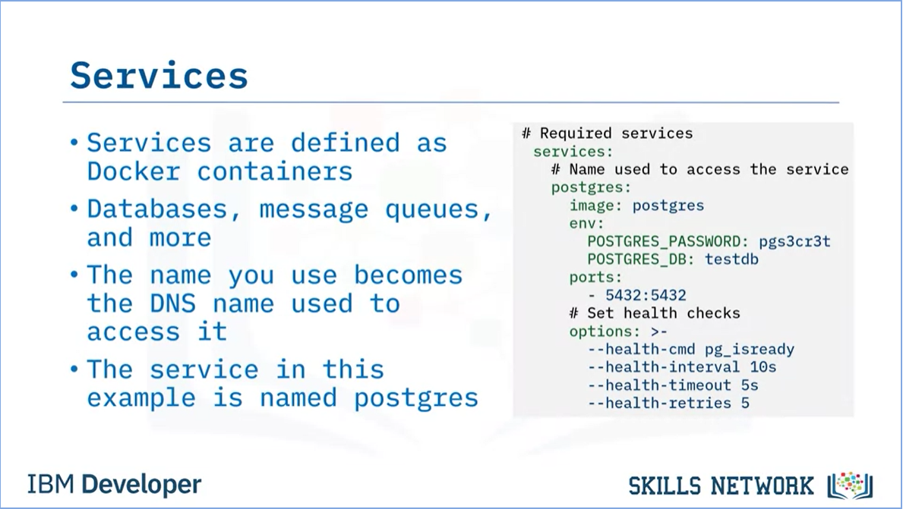
</p>
<!-- {width="4.0in" height="2.2572648731408576in"} -->

Whatever name you use for the service becomes the DNS name that you use
to access it.

So, in this example, you would look for your Postgres database on a host
called postgres.

Using services like this allows you to specify the same Docker
containers that you use in development for use in your workflows.

<!--~~~~~~~~~~~~~~~~~~~~~~~~~~~~~~~~~~~~~~~~~~~~~~~~~~~~~~~~~~~~~~~~~~~~~~~~~~~~~~~~~~~~~~~~~~~~-->
<p align="center">
  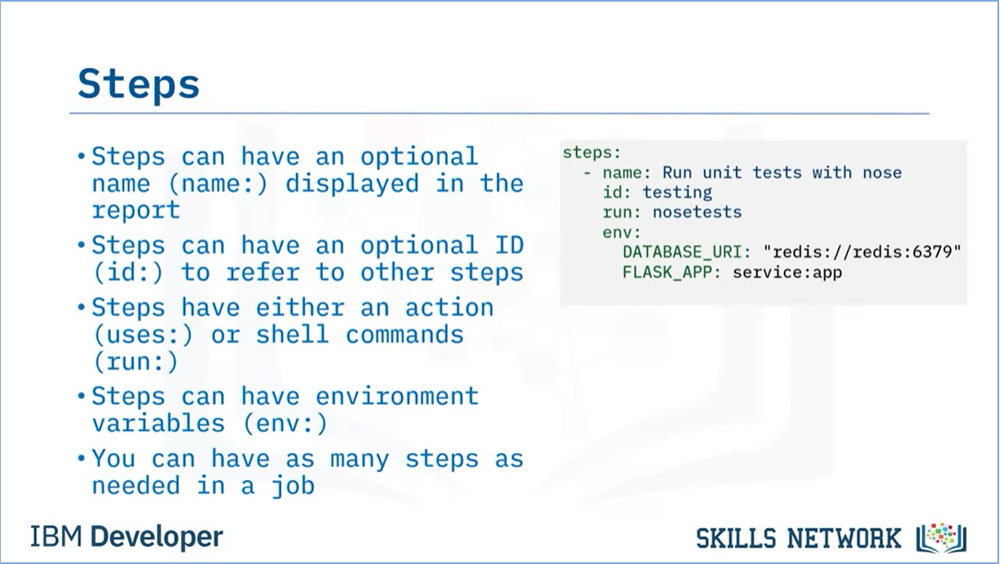
</p>
<!-- {width="4.0in" height="2.2572648731408576in"} -->

Steps are the heart of GitHub Actions.

This is where all of the work happens.

A step is a task comprising one or more shell commands or actions.

Steps can have an optional name specified by the 'name:' keyword that
displays in the report.

It's best to name your steps something descriptive so that when you look
at the report, you know exactly what\'s going on in each step.

If you don't name your step yourself, the step assumes the name of the
command that you\'re running.

Steps can have an optional ID specified by the 'id:' keyword, making it
really helpful to refer to them in other steps.

This is useful when you want to use the output of one step as the input
parameters for another step.

Steps have either an action specified by the 'uses:' keyword or shell
commands specified by the 'run:' keyword.

You can specify more than one shell command by starting with a vertical
bar and then placing each command on a new line.

Steps can also have defined environment variables.

In true 12-factor fashion, you should be configuring your services
through environment variables, and the 'env:' keyword allows you to do
this.

And you can have as many steps as you need in a job.

<!--~~~~~~~~~~~~~~~~~~~~~~~~~~~~~~~~~~~~~~~~~~~~~~~~~~~~~~~~~~~~~~~~~~~~~~~~~~~~~~~~~~~~~~~~~~~~-->
<p align="center">
  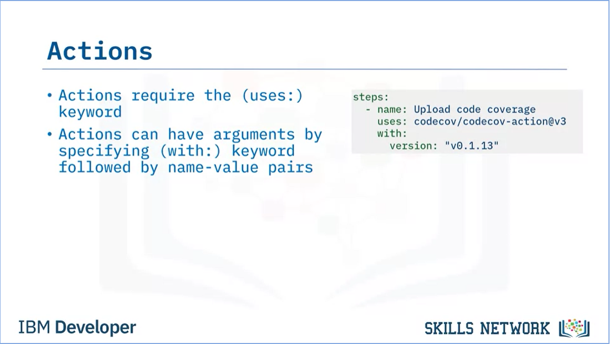
</p>
<!-- {width="4.0in" height="2.2572648731408576in"} -->

Actions are procedures that can be executed within a step.

Defining actions requires the 'uses:' keyword followed by the name of
the action.

There is a large library of actions in the GitHub Actions Marketplace
community.

Actions can have arguments to configure them by specifying the 'with:'
keyword followed by name-value pairs.

Some actions use the 'args:' keyword.

<!--~~~~~~~~~~~~~~~~~~~~~~~~~~~~~~~~~~~~~~~~~~~~~~~~~~~~~~~~~~~~~~~~~~~~~~~~~~~~~~~~~~~~~~~~~~~~-->
<p align="center">
  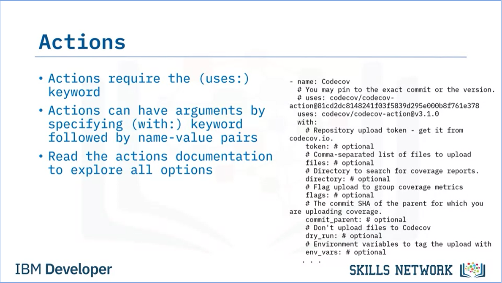
</p>
<!-- {width="4.0in" height="2.2572648731408576in"} -->

In this example, the codecov action accepts a version as one of its
optional parameters.

It's critical that you read the actions documentation to explore all
possible options that you can configure an action with.

This is one time that reading the documentation really helps you.

<!--~~~~~~~~~~~~~~~~~~~~~~~~~~~~~~~~~~~~~~~~~~~~~~~~~~~~~~~~~~~~~~~~~~~~~~~~~~~~~~~~~~~~~~~~~~~~-->
<p align="center">
  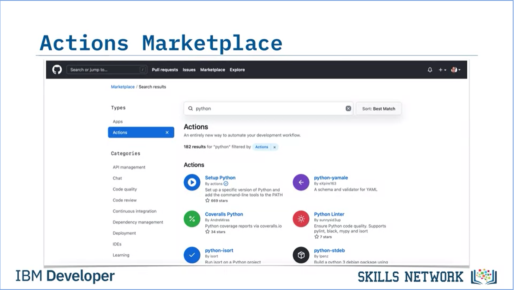
</p>
<!-- {width="4.0in" height="2.2572648731408576in"} -->

I've mentioned the GitHub Actions Marketplace several times, and it\'s a
great place to find actions.

<!--~~~~~~~~~~~~~~~~~~~~~~~~~~~~~~~~~~~~~~~~~~~~~~~~~~~~~~~~~~~~~~~~~~~~~~~~~~~~~~~~~~~~~~~~~~~~-->
<p align="center">
  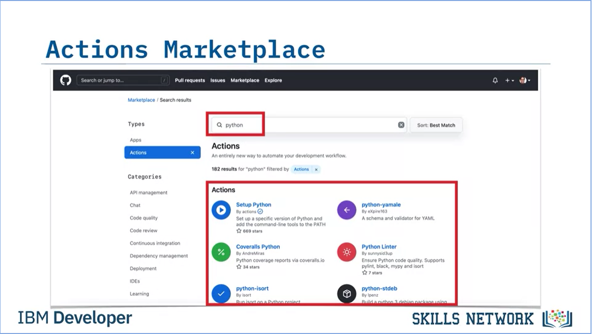
</p>
<!-- {width="4.0in" height="2.2572648731408576in"} -->

In this example, a search for Python retrieves actions to set up a
Python environment, run a Python linter, use coveralls (which is another
code coverage utility), and more.

Always check the GitHub Actions Marketplace for any action you may want
to perform.

<!--~~~~~~~~~~~~~~~~~~~~~~~~~~~~~~~~~~~~~~~~~~~~~~~~~~~~~~~~~~~~~~~~~~~~~~~~~~~~~~~~~~~~~~~~~~~~-->
<p align="center">
  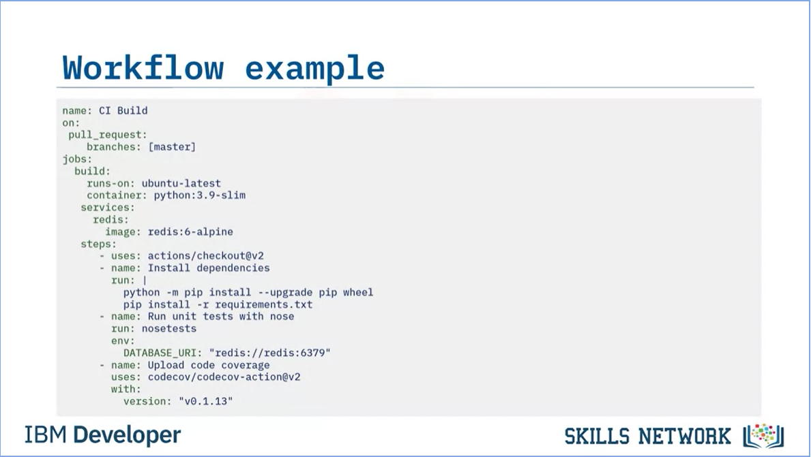
</p>
<!-- {width="4.0in" height="2.2572648731408576in"} -->

Let\'s put everything together with an example.

Every workflow has a name.

<!--~~~~~~~~~~~~~~~~~~~~~~~~~~~~~~~~~~~~~~~~~~~~~~~~~~~~~~~~~~~~~~~~~~~~~~~~~~~~~~~~~~~~~~~~~~~~-->
<p align="center">
  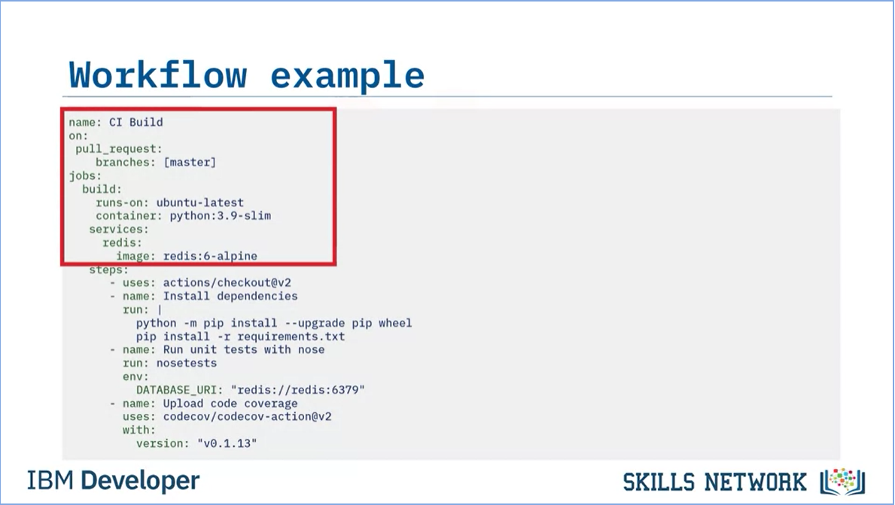
</p>
<!-- {width="4.0in" height="2.2572648731408576in"} -->

This one is called 'CI Build' because it\'s part of a Continuous
Integration workflow.

<!--~~~~~~~~~~~~~~~~~~~~~~~~~~~~~~~~~~~~~~~~~~~~~~~~~~~~~~~~~~~~~~~~~~~~~~~~~~~~~~~~~~~~~~~~~~~~-->
<p align="center">
  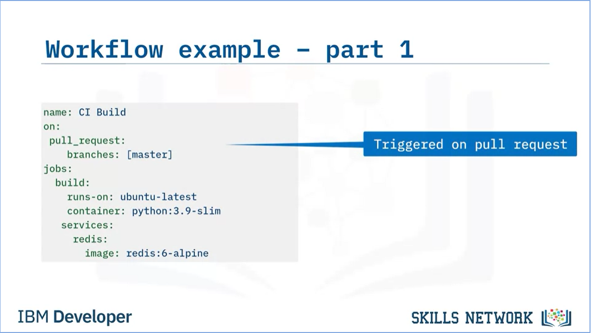
</p>
<!-- {width="4.0in" height="2.2572648731408576in"} -->

It's triggered on a pull request to the master branch.

<!--~~~~~~~~~~~~~~~~~~~~~~~~~~~~~~~~~~~~~~~~~~~~~~~~~~~~~~~~~~~~~~~~~~~~~~~~~~~~~~~~~~~~~~~~~~~~-->
<p align="center">
  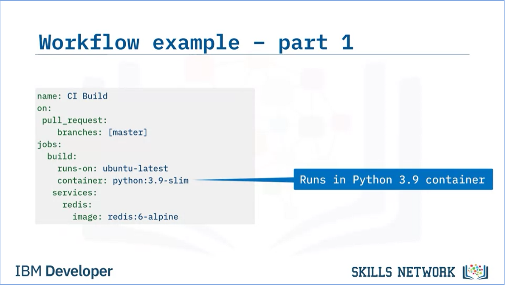
</p>
<!-- {width="4.0in" height="2.2572648731408576in"} -->

It has a job called 'build' that runs in a Python 3.9 container on top
of the latest Ubuntu runner.

<!--~~~~~~~~~~~~~~~~~~~~~~~~~~~~~~~~~~~~~~~~~~~~~~~~~~~~~~~~~~~~~~~~~~~~~~~~~~~~~~~~~~~~~~~~~~~~-->
<p align="center">
  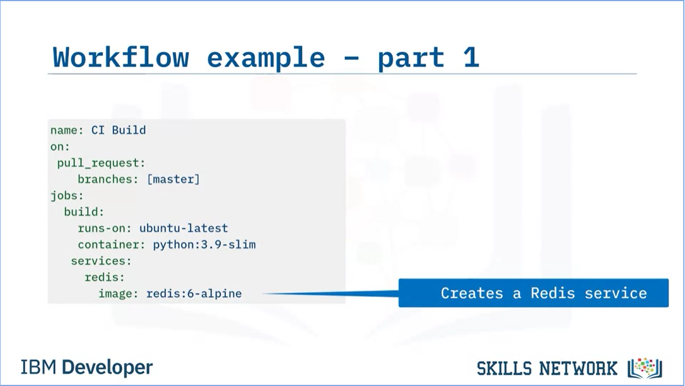
</p>
<!-- {width="4.0in" height="2.2572648731408576in"} -->

And it creates a database service called 'redis' from the Redis 6-Alpine
Docker image.

Then in the steps:

<!--~~~~~~~~~~~~~~~~~~~~~~~~~~~~~~~~~~~~~~~~~~~~~~~~~~~~~~~~~~~~~~~~~~~~~~~~~~~~~~~~~~~~~~~~~~~~-->
<p align="center">
  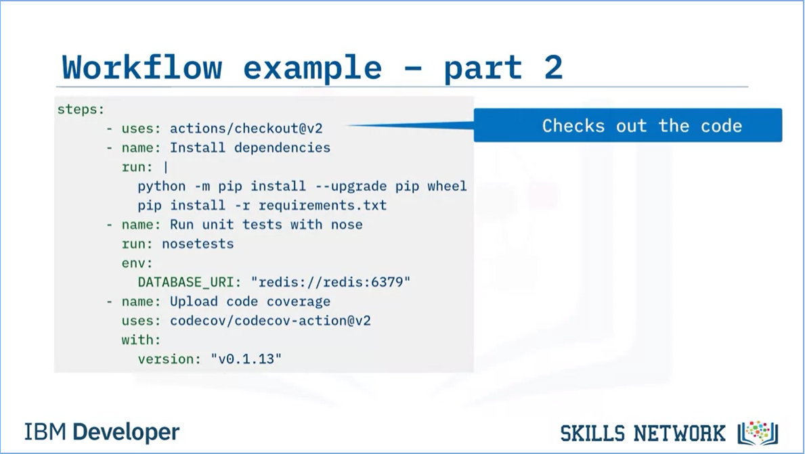
</p>
<!-- {width="4.0in" height="2.2572648731408576in"} -->

It checks out the code using a GitHub action.

<!--~~~~~~~~~~~~~~~~~~~~~~~~~~~~~~~~~~~~~~~~~~~~~~~~~~~~~~~~~~~~~~~~~~~~~~~~~~~~~~~~~~~~~~~~~~~~-->
<p align="center">
  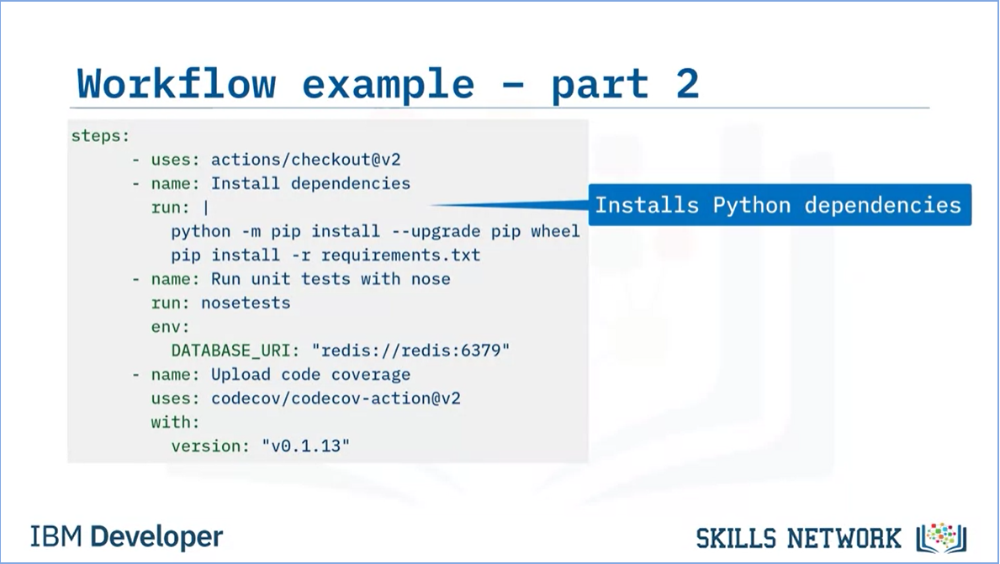
</p>
<!-- {width="4.0in" height="2.2572648731408576in"} -->

It uses a shell command to upgrade pip and wheel and then uses pip to
install all of the packages in the 'requirements.txt' file.

<!--~~~~~~~~~~~~~~~~~~~~~~~~~~~~~~~~~~~~~~~~~~~~~~~~~~~~~~~~~~~~~~~~~~~~~~~~~~~~~~~~~~~~~~~~~~~~-->
<p align="center">
  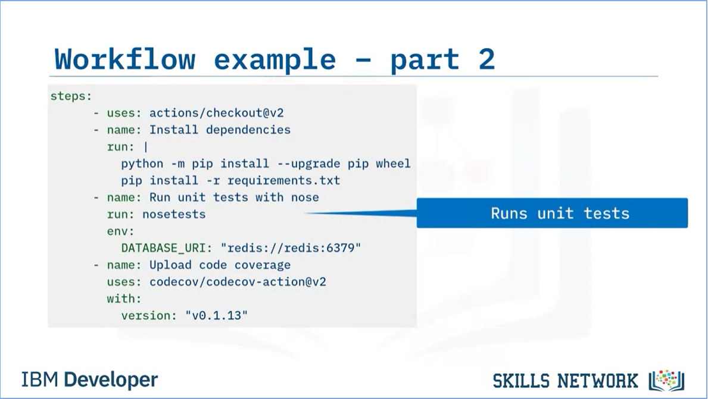
</p>
<!-- {width="4.0in" height="2.2572648731408576in"} -->

Then it runs the unit tests using a popular Python test runner called
nosetests.

In the same step, it establishes an environment variable called
'DATABASE_URI' that points to the 'redis' database service that it
created earlier.

<!--~~~~~~~~~~~~~~~~~~~~~~~~~~~~~~~~~~~~~~~~~~~~~~~~~~~~~~~~~~~~~~~~~~~~~~~~~~~~~~~~~~~~~~~~~~~~-->
<p align="center">
  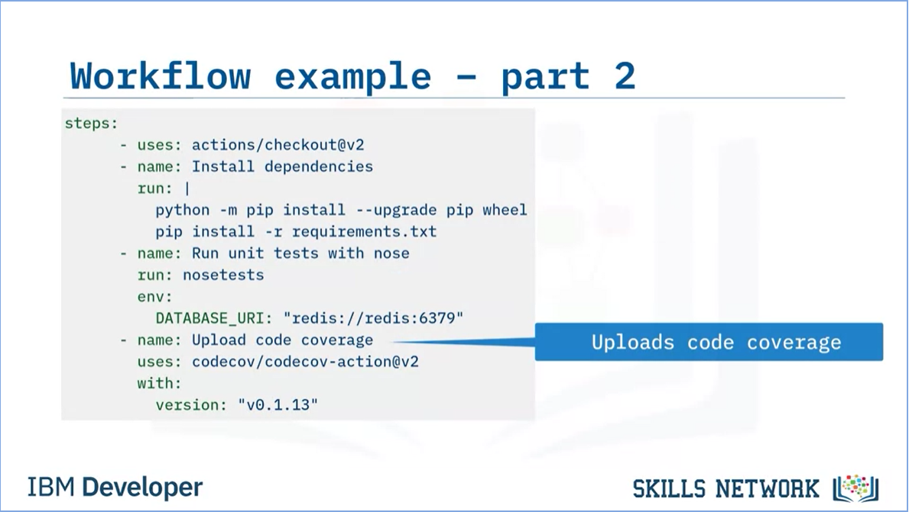
</p>
<!-- {width="4.0in" height="2.2572648731408576in"} -->

Finally, it uploads code coverage data to the Codecov website using
version 0.1.13 of a codecov uploader by specifying the version number as
an argument.

Hopefully, this shows you how to put events, jobs, runners, services,
steps, and actions together to build a Continuous Integration workflow
that will trigger on every pull request to the master branch.

<!--~~~~~~~~~~~~~~~~~~~~~~~~~~~~~~~~~~~~~~~~~~~~~~~~~~~~~~~~~~~~~~~~~~~~~~~~~~~~~~~~~~~~~~~~~~~~-->
<p align="center">
  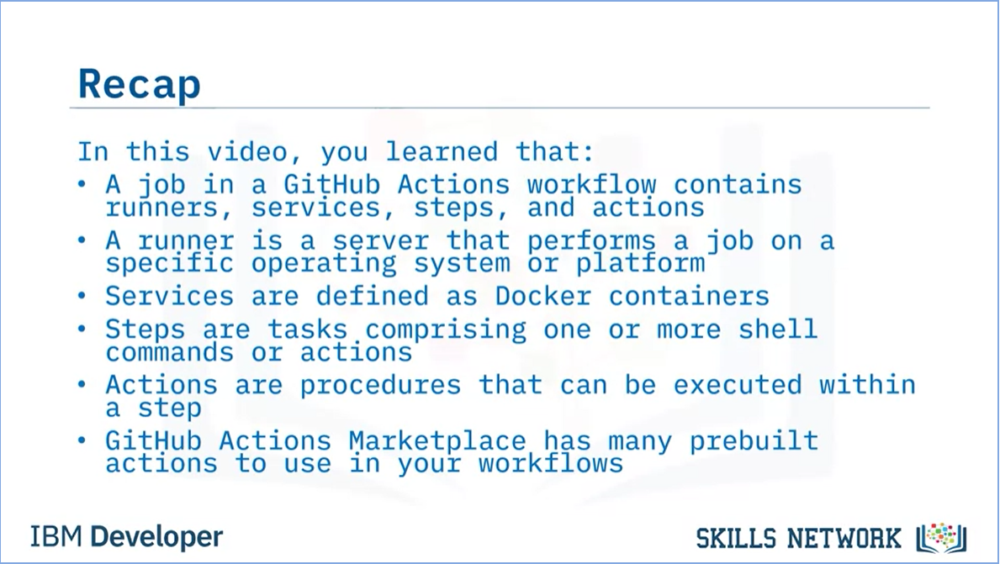
</p>
<!-- {width="4.0in" height="2.2572648731408576in"} -->

In this module, you learned that:

-   The job component of a GitHub Actions workflow contains runners,
    services, steps, and actions,

-   A runner is a server that performs a job on a specific operating
    system or platform,

-   Services are defined as Docker containers,

-   Steps are tasks comprising one or more shell commands or actions,

-   Actions are procedures that can be executed within a step, and

-   The GitHub Actions Marketplace has many prebuilt actions for you to
    use in your workflows.

### Lab: Using GitHub Actions - Part 2

Welcome to the hands-on lab for **Using GitHub Actions - Part 2**. In
this part, you will continue building the Continuous Integration
pipeline you started in the previous lab titled** Using GitHub Actions -
Part 1**. Please ensure you complete part 1 before starting this lab.

You should have a workflow file with an empty job from the previous lab.
You will add the following steps to this job in this lab: - Check out
the code - Install dependencies - Lint code with Flake8 - Run unit tests
with nose

Skills Network Labs (SN Labs) is a virtual lab environment used in this
course.  Upon clicking the \"Open Tool\" button below, your Username and
Email will be passed to SN Labs and will be used in strict accordance
with IBM Skills Network Privacy policy, such as for communicating
important information to enhance your learning experience. 

In case you need to download the lab instructions
click [HERE](https://cf-courses-data.s3.us.cloud-object-storage.appdomain.cloud/IBM-CD0215EN-SkillsNetwork/labs/module2/github_actions_part2.md.html) to
open a new tab.

<h3>Using GitHub Actions - Part 2 (External resource)</h3>

Clicking on the Open Tool button below will launch the cloud-based SN
labs virtual labs environment with instructions to complete this lab.
Your username and email will be shared with SN Labs to authenticate and
provision your lab environment.

<h4>Open Tool</h4>

<h3>Summary & Highlights: Implementing Continuous Integration (CI)</h3>

Congratulations! You have completed this lesson. At this point in the
course, you know:

-   GitHub Actions is a CI/CD tool available on every GitHub
    repository. 

-   GitHub Actions provides starter code to get your workflow up and
    running quickly. 

-   You configure GitHub Actions by creating a .github/workflows folder
    and placing workflow YAML files in it. 

-   A workflow is a series of automated procedures that GitHub Actions
    will execute. 

-   Workflow components include events, jobs, runners, steps, and
    actions. 

-   The GitHub Actions Marketplace provides a variety of prebuilt
    actions that you can use in your workflows. 

<h1>Module 3. Continuous Delivery - Introduction and Learning Objective</h1>

<h3>Module Introduction</h3>

This module provides an overview of Continuous Delivery (CD). You will
explore CD's goals, benefits, key principles, and best practices. You
will discover the requirements of a CI/CD pipeline and the difference
between Continuous Delivery and Continuous Deployment, a closely related
process. You will learn about standard CD tools, including Argo CD and
Tekton, and how to choose the best tool for the job. You will then
explore Tekton in greater depth. You will discover its essential
components and how they work together to create a CD pipeline. You will
learn how to build a pipeline from Tekton tasks, pass parameters to a
pipeline, and build triggers that start pipeline runs. You will explore
how to implement reusable Tekton tasks from the Tekton Catalog and
create your own tasks to automate linting and unit testing. You will
discover how to complete your CD pipeline by building a container image
and deploying your application to an environment. 

<h3>Learning Objectives</h3>

-   Explain the benefits of Continuous Delivery (CD).

-   Describe the five key principles of CD.

-   Summarize CD best practices.

-   Discuss key considerations for choosing a CD tool.

-   Describe how Tekton works.

-   Explain how to build a Tekton pipeline.

-   Create an empty Tekton pipeline and pass parameters to it.

-   Explain how to create and use events and triggers to start a Tekton
    pipeline.

-   Create and use EventListeners, TriggerTemplates, and TriggerBindings
    to start a Tekton pipeline.

-   Describe how to use the Tekton catalog.

-   Explain how to create a workspace for tasks.

-   Implement a Tekton Catalog task in a Tekton pipeline.

-   Summarize how to create your own Tekton tasks for quality checks and
    testing.

-   Integrate automated linting and unit testing into a Tekton workflow.

-   Describe how to build a container image with Tekton to prepare for
    deployment.

-   Implement a task that builds a Docker image within a Tekton
    workflow.

-   Explain how to deploy an application to an environment using Tekton.

-   Use the OpenShift client in Tekton to deploy a Docker image to
    Kubernetes.

<h2 id="3-01">Module 3-01. Continuous Delivery (2:00)</h2>

Welcome to Module 3, Continuous Delivery.

This module will give you a broad overview of Continuous Delivery (or
CD).

You will start by exploring the goals, benefits, key principles, and
best practices of CD.

Then you\'ll discover the requirements of a CI/CD pipeline and the
differences between Continuous Delivery and Continuous Deployment, a
closely related process.

You'll also learn about some popular CD tools, compare and contrast
their features and benefits, and learn how to choose the best tool for
your needs.

Then, we'll dive deep into exploring Tekton, a cloud native CD tool that
executes right in your Kubernetes cluster.

You'll discover its essential components of events, triggers, pipelines,
tasks, and steps and how they work together to create a complete CD
pipeline.

Starting from the bottom up, you'll learn how to build a pipeline from
Tekton tasks, pass parameters into the pipeline, build triggers, and
start pipeline runs from webhooks that you create with your favorite
version control system like GitHub and GitLab.

You'll also learn how to use community-written tasks from the Tekton
catalog, otherwise known as Tekton Hub, and how to write your own custom
task when the catalog doesn\'t have one that you need.

Finally, you'll learn how to build a container image and deploy it to
OpenShift as the last step in your CD pipeline.

The hands-on labs will allow you to implement everything you've learned
in the module.

They take you step by step through the process of creating a fully
functioning CD pipeline that clones a repo, performs quality checks,
unit tests, builds an image, and deploys it to Kubernetes.

In the end, you'll have a fully functioning pipeline that you could use
with or modify for your own projects.

So, let\'s get started.

<h2 id="3-02">Module 3-02. What is Continuous Delivery? (4:41)</h2>

Welcome to 'What is Continuous Delivery?'

<!--~~~~~~~~~~~~~~~~~~~~~~~~~~~~~~~~~~~~~~~~~~~~~~~~~~~~~~~~~~~~~~~~~~~~~~~~~~~~~~~~~~~~~~~~~~~~-->
<p align="center">
  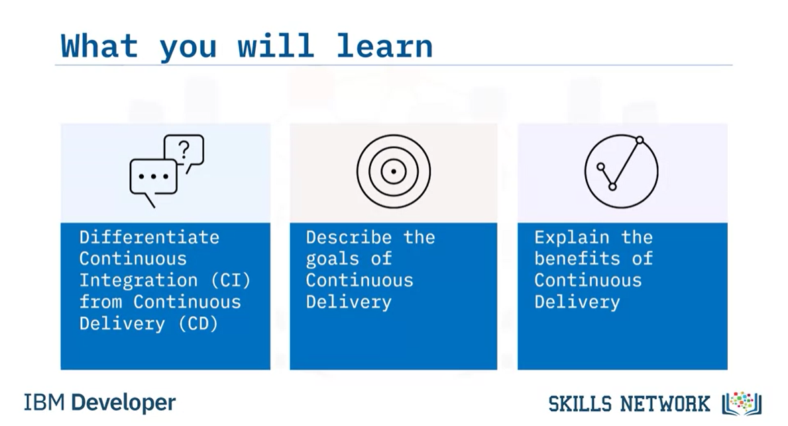
</p>
<!-- {width="4.0in" height="2.1666666666666665in"} -->

After this module, you will be able to:

-   Differentiate between Continuous Integration and Continuous
    Delivery,

-   Describe the goals of Continuous Delivery, and

-   Explain the benefits of Continuous Delivery.

<!--~~~~~~~~~~~~~~~~~~~~~~~~~~~~~~~~~~~~~~~~~~~~~~~~~~~~~~~~~~~~~~~~~~~~~~~~~~~~~~~~~~~~~~~~~~~~-->
<p align="center">
  
</p>
<!-- {width="4.0in" height="2.25042760279965in"} -->

The first thing that's important to understand, is the difference
between Continuous Delivery and Continuous Integration, because a lot of
times, people say 'CI/CD' like it\'s one thing, but it\'s not.

It's two separate and distinct things that happen after each other.

Continuous Integration is continuously integrating your code back into
the main or master or trunk branch, so it shouldn\'t get too far away
before you merge stuff back into the main branch to make sure that it
works.

You are continuously integrating your code, with the main code.

Whereas Continuous Delivery is then taking that integrated code and
deploying it somewhere.

You may deploy it every time you integrate it, you may not deploy it
every time you integrate it - you may have continuous integration on one
loop.

And then, when you finally merge to your main branch, you kick off the
Continuous Delivery part.

<!--~~~~~~~~~~~~~~~~~~~~~~~~~~~~~~~~~~~~~~~~~~~~~~~~~~~~~~~~~~~~~~~~~~~~~~~~~~~~~~~~~~~~~~~~~~~~-->
<p align="center">
  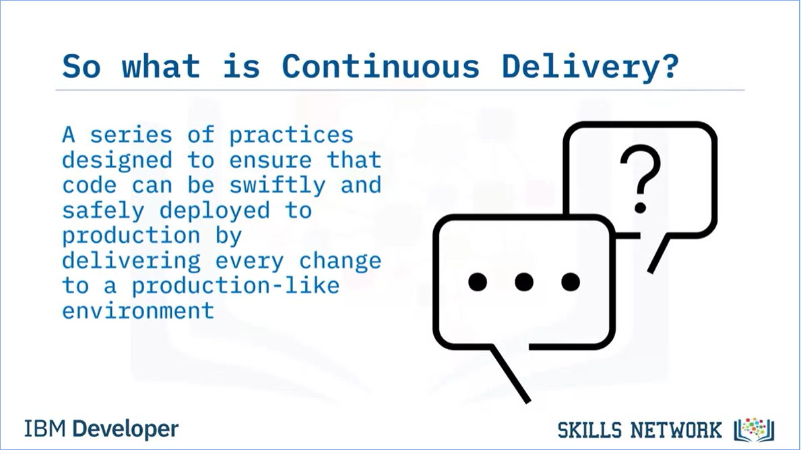
</p>
<!-- {width="4.0in" height="2.25042760279965in"} -->

The term Continuous Delivery can be defined as a series of practices
designed to ensure that code can be rapidly and safely deployed to
production by delivering every change to a production-like environment.

Notice that is says "production-like."

It doesn't have to be a production environment and many times it's not.

In fact, deploying to production is usually called "Continuous
Deployment".

Continuous Delivery just means that you are deploying the code to a
development, or test, or staging environment to ensure that the code can
be deployed.

This also gives everyone a chance to see the code working.

The key takeaway is that this is automated.

Nobody performed any manual steps to deploy the code.

It is continuously deployed automatically.

<!--~~~~~~~~~~~~~~~~~~~~~~~~~~~~~~~~~~~~~~~~~~~~~~~~~~~~~~~~~~~~~~~~~~~~~~~~~~~~~~~~~~~~~~~~~~~~-->
<p align="center">
  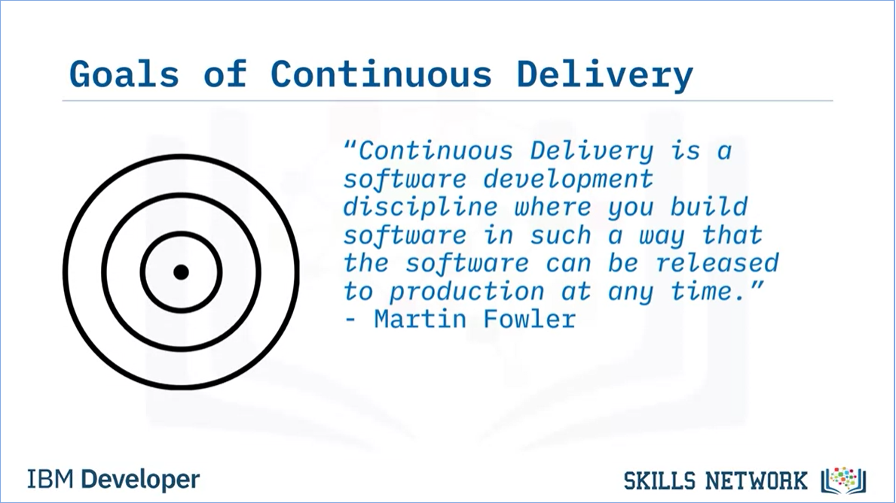
</p>
<!-- {width="4.0in" height="2.25042760279965in"} -->

So, what are the goals of Continuous Delivery?

Well, according to Martin Fowler, "Continuous Delivery is a software
development discipline where you build software in such a way that the
software can be released to production at any time."

Let's dig deeper into what that means.

<!--~~~~~~~~~~~~~~~~~~~~~~~~~~~~~~~~~~~~~~~~~~~~~~~~~~~~~~~~~~~~~~~~~~~~~~~~~~~~~~~~~~~~~~~~~~~~-->
<p align="center">
  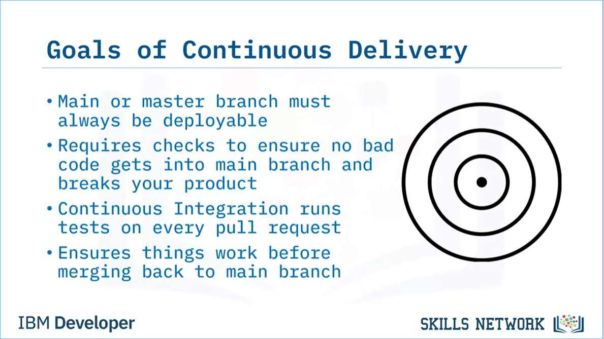
</p>
<!-- {width="4.0in" height="2.25042760279965in"} -->

To release to production at any time, means that the main or master
branch must always be deployable.

Which means that you\'ve got to have a set of checks in place to make
sure that you don\'t get bad code into that main or master branch, that
could break your product.

And this is absolutely key.

And that\'s why you use Continuous Integration to run the tests every
time there\'s a pull request.

Working in separate feature branches and using pull requests ensures
that any code you have written is working correctly before you merge it
back into the main branch.

<!--~~~~~~~~~~~~~~~~~~~~~~~~~~~~~~~~~~~~~~~~~~~~~~~~~~~~~~~~~~~~~~~~~~~~~~~~~~~~~~~~~~~~~~~~~~~~-->
<p align="center">
  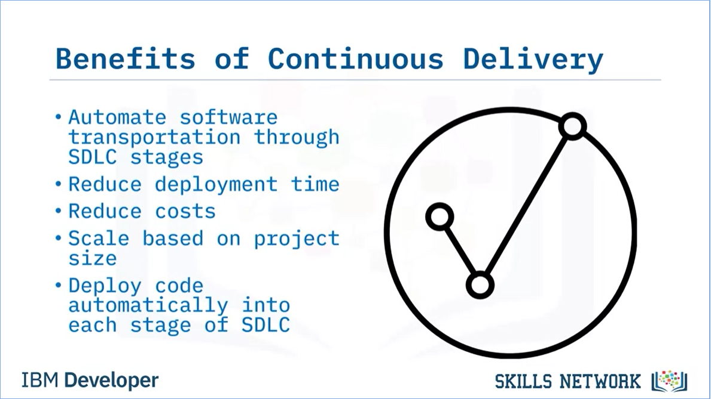
</p>
<!-- {width="4.0in" height="2.25042760279965in"} -->

The benefits of Continuous Delivery are many and varied and they include
the following:

Enabling your development teams to automate the steps that transport
software through the various stages of the software development
lifecycle (or SDLC).

Automation leads to reducing the deployment time by nonstop testing and
deployment cycles.

The more you deploy, the more confidence you have that your next
deployment will work, and the less time you spend debugging deployments.

Reducing the costs that are normally common with standard deployment
strategies.

This could be people costs, infrastructure costs, and the cost of lost
time due to manual failures.

Continuous Delivery enables your development team to scale their
software deployments based on the size of the project.

And enabling you to deploy code automatically into the various stages of
the software development lifecycle.

Once you have deployed to the development environment without incident,
and to the test environment, and then the staging environment all
without incident, the chances are pretty good that when you deploy to
production that will also be without incident.

<!--~~~~~~~~~~~~~~~~~~~~~~~~~~~~~~~~~~~~~~~~~~~~~~~~~~~~~~~~~~~~~~~~~~~~~~~~~~~~~~~~~~~~~~~~~~~~-->
<p align="center">
  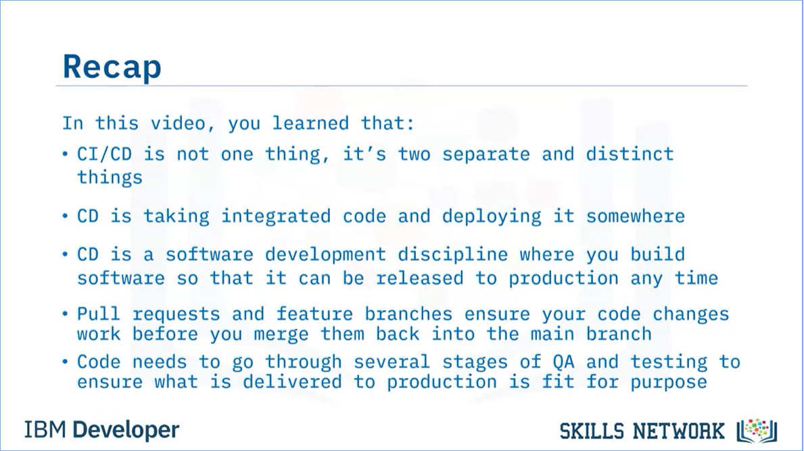
</p>
<!-- {width="4.0in" height="2.25042760279965in"} -->

In this module, you learned that:

-   CI/CD is not one thing, it's two separate and distinct things that
    happen after each other,

-   Continuous Delivery is taking integrated code and deploying it
    somewhere,

-   Continuous Delivery is a software development discipline where you
    build software in such a way that the software can be released to
    production at any time,

-   The reason you have pull requests and feature branches is so you can
    ensure code changes work before you merge them back into the main
    branch, and

-   Your code will typically need to go through several stages of
    Quality Assurance and Staging or Testing to ensure that what you
    deliver to production is bug-free and fit for purpose.

<h2 id="3-03">Module 3-03. Continuous Delivery Key Principles (2:46)</h2>

Welcome to 'Continuous Delivery Key Principles.'

<!--~~~~~~~~~~~~~~~~~~~~~~~~~~~~~~~~~~~~~~~~~~~~~~~~~~~~~~~~~~~~~~~~~~~~~~~~~~~~~~~~~~~~~~~~~~~~-->
<p align="center">
  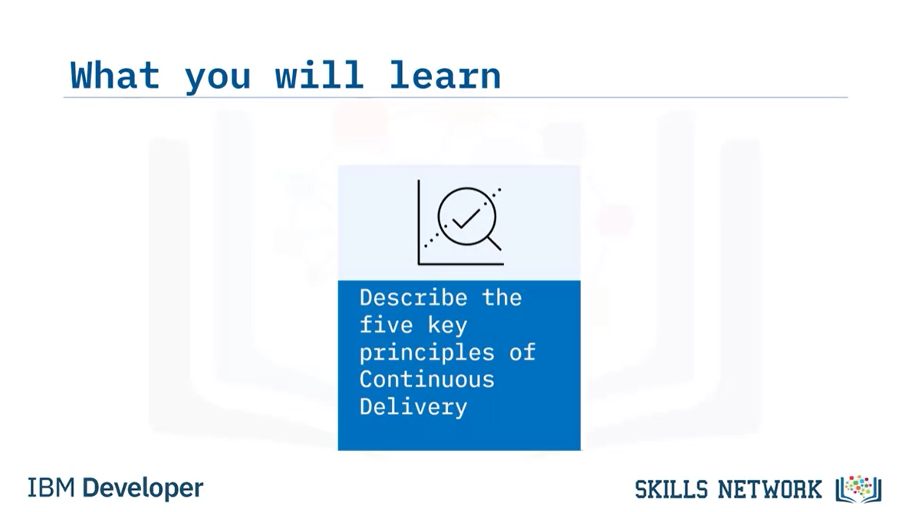
</p>
<!-- {width="4.0in" height="2.25042760279965in"} -->

After this module, you will be able to describe the five key principles
of Continuous Delivery.

<!--~~~~~~~~~~~~~~~~~~~~~~~~~~~~~~~~~~~~~~~~~~~~~~~~~~~~~~~~~~~~~~~~~~~~~~~~~~~~~~~~~~~~~~~~~~~~-->
<p align="center">
  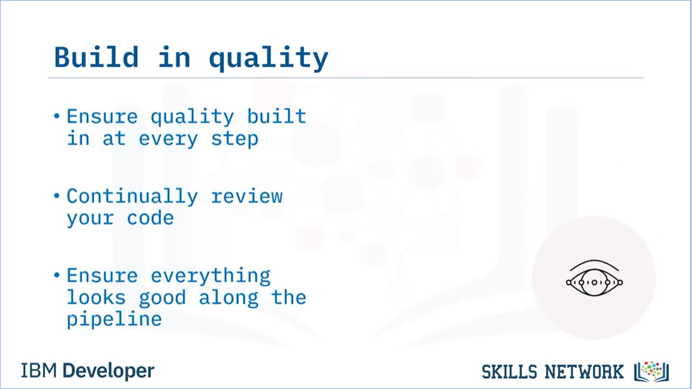
</p>
<!-- {width="4.0in" height="2.25042760279965in"} -->

The first of our key principles of Continuous Delivery is to ***build in
quality***. You need to ensure that you have quality built in at every
step. Quality isn't free; you must plan for it. This can be achieved by
continually reviewing your code. Every pull request is an opportunity
for a code review and quality check. This is critical to make sure that
everything looks good all the way along your pipeline.

<!--~~~~~~~~~~~~~~~~~~~~~~~~~~~~~~~~~~~~~~~~~~~~~~~~~~~~~~~~~~~~~~~~~~~~~~~~~~~~~~~~~~~~~~~~~~~~-->
<p align="center">
  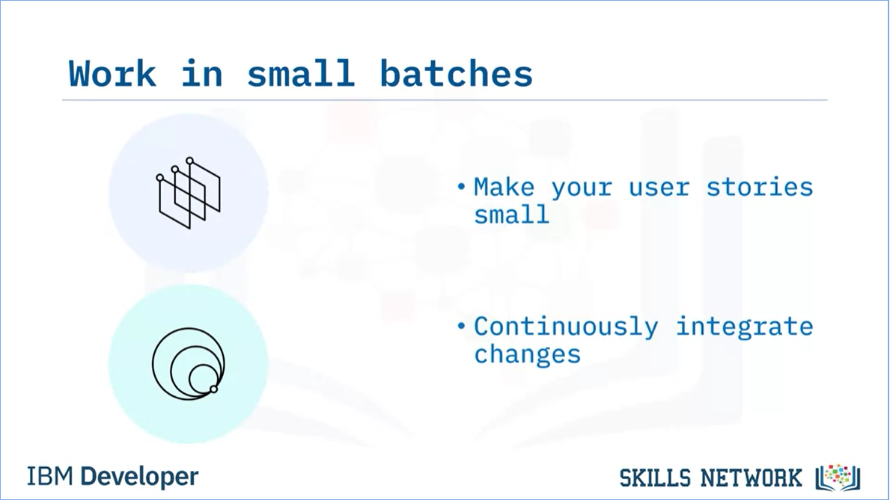
</p>
<!-- {width="4.0in" height="2.25042760279965in"} -->

The next key principle is to work in ***small batches***. That's why you
should make your user stories small; it's best to make small changes
because less change means less risk. And you should continuously
integrate these changes with the base code so that the changes never
drift too far from the base that everyone else is working from.

<!--~~~~~~~~~~~~~~~~~~~~~~~~~~~~~~~~~~~~~~~~~~~~~~~~~~~~~~~~~~~~~~~~~~~~~~~~~~~~~~~~~~~~~~~~~~~~-->
<p align="center">
  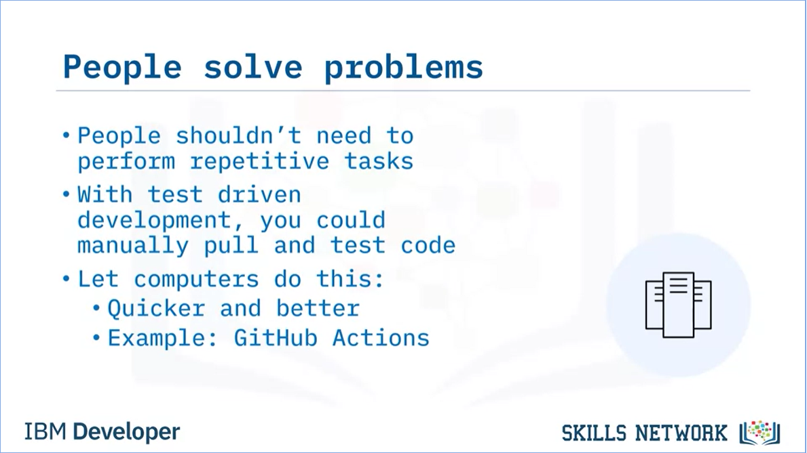
</p>
<!-- {width="4.0in" height="2.25042760279965in"} -->

The third key principle is knowing that people are great at solving
problems, but not so good at repetition. So, ***people shouldn't be
required to perform repetitive tasks***. In fact, people are terrible at
performing repetitive tasks. They get easily bored and distracted.

With test-driven development, you could constantly pull people's code
and run tests against it manually, but why not harness the power of
computers to perform these repetitive tasks they were designed to
handle?

Computers can perform these tasks more quickly and efficiently than you
or I.

For example, applications such as GitHub Actions could do that job, and
you would never have to pull and test code manually again.

<!--~~~~~~~~~~~~~~~~~~~~~~~~~~~~~~~~~~~~~~~~~~~~~~~~~~~~~~~~~~~~~~~~~~~~~~~~~~~~~~~~~~~~~~~~~~~~-->
<p align="center">
  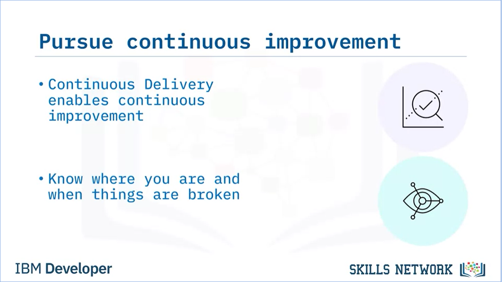
</p>
<!-- {width="4.0in" height="2.25042760279965in"} -->

The next key principle of Continuous Delivery is that it ***enables
relentless continuous improvement***. The more often you do something,
the better you get at it, and the less likely it is to fail. By
delivering each change to a known working environment, you should
continually know where you are and when things are broken.

<!--~~~~~~~~~~~~~~~~~~~~~~~~~~~~~~~~~~~~~~~~~~~~~~~~~~~~~~~~~~~~~~~~~~~~~~~~~~~~~~~~~~~~~~~~~~~~-->
<p align="center">
  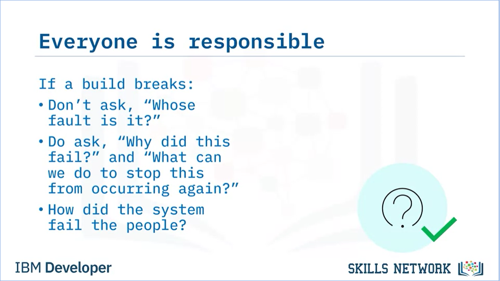
</p>
<!-- {width="4.0in" height="2.25042760279965in"} -->

And the last key principle of Continuous Delivery is that ***everyone is
responsible for their part in the story***. So, if a build does break,
it's not a case of finger-pointing and asking, "Whose fault is it?" What
you should be asking is, "What went wrong?" and "How can we prevent this
from happening in the future?" What you need to consider is more about
the system's failings rather than the people's failings. How did the
system fail the people? Not the other way around.

<!--~~~~~~~~~~~~~~~~~~~~~~~~~~~~~~~~~~~~~~~~~~~~~~~~~~~~~~~~~~~~~~~~~~~~~~~~~~~~~~~~~~~~~~~~~~~~-->
<p align="center">
  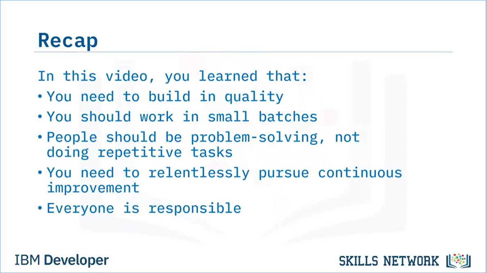
</p>
<!-- {width="4.0in" height="2.25042760279965in"} -->

In this module, you learned that

-   You need to build in quality,

-   You should work in small batches,

-   People are best at solving problems, not repetitive tasks,

-   You need to relentlessly pursue continuous improvement, and

-   Everyone is responsible for their part in the story.

<h2 id="3-04">Module 3-04. Continuous Delivery Practices (4:14)</h2>

Welcome to 'Continuous Delivery Practices.'

<!--~~~~~~~~~~~~~~~~~~~~~~~~~~~~~~~~~~~~~~~~~~~~~~~~~~~~~~~~~~~~~~~~~~~~~~~~~~~~~~~~~~~~~~~~~~~~-->
<p align="center">
  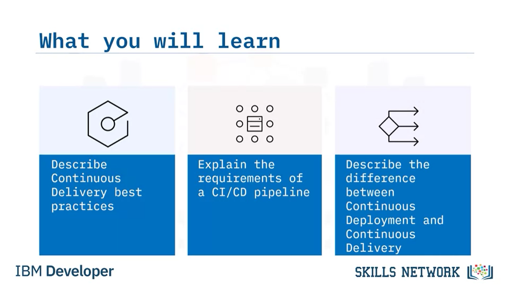
</p>
<!-- {width="4.0in" height="2.25042760279965in"} -->

After this module, you will be able to;

-   Describe Continuous Delivery best practices,

-   Explain the requirements of a CI/CD pipeline, and

-   Describe the differences between Continuous Deployment and
    Continuous Delivery.
<!--~~~~~~~~~~~~~~~~~~~~~~~~~~~~~~~~~~~~~~~~~~~~~~~~~~~~~~~~~~~~~~~~~~~~~~~~~~~~~~~~~~~~~~~~~~~~-->
<p align="center">
  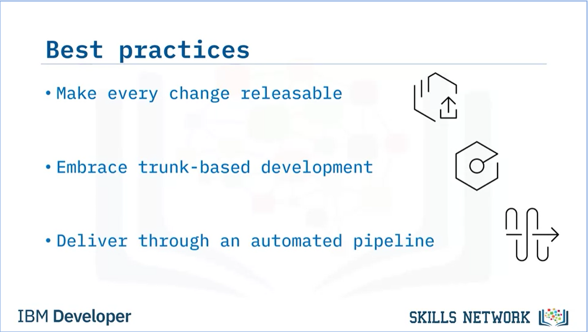
</p>
<!-- {width="4.0in" height="2.2572648731408576in"} -->

There are many best practices to follow when implementing Continuous
Delivery.

-   It's important to make every change releasable. This means you
    should always include user documentation, operations runbooks, and
    information about what your change does. This ensures that every
    change will work and be documented well enough to be delivered to
    customers as well as serve any audit that may occur. You also need
    to keep in mind that Continuous Delivery is built upon Continuous
    Integration. As a best practice, you should avoid delaying any
    integration caused by long-lived branches.

-   You want to use short-lived feature branches that are continuously
    integrated into the main codebase. This is also called trunk-based
    development because you always come back to the trunk, otherwise
    known as the master or main branch. Every change is built, tested,
    and deployed together for the fastest feedback.

-   A well-constructed, automated delivery pipeline is integral to a
    successful Continuous Delivery implementation. This ensures that all
    code releases move into the test and production environments in a
    consistent, predictable way.

<!--~~~~~~~~~~~~~~~~~~~~~~~~~~~~~~~~~~~~~~~~~~~~~~~~~~~~~~~~~~~~~~~~~~~~~~~~~~~~~~~~~~~~~~~~~~~~-->
<p align="center">
  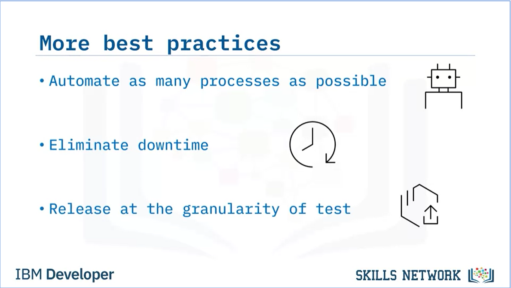
</p>
<!-- {width="4.0in" height="2.2572648731408576in"} -->

-   Automate as many processes as possible. In Continuous Delivery, you
    must automate as many processes as possible in your software
    development lifecycle to create a good, reliable delivery pipeline.
    This pipeline is not only for code builds and deployments, but for
    the creation of new development environments as well.

-   You want to aim for no downtime. To ensure application availability
    while you make frequent Continuous Delivery updates, when you push a
    new function to production, you must first validate it before
    deploying it to public-running application instances.

-   You also want to release at the granularity of test. If two parts of
    the system must be tested together, they should be released together
    so that you know that the parts of your system are compatible.
    Release automation tools are good at coordinating this kind of
    delivery. Alternatively, you can fully decouple.

<!--~~~~~~~~~~~~~~~~~~~~~~~~~~~~~~~~~~~~~~~~~~~~~~~~~~~~~~~~~~~~~~~~~~~~~~~~~~~~~~~~~~~~~~~~~~~~-->
<p align="center">
  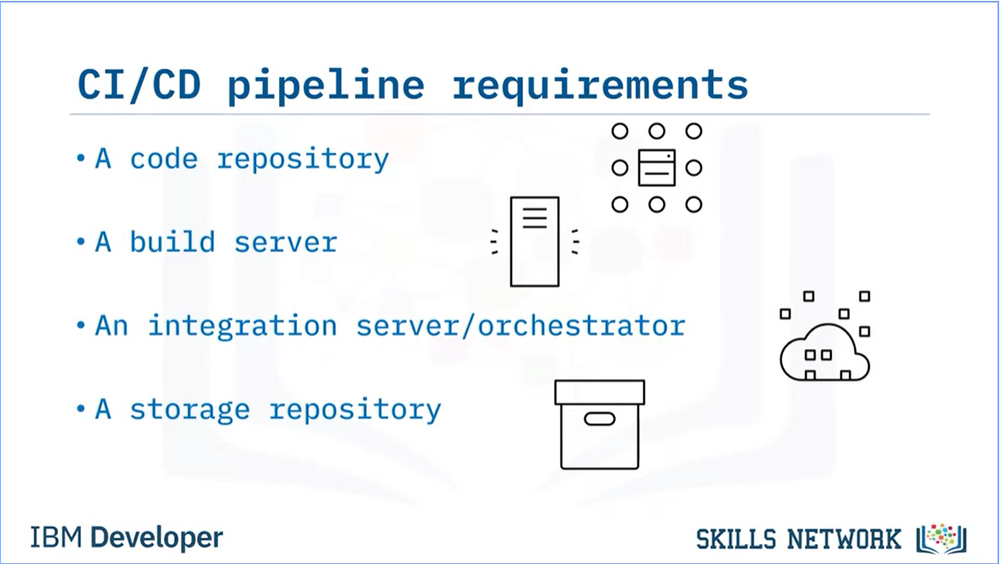
</p>
<!-- {width="4.0in" height="2.2572648731408576in"} -->

A CI/CD pipeline requires several elements to be in place:

-   You need a code repository to host and manage all source code. Your
    source code management system is the single version of the truth.
    Everything you need to build and release your code must be checked
    into version control.

-   That code needs a build server to manage the building of the
    application. You want that environment to perform clean builds,
    starting from the same state every time.

-   You need an integration server or orchestrator that handles the
    build automation and runs tests against your code. There should be
    no manual steps. Everything should be automated.

-   And finally, you need a repository to store all the binaries and
    artifacts of the application so that once built and tested, they can
    be deployed easily.

<!--~~~~~~~~~~~~~~~~~~~~~~~~~~~~~~~~~~~~~~~~~~~~~~~~~~~~~~~~~~~~~~~~~~~~~~~~~~~~~~~~~~~~~~~~~~~~-->
<p align="center">
  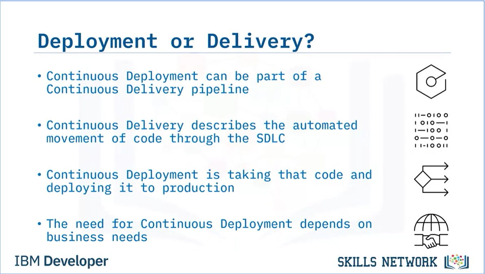
</p>
<!-- {width="4.0in" height="2.2572648731408576in"} -->

So, what's the difference between Continuous Deployment and Continuous
Delivery?

-   Continuous Deployment can be part of a Continuous Delivery pipeline.

-   Specifically, Continuous Delivery is the automated movement of code
    through the development lifecycle (or delivery lifecycle) once it
    passes the required automation tests.

-   Continuous Deployment is taking that delivered code and deploying it
    to production.

-   Whether and how Continuous Delivery is implemented all depends on
    your business needs. If your business needs the delivery team to
    release new or updated software to production repeatedly, reliably,
    and quickly, then Continuous Deployment will be of great benefit.

<!--~~~~~~~~~~~~~~~~~~~~~~~~~~~~~~~~~~~~~~~~~~~~~~~~~~~~~~~~~~~~~~~~~~~~~~~~~~~~~~~~~~~~~~~~~~~~-->
<p align="center">
  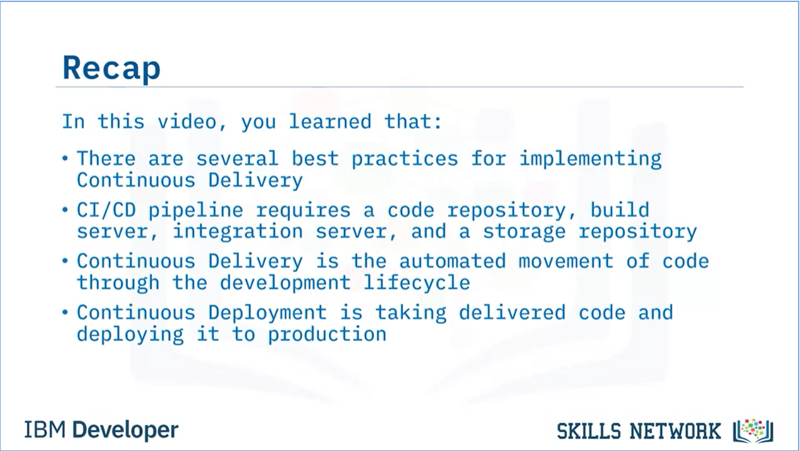
</p>
<!-- {width="4.0in" height="2.2572648731408576in"} -->

In this module, you learned that;

-   There are several best practices to follow when implementing
    Continuous Delivery,

-   a CI/CD pipeline requires a code repository, build server,
    integration server, and a storage repository,

-   Continuous Delivery is the practice of automating the movement of
    code through the development lifecycle, and

-   Continuous Deployment is the practice of taking the delivered code
    and deploying it into the production environment.

<h2 id="3-05">Module 3-05. Tools of Continuous Delivery (7:56)</h2>

Welcome to Tools of Continuous Delivery.

<!--~~~~~~~~~~~~~~~~~~~~~~~~~~~~~~~~~~~~~~~~~~~~~~~~~~~~~~~~~~~~~~~~~~~~~~~~~~~~~~~~~~~~~~~~~~~~-->
<p align="center">
  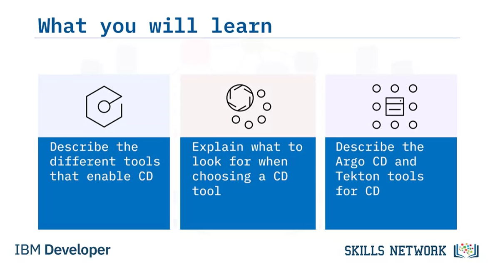
</p>
<!-- {width="4.0in" height="2.1461537620297464in"} -->

After this module, you will be able to;

-   Describe the different tools that enable Continuous Delivery, or CD,

-   Explain what to look for when choosing a CD tool, and

-   Describe the Argo CD and Tekton tools for CD.

<!--~~~~~~~~~~~~~~~~~~~~~~~~~~~~~~~~~~~~~~~~~~~~~~~~~~~~~~~~~~~~~~~~~~~~~~~~~~~~~~~~~~~~~~~~~~~~-->
<p align="center">
  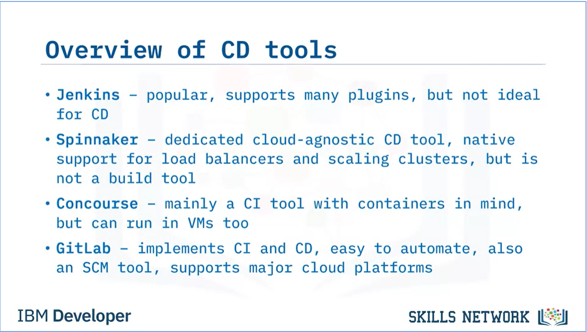
</p>
<!-- {width="4.0in" height="2.2641021434820647in"} -->

There are many tools available to the average developer for performing
Continuous Delivery.

-   Jenkins is one of the older CI/CD tools on the market and one of the
    most popular. It has a huge community, and supports countless
    plugins, but it's not ideal for CD. Jenkins does not provide
    visibility into the pipeline process, and requires a lot of setup
    and maintenance, making it uncompetitive compared to other CD tools.

-   Spinnaker, on the other hand, is a dedicated cloud-agnostic CD tool
    built in-house by Netflix. It allows you to manage CD pipelines and
    simplifies release rollbacks. It supports the creation of load
    balancers and scale clusters all natively.

-   Concourse CI is a tool that also contains CD capabilities, and was
    initially built with containers in mind, although you can still run
    things on virtual machines. The containers are highly scalable, and
    due to the container-first approach, every step of the build is very
    flexible; you just point to a Docker image to build from.

-   Lastly, GitLab can implement both CI and CD. It's easy to automate
    the process of deploying code to production since GitLab is also a
    source code manager. It supports all major cloud platforms, making
    the CI/CD pipeline very flexible to build.

<!--~~~~~~~~~~~~~~~~~~~~~~~~~~~~~~~~~~~~~~~~~~~~~~~~~~~~~~~~~~~~~~~~~~~~~~~~~~~~~~~~~~~~~~~~~~~~-->
<p align="center">
  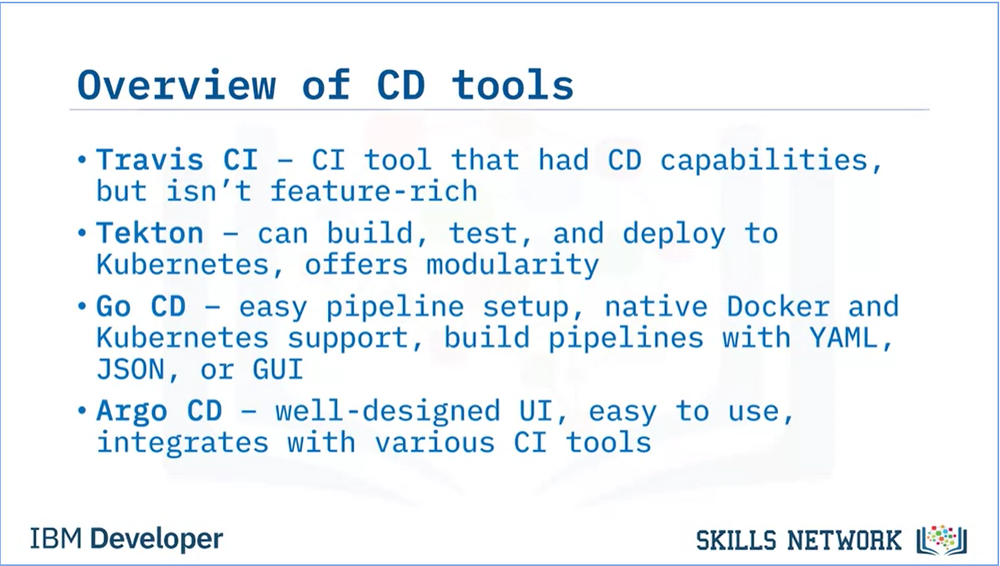
</p>
<!-- {width="4.0in" height="2.2641021434820647in"} -->

-   Travis CI is another CI tool that contains CD capabilities. It isn't
    as feature-rich as other CD implementations, but it requires minimal
    maintenance.

-   Tekton enables you to build, test, and deploy apps in Kubernetes
    using an open source, vendor-neutral framework. Its main strength is
    its modularity, allowing you to deploy across multiple environments
    such as VMs, serverless, Kubernetes, and cloud providers.

-   Go CD is a tool that boasts easy pipeline setup with native Docker
    and Kubernetes support. It comes with its own Value Stream Map tool
    that helps you trace each pipeline through all of the stages between
    commit and deployment. You can build pipelines with YAML or JSON
    files in a visual UI.

-   And finally, Argo CD was originally developed by Intuit, as they
    were looking for a lighter tool than Spinnaker that would improve
    build and deployment times and streamline their GitOps workflow. The
    UI is well made and easy to use and integrates well with a variety
    of CI tools such as Jenkins, GitHub Actions, CircleCI, and more.

<!--~~~~~~~~~~~~~~~~~~~~~~~~~~~~~~~~~~~~~~~~~~~~~~~~~~~~~~~~~~~~~~~~~~~~~~~~~~~~~~~~~~~~~~~~~~~~-->
<p align="center">
  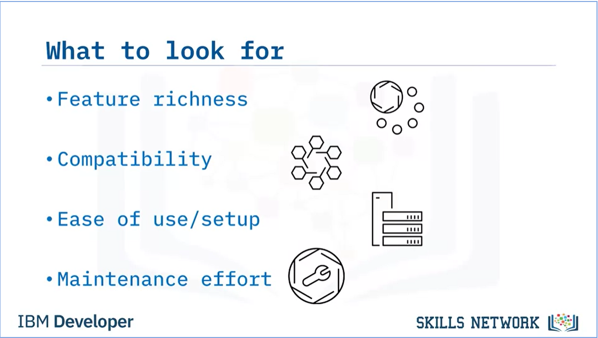
</p>
<!-- {width="4.0in" height="2.2641021434820647in"} -->

When looking for a CD tool to use within your workflow, these key
considerations should be top of mind.

-   With CD, you may want full audit trails; proprietary integrated
    secrets; and fine-grained, role-based access control. These features
    may only be partially available in CD tools and not ubiquitous, as
    some tools may be very new and overly simplistic. Having a
    **feature-rich** CD tool means that once your applications become
    more complex with more moving parts, you will already have the
    features at your disposal.

-   Depending on your CI pipeline, some CD tools may not be
    **compatible** with your current process. Picking a tool that is
    compatible and easily integrates with your current toolset makes
    setting up CD faster and reduces potential headaches.

-   CD tools can differ greatly in how they are implemented and how easy
    it is for developers to set up CD in their projects. Tools like
    Tekton are **easy to set up** and provide clear insights into your
    pipelines.

-   Beyond setup, **maintenance** can also take up a lot of time. Tools
    like Argo CD are easy to set up and maintain, while Jenkins is a
    handful to both set up and maintain. Using a CD tool to build a
    pipeline is just the first step.

<!--~~~~~~~~~~~~~~~~~~~~~~~~~~~~~~~~~~~~~~~~~~~~~~~~~~~~~~~~~~~~~~~~~~~~~~~~~~~~~~~~~~~~~~~~~~~~-->
<p align="center">
  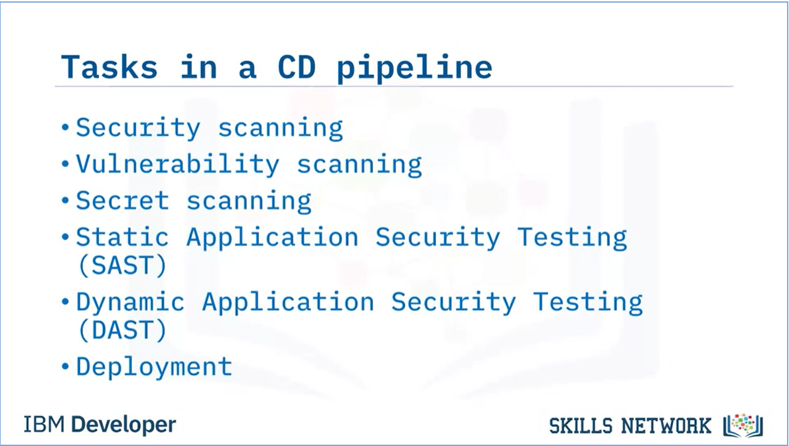
</p>
<!-- {width="4.0in" height="2.2641021434820647in"} -->

You must also consider what tools you need within your CD pipeline to
perform the following tasks:

-   Within your pipeline, you need tools for application security
    scanning and ensure overall application health. Security is often an
    afterthought and added at the end before an application launches. By
    adding security checks to your pipeline, every change that you make
    along the way is tested to be secure.

-   Vulnerability scanning helps identify dependencies and components
    vulnerabilities. Applications that are not vulnerable one day
    suddenly become vulnerable because of exploits found in existing
    code or libraries. It is critically important to add vulnerability
    scanning to your CD pipeline to ensure that you are not shipping
    code with known vulnerabilities.

-   Secret scanning for API keys and credentials prevents accidental
    exposure of sensitive information. Many times, developers
    inadvertently place passwords and other credentials in files that
    have been erroneously checked into source control. Scanning for
    secrets ensures that credentials are not leaked.

-   Static Application Security Testing (or SAST) scanning identifies
    vulnerabilities of the entire code base such as SQL injections and
    cross-site scripting. While some of these mistakes might get
    identified during code reviews, it's important to ensure that your
    CD pipeline is checking for them in case your developers forget to.

-   Dynamic Application Security Testing (or DAST) scans for incorrect
    security assumptions that may be hidden in the source code. Dynamic
    scanning checks the running application for weak spots. Better to
    catch these in your CD pipeline than have malicious users find them
    in production.

-   Lastly, a CD pipeline also requires a tool that facilitates code
    deployment. Automating deployments ensures that they are repeatable
    so that you get the same results regardless of whether you are
    deploying to development, test, staging, or production.

<!--~~~~~~~~~~~~~~~~~~~~~~~~~~~~~~~~~~~~~~~~~~~~~~~~~~~~~~~~~~~~~~~~~~~~~~~~~~~~~~~~~~~~~~~~~~~~-->
<p align="center">
  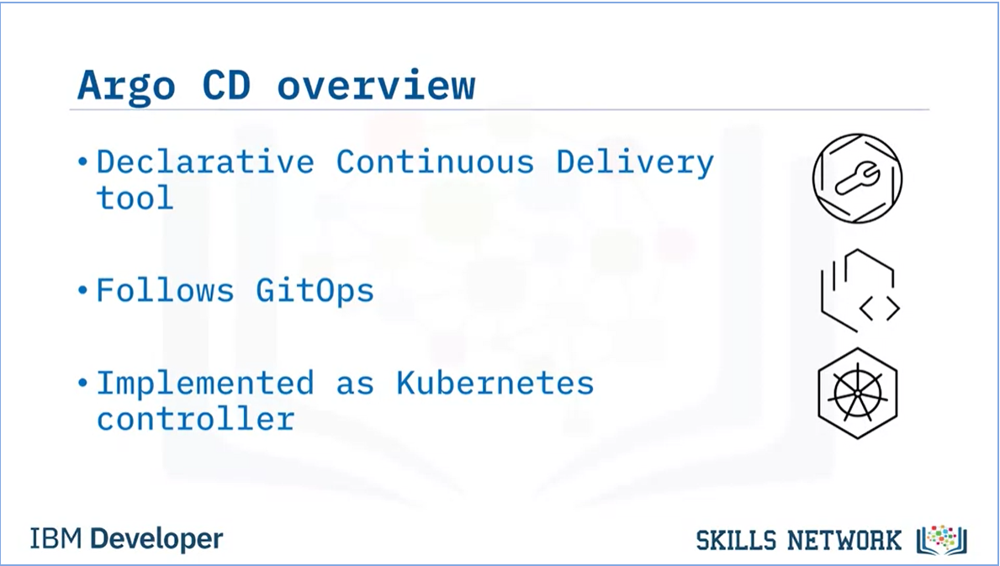
</p>
<!-- {width="4.0in" height="2.2641021434820647in"} -->

A relatively new tool that is gaining in popularity is Argo CD.

-   Argo CD is a declarative Continuous Delivery tool that makes CD easy
    to automate, audit, and understand.

-   It follows the GitOps pattern of using Git repositories as the
    single source of truth for defining the desired application state.

-   Argo CD, as a Kubernetes controller, monitors the current
    application state compared to the desired state, visualizes the
    differences, and ensures parity by automatically syncing.

<!--~~~~~~~~~~~~~~~~~~~~~~~~~~~~~~~~~~~~~~~~~~~~~~~~~~~~~~~~~~~~~~~~~~~~~~~~~~~~~~~~~~~~~~~~~~~~-->
<p align="center">
  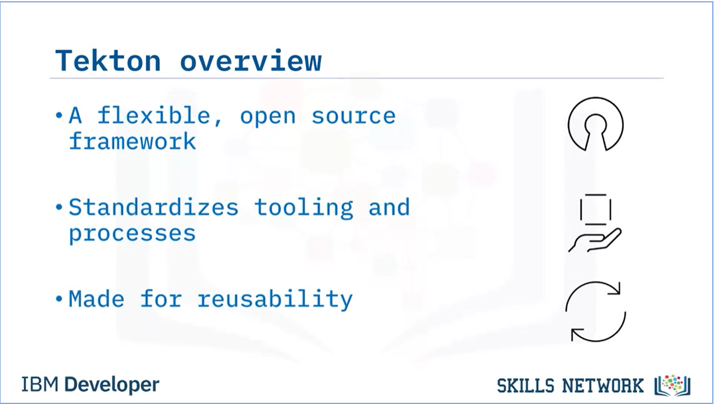
</p>
<!-- {width="4.0in" height="2.2641021434820647in"} -->

Since we'll be using Tekton in this course, let's take a brief look at
it.

-   Tekton is a flexible, open-source framework that abstracts the
    implementation details so you can focus on building, testing, and
    deploying according to your projects' requirements.

-   By standardizing the CI/CD tooling and process, Tekton works well
    with other CI/CD tools such as Jenkins, Skaffold, and Knative.

-   Tekton pipelines are fully portable, so once they are created or
    defined, a developer in the organization can take a pipeline and
    reuse its components.

<!--~~~~~~~~~~~~~~~~~~~~~~~~~~~~~~~~~~~~~~~~~~~~~~~~~~~~~~~~~~~~~~~~~~~~~~~~~~~~~~~~~~~~~~~~~~~~-->
<p align="center">
  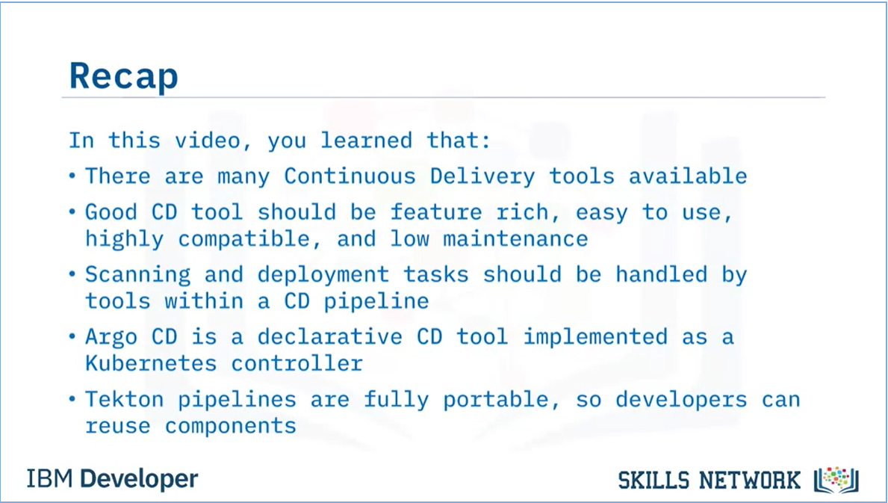
</p>
<!-- {width="4.0in" height="2.2641021434820647in"} -->

In this module, you learned that;

-   There are many Continuous Delivery tools available to choose from,

-   A good CD tool should be feature-rich, easy to use, highly
    compatible, and require low maintenance,

-   Scanning and deployment tasks should be handled by tools within the
    CD pipeline,

-   Argo CD is a declarative Continuous Delivery tool implemented as a
    Kubernetes controller, and

-   Tekton pipelines are fully portable, so developers can reuse their
    components.

<h3>Reading: Understanding Continuous Delivery</h3>

Congratulations! You have completed this lesson. At this point in the
course, you know: 

-   Continuous Delivery (CD) is a software development practice that
    automatically delivers code changes to a production-like environment
    to ensure that the updated software is ready for release. 

-   CD has many benefits including reduced deployment time, reduced
    costs, and scaling based on project size. 

-   CD has five key principles: 

    1.  You need to build in quality,

    2.  You should work in small batches,

    3.  People should solve problems, not perform repetitive tasks,

    4.  You should relentlessly pursue continuous improvement, and

    5.  Everyone is responsible for their part in the story. 

-   Best practices for CD include, but are not limited to, making every
    change releasable, automating as many processes as possible, and
    ensuring no application downtime. 

-   A CI/CD pipeline requires a code repository, build server,
    integration server, and storage repository. 

-   Continuous Deployment is a practice that automatically deploys code
    from the preproduction environment to production. 

-   Your CD tool should be feature-rich, easy to use, highly compatible,
    and low maintenance. 

-   Tools within your CD pipeline should handle scanning and deployment
    tasks

<h2 id="3-06">Module 3-06. Introduction Tekton and Pipelines (6:25)</h2>

Welcome to Introduction to Tekton and Pipelines.

<!--~~~~~~~~~~~~~~~~~~~~~~~~~~~~~~~~~~~~~~~~~~~~~~~~~~~~~~~~~~~~~~~~~~~~~~~~~~~~~~~~~~~~~~~~~~~~-->
<p align="center">
  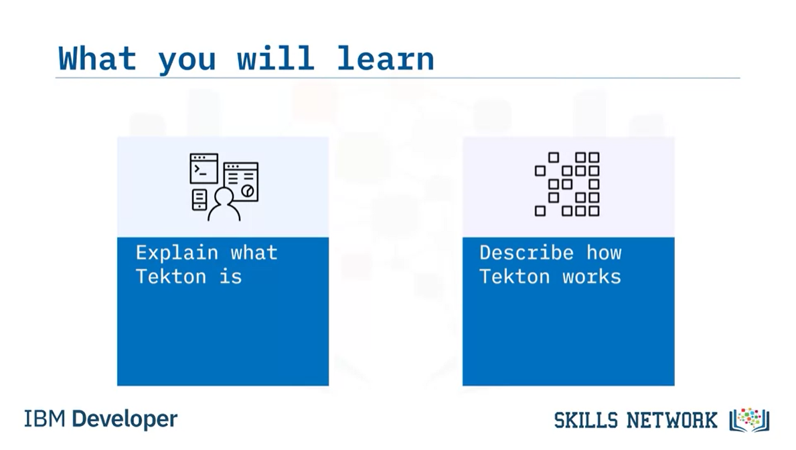
</p>
<!-- {width="4.0in" height="2.2641021434820647in"} -->

After this module, you will be able to;

-   Explain what Tekton is, and

-   Describe how Tekton works.

<!--~~~~~~~~~~~~~~~~~~~~~~~~~~~~~~~~~~~~~~~~~~~~~~~~~~~~~~~~~~~~~~~~~~~~~~~~~~~~~~~~~~~~~~~~~~~~-->
<p align="center">
  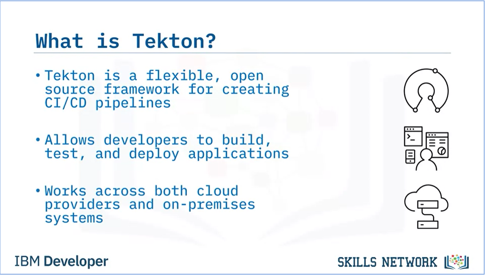
</p>
<!-- {width="4.0in" height="2.2641021434820647in"} -->

Let\'s start by describing what Tekton is.

-   Tekton is a flexible, open-source framework for creating CI/CD
    pipelines. It provides you with a basic set of building blocks that
    you can use to create CI/CD pipelines, from very simple to very
    elaborate.

-   Tekton allows developers to build, test, and deploy applications
    automatically. It has the ability to run steps in series or in
    parallel so you are in complete control of the execution sequence.

-   Best of all, it works across both cloud providers and on-premises
    systems. So, you can use Tekton in your local data center as well as
    on the cloud. Anywhere you can run a Kubernetes cluster, you can run
    Tekton.

<!--~~~~~~~~~~~~~~~~~~~~~~~~~~~~~~~~~~~~~~~~~~~~~~~~~~~~~~~~~~~~~~~~~~~~~~~~~~~~~~~~~~~~~~~~~~~~-->
<p align="center">
  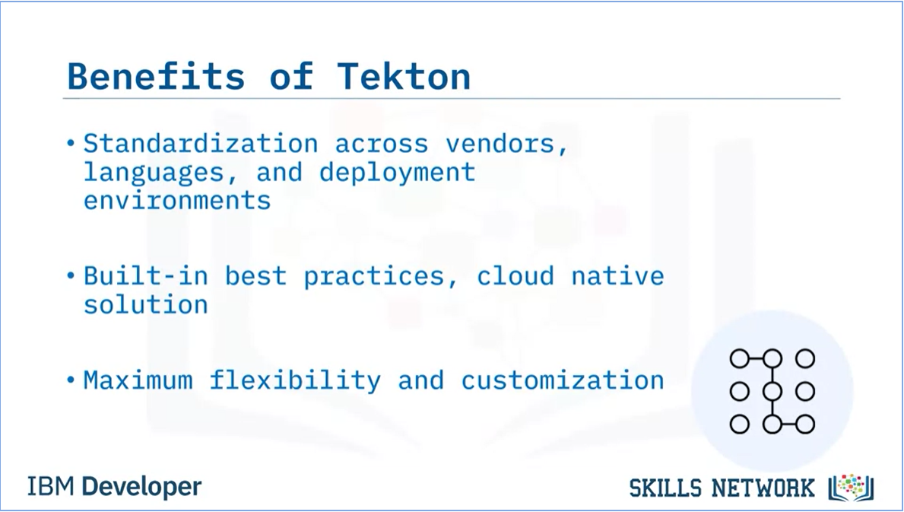
</p>
<!-- {width="4.0in" height="2.2641021434820647in"} -->

Some of the benefits of using Tekton include the following:

-   It offers standardization. Because Tekton is an open-source project
    and its vendor neutral, Tekton allows you to standardize your CI/CD
    tooling and processes across vendors, languages, and deployment
    environments. Many popular CI/CD tools like Jenkins X, Skaffold, and
    Knative use Tekton as their base.

-   Tekton also offers built-in best practices because it is logically
    laid out. You can quickly create CI/CD systems that are scalable,
    serverless, and best of all, cloud native right out of the box. That
    means that Tekton runs natively on your Kubernetes cluster,
    eliminating the need for a separate CI/CD solution.

-   Tekton also maximizes flexibility in how you design and customize
    your CI/CD pipelines. It satisfies your teams' needs by abstracting
    the underlying implementation so that you can choose how to build,
    test, and deploy applications based on your teams' requirements.

<!--~~~~~~~~~~~~~~~~~~~~~~~~~~~~~~~~~~~~~~~~~~~~~~~~~~~~~~~~~~~~~~~~~~~~~~~~~~~~~~~~~~~~~~~~~~~~-->
<p align="center">
  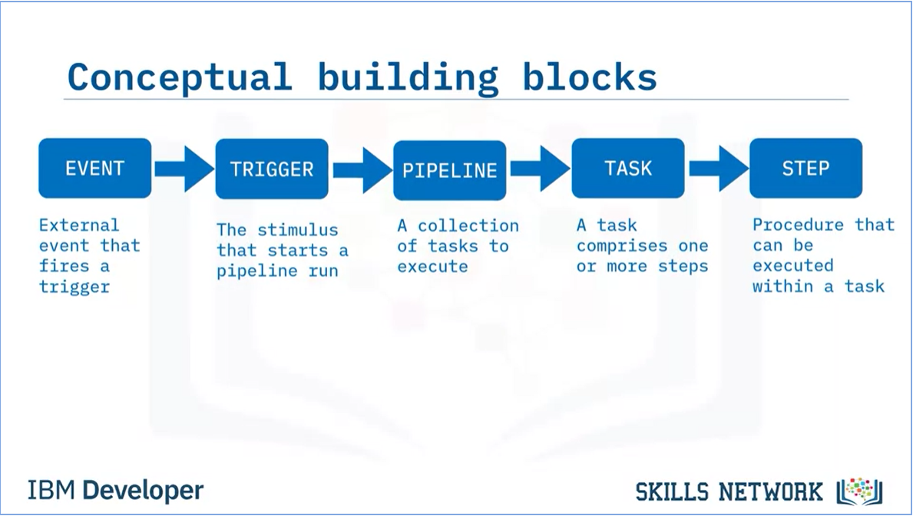
</p>
<!-- {width="4.0in" height="2.2641021434820647in"} -->

To understand how Tekton works, let's take a look at a few conceptual
building blocks that exemplify the workflow:

-   There is the concept of an **event**. This is an external event that
    causes a trigger to fire. This might be a pull request or a push to
    a Git repository.

-   A **trigger** is fired by an event and is the stimulus that starts a
    pipeline run, which executes a pipeline.

-   Triggers point to **pipelines**, which are collections of tasks to
    execute. There\'s no limit to the number of tasks you could have in
    a pipeline, and these tasks can execute serially or in parallel.

-   A **task** is a unit of work that comprises one or more steps. It
    can also define parameters required to carry out the steps and
    workspaces needed to store artifacts.

-   Finally, you have the **steps**, which are the actual commands that
    are executed to carry out the tasks. These can be anything you like,
    but most often, they are shell scripts that execute commands to
    build, test, and deploy applications.

<!--~~~~~~~~~~~~~~~~~~~~~~~~~~~~~~~~~~~~~~~~~~~~~~~~~~~~~~~~~~~~~~~~~~~~~~~~~~~~~~~~~~~~~~~~~~~~-->
<p align="center">
  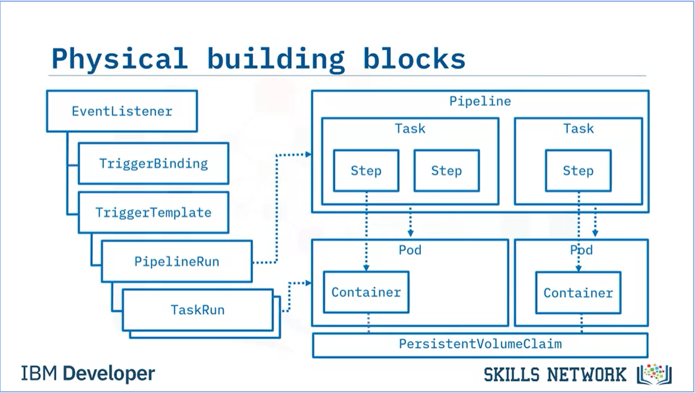
</p>
<!-- {width="4.0in" height="2.2641021434820647in"} -->

Now that you've seen how Tekton works conceptually, a closer look
reveals that Tekton is a set of Kubernetes custom resource definitions,
or CRDs.

Let\'s explain each one in order of execution:

To handle events, you have a CRD called EventListener that listens for
events like pull requests or commits on a Git repository.

Events are associated with two other CRDs, the first of which is the
TriggerBinding.

The TriggerBinding captures parameters from the event that are required
to run the pipeline.

The second CRD that events are associated with is the TriggerTemplate,
which takes the parameters from the TriggerBinding and associates them
with the PipelineRun.

When triggered by an event, the TriggerTemplate creates a PipelineRun,
passing along any parameters from the triggered event, or persistent
storage, that the pipeline might need.

It\'s important to note that you could also manually create PipelineRuns
and not use events, but CI/CD pipelines are usually driven by events.

The PipelineRun is what instantiates a pipeline.

A pipeline is a collection of tasks.

These tasks can run in parallel, at the same time, which is the default,
or they can run serially, one after the other, if you specify
dependencies between them.

And each task comprises a series of steps.

The steps run in the sequence specified in the task.

When a pipeline executes, the PipelineRun CRD is responsible for
managing the tasks.

It does this by creating a TaskRun for each task, which, in turn,
creates a Kubernetes pod for the task to run in.

All the steps for a task run in the same pod.

As the steps are executed, a container is created in the pod, one for
each step to run in.

If the tasks are running in parallel, the containers for each task will
be created at once, as in this example.

Usually, a PersistentVolumeClaim is created, and the storage is attached
to all the pods so that they can share artifacts throughout the
pipeline.

This allows you to check out code in one task, run unit tests on it in
another task, and create a container image from it in yet another task.

Most pipelines require some form of persistent storage.

<!--~~~~~~~~~~~~~~~~~~~~~~~~~~~~~~~~~~~~~~~~~~~~~~~~~~~~~~~~~~~~~~~~~~~~~~~~~~~~~~~~~~~~~~~~~~~~-->
<p align="center">
  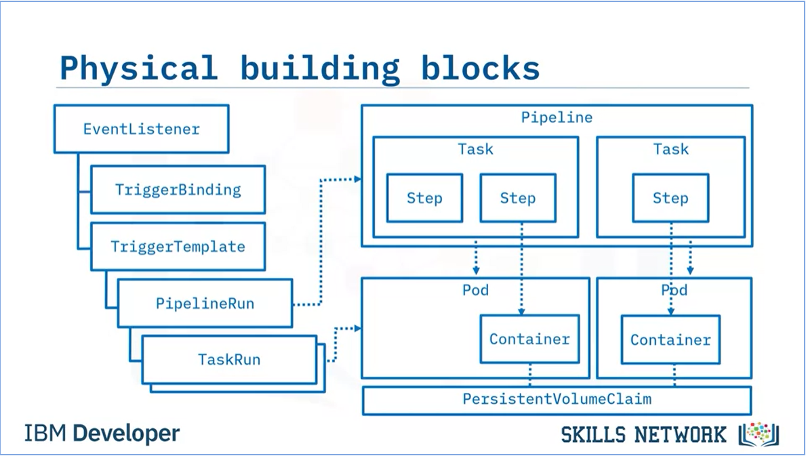
</p>
<!-- {width="4.0in" height="2.2641021434820647in"} -->

Since steps are always run in series, the containers will be created one
at a time, each one starting when the previous one ends. Everything
about Tekton is Kubernetes native. Everything is running in your
Kubernetes cluster with no external CI/CD servers required. This is one
of the things that makes Tekton the perfect technology for CI/CD with
Kubernetes.

<!--~~~~~~~~~~~~~~~~~~~~~~~~~~~~~~~~~~~~~~~~~~~~~~~~~~~~~~~~~~~~~~~~~~~~~~~~~~~~~~~~~~~~~~~~~~~~-->
<p align="center">
  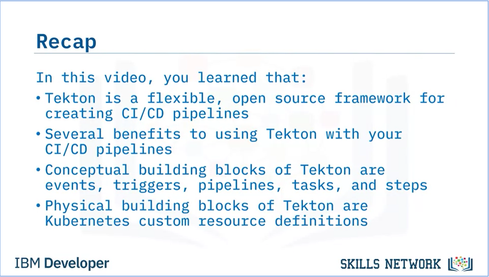
</p>
<!-- {width="4.0in" height="2.2641021434820647in"} -->

In this module, you learned that;

-   Tekton is a flexible, open-source framework for creating CI/CD
    pipelines,

-   There are several benefits to using Tekton within your CI/CD
    pipeline,

-   The conceptual building blocks of Tekton are events, triggers,
    pipelines, tasks, and steps, and

-   The physical building blocks of Tekton are a set of Kubernetes
    custom resource definitions or CRDs.

<h2 id="3-07">Module 3-07. Building a Tekton Pipeline (8:39)</h2>

Welcome to 'Building a Tekton Pipeline.'

<!--~~~~~~~~~~~~~~~~~~~~~~~~~~~~~~~~~~~~~~~~~~~~~~~~~~~~~~~~~~~~~~~~~~~~~~~~~~~~~~~~~~~~~~~~~~~~-->
<p align="center">
  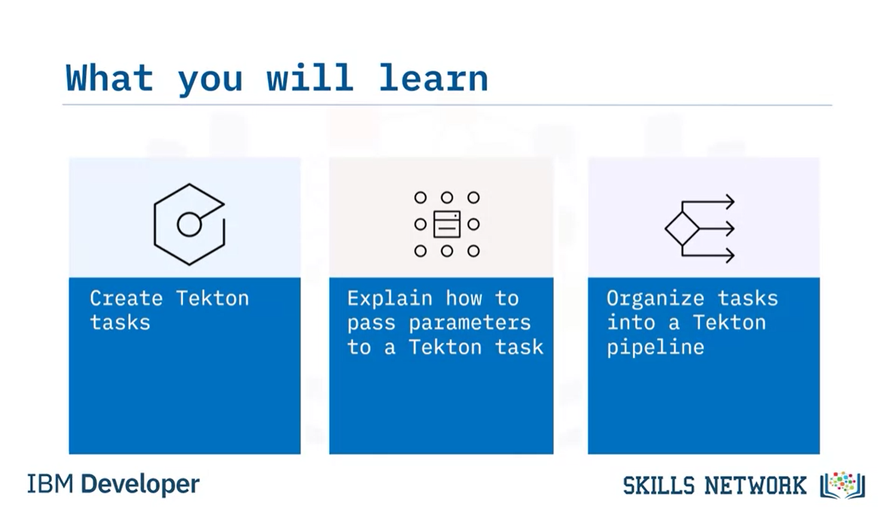
</p>
<!-- {width="4.0in" height="2.2641021434820647in"} -->

After this module, you will be able to;

-   Create Tekton tasks,

-   Explain how to pass parameters to a Tekton task, and

-   Organize tasks into a Tekton pipeline.

<!--~~~~~~~~~~~~~~~~~~~~~~~~~~~~~~~~~~~~~~~~~~~~~~~~~~~~~~~~~~~~~~~~~~~~~~~~~~~~~~~~~~~~~~~~~~~~-->
<p align="center">
  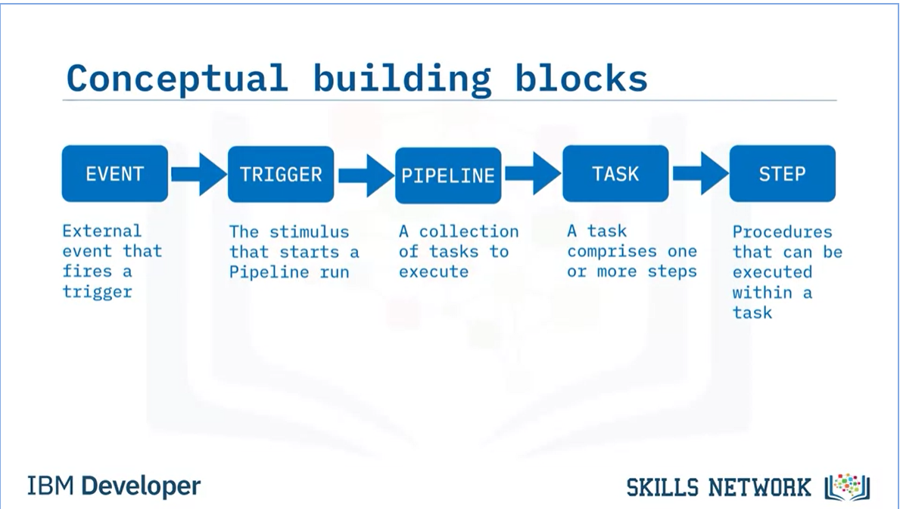
</p>
<!-- {width="4.0in" height="2.2641021434820647in"} -->

Referring to the conceptual building blocks of events, triggers,
pipelines, tasks, and steps,

<!--~~~~~~~~~~~~~~~~~~~~~~~~~~~~~~~~~~~~~~~~~~~~~~~~~~~~~~~~~~~~~~~~~~~~~~~~~~~~~~~~~~~~~~~~~~~~-->
<p align="center">
  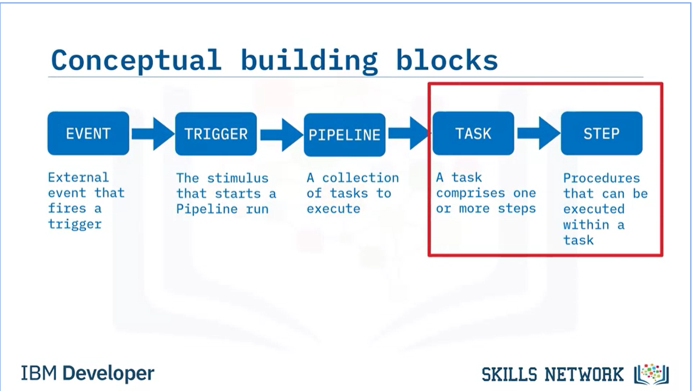
</p>
<!-- {width="4.0in" height="2.2641021434820647in"} -->

you\'re now going to work from right to left and define your steps and
tasks.

<!--~~~~~~~~~~~~~~~~~~~~~~~~~~~~~~~~~~~~~~~~~~~~~~~~~~~~~~~~~~~~~~~~~~~~~~~~~~~~~~~~~~~~~~~~~~~~-->
<p align="center">
  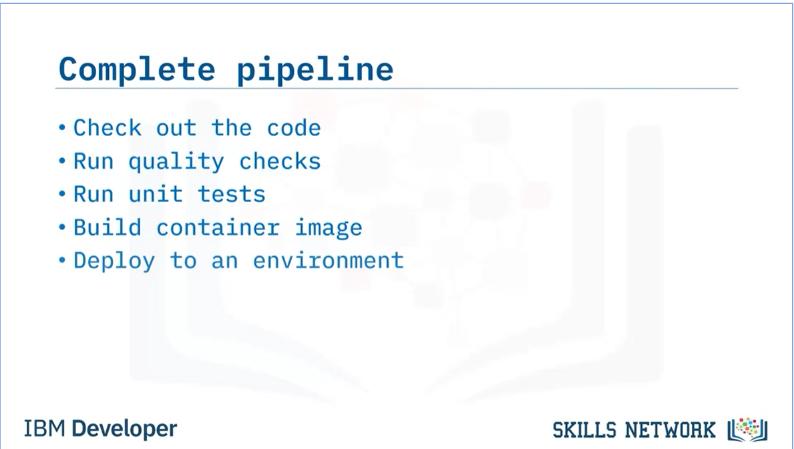
</p>
<!-- {width="4.0in" height="2.2641021434820647in"} -->

Think about what you need in your Continuous Delivery pipeline.

-   You first have to start with the code. So, you need something that
    will **check out the code** from a version control system.

-   Then, you probably want to **run quality checks**. These are checks
    like linters and other tools that check for various quality issues.

-   You definitely want to **run the unit tests** to make sure that all
    the code is working as expected. And once all the unit tests have
    passed,

-   You\'re now ready to **build** your artifact. In this case, it\'s a
    **container image**.

-   Finally, you want to **deploy into some environment**---development,
    test, or staging.

<!--~~~~~~~~~~~~~~~~~~~~~~~~~~~~~~~~~~~~~~~~~~~~~~~~~~~~~~~~~~~~~~~~~~~~~~~~~~~~~~~~~~~~~~~~~~~~-->
<p align="center">
  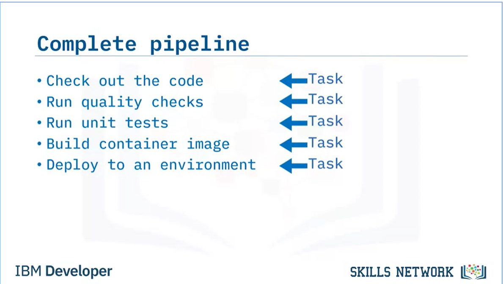
</p>
<!-- {width="4.0in" height="2.2641021434820647in"} -->

All of these become tasks in Tekton that run one after the other.

<!--~~~~~~~~~~~~~~~~~~~~~~~~~~~~~~~~~~~~~~~~~~~~~~~~~~~~~~~~~~~~~~~~~~~~~~~~~~~~~~~~~~~~~~~~~~~~-->
<p align="center">
  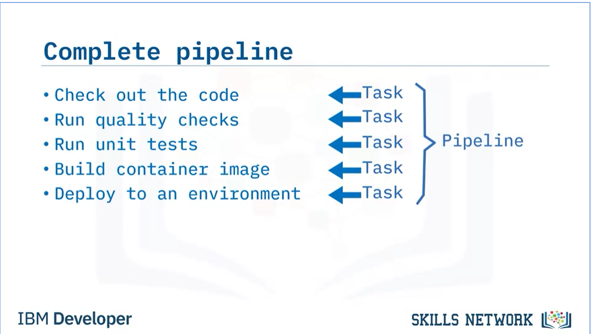
</p>
<!-- {width="4.0in" height="2.2641021434820647in"} -->

When you put them all together, it's called a **pipeline**.

<!--~~~~~~~~~~~~~~~~~~~~~~~~~~~~~~~~~~~~~~~~~~~~~~~~~~~~~~~~~~~~~~~~~~~~~~~~~~~~~~~~~~~~~~~~~~~~-->
<p align="center">
  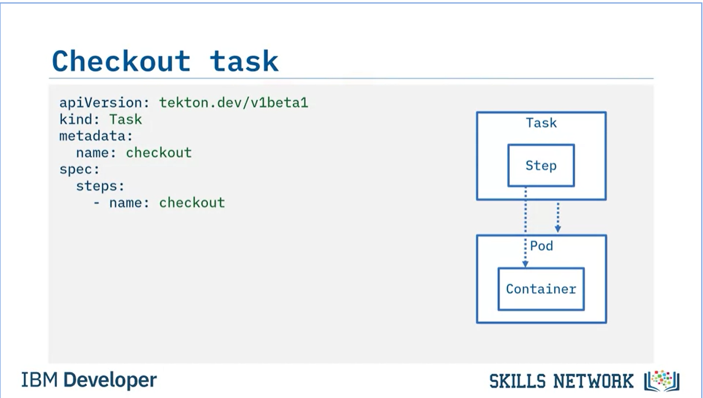
</p>
<!-- {width="4.0in" height="2.2641021434820647in"} -->

Let\'s see how you can start building this pipeline.

You start by writing the checkout task. All of these definitions are
described in YAML files called Kubernetes manifests.

Every manifest must define an API version to use. In this example, the
API version is 'tekton.dev/v1beta1'.

Tekton defines new custom resource definitions in Kubernetes. You must
tell Kubernetes what kind of resource to use, which in this example, is
a 'task'.

Next, you need to give the task a name in the metadata section by
creating a name parameter with a name value, which, in this example, is
called 'checkout'.

Now, the specification section of your manifest starts.

A task is a collection of steps, so you add the 'steps' keyword, and
then you define a step and give it a name.

In this example, it's called 'checkout' as well. Remember that a step is
contained within a task, and that task runs on a pod.

Every step executes in a new container in that pod.

<!--~~~~~~~~~~~~~~~~~~~~~~~~~~~~~~~~~~~~~~~~~~~~~~~~~~~~~~~~~~~~~~~~~~~~~~~~~~~~~~~~~~~~~~~~~~~~-->
<p align="center">
  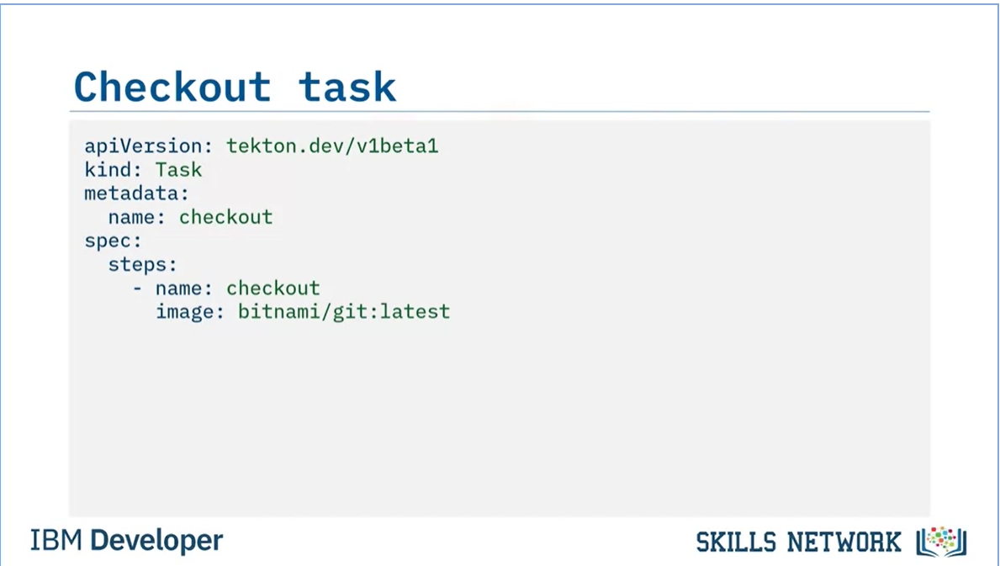
</p>
<!-- {width="4.0in" height="2.2641021434820647in"} -->

So, the next thing you need to define is what image to use to create
that container. You use the 'image' keyword followed by
'bitnami/git:latest'. You could\'ve used any image that had a Git client
installed. Bitnami maintains a number of images that are great for
creating CI/CD pipelines, and this Git image will do just fine.

<!--~~~~~~~~~~~~~~~~~~~~~~~~~~~~~~~~~~~~~~~~~~~~~~~~~~~~~~~~~~~~~~~~~~~~~~~~~~~~~~~~~~~~~~~~~~~~-->
<p align="center">
  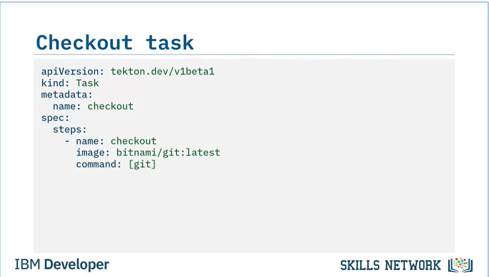
</p>
<!-- {width="4.0in" height="2.2641021434820647in"} -->

Next, you need to define the command to run inside of that container,
and you\'re going to use the 'git' command to clone the repository.

<!--~~~~~~~~~~~~~~~~~~~~~~~~~~~~~~~~~~~~~~~~~~~~~~~~~~~~~~~~~~~~~~~~~~~~~~~~~~~~~~~~~~~~~~~~~~~~-->
<p align="center">
  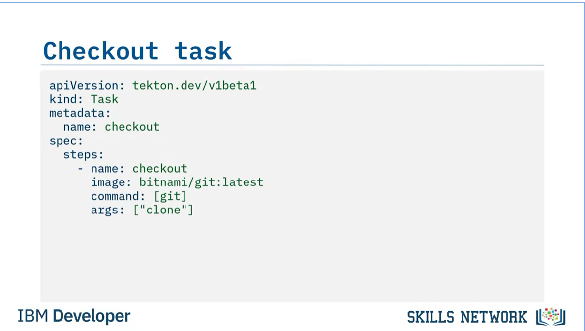
</p>
<!-- {width="4.0in" height="2.2641021434820647in"} -->

Finally, you need to tell the git command what to do, so you pass in
'clone' as the first argument, but there\'s a problem.

You need two arguments.

You need the URL of the repository to clone as well.

It looks like you\'re going to need to pass in a second argument that
you currently don\'t have.

<!--~~~~~~~~~~~~~~~~~~~~~~~~~~~~~~~~~~~~~~~~~~~~~~~~~~~~~~~~~~~~~~~~~~~~~~~~~~~~~~~~~~~~~~~~~~~~-->
<p align="center">
  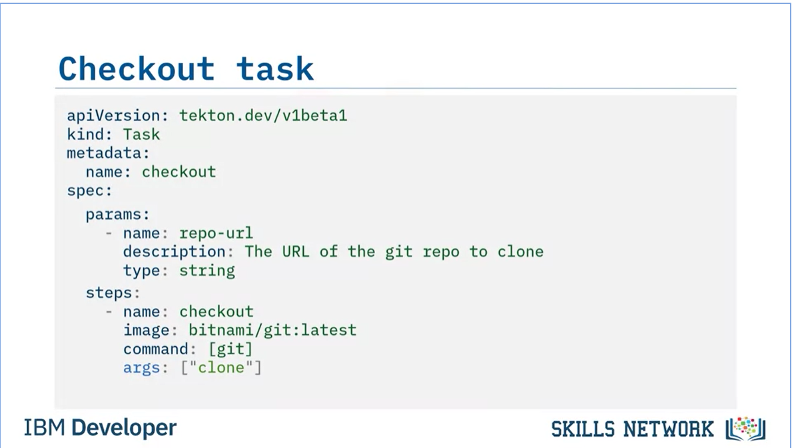
</p>
<!-- {width="4.0in" height="2.2641021434820647in"} -->

So, let\'s go define one.

First, you move the 'steps' down to make room to define a parameter.

Parameters are defined with the 'params' keyword.

You give the parameter the name 'repo-url'.

You can also give it a description so that people know what the
parameter is for and the type so that they know to pass it in a string.

Now you can go back to the arguments and pass in the message.

<!--~~~~~~~~~~~~~~~~~~~~~~~~~~~~~~~~~~~~~~~~~~~~~~~~~~~~~~~~~~~~~~~~~~~~~~~~~~~~~~~~~~~~~~~~~~~~-->
<p align="center">
  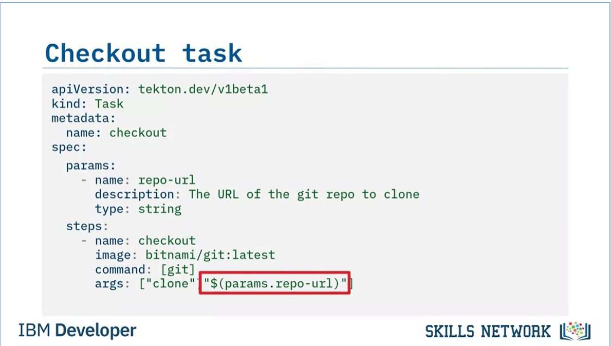
</p>
<!-- {width="4.0in" height="2.2641021434820647in"} -->

But how do you know how to reference it?

The subsection in the spec section is 'params', and the name of the
parameter is 'repo-url'.

So, you change the argument to reference '\$(params.repo-url)' to match
the parameter name that you want.

As you might've guessed, you could have any number of parameters, and
you can reference them by using params dot whatever the parameter's name
is.

That completes your task definition.

<!--~~~~~~~~~~~~~~~~~~~~~~~~~~~~~~~~~~~~~~~~~~~~~~~~~~~~~~~~~~~~~~~~~~~~~~~~~~~~~~~~~~~~~~~~~~~~-->
<p align="center">
  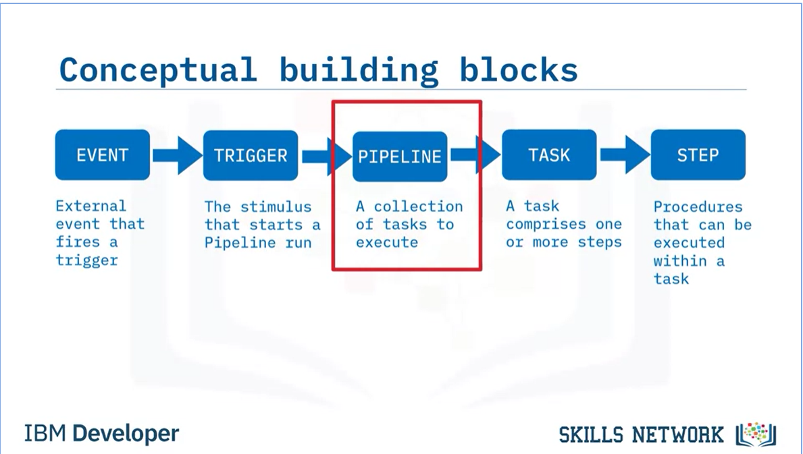
</p>
<!-- {width="4.0in" height="2.2641021434820647in"} -->

Now that you've created your first task, let's turn our attention to
defining a pipeline.

Just like the task definition, a pipeline definition is a Kubernetes
manifest.

<!--~~~~~~~~~~~~~~~~~~~~~~~~~~~~~~~~~~~~~~~~~~~~~~~~~~~~~~~~~~~~~~~~~~~~~~~~~~~~~~~~~~~~~~~~~~~~-->
<p align="center">
  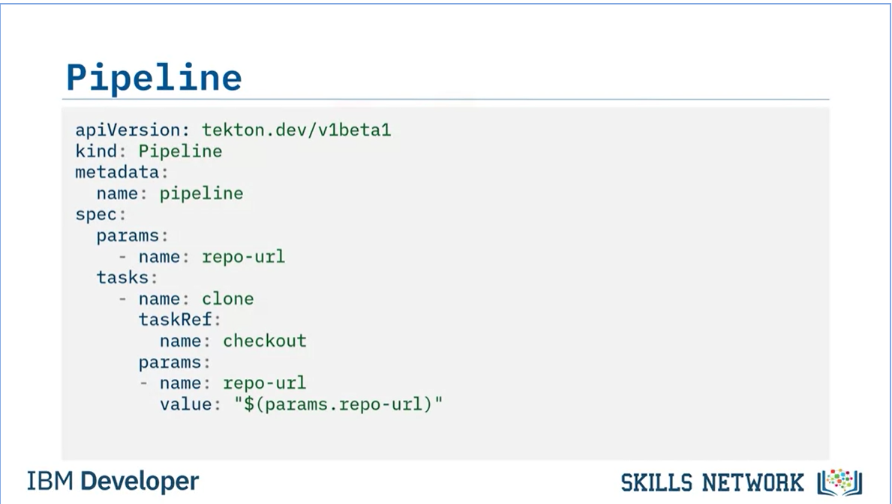
</p>
<!-- {width="4.0in" height="2.2641021434820647in"} -->

So, you start by specifying the API version.

Next, you tell it what kind of resource this is, and it's a pipeline
resource.

You want to give it a name, and again, that's done in the metadata
section.

You name it 'pipeline'.

Now, you can start with your specifications.

Since you already know that the task you're going to use has a parameter
called repo-url, you define that parameter now by declaring a parameter
named 'repo-url'.

Now you can start adding tasks to the pipeline.

You only add one task for now, but the dash indicates that this is a
list and there could be multiple tasks.

You name your first task 'clone'.

Then, you need to reference the task that you've already written so you
add the 'taskRef' keyword, and then reference the name of the task
called 'checkout'.

You know that the checkout task requires a parameter, so you declare
that here.

The name of the parameter you want to address is 'repo-url', and the
value of that repo-url is going to come from 'params.repo-url'.

This means that whatever repo-url you pass into the pipeline will be
passed on to any task that requires it.

<!--~~~~~~~~~~~~~~~~~~~~~~~~~~~~~~~~~~~~~~~~~~~~~~~~~~~~~~~~~~~~~~~~~~~~~~~~~~~~~~~~~~~~~~~~~~~~-->
<p align="center">
  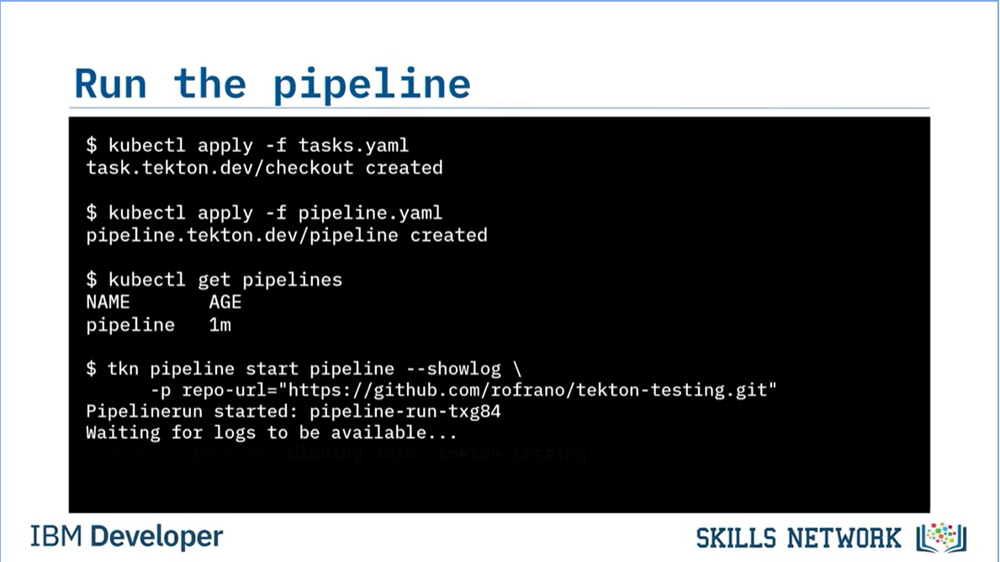
</p>
<!-- {width="4.0in" height="2.25042760279965in"} -->

Now that you've defined at least one task and one pipeline, you're ready
to run the pipeline.

First, you use the kube control command (kubectl) and apply your task
that is defined in the 'tasks.yaml' file.

Kubernetes replies, telling you that the checkout task has been created.

Next, you use the 'kube control apply' command again but pointing to the
'pipeline.yaml' file that contains your pipeline.

And again, you see that the pipeline has been created.

It's important to understand that you haven't actually created a task or
pipeline at this point.

What you've created is a task definition and a pipeline definition.

The actual task and pipeline are created by other resources called
'TaskRun' and 'PipelineRun', respectively.

Since Tekton resources are Kubernetes resources, you can check that the
pipeline definition was created using the command 'kubectl get
pipelines'.

This will show you how long ago that pipeline definition was created, in
this case, one minute ago.

Finally, you're ready to run your pipeline.

You do this using the Tekton command line interface, or CLI.

The command is 'tkn pipeline start' followed by the pipeline name that
you simply called 'pipeline'.

You add the '---showlog' parameter so that it will wait for the logs and
display them on the console.

You pass in any parameters you know the pipeline needs using the '-p'
flag.

In this case, the pipeline needs a 'repo-url' parameter, so you pass in
a URL from one of your GitHub repositories.

The Tekton CLI is creating the 'PipelineRun' and 'TaskRun' resources
behind the scenes.

These are the resources that create the actual running pipeline and
tasks.

You could have done this manually and accomplished the same result, but
the Tekton CLI automates all of this for you, so why not use it?

<!--~~~~~~~~~~~~~~~~~~~~~~~~~~~~~~~~~~~~~~~~~~~~~~~~~~~~~~~~~~~~~~~~~~~~~~~~~~~~~~~~~~~~~~~~~~~~-->
<p align="center">
  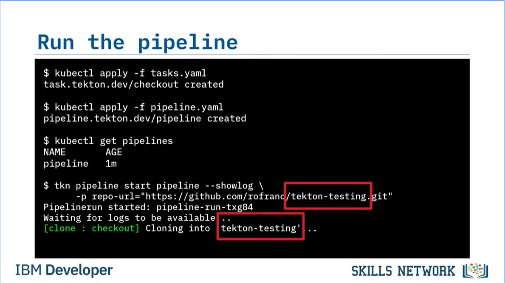
</p>
<!-- {width="4.0in" height="2.25042760279965in"} -->

Then, you wait for the logs to come back, and eventually, you see that
the checkout step of the clone task has returned the git message that it
was cloning, and the repo name in the message matches the repo name you
gave it in the URL.

You have a successful pipeline run.

You can continue to build this pipeline by creating more tasks and
adding them to the pipeline definition.

<!--~~~~~~~~~~~~~~~~~~~~~~~~~~~~~~~~~~~~~~~~~~~~~~~~~~~~~~~~~~~~~~~~~~~~~~~~~~~~~~~~~~~~~~~~~~~~-->
<p align="center">
  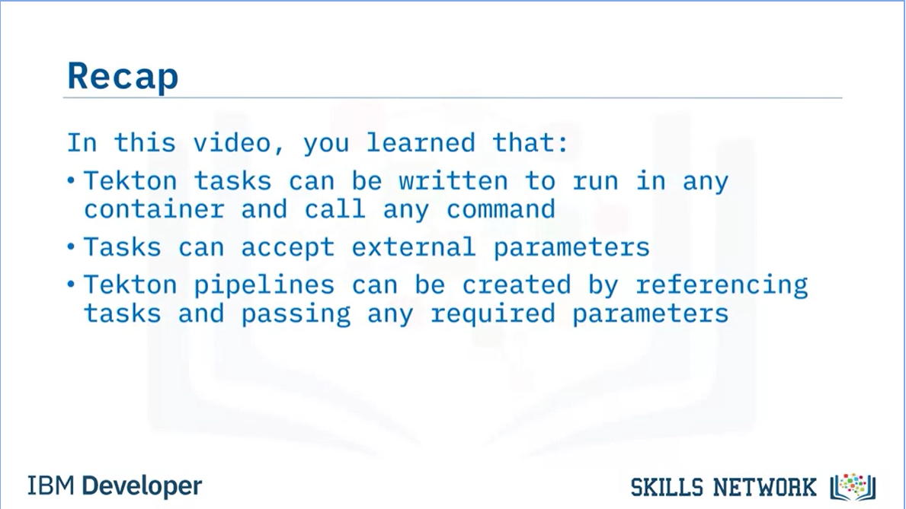
</p>
<!-- {width="4.0in" height="2.25042760279965in"} -->

In this module, you learned that Tekton tasks can be written to run in
any container and call any command, tasks can accept external
parameters, and Tekton pipelines can be created by referencing tasks and
passing any required parameters to them.

<h3>Hands-on Lab: Building a Tekton Pipeline</h3>

Welcome to the hands-on lab for **Building a Tekton Pipeline**. In this
lab, you will create a simple Tekton pipeline with one task in Step 1
and then add a parameter to it in Step 4. You will learn best practices
for structuring a Tekton pipeline project and how to author Tekton
pipelines and tasks so that they are easy to use and parameterize. You
will see that Tekton allows you to reuse your pipeline-as-code
artifacts, and you will look at practical approaches to publishing your
pipeline and task definitions to a Git repository.  

Skills Network Labs (SN Labs) is a virtual lab environment used in this
course.  Upon clicking the \"Open Tool\" button below, your Username and
Email will be passed to SN Labs and will be used in strict accordance
with IBM Skills Network Privacy policy, such as for communicating
important information to enhance your learning experience. 

In case you need to download the lab instructions
click[ HERE ](https://cf-courses-data.s3.us.cloud-object-storage.appdomain.cloud/IBM-CD0215EN-SkillsNetwork/labs/module3/01_base_pipeline.md.html) to
open a new tab.

<h3>Building a Tekton Pipeline (External resource)</h3>

Clicking on the Open Tool button below will launch the cloud-based SN
labs virtual labs environment with instructions to complete this lab.
Your username and email will be shared with SN Labs to authenticate and
provision your lab environment.

<h4>Open Tool</h4>

<h2 id="3-08">Module 3-08. Creating Tekton Triggers (9:11)</h2>

Welcome to 'Creating Tekton Triggers.'

<!--~~~~~~~~~~~~~~~~~~~~~~~~~~~~~~~~~~~~~~~~~~~~~~~~~~~~~~~~~~~~~~~~~~~~~~~~~~~~~~~~~~~~~~~~~~~~-->
<p align="center">
  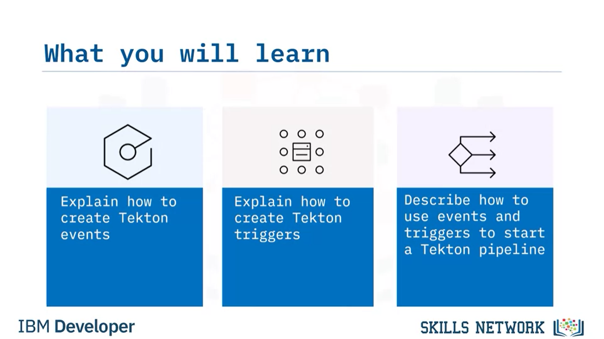
</p>

After this module, you will be able to explain how to create Tekton
events, explain how to create Tekton triggers, and describe how to use
events and triggers to start a Tekton pipeline.

<!--~~~~~~~~~~~~~~~~~~~~~~~~~~~~~~~~~~~~~~~~~~~~~~~~~~~~~~~~~~~~~~~~~~~~~~~~~~~~~~~~~~~~~~~~~~~~-->
<p align="center">
  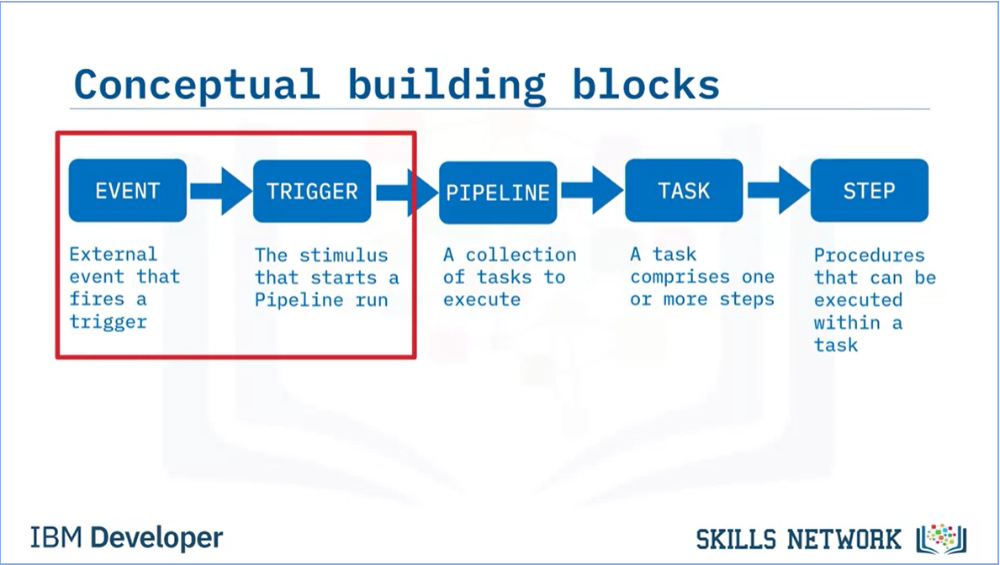
</p>

If you refer back to the conceptual building blocks of events, triggers,
pipelines, tasks, and steps, let's look closer at events and triggers.

<!--~~~~~~~~~~~~~~~~~~~~~~~~~~~~~~~~~~~~~~~~~~~~~~~~~~~~~~~~~~~~~~~~~~~~~~~~~~~~~~~~~~~~~~~~~~~~-->
<p align="center">
  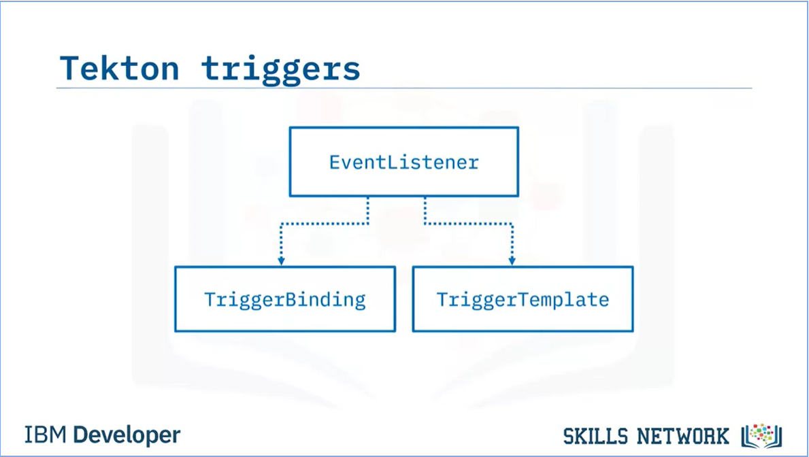
</p>

Tekton triggers allow your pipeline to respond to external events.

They do this with a custom resource definition (or CRD) known as an
EventListener that points to two other CRDs.

The TriggerBinding CRD, which takes data from the event and binds it to
the properties in your pipeline.

And the TriggerTemplate CRD, which takes data from the binding and
instantiates a PipelineRun, passing in that data.

<!--~~~~~~~~~~~~~~~~~~~~~~~~~~~~~~~~~~~~~~~~~~~~~~~~~~~~~~~~~~~~~~~~~~~~~~~~~~~~~~~~~~~~~~~~~~~~-->
<p align="center">
  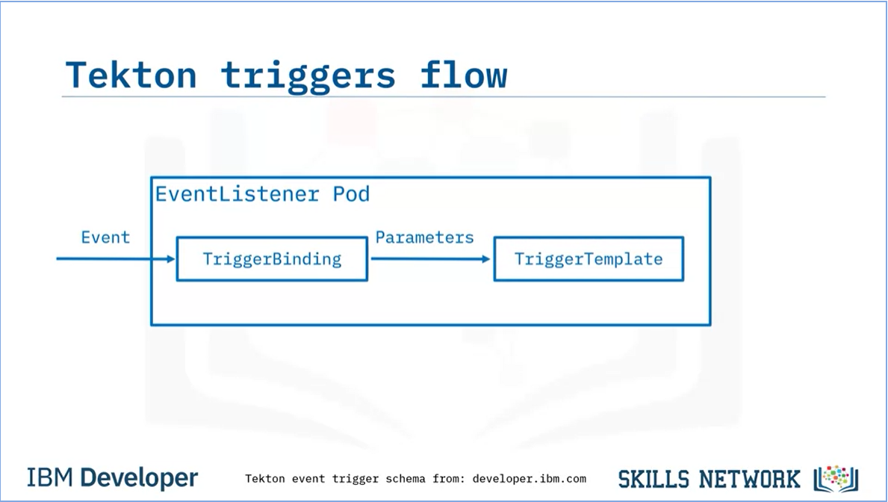
</p>

Let\'s take a look at how these triggers flow.

When you create an EventListener, it creates a pod running in Kubernetes
that listens for events.

When some external event happens, it\'s sent to the EventListener pod,
which causes the TriggerBinding to be instantiated and pull information
from the event and bind it to the parameters that the pipeline needs.

The parameters from the TriggerBinding are then forwarded to the
TriggerTemplate.

<!--~~~~~~~~~~~~~~~~~~~~~~~~~~~~~~~~~~~~~~~~~~~~~~~~~~~~~~~~~~~~~~~~~~~~~~~~~~~~~~~~~~~~~~~~~~~~-->
<p align="center">
  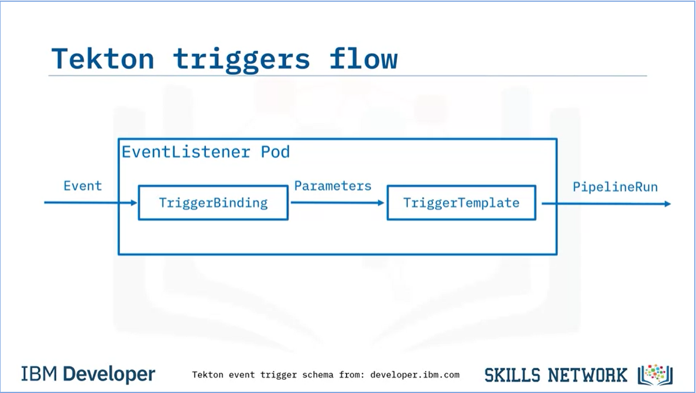
</p>

The TriggerTemplate is defined as a PipelineRun which, as its name
implies, runs your pipeline.

This new PipelineRun resource starts, and your pipeline begins to run.

<!--~~~~~~~~~~~~~~~~~~~~~~~~~~~~~~~~~~~~~~~~~~~~~~~~~~~~~~~~~~~~~~~~~~~~~~~~~~~~~~~~~~~~~~~~~~~~-->
<p align="center">
  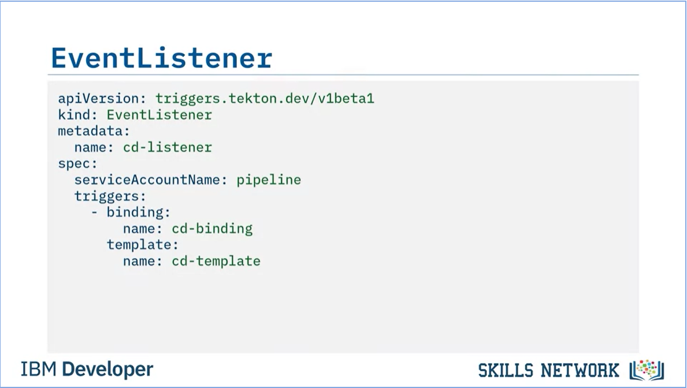
</p>

Let\'s build a simple event listener for a CD pipeline.

You start by specifying the API version, which is
triggers.tekton.dev/v1beta1.

Then, you specify the kind of resource, which is an EventListener.

Using the metadata, you give it the name \"cd-listener\".

Now you can add the specifications.

You specify the serviceAccountName of the ServiceAccount that the
pipeline should run under.

In OpenShift, there is a preconfigured ServiceAccount named \"pipeline\"
that is configured with the access control needed to run a pipeline, so
you use that.

Now, you can specify the triggers for this EventListener.

You specify a binding with the name \"cd-binding\", and a template with
the name \"cd-template\".

Whenever this EventListener receives an event, the data will first be
passed to the binding named \"cd-binding\", and then the binding will
marshal that data into the parameters needed for the trigger template
named \"cd-template\" and invoke that template.

<!--~~~~~~~~~~~~~~~~~~~~~~~~~~~~~~~~~~~~~~~~~~~~~~~~~~~~~~~~~~~~~~~~~~~~~~~~~~~~~~~~~~~~~~~~~~~~-->
<p align="center">
  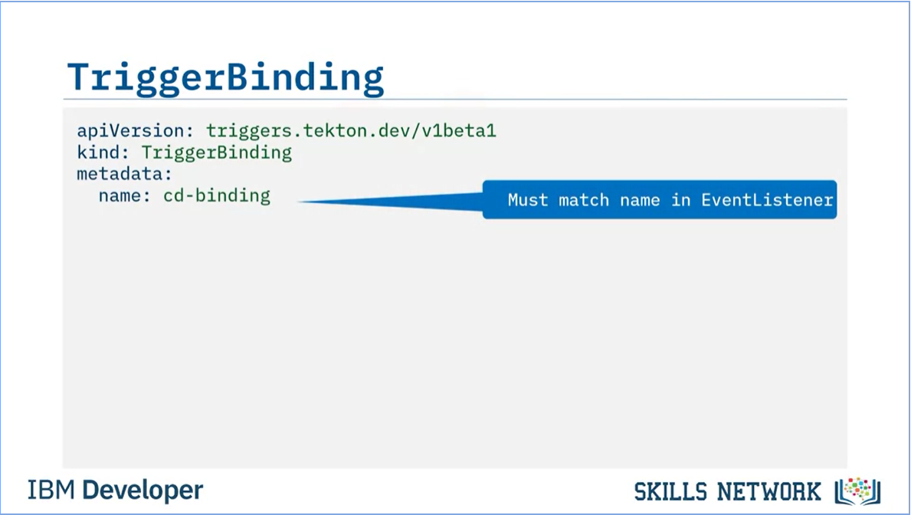
</p>

Now that you have the event listener, you can create the binding that it
references.

You start with the same API version as before, and specify the resource
kind as TriggerBinding.

Using the metadata, you give it the name \"cd--binding\" so that it
matches the name in the EventListener.

<!--~~~~~~~~~~~~~~~~~~~~~~~~~~~~~~~~~~~~~~~~~~~~~~~~~~~~~~~~~~~~~~~~~~~~~~~~~~~~~~~~~~~~~~~~~~~~-->
<p align="center">
  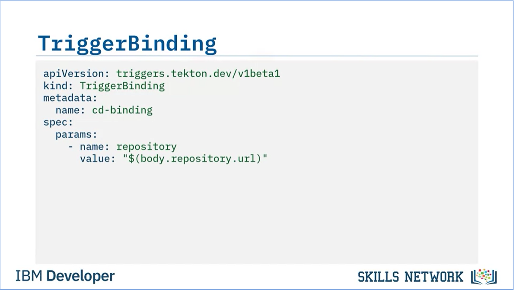
</p>

Next, you define the specifications, starting with the parameters.

The first parameter has the name \"repository\" with the value
body.repository.url.

This is very specific to the body of the incoming event.

To figure this out for GitHub, you would look at the JSON file coming
from the body of a GitHub event to understand where to pull these
parameters from.

<!--~~~~~~~~~~~~~~~~~~~~~~~~~~~~~~~~~~~~~~~~~~~~~~~~~~~~~~~~~~~~~~~~~~~~~~~~~~~~~~~~~~~~~~~~~~~~-->
<p align="center">
  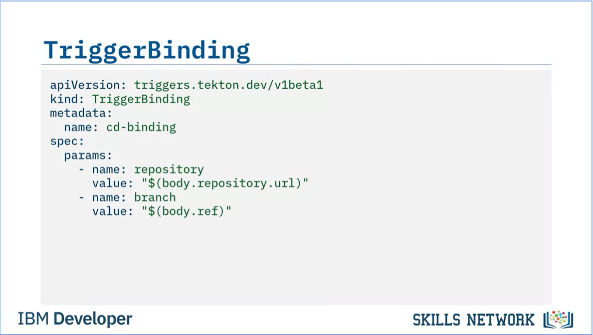
</p>

The second parameter has the name \"branch\" with a value that comes
from body.ref.

This is how you bind the data from an incoming event to the parameters
that your pipeline needs.

<!--~~~~~~~~~~~~~~~~~~~~~~~~~~~~~~~~~~~~~~~~~~~~~~~~~~~~~~~~~~~~~~~~~~~~~~~~~~~~~~~~~~~~~~~~~~~~-->
<p align="center">
  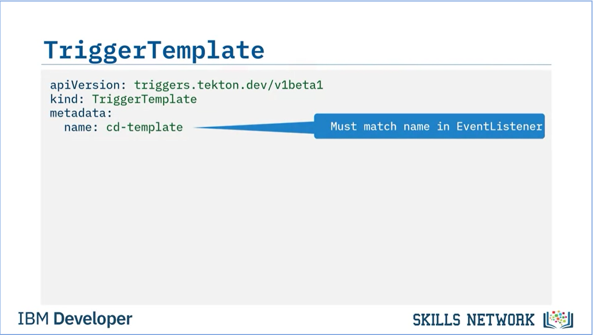
</p>

Now you need to specify the trigger template that was referenced in the
event listener.

Like the other resource definitions, it starts with the API version.

This time you specify the kind as TriggerTemplate.

Using the metadata, you give it the name \"cd-template\" so that it
matches the name in the EventListener.

<!--~~~~~~~~~~~~~~~~~~~~~~~~~~~~~~~~~~~~~~~~~~~~~~~~~~~~~~~~~~~~~~~~~~~~~~~~~~~~~~~~~~~~~~~~~~~~-->
<p align="center">
  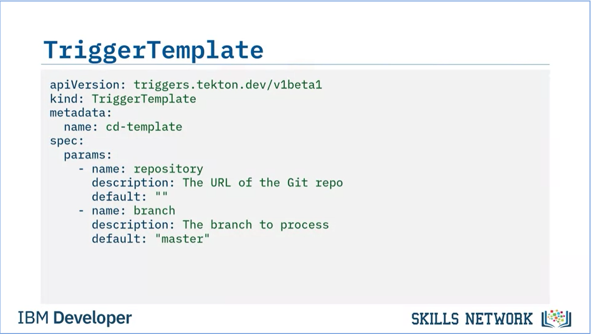
</p>

Next, you define the specifications, starting with the parameters.

The first parameter name is \"repository\" and you give it a description
and a default value that\'s empty.

The description is just used for documentation purposes, but the default
value will be used if a parameter called repository is not passed in by
the trigger binding.

The next parameter named \"branch\" also has a description, but this
time the default value is \"master\".

Again, if the branch parameter is not passed in from the trigger
binding, the value of \"master\" will be used as the branch parameter
for the pipeline.

<!--~~~~~~~~~~~~~~~~~~~~~~~~~~~~~~~~~~~~~~~~~~~~~~~~~~~~~~~~~~~~~~~~~~~~~~~~~~~~~~~~~~~~~~~~~~~~-->
<p align="center">
  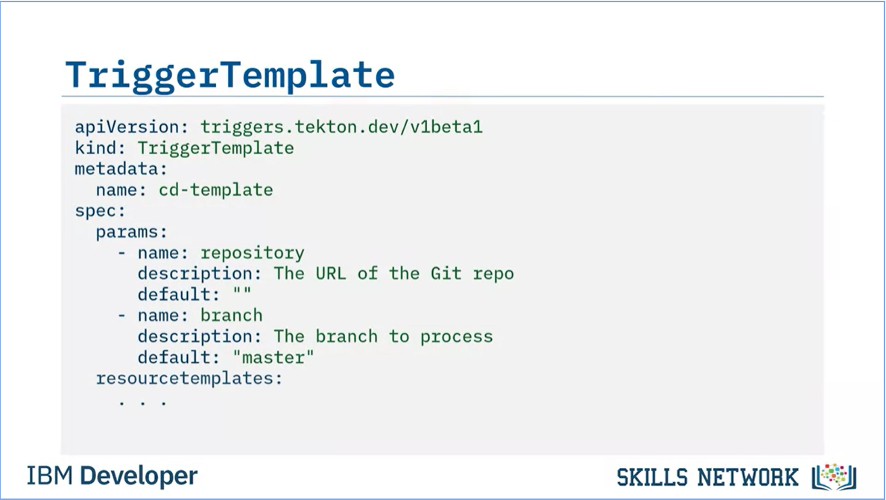
</p>

Now, you\'re ready to define the resource templates to be used.

This is all part of the same TriggerTemplate definition.

<!--~~~~~~~~~~~~~~~~~~~~~~~~~~~~~~~~~~~~~~~~~~~~~~~~~~~~~~~~~~~~~~~~~~~~~~~~~~~~~~~~~~~~~~~~~~~~-->
<p align="center">
  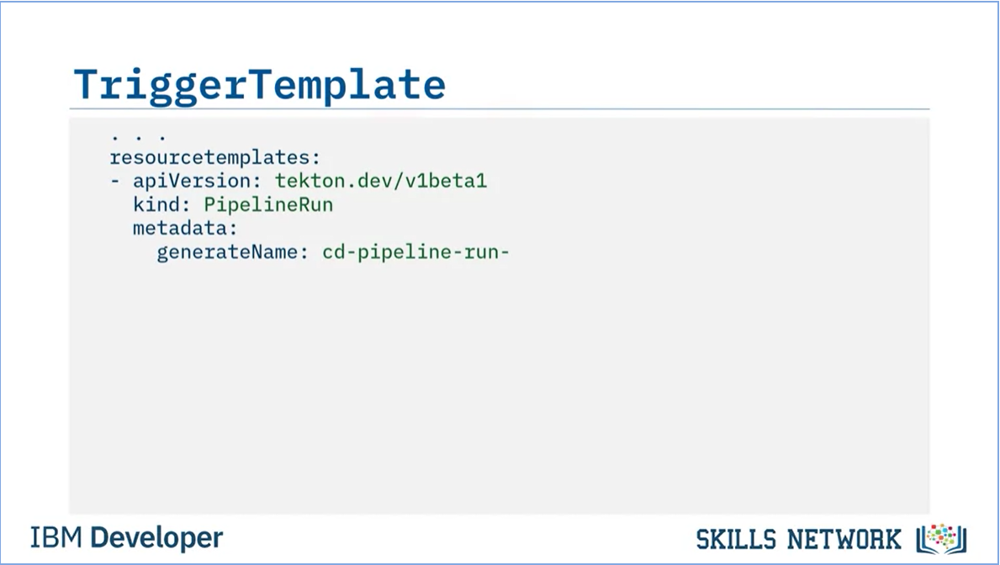
</p>

The resourcetemplates section of the TriggerTemplate contains a
PipelineRun resource.

Like all the resources you have seen, it starts with an API version.

This is the regular Tekton API.

The kind of resource is PipelineRun, which specifies the information
needed to run a pipeline.

In the metadata section, you could give it a name, or in this case, you
could use \"generateName\" and specify a partial name.

This generates a unique ID and appends it to the partial name that you
supply.

This is an effective way of giving all your pipeline runs a unique name.

<!--~~~~~~~~~~~~~~~~~~~~~~~~~~~~~~~~~~~~~~~~~~~~~~~~~~~~~~~~~~~~~~~~~~~~~~~~~~~~~~~~~~~~~~~~~~~~-->
<p align="center">
  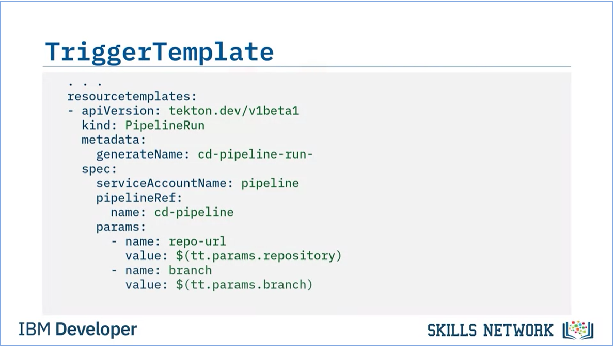
</p>

Next, you list the specifications.

Again, you need to specify the serviceAccountName of the ServiceAccount
that runs the pipeline, so you use the same \"pipeline\" account.

Now you specify the pipelineRef, which is a reference to the pipeline
that you want to run.

The name you specify is \"cd-pipeline\", assuming that you\'ve defined a
pipeline called cd-pipeline somewhere else.

Next, you specify any parameters that this pipeline requires.

As you may have guessed, it needs a parameter for the repository, but
you are using a different name here.

That\'s because you need to use the name that is specified by the
pipeline you are calling.

The pipeline has defined this as \"repo-url\" so that\'s what you need
to pass in.

You get the value from the params section of this TriggerTemplate, so
you reference it as \$(tt.params.repository).

This shows you that the parameter names do not have to match as long as
you can map them to each other.

The pipeline also needs a parameter named \"branch\" that also comes
from the params section of this TriggerTemplate, so you reference it as
\$(tt.params.branch).

Now you have everything you need to trigger a pipeline.

<!--~~~~~~~~~~~~~~~~~~~~~~~~~~~~~~~~~~~~~~~~~~~~~~~~~~~~~~~~~~~~~~~~~~~~~~~~~~~~~~~~~~~~~~~~~~~~-->
<p align="center">
  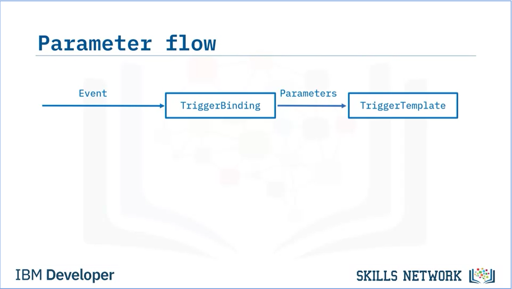
</p>

You saw that even if the parameter name doesn\'t always match, you were
still able to map them to each other.

<!--~~~~~~~~~~~~~~~~~~~~~~~~~~~~~~~~~~~~~~~~~~~~~~~~~~~~~~~~~~~~~~~~~~~~~~~~~~~~~~~~~~~~~~~~~~~~-->
<p align="center">
  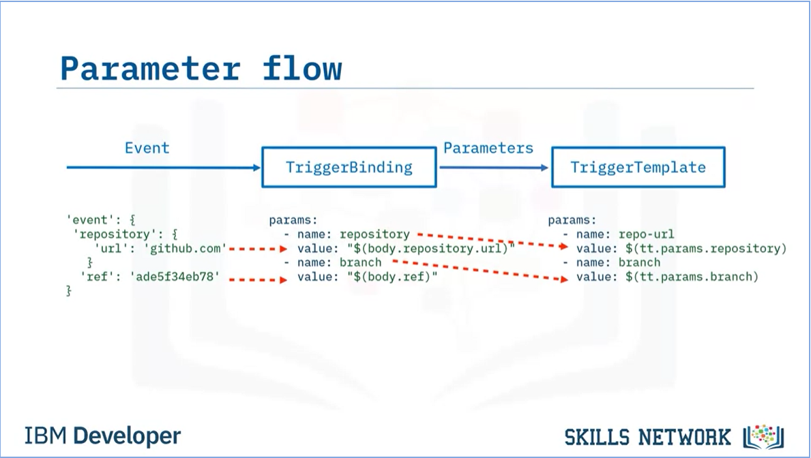
</p>

Let\'s take a look at how the parameters are flowing.

You start with an event that has some data that you need for the
pipeline.

The trigger binding takes the data from the event and binds it to
parameters.

Those parameters are then mapped in the trigger template to the pipeline
run so that they\'re available to the pipeline and all its tasks as
parameter names that the pipeline expects to receive.

You might be wondering, if you wrote these files yourself, why wouldn't
you make all of the parameter names the same?

Normally, you would, but now you see that you can map existing pipelines
with different parameter names and still make them work.

The moment of truth has arrived.

You are ready to see if your trigger works.

You can test this locally using the curl command.

<!--~~~~~~~~~~~~~~~~~~~~~~~~~~~~~~~~~~~~~~~~~~~~~~~~~~~~~~~~~~~~~~~~~~~~~~~~~~~~~~~~~~~~~~~~~~~~-->
<p align="center">
  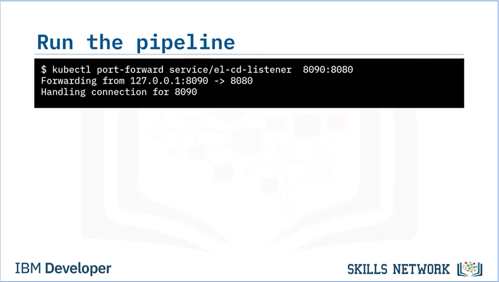
</p>

Before you do, you need to locally expose the event listener.

Normally, you would set up an Ingress to expose the EventListener as an
endpoint, but for a quick check, you can use the Kubernetes port-forward
command.

This forwards the port the EventListener is listening on, which is port
8080, to any port that you want.

In this case, you selected 8090.

<!--~~~~~~~~~~~~~~~~~~~~~~~~~~~~~~~~~~~~~~~~~~~~~~~~~~~~~~~~~~~~~~~~~~~~~~~~~~~~~~~~~~~~~~~~~~~~-->
<p align="center">
  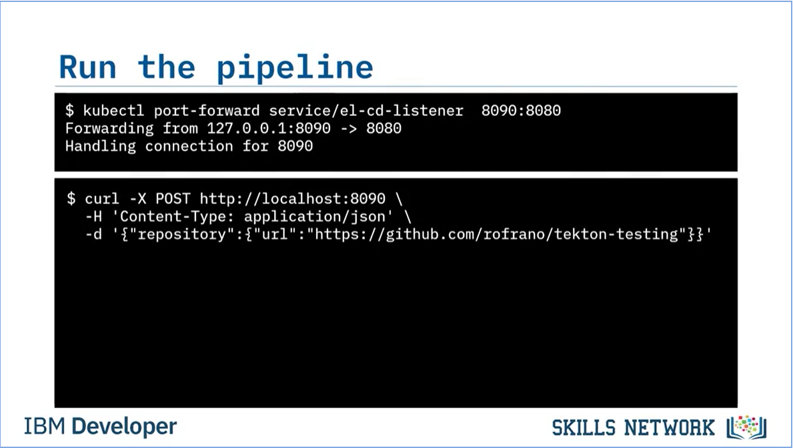
</p>

Next, you use the curl command and POST to localhost:8090.

You set the Content-Type in the header to specify that the payload that
you are sending is application/json.

And finally, you use the dash \"D\" parameter to send the data in JSON
format.

<!--~~~~~~~~~~~~~~~~~~~~~~~~~~~~~~~~~~~~~~~~~~~~~~~~~~~~~~~~~~~~~~~~~~~~~~~~~~~~~~~~~~~~~~~~~~~~-->
<p align="center">
  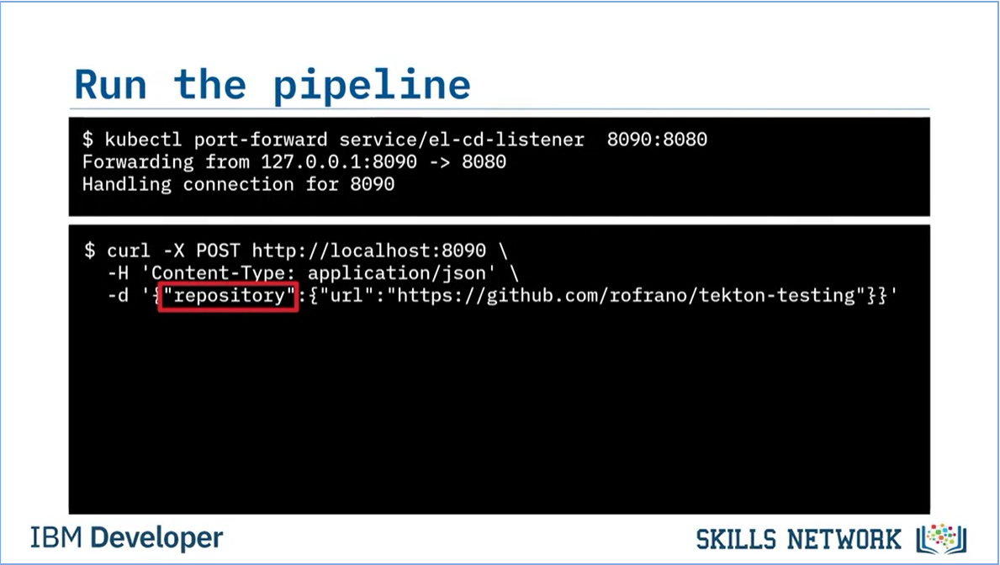
</p>

If you remember, you told the TriggerBinding to get the repository
parameter from (body.repository.url), so the body of your JSON message
has a \"repository\" attribute with a \"url\" attribute under it.

<!--~~~~~~~~~~~~~~~~~~~~~~~~~~~~~~~~~~~~~~~~~~~~~~~~~~~~~~~~~~~~~~~~~~~~~~~~~~~~~~~~~~~~~~~~~~~~-->
<p align="center">
  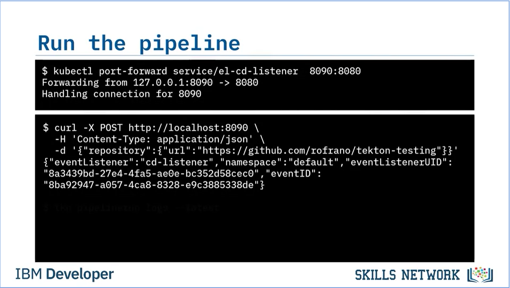
</p>

When you press ENTER, you receive a message from the EventListener
letting you know that it has accepted your request.

<!--~~~~~~~~~~~~~~~~~~~~~~~~~~~~~~~~~~~~~~~~~~~~~~~~~~~~~~~~~~~~~~~~~~~~~~~~~~~~~~~~~~~~~~~~~~~~-->
<p align="center">
  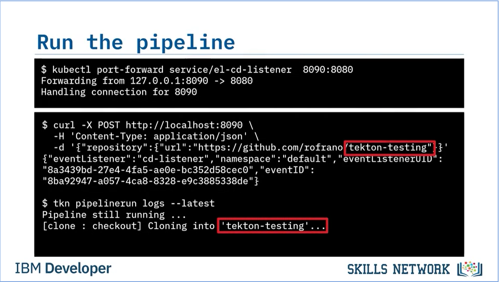
</p>

If you use the 'tekton pipelinerun logs' command to specify the latest
logs, you see that the pipeline is still running, and eventually, you
see the message from the \"checkout\" task that ran in the pipeline.

Notice that the name of the repository in the message matches the name
of the repository you told it to clone.

This is how you know that it worked.

<!--~~~~~~~~~~~~~~~~~~~~~~~~~~~~~~~~~~~~~~~~~~~~~~~~~~~~~~~~~~~~~~~~~~~~~~~~~~~~~~~~~~~~~~~~~~~~-->
<p align="center">
  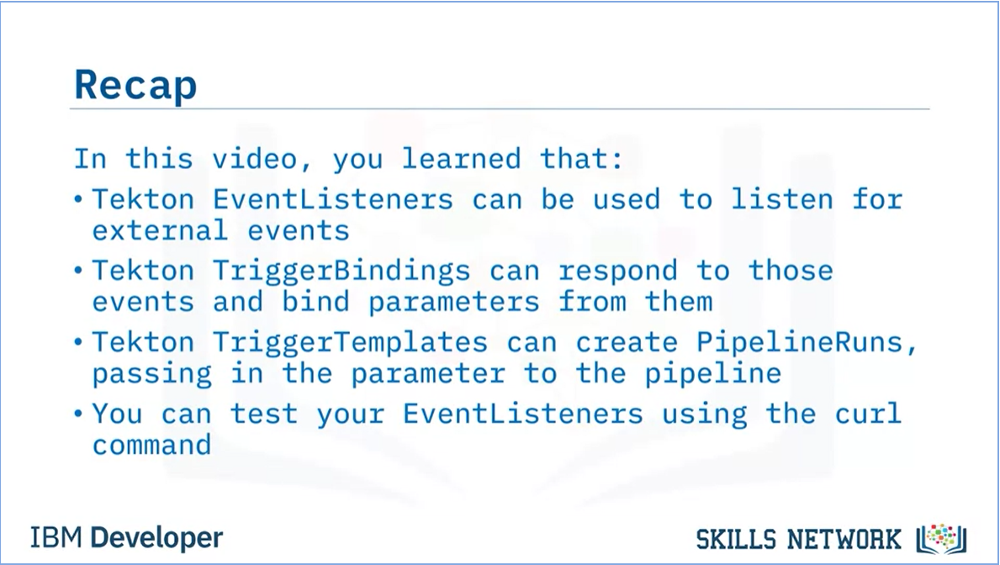
</p>

In this module, you learned that;

-   Tekton EventListeners can be used to listen for external events, 

-   Tekton TriggerBindings can respond to those events and bind parameters from them, 

-   Tekton TriggerTemplates can create PipelineRuns, passing in the parameters to the pipeline, and 

-   You can test your EventListener using the curl command.

<h3>Hands-on Lab: Adding GitHub Triggers</h3>

Welcome to this hands-on lab for <b>Adding GitHub Triggers</b>.

Running a pipeline manually has limited uses. In this lab you will
create a Tekton Trigger to cause a pipeline run from external events
like changes made to a repo in GitHub.

Skills Network Labs (SN Labs) is a virtual lab environment used in this
course.  Upon clicking the \"Open Tool\" button below, your Username and
Email will be passed to SN Labs and will be used in strict accordance
with IBM Skills Network Privacy policy, such as for communicating
important information to enhance your learning experience.  

In case you need to download the lab instructions click <a href="https://cf-courses-data.s3.us.cloud-object-storage.appdomain.cloud/IBM-CD0215EN-SkillsNetwork/labs/module3/02_add_github_trigger.md.html">
HERE</a> to open a new tab.

<h3>Adding GitHub Triggers (External resource)</h3>

Clicking on the Open Tool button below will launch the cloud based SN
labs virtual labs environment with instructions to complete this lab.
Your username and email will be shared with SN Labs to authenticate and
provision your lab environment.

Open Tool 

<h2 id="3-09">Module 3-09. Leveraging the Tekton Catalog (7:55)</h2>

Welcome to 'Leveraging the Tekton Catalog.'

<!--~~~~~~~~~~~~~~~~~~~~~~~~~~~~~~~~~~~~~~~~~~~~~~~~~~~~~~~~~~~~~~~~~~~~~~~~~~~~~~~~~~~~~~~~~~~~-->
<p align="center">
  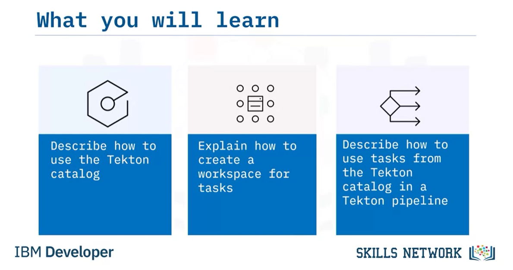
</p>

After this module, you will be able to;

-   Describe how to use the Tekton catalog, 

-   Explain how to create a workspace for tasks, and 

-   Describe how to use tasks from the Tekton catalog in a Tekton pipeline.

So, what is the Tekton catalog?

<!--~~~~~~~~~~~~~~~~~~~~~~~~~~~~~~~~~~~~~~~~~~~~~~~~~~~~~~~~~~~~~~~~~~~~~~~~~~~~~~~~~~~~~~~~~~~~-->
<p align="center">
  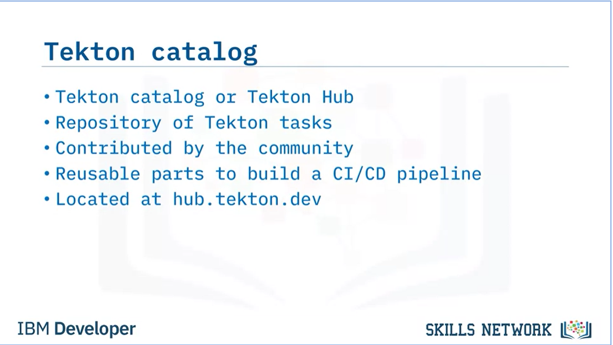
</p>

The Tekton catalog, also known as the Tekton Hub, is a repository of
Tekton tasks that have been contributed by the community, representing a
collection of reusable parts that you can use to build a CI/CD pipeline.

It's located at hub.tekton.dev.

And before writing your own tasks, you should always check the Tekton
catalog to see if someone else has already written one that you can use.

This not only saves hours of creating and debugging tasks, but many more
hours of task maintenance as well.

Remember: A line of code that you didn't write is a line of code that
you don\'t have to maintain.

<!--~~~~~~~~~~~~~~~~~~~~~~~~~~~~~~~~~~~~~~~~~~~~~~~~~~~~~~~~~~~~~~~~~~~~~~~~~~~~~~~~~~~~~~~~~~~~-->
<p align="center">
  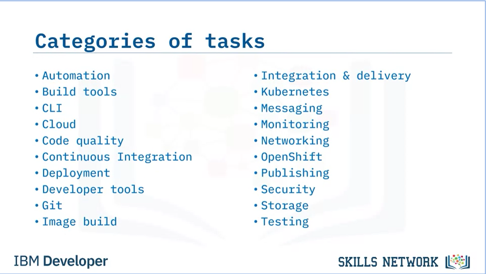
</p>

The task categories available at the Tekton Hub include automation,
build tools, code quality, continuous integration, developer tools like
Git, building images, Kubernetes and open shift tasks, networking,
monitoring, security, and publishing, just to name a few.

As mentioned previously, you should always check the Tekton Hub before
you start to write any task, because chances are, someone has already
written one that you can use.

<!--~~~~~~~~~~~~~~~~~~~~~~~~~~~~~~~~~~~~~~~~~~~~~~~~~~~~~~~~~~~~~~~~~~~~~~~~~~~~~~~~~~~~~~~~~~~~-->
<p align="center">
  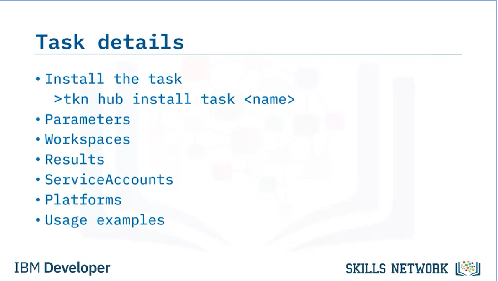
</p>

When you select a task and view the details, you see instructions on how
to install the task.

These are usually in the form of a Kubernetes manifest written in YAML
that you can apply with the kubectl command.

But it\'s important to also point out that you can also easily install
tasks from the hub using the Tekton CLI tool, simply by using: tkn hub
install task, followed by the task name.

The details also document any parameters that the task needs including
what the name is, what the type is, and hints on what the various values
might be.

The details also tell you if the task requires any workspaces to share
data with other tasks.

We\'ll discuss workspaces in just a moment.

If the task produces any results, they will be documented in the
details, as well as if the task requires a service account with special
run permissions.

Finally, the details include information on the platforms that the task
can run on, and some even give helpful usage examples.

<!--~~~~~~~~~~~~~~~~~~~~~~~~~~~~~~~~~~~~~~~~~~~~~~~~~~~~~~~~~~~~~~~~~~~~~~~~~~~~~~~~~~~~~~~~~~~~-->
<p align="center">
  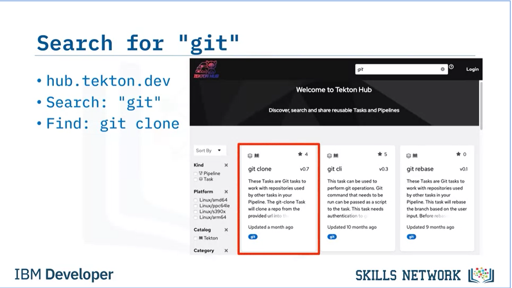
</p>

Probably the first thing you need to do in your pipeline is use git to
clone your source code so that it can be built, and other checks can be
run on it.

You go to hub.tekton.dev, you type \"git\" in the search box.

This returns several results, one of which is a task called \"git
clone\".

That looks like the exact task you need.

So, you select it to view the details.

<!--~~~~~~~~~~~~~~~~~~~~~~~~~~~~~~~~~~~~~~~~~~~~~~~~~~~~~~~~~~~~~~~~~~~~~~~~~~~~~~~~~~~~~~~~~~~~-->
<p align="center">
  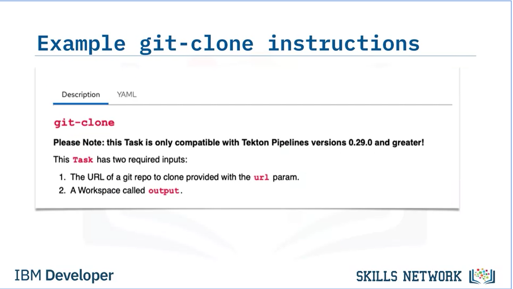
</p>

The details page gives you all the information needed to use the task in
your pipeline.

Some tasks like git-clone have a lot of optional parameters but don\'t
be overwhelmed.

<!--~~~~~~~~~~~~~~~~~~~~~~~~~~~~~~~~~~~~~~~~~~~~~~~~~~~~~~~~~~~~~~~~~~~~~~~~~~~~~~~~~~~~~~~~~~~~-->
<p align="center">
  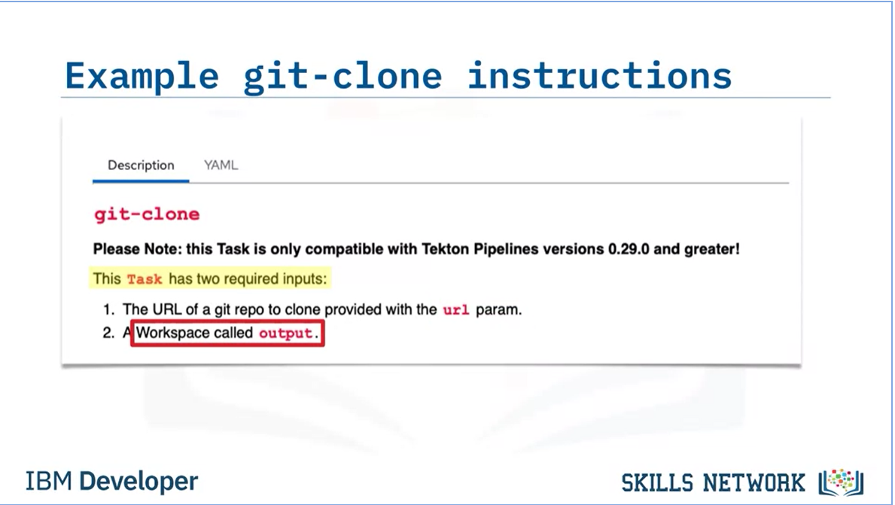
</p>

When you look at the overview, you see that the git-clone task only
requires two inputs.

The URL of the repository that you want to clone, and a workspace called
\"output\" to clone the source code into.

<!--~~~~~~~~~~~~~~~~~~~~~~~~~~~~~~~~~~~~~~~~~~~~~~~~~~~~~~~~~~~~~~~~~~~~~~~~~~~~~~~~~~~~~~~~~~~~-->
<p align="center">
  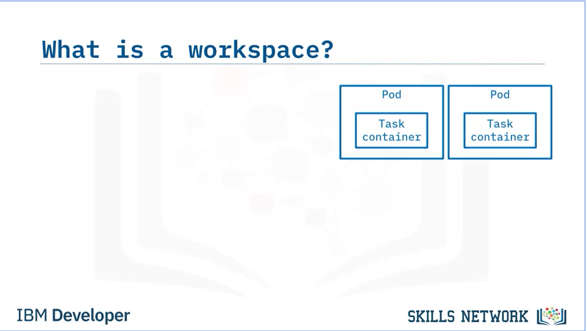
</p>

Let\'s see how you can use this information to implement this task in a
pipeline.

One of the two inputs is a workspace.

But what is a workspace?

Remember that with Tekton, each task runs in its own pod and every pod
is isolated from every other pod.

That makes it difficult to transfer data between tasks.

<!--~~~~~~~~~~~~~~~~~~~~~~~~~~~~~~~~~~~~~~~~~~~~~~~~~~~~~~~~~~~~~~~~~~~~~~~~~~~~~~~~~~~~~~~~~~~~-->
<p align="center">
  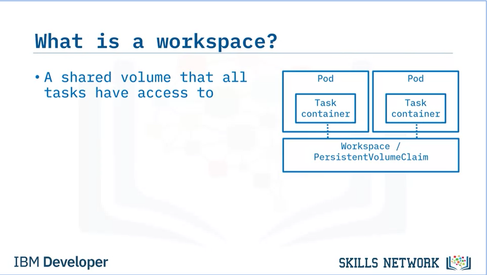
</p>

You solve this problem by providing a workspace that is a shared volume
that each task has access to.

This allows them to share data through this volume.

<!--~~~~~~~~~~~~~~~~~~~~~~~~~~~~~~~~~~~~~~~~~~~~~~~~~~~~~~~~~~~~~~~~~~~~~~~~~~~~~~~~~~~~~~~~~~~~-->
<p align="center">
  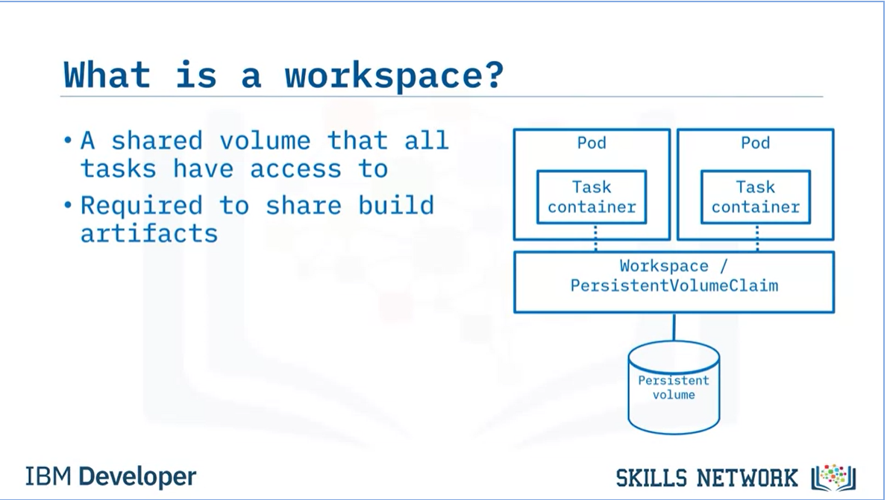
</p>

If you think about it, this is required for sharing build artifacts.

You can\'t lint your code without cloning it from Git first, and so
there must be a way to share the code, and a workspace is the answer.

<!--~~~~~~~~~~~~~~~~~~~~~~~~~~~~~~~~~~~~~~~~~~~~~~~~~~~~~~~~~~~~~~~~~~~~~~~~~~~~~~~~~~~~~~~~~~~~-->
<p align="center">
  
</p>

Workspaces are declared in the PipelineRun, and because they are
implemented as a Kubernetes PersistentVolumeClaim, it is up to the
PipelineRun to map from the name of the workspace that the pipeline is
expecting to a PersistentVolumeClaim that the pipeline can use to store
its artifacts.

<!--~~~~~~~~~~~~~~~~~~~~~~~~~~~~~~~~~~~~~~~~~~~~~~~~~~~~~~~~~~~~~~~~~~~~~~~~~~~~~~~~~~~~~~~~~~~~-->
<p align="center">
  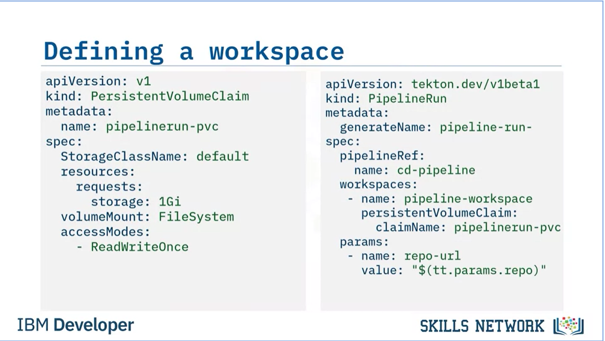
</p>

Let's take a look at how this is done.

First, you need to create a PersistentVolumeClaim.

You give it the name "pipelinerun-pvc".

Then you spec it out using the default storage class, request 1 gigabyte
of storage and mount it as a filesystem that is read-write.

Now you're ready to create a PipelineRun.

You configure it to generate a unique name so that every run can be
uniquely identified.

In the spec, you add a reference to the pipeline that you want to run.

In this example, it's a pipeline named \"cd-pipeline\".

Then, you declare the workspace by giving it a name, and mapping it to
the PersistentVolumeClaim (or PVC) that you want to use.

From this point forward, the pipeline can reference it by the name
\"pipeline-workspace\" and Kubernetes will know to mount the PVC named
\"pipelinerun-pvc" to each of the pods.

Finally, you pass on any parameters that the pipeline requires.

<!--~~~~~~~~~~~~~~~~~~~~~~~~~~~~~~~~~~~~~~~~~~~~~~~~~~~~~~~~~~~~~~~~~~~~~~~~~~~~~~~~~~~~~~~~~~~~-->
<p align="center">
  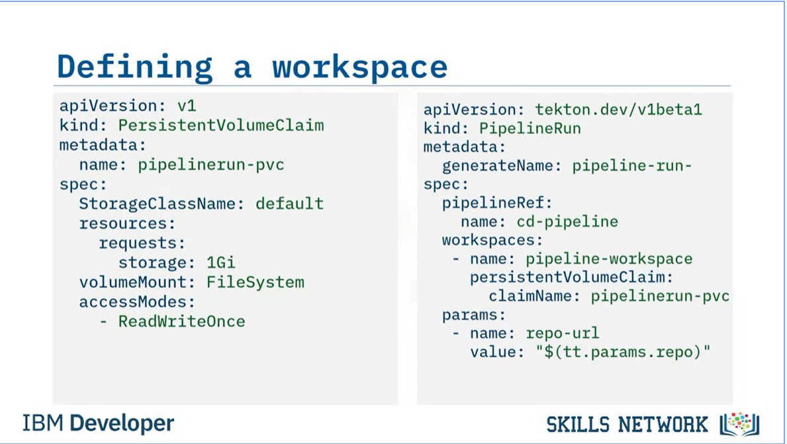
</p>

In this example, it's a parameter named \"repo-url\".

<!--~~~~~~~~~~~~~~~~~~~~~~~~~~~~~~~~~~~~~~~~~~~~~~~~~~~~~~~~~~~~~~~~~~~~~~~~~~~~~~~~~~~~~~~~~~~~-->
<p align="center">
  
</p>

Now, let\'s take a look at how to write the pipeline task using the
git-clone task from the Tekton catalog.

You start with the pipeline spec and define that a workspace named
\"pipeline-workspace\" is required so that any of the tasks that need it
can use it.

Next, you declare that a parameter named \"repo-url\" must be passed
into the pipeline so that it can be used by any task that needs it.

Then, you start defining your tasks.

You create a task named \"clone\" because this is the task that will
clone your source code.

You set the taskRef to point to the \"git-clone\" task that you
installed from the Tekton catalog.

If you remember, the git-clone task requires a workspace named
\"output\", so you define a mapping from the workspace named
\"pipeline-workspace\" to a workspace named \"output\" for this task.

Other tasks can use different workspace names and they can all be mapped
back to the single workspace that this pipeline is using.

Also remember, that the git-clone task requires that a parameter named
\"url\" be set to the url of the git repository that you want to clone,
so you map the \"repo-url\" parameter from the pipeline into the \"url\"
parameter that the task requires.

<!--~~~~~~~~~~~~~~~~~~~~~~~~~~~~~~~~~~~~~~~~~~~~~~~~~~~~~~~~~~~~~~~~~~~~~~~~~~~~~~~~~~~~~~~~~~~~-->
<p align="center">
  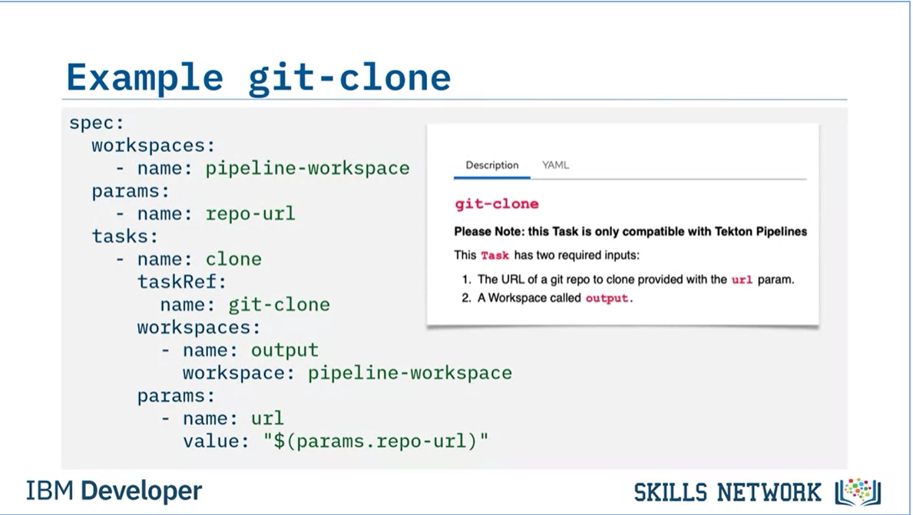
</p>

The task is complete and ready to run.

Let\'s review where everything came from.

From the details of the git-clone task on Tekton Hub, you saw that you
needed a workspace named \"output\", so you defined this for the task.

<!--~~~~~~~~~~~~~~~~~~~~~~~~~~~~~~~~~~~~~~~~~~~~~~~~~~~~~~~~~~~~~~~~~~~~~~~~~~~~~~~~~~~~~~~~~~~~-->
<p align="center">
  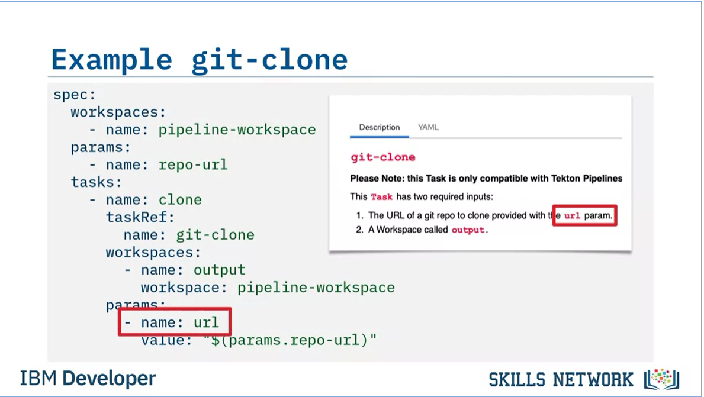
</p>

The details also said that a parameter named \"url\" must be passed in,
so you defined this for the task also.

<!--~~~~~~~~~~~~~~~~~~~~~~~~~~~~~~~~~~~~~~~~~~~~~~~~~~~~~~~~~~~~~~~~~~~~~~~~~~~~~~~~~~~~~~~~~~~~-->
<p align="center">
  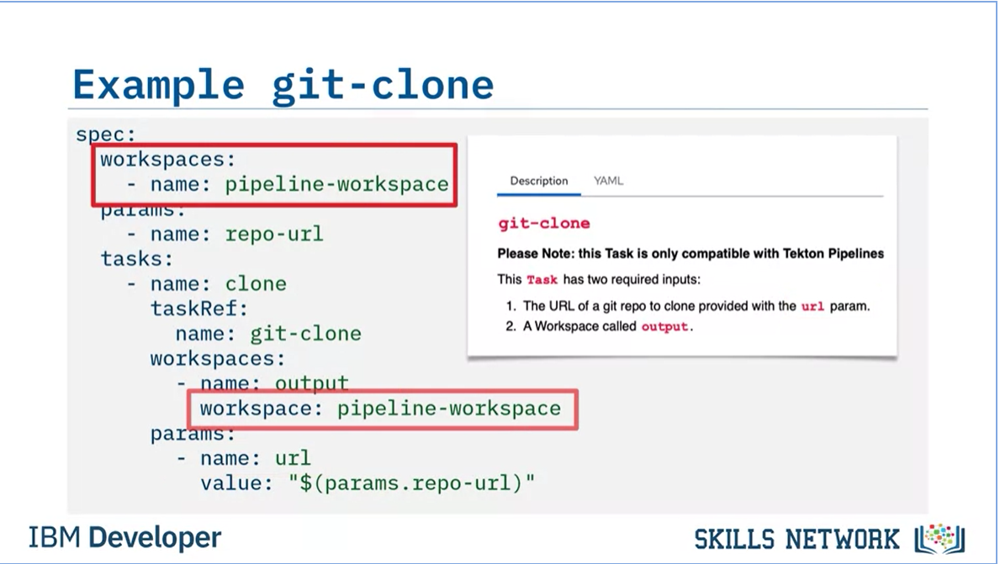
</p>

The workspace in the task was mapped to the pipeline-workspace from the
pipeline spec, 

<!--~~~~~~~~~~~~~~~~~~~~~~~~~~~~~~~~~~~~~~~~~~~~~~~~~~~~~~~~~~~~~~~~~~~~~~~~~~~~~~~~~~~~~~~~~~~~-->
<p align="center">
  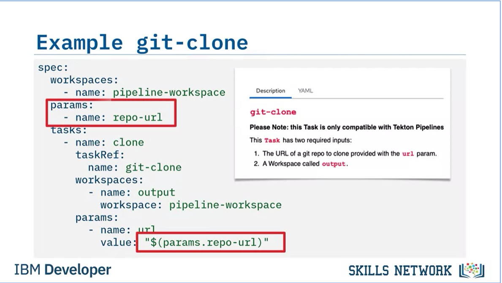
</p>

and the url parameter in the task was mapped to the
pipeline parameter repo-url from the pipeline spec.

<!--~~~~~~~~~~~~~~~~~~~~~~~~~~~~~~~~~~~~~~~~~~~~~~~~~~~~~~~~~~~~~~~~~~~~~~~~~~~~~~~~~~~~~~~~~~~~-->
<p align="center">
  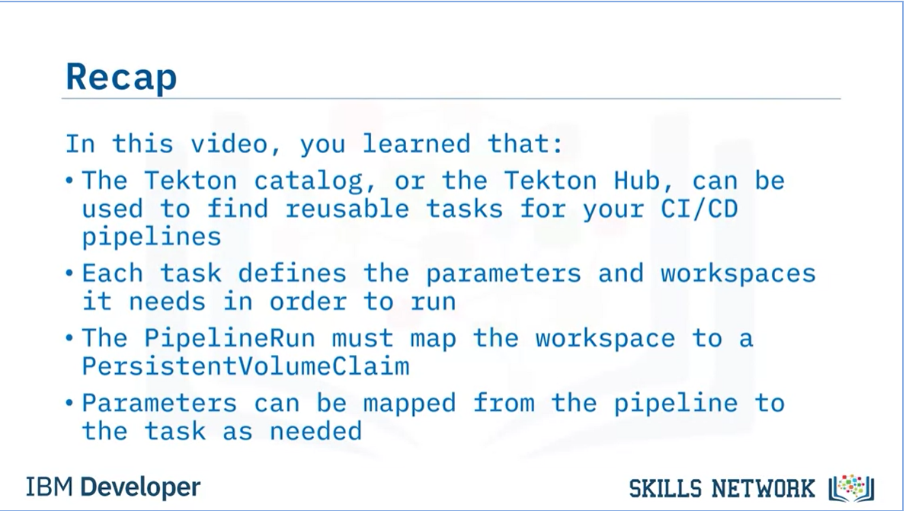
</p>

In this module, you learned that

-   The Tekton catalog, or Tekton Hub, can be used to find reusable
    tasks for your CI/CD pipelines,

-   Each task defines the parameters and workspaces it needs in order to
    run,

-   The PipelineRun must map the workspace to a PersistentVolumeClaim,
    and

-   The parameters can be mapped from the pipeline to the task as
    needed.


<h3>Hands-on Lab: Use Tekton Continuous Delivery Catalog</h3>

Welcome to the hands-on lab for **Using the Tekton Catalog**. The Tekton
community provides a wide selection of tasks and pipelines that you can
use in your CI/CD pipelines, so that you do not have to write all of
them yourself. Many common tasks can be found at the [Tekton
Hub](http://hub.tekton.dev/?utm_medium=Exinfluencer&utm_source=Exinfluencer&utm_content=000026UJ&utm_term=10006555&utm_id=NA-SkillsNetwork-Channel-SkillsNetworkCoursesIBMCD0215ENSkillsNetwork35576036-2022-01-01).
In this lab, you will search for and use one of them.  

Skills Network Labs (SN Labs) is a virtual lab environment used in this
course.  Upon clicking the \"Open Tool\" button below, your Username and
Email will be passed to SN Labs and will be used in strict accordance
with IBM Skills Network Privacy policy, such as for communicating
important information to enhance your learning experience. 

In case you need to download the lab instructions
click [HERE ](https://cf-courses-data.s3.us.cloud-object-storage.appdomain.cloud/IBM-CD0215EN-SkillsNetwork/labs/module3/03_use_tekton_catalog.md.html)to
open a new tab.

<h3>Use Tekton Continuous Delivery Catalog (External resource)</h3>

Clicking on the Open Tool button below will launch the cloud-based SN
labs virtual labs environment with instructions to complete this lab.
Your username and email will be shared with SN Labs to authenticate and
provision your lab environment.

Open Tool 

<h2 id="3-10">Module 3-10. Creating Tasks for Quality Checks and Tasks (8:50)</h2>

Welcome to Creating Tasks for Quality Checks and Testing.

<!--~~~~~~~~~~~~~~~~~~~~~~~~~~~~~~~~~~~~~~~~~~~~~~~~~~~~~~~~~~~~~~~~~~~~~~~~~~~~~~~~~~~~~~~~~~~~-->
<p align="center">
  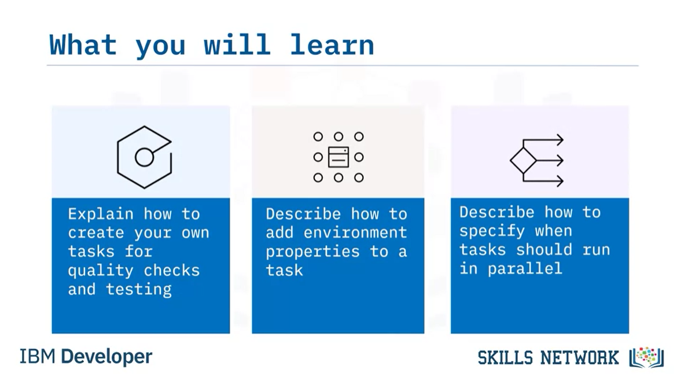
</p>

After this module, you will be able to explain how to create your own
tasks for quality checks and testing, describe how to add environment
properties to a task, and describe how to specify when tasks should run
in parallel.

Let\'s look at where you are in building a complete pipeline using
Tekton.

<!--~~~~~~~~~~~~~~~~~~~~~~~~~~~~~~~~~~~~~~~~~~~~~~~~~~~~~~~~~~~~~~~~~~~~~~~~~~~~~~~~~~~~~~~~~~~~-->
<p align="center">
  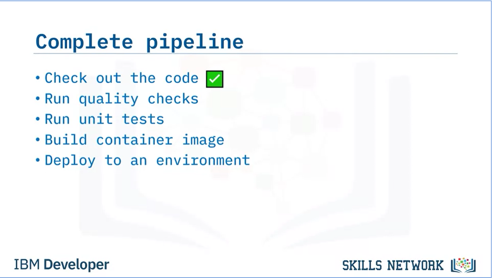
</p>

In previous modules, you've seen two ways to create the checkout stage
of a pipeline, so you have that completed.

Now it\'s time to build the other stages.

<!--~~~~~~~~~~~~~~~~~~~~~~~~~~~~~~~~~~~~~~~~~~~~~~~~~~~~~~~~~~~~~~~~~~~~~~~~~~~~~~~~~~~~~~~~~~~~-->
<p align="center">
  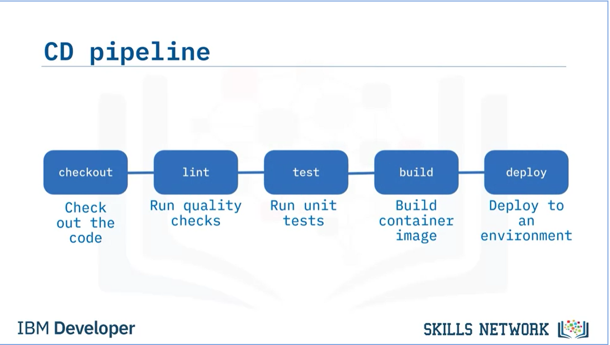
</p>

To visualize this pipeline, you can think of it as a linear progression
of tasks, to check out, lint, test, build, and deploy your application.

But in reality, quality checks like running lint and unit testing are
completely independent.

<!--~~~~~~~~~~~~~~~~~~~~~~~~~~~~~~~~~~~~~~~~~~~~~~~~~~~~~~~~~~~~~~~~~~~~~~~~~~~~~~~~~~~~~~~~~~~~-->
<p align="center">
  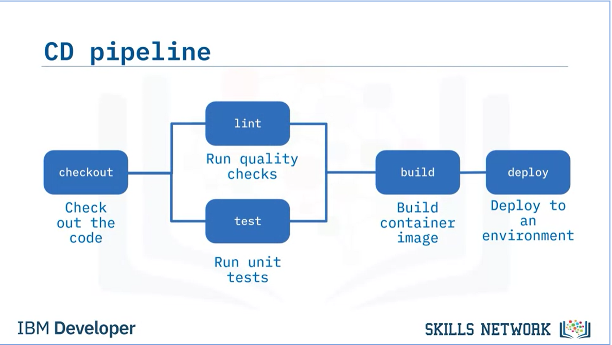
</p>

So, the pipeline can look like this with quality checks and unit tests
running in parallel.

If either one of them fails, the pipeline will stop, but the run order
really doesn\'t matter.

This allows you to take advantage of Tekton\'s parallel processing to
speed up the pipeline run.

<!--~~~~~~~~~~~~~~~~~~~~~~~~~~~~~~~~~~~~~~~~~~~~~~~~~~~~~~~~~~~~~~~~~~~~~~~~~~~~~~~~~~~~~~~~~~~~-->
<p align="center">
  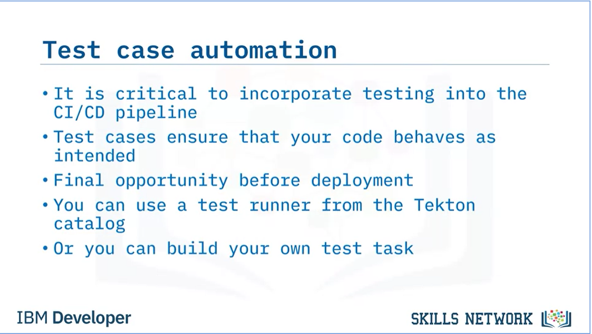
</p>

Let\'s look at testing first.

Testing is critically important for any CI/CD pipeline.

You perform unit testing in the CI pipeline, and you perform integration
testing in the CD pipeline.

Whichever type of testing, test cases ensure that your code is behaving
as intended.

For a CD pipeline, this is the final opportunity to check for any
problems before the code is deployed.

The Tekton catalog has many testing tools to choose from, but what if
the tool that you use isn't in the catalog?

In this case, you can simply build your own tasks to run the tool you're
already using to automate your tests.

<!--~~~~~~~~~~~~~~~~~~~~~~~~~~~~~~~~~~~~~~~~~~~~~~~~~~~~~~~~~~~~~~~~~~~~~~~~~~~~~~~~~~~~~~~~~~~~-->
<p align="center">
  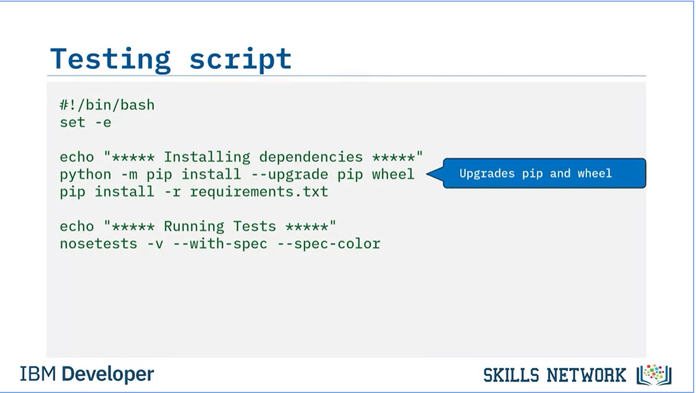
</p>

Creating your own task is quite simple.

You start with a script that you probably already have.

This script starts out by upgrading pip and wheel so that you're using
the latest versions.

Then, it uses pip, the Python package manager, to install the required
Python package dependencies.

<!--~~~~~~~~~~~~~~~~~~~~~~~~~~~~~~~~~~~~~~~~~~~~~~~~~~~~~~~~~~~~~~~~~~~~~~~~~~~~~~~~~~~~~~~~~~~~-->
<p align="center">
  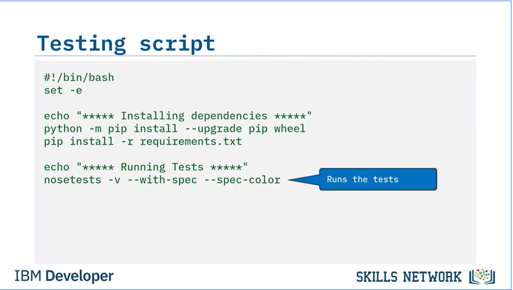
</p>

Finally, it runs the Python test runner called nosetests and passes in
some parameters to make the output colorful.

<!--~~~~~~~~~~~~~~~~~~~~~~~~~~~~~~~~~~~~~~~~~~~~~~~~~~~~~~~~~~~~~~~~~~~~~~~~~~~~~~~~~~~~~~~~~~~~-->
<p align="center">
  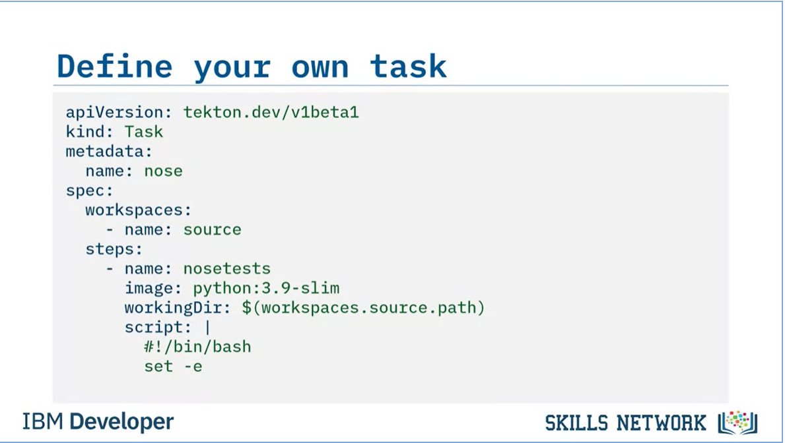
</p>

You can use this exact script in your Tekton task, which means that the
same commands your developers are using to test their code locally can
be used in your pipeline as well.

You can write your own task that uses this script.

You start by specifying the Tekton API version, and tell Kubernetes that
this resource kind is a task.

Next, you give it a name. You will be running a tool called \"nose,\" so
you call the task \"nose\" so that it will be easy to identify in the
future.

Now you can start writing the specifications. Since you want to run the
test cases against your code, you need a workspace that the previous
tasks in the pipeline can place the code into. A common workspace name
that many tasks use for code is \"source,\" so you name the workspace
\"source\" for consistency.

Now, you are ready to write the steps. You create a step and call it
\"nosetests\" since this is the actual name of the command that you will
be using. This is also the name that the logs will show when this task
runs. Since all the steps run in a container, you need to specify the
name of the image that the container should be created from. You\'re
testing Python code, so you specify the \"python:3.9-slim\" image, which
also happens to be the same image that your developers use for their
development. This should minimize any surprises when testing. You want
to be sure that when your test command runs, it\'s in the same directory
as the code. You use the \"workingDir\" option to specify the path of
the root of the workspace. To do this, you use the word \"workspaces.\"
followed by the name of the workspace, which is \"source\", followed by
the word \".path\". That makes the reference
\"\$(workspaces.source.path).

The only thing left to do is insert your script.

You use the \"script\" parameter with a vertical bar to indicate that
the script will be specified in-line on the lines that follow, and you
paste your script below it.

<!--~~~~~~~~~~~~~~~~~~~~~~~~~~~~~~~~~~~~~~~~~~~~~~~~~~~~~~~~~~~~~~~~~~~~~~~~~~~~~~~~~~~~~~~~~~~~-->
<p align="center">
  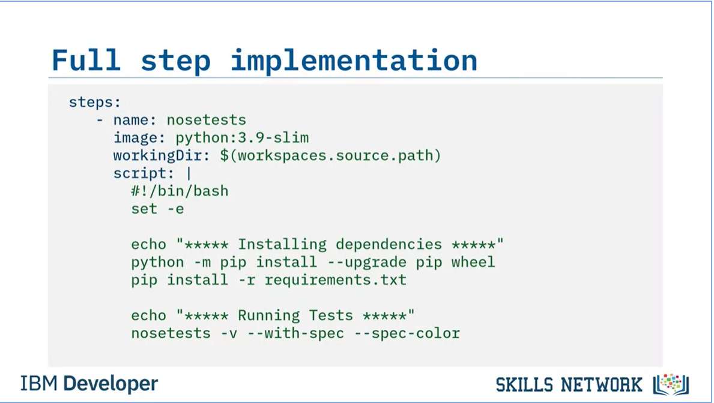
</p>

This is the full step implementation after adding your script. That\'s
how easy it is to take existing scripts and incorporate them into your
Tekton pipeline. This works great until you realize that your test cases
require a database, and that the database URI is normally specified as
an environment variable.

<!--~~~~~~~~~~~~~~~~~~~~~~~~~~~~~~~~~~~~~~~~~~~~~~~~~~~~~~~~~~~~~~~~~~~~~~~~~~~~~~~~~~~~~~~~~~~~-->
<p align="center">
  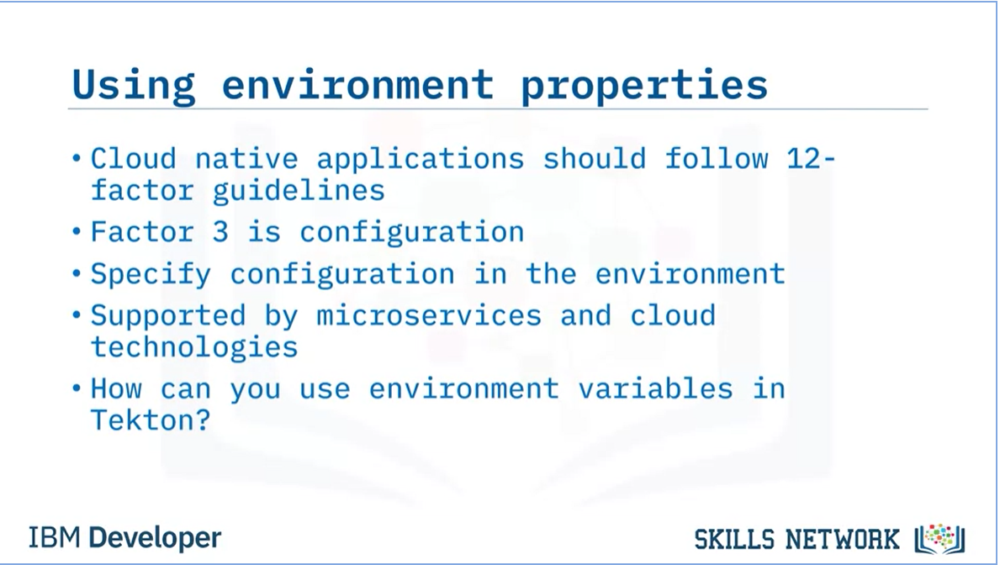
</p>

Let\'s look at how to handle this.

Cloud native applications should follow the 12-factor guidelines, which
define how to deliver software-as-a-service applications.

Factor number three is all about configuration.

In particular, it states that configuration should be specified in the
environment.

As a result, it has been widely adopted by the microservice
architecture, and every cloud provider has a way of injecting
environment properties into the runtime for things like database URIs so
that your application knows how to connect to the database.

Let\'s take a look at how you can use environment variables in Tekton to
provide a database URI for your tests.

<!--~~~~~~~~~~~~~~~~~~~~~~~~~~~~~~~~~~~~~~~~~~~~~~~~~~~~~~~~~~~~~~~~~~~~~~~~~~~~~~~~~~~~~~~~~~~~-->
<p align="center">
  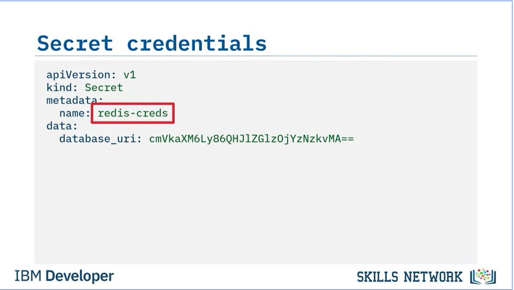
</p>

Let\'s say you have a secret named \"redis-creds\" defined in your
Kubernetes cluster.

It has a data value called \"database_uri\" that contains the
base64-encoded credentials and URL to make the database connection.

Your test cases are expecting this to be available as an environment
variable called all uppercase DATABASE_URI so that they can connect to
the test database.

Let\'s look at how to define this.

<!--~~~~~~~~~~~~~~~~~~~~~~~~~~~~~~~~~~~~~~~~~~~~~~~~~~~~~~~~~~~~~~~~~~~~~~~~~~~~~~~~~~~~~~~~~~~~-->
<p align="center">
  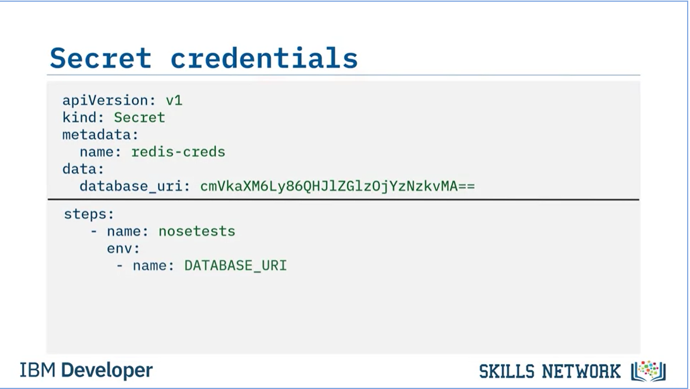
</p>

In the nosetests task in your Tekton steps, you can create an
environment definition to make this variable available to your task.

The name should be the name of the environment variable that your test
cases are expecting.

In this example, that's DATABASE_URI, all uppercase.

<!--~~~~~~~~~~~~~~~~~~~~~~~~~~~~~~~~~~~~~~~~~~~~~~~~~~~~~~~~~~~~~~~~~~~~~~~~~~~~~~~~~~~~~~~~~~~~-->
<p align="center">
  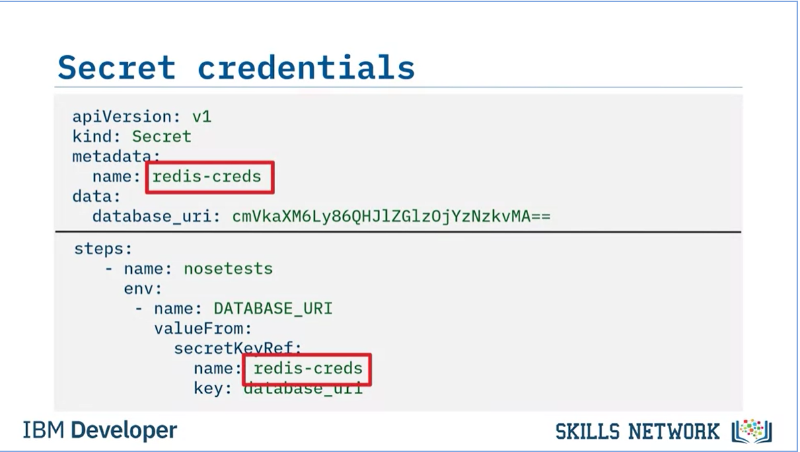
</p>

You define that the value is coming from a secret.

<!--~~~~~~~~~~~~~~~~~~~~~~~~~~~~~~~~~~~~~~~~~~~~~~~~~~~~~~~~~~~~~~~~~~~~~~~~~~~~~~~~~~~~~~~~~~~~-->
<p align="center">
  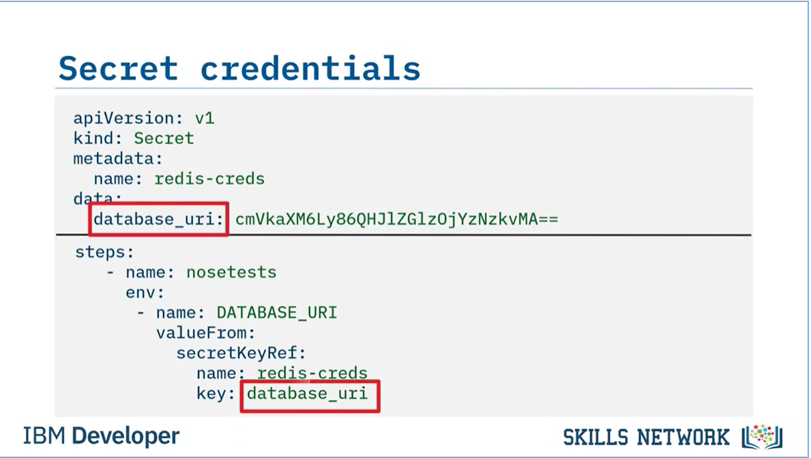
</p>

The name of that secret is \"redis-creds\", and the data key is called
\"database_uri\".

This is what maps the value of the key in the secret to the value of the
environment variable that your tests see.

<!--~~~~~~~~~~~~~~~~~~~~~~~~~~~~~~~~~~~~~~~~~~~~~~~~~~~~~~~~~~~~~~~~~~~~~~~~~~~~~~~~~~~~~~~~~~~~-->
<p align="center">
  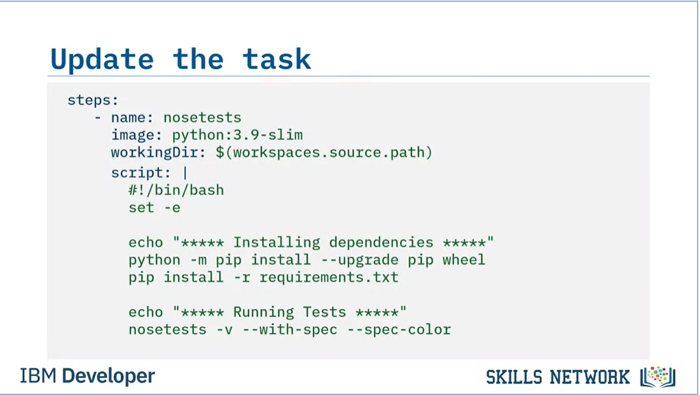
</p>

Let\'s see how you can add this to your Tekton task.

This is your current task.

You can insert the environment definition anywhere in the step, so you
add it right above the script.

<!--~~~~~~~~~~~~~~~~~~~~~~~~~~~~~~~~~~~~~~~~~~~~~~~~~~~~~~~~~~~~~~~~~~~~~~~~~~~~~~~~~~~~~~~~~~~~-->
<p align="center">
  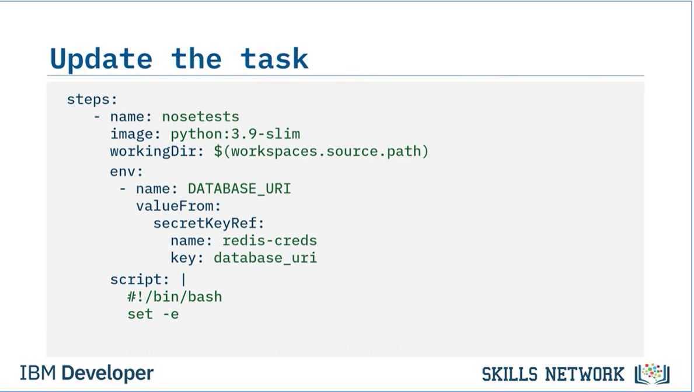
</p>

You move the script down to make some room, and paste the code from the
previous example.

And you\'re done!

It\'s that simple.

Now when these test cases run, the environment variable called
DATABASE_URI will be available for the tests to use to connect to the
database. As mentioned earlier, all cloud providers have a way of
injecting environment properties into their runtimes. So, this technique
can also be used when running Tekton pipelines in a cloud environment.

<!--~~~~~~~~~~~~~~~~~~~~~~~~~~~~~~~~~~~~~~~~~~~~~~~~~~~~~~~~~~~~~~~~~~~~~~~~~~~~~~~~~~~~~~~~~~~~-->
<p align="center">
  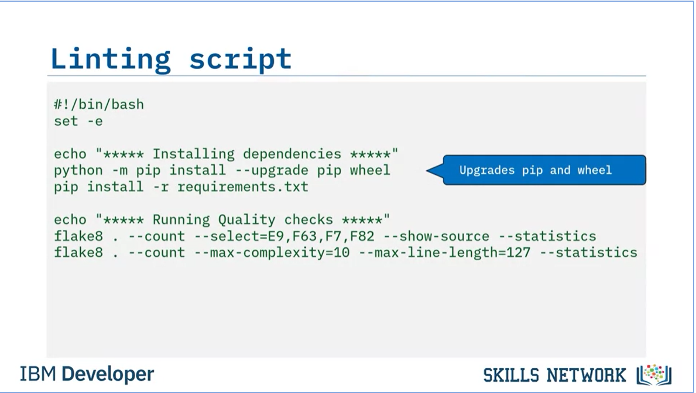
</p>

You use the same method for creating your own task for quality checks
like linting. You start with a script that you already have.

Just like the test script, this script starts out by upgrading pip and
wheel so that you're using the latest version.

Then, it uses pip to install the required Python package dependencies.

<!--~~~~~~~~~~~~~~~~~~~~~~~~~~~~~~~~~~~~~~~~~~~~~~~~~~~~~~~~~~~~~~~~~~~~~~~~~~~~~~~~~~~~~~~~~~~~-->
<p align="center">
  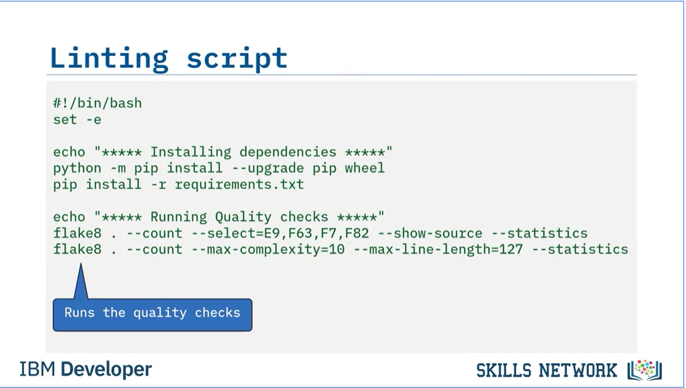
</p>

Finally, it runs the flake8 command to check for any quality issues.

Once again, you can use this exact script in your Tekton task, which
means that the same commands developers are using to lint their code
locally can be used in your Tekton pipeline as well.

You could also make it more generic and pass in the arguments as
parameters.

You can decide how flexible you want to make it.

<!--~~~~~~~~~~~~~~~~~~~~~~~~~~~~~~~~~~~~~~~~~~~~~~~~~~~~~~~~~~~~~~~~~~~~~~~~~~~~~~~~~~~~~~~~~~~~-->
<p align="center">
  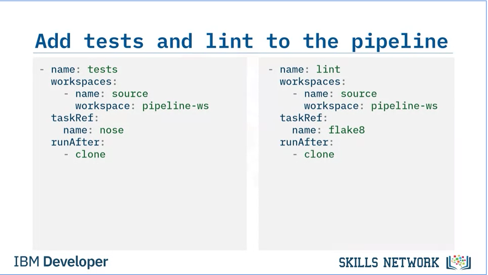
</p>

Now, let\'s look at how you can add these two new steps to the pipeline.

You define a new pipeline task and give it a name.

In this example, you name it \'tests\'.

You specify any workspaces needed to share the code from previous tasks.

Then, you refer to the task you just wrote, called \'nose\'.

This tells Tekton to run the \'nose\' task.

Finally, you tell Tekton when to run this pipeline task and specify to
run it after the \`clone\` task because you must clone the code from
GitHub before you can run tests on it.

The lint task is much the same except that it uses the name \'lint\' and
references the \'flake8\' task you created.

<!--~~~~~~~~~~~~~~~~~~~~~~~~~~~~~~~~~~~~~~~~~~~~~~~~~~~~~~~~~~~~~~~~~~~~~~~~~~~~~~~~~~~~~~~~~~~~-->
<p align="center">
  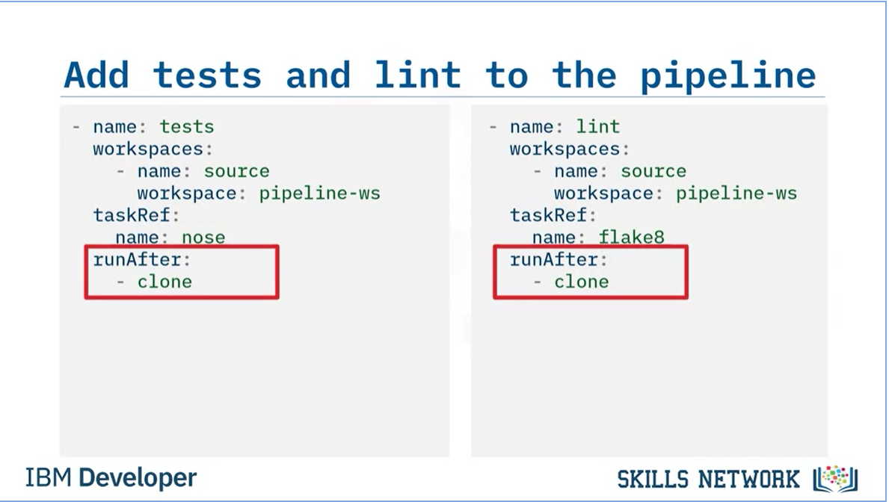
</p>

These two tasks run in parallel because they are both specified to run
after the clone task.

So, both tasks will run after the clone task completes.

<!--~~~~~~~~~~~~~~~~~~~~~~~~~~~~~~~~~~~~~~~~~~~~~~~~~~~~~~~~~~~~~~~~~~~~~~~~~~~~~~~~~~~~~~~~~~~~-->
<p align="center">
  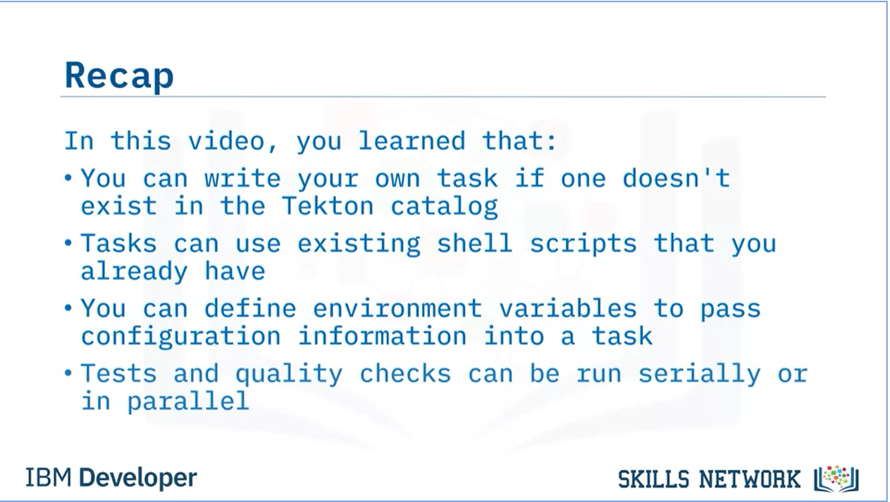
</p>

In this module, you learned that;

-   You can write your own task if one doesn\'t exist in the Tekton
    catalog,

-   These tasks can use existing shell scripts that you already have,

-   You can define environment variables to pass configuration
    information into a task, and

-   Tasks like tests and quality checks, can be run serially or in
    parallel, depending on your needs.

<h3>Lab: Integrating Unit Test Automation</h3>

Welcome to Integrating Unit Test Automation. In this lab, we will take
the code that was cloned in the previous pipeline step and run linting
and unit tests against it to make sure it is ready to be built and
deployed.  

Skills Network Labs (SN Labs) is a virtual lab environment used in this
course.  Upon clicking the \"Open Tool\" button below, your Username and
Email will be passed to SN Labs and will be used in strict accordance
with IBM Skills Network Privacy policy, such as for communicating
important information to enhance your learning experience.  

In case you need to download the lab instructions
click [HERE](https://cf-courses-data.s3.us.cloud-object-storage.appdomain.cloud/IBM-CD0215EN-SkillsNetwork/labs/module3/04_unit_test_automation.md.html) to
open a new tab. 

Integrating Unit Test Automation (External resource)

Clicking on the Open Tool button below will launch the cloud based SN
labs virtual labs environment with instructions to complete this lab.
Your username and email will be shared with SN Labs to authenticate and
provision your lab environment.

Open Tool 

<h2 id="3-11">Module 3-11. Building an Image (5:30)</h2>

Welcome to 'Building an Image.'

<!--~~~~~~~~~~~~~~~~~~~~~~~~~~~~~~~~~~~~~~~~~~~~~~~~~~~~~~~~~~~~~~~~~~~~~~~~~~~~~~~~~~~~~~~~~~~~-->
<p align="center">
  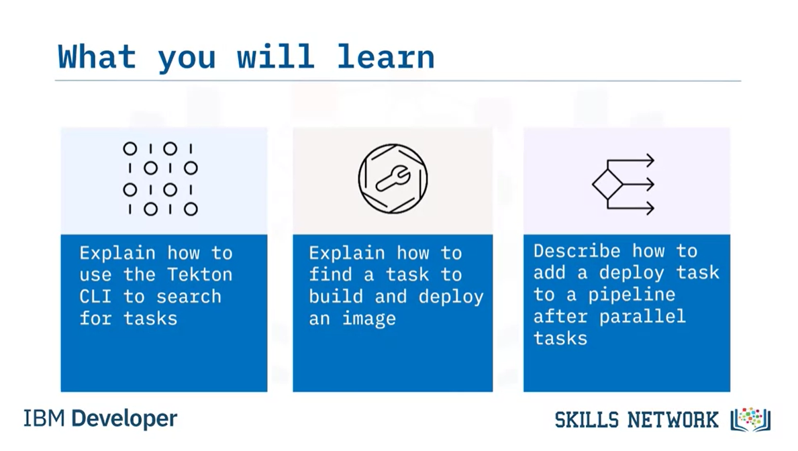
</p>

After this module, you will be able to;

-   Explain how to use the Tekton CLI to search for tasks,

-   Explain how to find a task to build and deploy an image, and

-   Describe how to add a deploy task to a pipeline after parallel
    tasks.

<!--~~~~~~~~~~~~~~~~~~~~~~~~~~~~~~~~~~~~~~~~~~~~~~~~~~~~~~~~~~~~~~~~~~~~~~~~~~~~~~~~~~~~~~~~~~~~-->
<p align="center">
  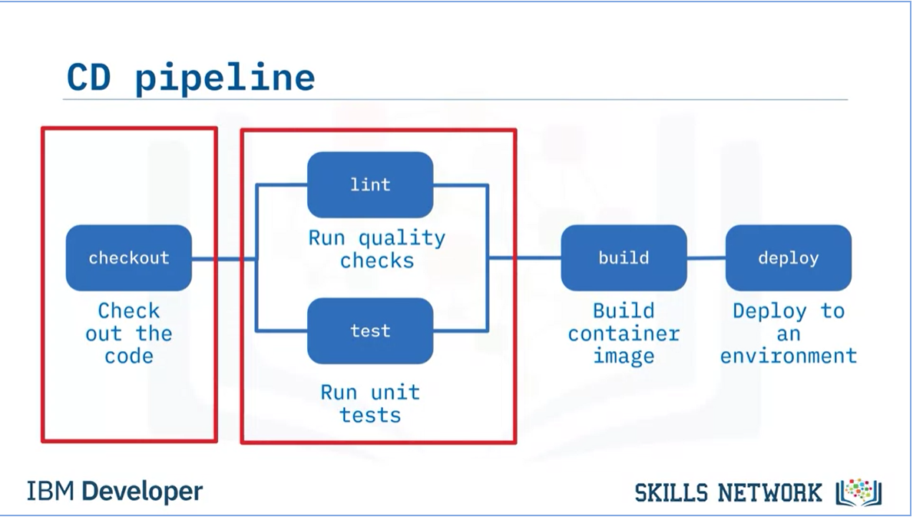
</p>

So far in creating your CD pipeline, you have addressed checking out the
code by cloning it from GitHub, and running quality checks and unit
tests like flake8 and nose.

<!--~~~~~~~~~~~~~~~~~~~~~~~~~~~~~~~~~~~~~~~~~~~~~~~~~~~~~~~~~~~~~~~~~~~~~~~~~~~~~~~~~~~~~~~~~~~~-->
<p align="center">
  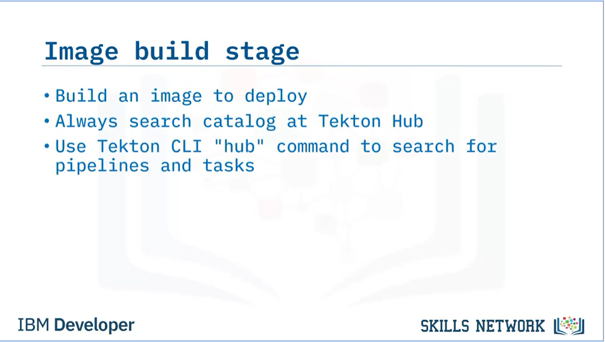
</p>

Now it\'s time to build a container image in preparation to deploy to
Kubernetes.

The purpose of the image build stage is to build a container image that
you can push to a registry in preparation for deploying it into a
Kubernetes environment.

It\'s a good habit to get into searching the Tekton catalog at Tekton
Hub for any new tasks you might need including this build task.

In fact, you can also use the Tekton CLI \"hub\" command to search for
pipelines and tasks.

<!--~~~~~~~~~~~~~~~~~~~~~~~~~~~~~~~~~~~~~~~~~~~~~~~~~~~~~~~~~~~~~~~~~~~~~~~~~~~~~~~~~~~~~~~~~~~~-->
<p align="center">
  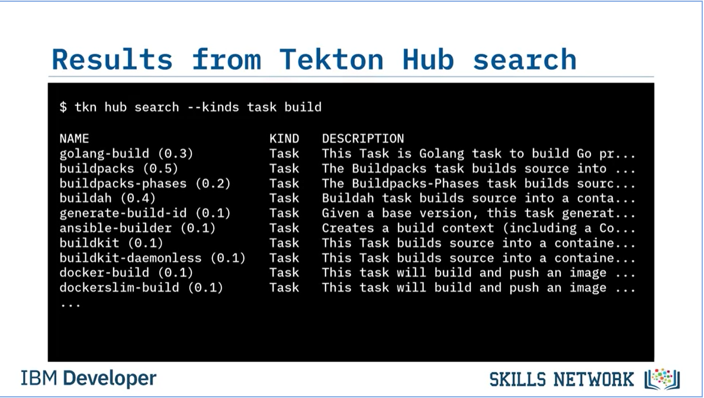
</p>

Let\'s see how that works.

You can use the command \'tkn hub search\' followed by the \"build\"
search criteria.

You can also add the \`\--kinds\` flag to indicate that you're only
searching for tasks right now.

All the tasks that match the \"build\" keyword are returned.

<!--~~~~~~~~~~~~~~~~~~~~~~~~~~~~~~~~~~~~~~~~~~~~~~~~~~~~~~~~~~~~~~~~~~~~~~~~~~~~~~~~~~~~~~~~~~~~-->
<p align="center">
  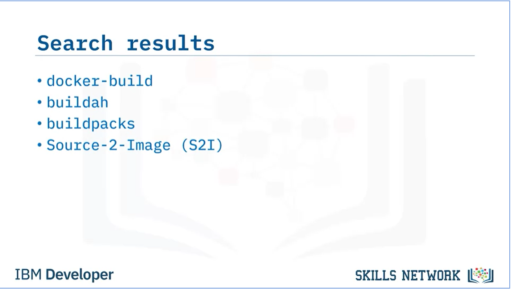
</p>

Let\'s take a closer look at some of the returned search results.

Docker-build builds a Docker image from a Dockerfile and pushes a Docker
image to a registry.

This is what you want, so it might be a candidate.

Another result is buildah.

The buildah task builds a source into a container image from a
Dockerfile and then pushes it to a container registry using Project
Atomic\'s Buildah build tool.

That looks like another likely candidate.

Buildpacks was also returned.

It accomplishes pretty much the same as the first two except that it
uses Cloud Native Buildpacks.

These are pluggable, modular tools that transform application source
code into Open Container Initiative (or OCI) images without the need for
Dockerfiles.

There is also Source-2-Image (or s2i) which, like buildpacks, transforms
your source code into OCI container images without the need for creating
a Dockerfile.

There are many build tasks to choose from, but you select buildah as the
tool for your pipeline.

<!--~~~~~~~~~~~~~~~~~~~~~~~~~~~~~~~~~~~~~~~~~~~~~~~~~~~~~~~~~~~~~~~~~~~~~~~~~~~~~~~~~~~~~~~~~~~~-->
<p align="center">
  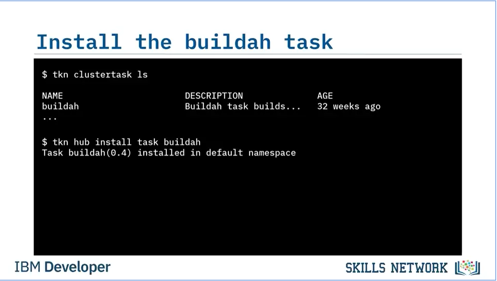
</p>

I\'d like to point out that administrators can install tasks at the
cluster level.

It\'s always a good idea to use the command: \`tkn clustertask ls\' to
see what cluster tasks are installed.

In this example, buildah is installed at the cluster level so there is
no need to install it locally into your namespace.

Anyone in the cluster can use cluster tasks in their pipelines.

If it isn't installed at the cluster level, you can install the buildah
task into your local namespace using the Tekton CLI.

The command is \'tkn hub install task\' followed by the name of the task
you want to install, which in this case is \'buildah'.

You should see a result returned that indicates that buildah has been
installed into your current namespace.

<!--~~~~~~~~~~~~~~~~~~~~~~~~~~~~~~~~~~~~~~~~~~~~~~~~~~~~~~~~~~~~~~~~~~~~~~~~~~~~~~~~~~~~~~~~~~~~-->
<p align="center">
  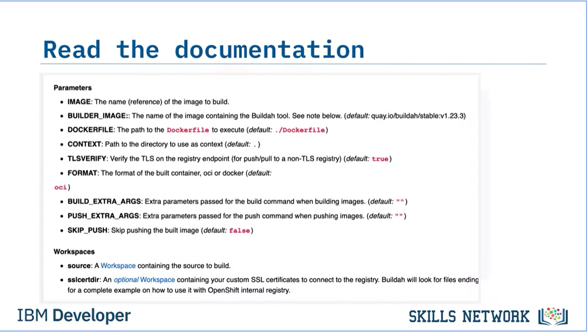
</p>

So, how do you make use of the buildah task?

<!--~~~~~~~~~~~~~~~~~~~~~~~~~~~~~~~~~~~~~~~~~~~~~~~~~~~~~~~~~~~~~~~~~~~~~~~~~~~~~~~~~~~~~~~~~~~~-->
<p align="center">
  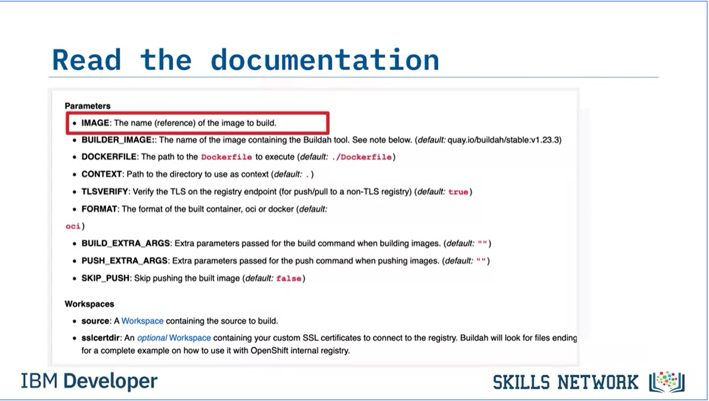
</p>

When you read the buildah documentation on Tekton Hub, you see that the
only required parameter is the \'IMAGE\' parameter because it doesn\'t
have a default.

<!--~~~~~~~~~~~~~~~~~~~~~~~~~~~~~~~~~~~~~~~~~~~~~~~~~~~~~~~~~~~~~~~~~~~~~~~~~~~~~~~~~~~~~~~~~~~~-->
<p align="center">
  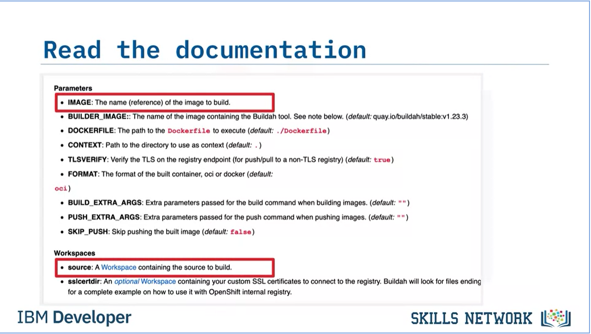
</p>

You also see that it requires a workspace named \'source\'.

With those two pieces of information, you are ready to add the buildah
task to your Tekton pipeline.

<!--~~~~~~~~~~~~~~~~~~~~~~~~~~~~~~~~~~~~~~~~~~~~~~~~~~~~~~~~~~~~~~~~~~~~~~~~~~~~~~~~~~~~~~~~~~~~-->
<p align="center">
  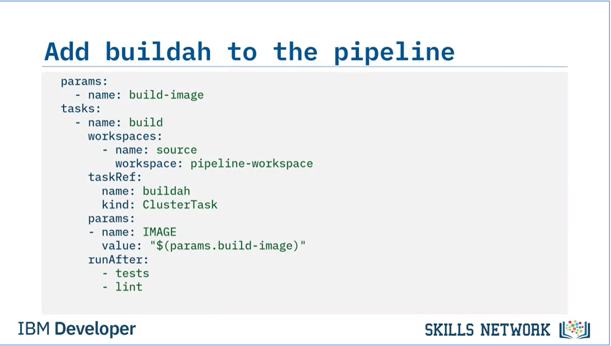
</p>

To add buildah to the pipeline, you start by adding a new pipeline
parameter call \'build-image'.

You will pass this parameter to the buildah task in a moment.

Now you can add a new task.

There will be other tasks in the pipeline, but it doesn\'t matter where
you add this task because it will always run after the tasks that you
specify, not in the order in which you write them.

You give this task the name \'build\'.

Then, you add a definition for the workspace.

The documentation states that buildah needs a workspace called
\'source\' so you name the workspace \'source\' and use your
pipeline-workspace persistent volume claim (or PVC).

Next, you reference the installed buildah task.

If you are using the cluster task version, you must tell Tekton by using
the \'kind\' keyword with a value of 'ClusterTask.'

This is not needed if you installed it locally in your namespace.

Now it\'s time to create a parameter called \'IMAGE\' because that\'s
the name of the parameter that buildah will look for.

You give it a value that references the \'params.build-image\' from your
pipeline parameter of the same name.

Finally, you specify that this pipeline task should run after both the
\'tests\' and \'lint\' tasks have completed.

<!--~~~~~~~~~~~~~~~~~~~~~~~~~~~~~~~~~~~~~~~~~~~~~~~~~~~~~~~~~~~~~~~~~~~~~~~~~~~~~~~~~~~~~~~~~~~~-->
<p align="center">
  
</p>

If you remember, \'tests\' and \'lint\' are running in parallel, so if
you want to make sure that you don\'t build an image until the code is
tested and linted,

then you must specify both of those tasks by name as prerequisites for
the build task using the \'runAfter\' keyword.

And that\'s it.

You have successfully added a build task to your pipeline using buildah.

<!--~~~~~~~~~~~~~~~~~~~~~~~~~~~~~~~~~~~~~~~~~~~~~~~~~~~~~~~~~~~~~~~~~~~~~~~~~~~~~~~~~~~~~~~~~~~~-->
<p align="center">
  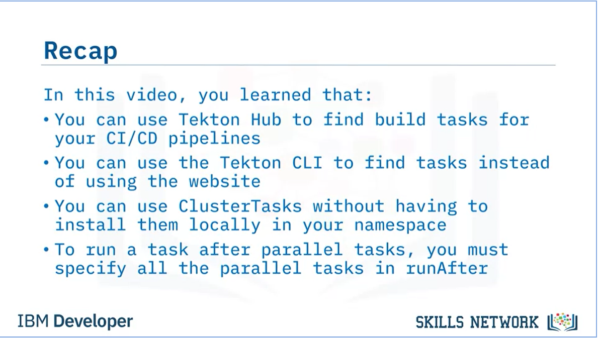
</p>

In this module, you learned that;

-   You can use Tekton Hub to find build tasks for your CI/CD pipelines,

-   You can use the Tekton CLI to find tasks instead of using the
    website,

-   You can use ClusterTasks without having to install them locally in
    your namespace, and

-   To run a task after parallel tasks, you must specify all the
    parallel tasks in runAfter.

<h3>Hands-on Lab: Building an Image</h3>

Welcome to the hands-on lab for **Building an Image**. You are now at
the build step, which is the next to last step in your CD pipeline.
Before you can deploy your application, you need to build a Docker image
and push it to an image registry. Luckily, there is a ClusterTask from
the Tekton catalog available on your cluster that can do that \--
the** buildah** ClusterTask.  

Skills Network Labs (SN Labs) is a virtual lab environment used in this
course.  Upon clicking the \"Open Tool\" button below, your Username and
Email will be passed to SN Labs and will be used in strict accordance
with IBM Skills Network Privacy policy, such as for communicating
important information to enhance your learning experience. 

In case you need to download the lab instructions,
click [HERE](https://cf-courses-data.s3.us.cloud-object-storage.appdomain.cloud/IBM-CD0215EN-SkillsNetwork/labs/module3/05_build_an_image.md.html) to
open in a new tab.

<h3>Building an Image (External resource)</h3>

Clicking on the Open Tool button below will launch the cloud-based SN
labs virtual labs environment with instructions to complete this lab.
Your username and email will be shared with SN Labs to authenticate and
provision your lab environment.

Open Tool 

<h2 id="3-12">Module 3-12. Deploying to Kubernetes (6:55)</h2>

Welcome to 'Deploying to Kubernetes.'

<!--~~~~~~~~~~~~~~~~~~~~~~~~~~~~~~~~~~~~~~~~~~~~~~~~~~~~~~~~~~~~~~~~~~~~~~~~~~~~~~~~~~~~~~~~~~~~-->
<p align="center">
  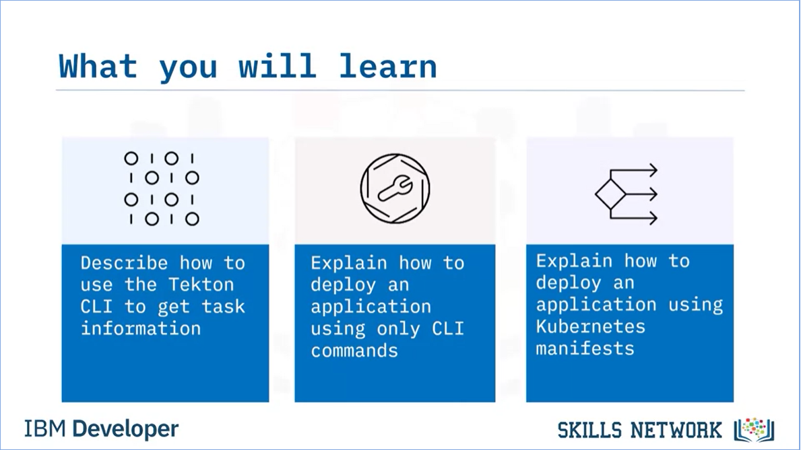
</p>

After this module, you will be able to;

-   Describe how to use the Tekton CLI to get task information,

-   Explain how to deploy an application using only CLI commands, and

-   Explain how to deploy an application using Kubernetes manifests.

<!--~~~~~~~~~~~~~~~~~~~~~~~~~~~~~~~~~~~~~~~~~~~~~~~~~~~~~~~~~~~~~~~~~~~~~~~~~~~~~~~~~~~~~~~~~~~~-->
<p align="center">
  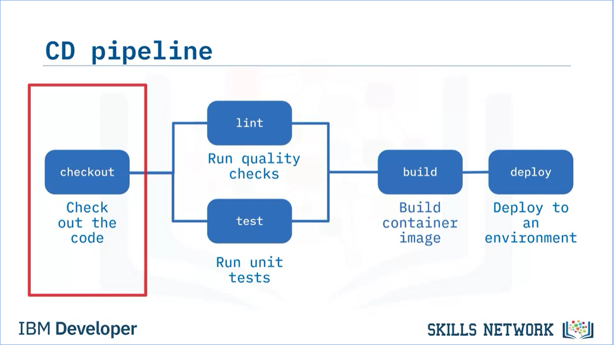
</p>

You are now at the final stage of your CD pipeline.

You have addressed checking out the code by cloning it from GitHub,
running quality checks and unit tests like flake8 and nose, and you have
built a container image and pushed it to a local registry.

<!--~~~~~~~~~~~~~~~~~~~~~~~~~~~~~~~~~~~~~~~~~~~~~~~~~~~~~~~~~~~~~~~~~~~~~~~~~~~~~~~~~~~~~~~~~~~~-->
<p align="center">
  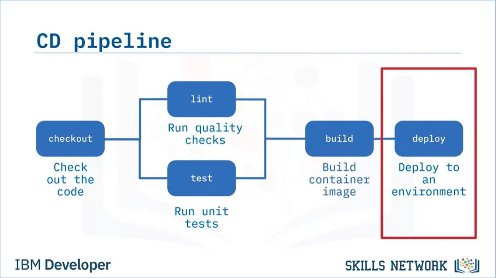
</p>

Now it\'s time to deploy your application to an environment,
specifically Kubernetes.

<!--~~~~~~~~~~~~~~~~~~~~~~~~~~~~~~~~~~~~~~~~~~~~~~~~~~~~~~~~~~~~~~~~~~~~~~~~~~~~~~~~~~~~~~~~~~~~-->
<p align="center">
  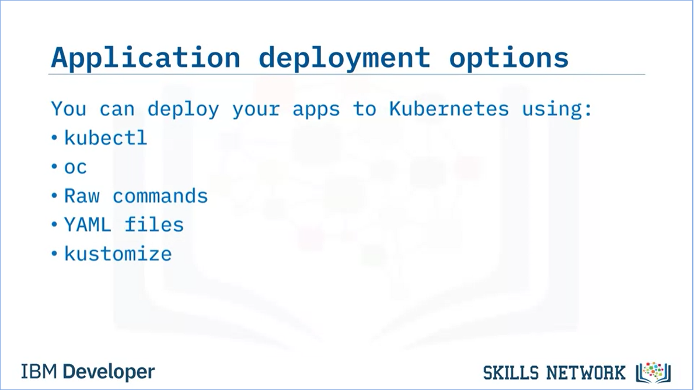
</p>

There are many ways that you can choose to deploy your application to
Kubernetes.

You could use the kubectl command to deploy to the cluster.

This is the official Kubernetes command line interface, or CLI.

You can also use the OC (or OpenShift Cluster CLI) command if you\'re
deploying to an OpenShift cluster, as you will in the labs.

Many of the \`oc\` commands work with native Kubernetes as well because
\`oc\` is a proper superset of \'kubectl\'.

For both of these methods, you could use raw CLI commands with lots of
parameters to configure your resource.

But most people deploy using Kubernetes manifests in the form of YAML
files that contain the description of the resources they want to deploy.

Finally, there\'s a tool called kustomize (with a K), which is now part
of the kubectl command, that allows you to customize those deployments
to different environments on the fly with minimal changes to your
manifest files.

<!--~~~~~~~~~~~~~~~~~~~~~~~~~~~~~~~~~~~~~~~~~~~~~~~~~~~~~~~~~~~~~~~~~~~~~~~~~~~~~~~~~~~~~~~~~~~~-->
<p align="center">
  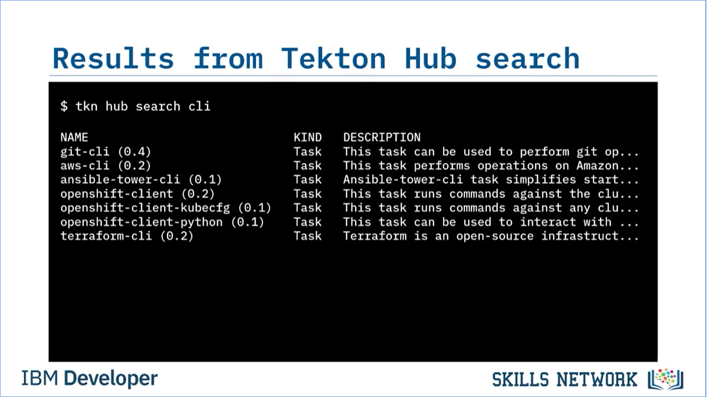
</p>

Since you want to use one of the command line interfaces to deploy your
application, you can use the command \'tkn hub search\' followed by the
\"cli\" search criteria to search for tasks that have been annotated
with the \'cli\' tag.

All the tasks that match the keyword \"cli\" or have the \'cli\' tag are
returned.

<!--~~~~~~~~~~~~~~~~~~~~~~~~~~~~~~~~~~~~~~~~~~~~~~~~~~~~~~~~~~~~~~~~~~~~~~~~~~~~~~~~~~~~~~~~~~~~-->
<p align="center">
  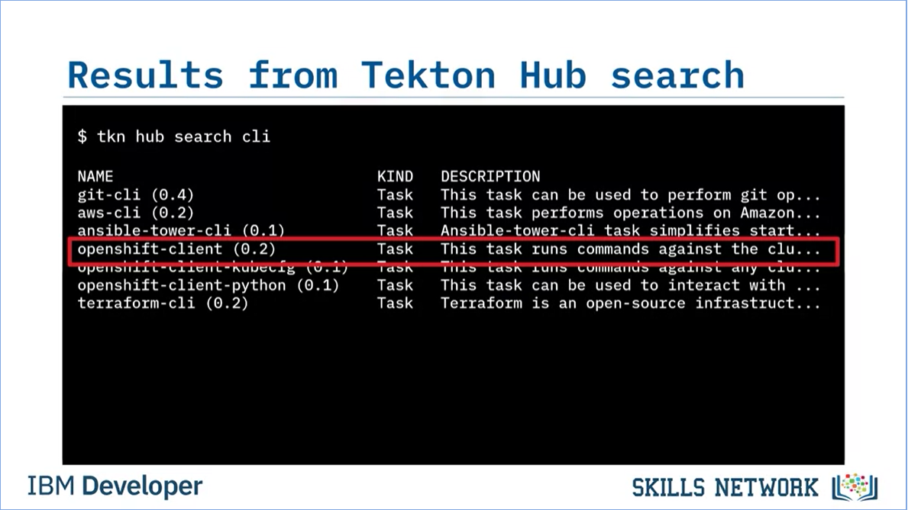
</p>

You can see that the \`openshift-client\` is in this list, so let\'s
investigate that one.

<!--~~~~~~~~~~~~~~~~~~~~~~~~~~~~~~~~~~~~~~~~~~~~~~~~~~~~~~~~~~~~~~~~~~~~~~~~~~~~~~~~~~~~~~~~~~~~-->
<p align="center">
  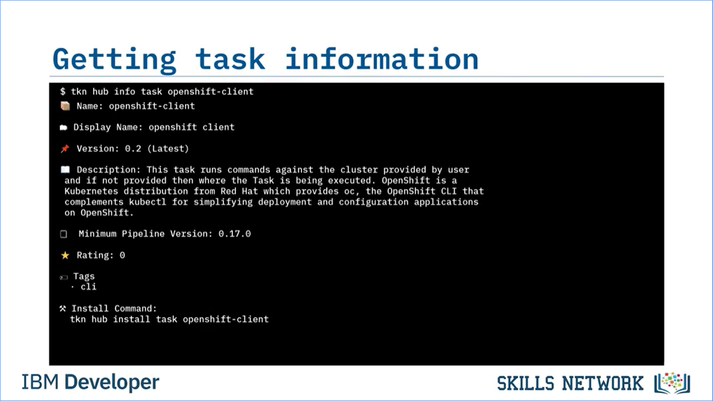
</p>

You can get more information on a task from the command line without
going to Tekton Hub.

To do this, you use the command \'tkn hub info task\' and then the name
of the task that you want information on, which in this example is
\'openshift-client\'.

You see a detailed description returned that describes the task and even
tells you how to install it.

<!--~~~~~~~~~~~~~~~~~~~~~~~~~~~~~~~~~~~~~~~~~~~~~~~~~~~~~~~~~~~~~~~~~~~~~~~~~~~~~~~~~~~~~~~~~~~~-->
<p align="center">
  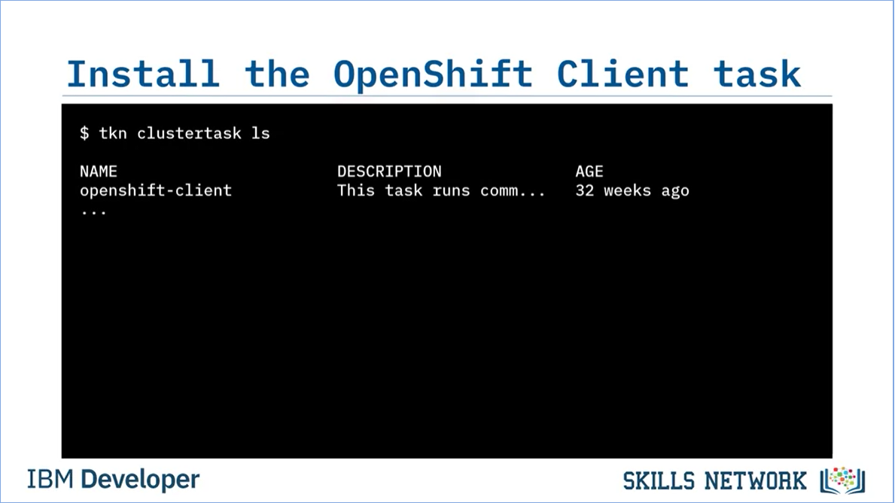
</p>

From the description, you can see that this is exactly what you need, so
let\'s install it.

Once again, I\'d like to point out that tasks can be installed by an
administrator at the cluster level or at the local level.

It\'s always a good idea to use the command: \`tkn clustertask ls\' to
see what cluster tasks are already installed.

In this example, openshift-client is installed at the cluster level so
there is no need to install it locally in your namespace.

If this is the case in your cluster, you are good to go.

<!--~~~~~~~~~~~~~~~~~~~~~~~~~~~~~~~~~~~~~~~~~~~~~~~~~~~~~~~~~~~~~~~~~~~~~~~~~~~~~~~~~~~~~~~~~~~~-->
<p align="center">
  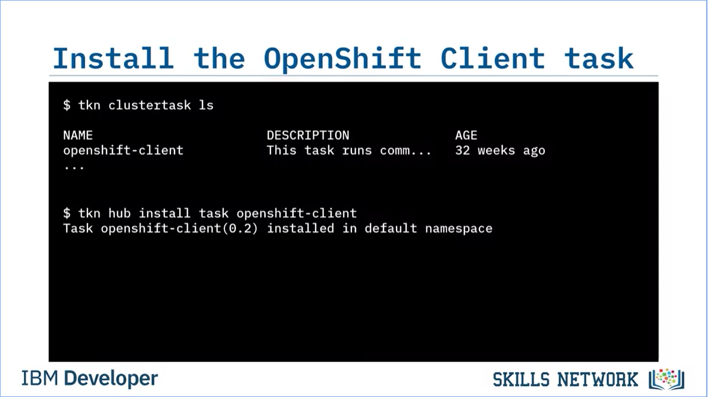
</p>

Otherwise, you can install the openshift-client task using the Tekton
CLI.

The command is \'tkn hub install task\' and then the name of the task
that you want to install, which in this case is \'openshift-client\'.

You should see a returned result indicating that openshift-client has
been installed in your current default namespace.

<!--~~~~~~~~~~~~~~~~~~~~~~~~~~~~~~~~~~~~~~~~~~~~~~~~~~~~~~~~~~~~~~~~~~~~~~~~~~~~~~~~~~~~~~~~~~~~-->
<p align="center">
  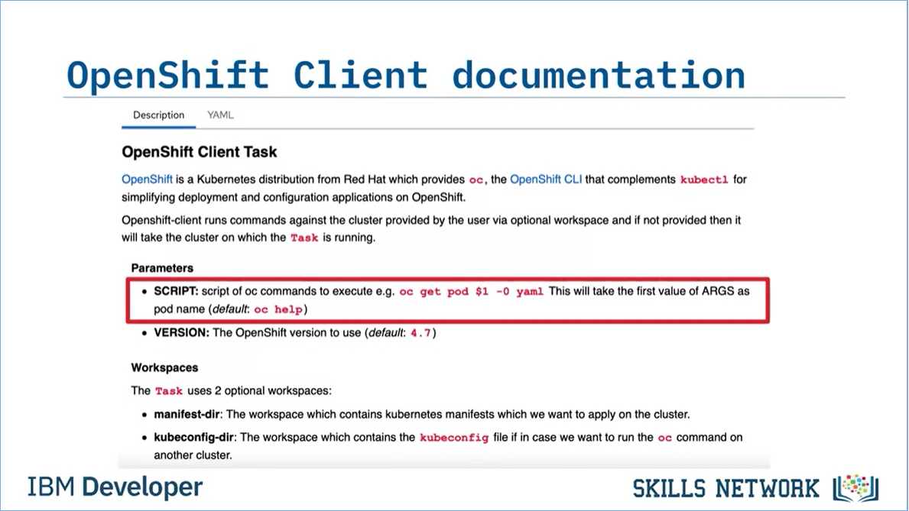
</p>

If you look at the OpenShift Client task documentation on Tekton Hub,
you see that it requires only one parameter with the name SCRIPT that
represents the script you want to run.

<!--~~~~~~~~~~~~~~~~~~~~~~~~~~~~~~~~~~~~~~~~~~~~~~~~~~~~~~~~~~~~~~~~~~~~~~~~~~~~~~~~~~~~~~~~~~~~-->
<p align="center">
  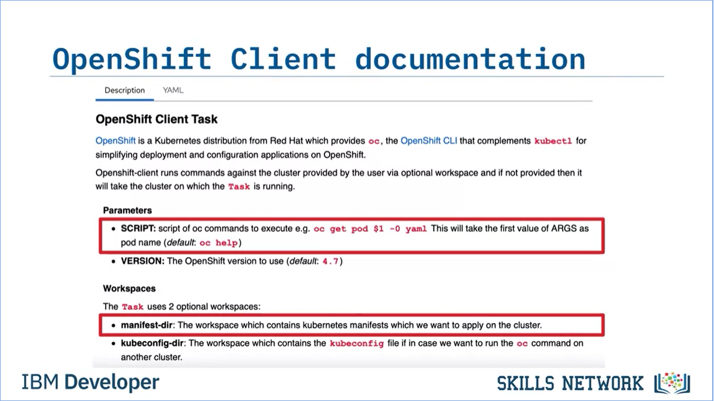
</p>

It also specifies an optional parameter named \'manifest-dir\' if you
have any manifests you want to deploy from.

This looks to be perfect for deploying your application in a variety of
ways.

<!--~~~~~~~~~~~~~~~~~~~~~~~~~~~~~~~~~~~~~~~~~~~~~~~~~~~~~~~~~~~~~~~~~~~~~~~~~~~~~~~~~~~~~~~~~~~~-->
<p align="center">
  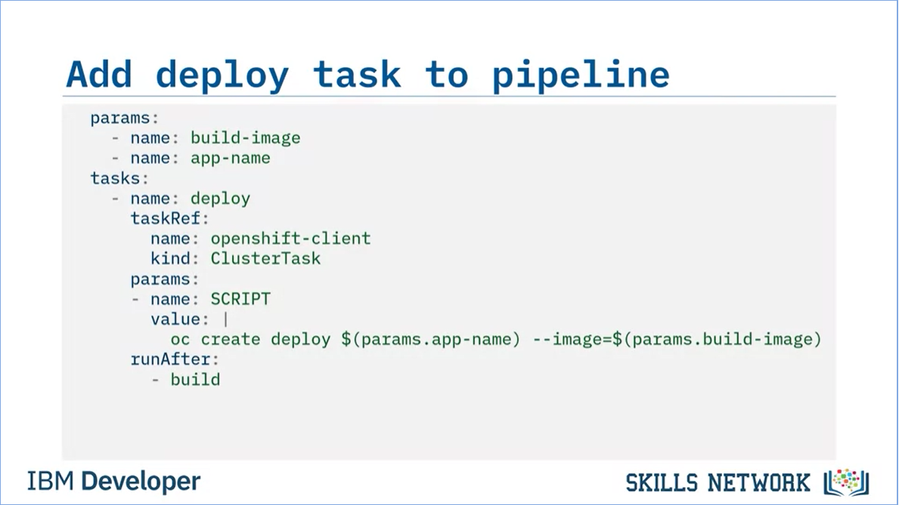
</p>

Let\'s add the deploy task to the pipeline using a single command line
that specifies the deployment name and what image to use.

You can reuse the pipeline parameter called \'build-image\' from the
build task.

This is the nice thing about pipeline parameters, you can reuse them
across multiple pipeline tasks.

You need to add a new pipeline parameter for the application name, which
you call \'app-name\', to be used later with the \'oc\' command.

Now you can add a new task.

You name it \'deploy\'.

Then, you reference the openshift-client task you installed.

If you are using the cluster task version, you must tell Tekton by using
the \'kind\' keyword with the ClusterTask value.

This is not needed if you installed it locally in your namespace.

Now it\'s time to create a parameter called \'SCRIPT\' because that\'s
the name of the parameter that openshift-client will look for.

You give it a value that starts with a vertical bar (the pipe character)
to indicate that the following lines are to be treated as one script.

You use the \'oc create deploy\' command, passing it the name of the
application and the name of the image from the pipeline parameters.

This is why you added \'app-name\' to the parameters above.

Finally, you specify that this pipeline task should run after the
\'build\' task to be sure that the image is built before you deploy it.

And that\'s it.

You have successfully added a deploy task to your pipeline using the
openshift-client task from the Tekton catalog at Tekton Hub.

<!--~~~~~~~~~~~~~~~~~~~~~~~~~~~~~~~~~~~~~~~~~~~~~~~~~~~~~~~~~~~~~~~~~~~~~~~~~~~~~~~~~~~~~~~~~~~~-->
<p align="center">
  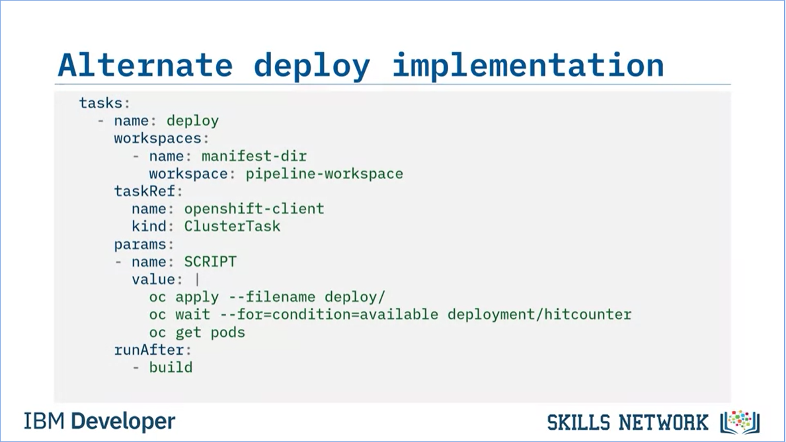
</p>

Let\'s look at an alternate deploy implementation.

Let\'s say you have Kubernetes manifests in the form of YAML files that
specify the resources that you want to deploy.

That will look slightly different.

You don\'t need any pipeline parameters for this task.

Everything will be specified in the manifests.

You start by adding a new task and naming it \'deploy\'.

Then, you add a definition for the workspace.

The documentation stated that the openshift-client task can use an
optional workspace named \'manifest-dir\', so you make that the name and
use your pipeline-workspace persistent volume claim.

Next, you will reference the openshift-client task you installed.

Once again, if you are using the cluster task, you must set the \'kind\'
to ClusterTask, otherwise you can leave that out.

Now, you create the same parameter called \'SCRIPT\', but the script
will be slightly different.

In this script version, you want to apply all the Kubernetes manifests
in the \'deploy/\' folder.

That folder is why you added the \'manifest-dir' workspace.

You use the \'oc apply\' command with the \'\--filename\' flag and then
the folder that contains the manifest files.

Since a script can have multiple lines, you can use multiple commands.

In this example, you wait for the deployment to roll out, and then list
the pods.

Finally, you specify that this pipeline task should run after the
\'build\' task that builds the image you are deploying.

So, that\'s an alternate way of deploying your application to Kubernetes
when you have a set of manifest YAML files that you want to apply.

<!--~~~~~~~~~~~~~~~~~~~~~~~~~~~~~~~~~~~~~~~~~~~~~~~~~~~~~~~~~~~~~~~~~~~~~~~~~~~~~~~~~~~~~~~~~~~~-->
<p align="center">
  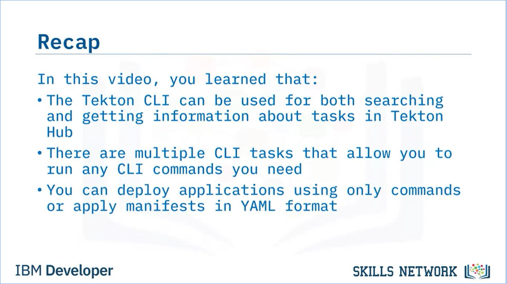
</p>

In this module, you learned that;

-   The Tekton CLI can be used for both searching and getting
    information about tasks in Tekton Hub,

-   There are multiple CLI tasks that allow you to run any CLI commands
    that you need, and

-   You can deploy applications using only commands or apply manifests
    in YAML format.

<h3>Hands-on Lab: Deploy to Kubernetes/ Open Shift</h3>

Welcome to the hands-on lab for **Deploying to Kubernetes / OpenShift**.
You are now at the deploy step, which is the last step in your CD
pipeline. For this step, you will use the OpenShift client to deploy
your Docker image to an OpenShift cluster.  

Note: OpenShift is based on Kubernetes. Anything you can do with
Kubernetes, you can do that and more with OpenShift. This lab uses the
commands **kubectl **and** oc** interchangeably because **oc** is a
proper superset of** kubectl.  **

Note: In case you are unable to access the Open Tool button,
instructions to complete this lab are also
available [here ](https://cf-courses-data.s3.us.cloud-object-storage.appdomain.cloud/IBM-CD0215EN-SkillsNetwork/labs/module3/06_deploy_to_kubernetes.md.html).  

<h3>Deploy to Kubernetes/OpenShift (External resource)</h3>

Clicking on the Open Tool button below will launch the cloud-based SN
labs virtual labs environment with instructions to complete this lab.
Your username and email will be shared with SN Labs to authenticate and
provision your lab environment.

<h4>Open Tool</h4>

<h3>Reading: Summary & Highlights: Implementing Pipelines with Tekton</h3>

Congratulations! You have completed this lesson. At this point in the
course, you know: 

-   The conceptual building blocks of Tekton are events, triggers,
    pipelines, tasks, and steps. 

-   The physical building blocks of Tekton are Kubernetes custom
    resource definitions (CRDs). 

-   You can create Tekton pipelines by referencing tasks and passing in
    required parameters. 

-   EventListeners listen for external events, TriggerBindings respond
    to those events and bind parameters from them, and TriggerTemplates
    create PipelineRuns that pass the parameters to the pipeline. 

-   The Tekton Catalog, or Tekton Hub, contains reusable tasks for your
    CI/CD pipelines. 

-   The PipelineRun must map the workspace to a PersistentVolumeClaim. 

-   You can use existing shell scripts within tasks and define
    environment variables to pass configuration information into tasks. 

-   You can use Tekton Hub or Tekton CLI to find build tasks for your
    CI/CD pipelines.

-   To run a task after parallel tasks, you must specify the parallel
    tasks in the runAfter field.

-   You can deploy applications to an environment using commands or YAML
    manifests.

<h3>Module Introduction</h3>

In this module, you will complete a final exam that tests your knowledge
of the course's content. The exam will include questions on topics
including but not limited to CI/CD's principles, features, benefits,
tools, and methods of implementation.

<h1>Module 4 Introduction - Final Exam (0:55)</h1>

Welcome to Module 4, the Final Exam.

Congratulations!

You've made it to the final exam.

Hopefully, you have learned all about Continuous Integration and
Continuous Delivery.

You are now ready to test your knowledge of the course's content.

Unlike the module quizzes, the final exam will cover the entire course
and pull topics from all modules, including CI/CD's principles,
features, benefits, tools, and implementation methods.

If you have read all of the modules and completed the labs, you will
hopefully do fine.

I'd like to take this final opportunity to thank you for allowing me to
share my knowledge and experience with you.

I hope you found it enlightening.

Good luck!

<h3>Congrats & Next Steps</h3>

Congratulations on completing this course on continuous integration and
continuous delivery! We hope you enjoyed it and will find great
satisfaction in using your new skills in the workplace or elsewhere. 

To continue your learning beyond this course, consider these related
programs:  

[IBM DevOps, Cloud, and Agile Foundations
Specialization](https://www.coursera.org/specializations/devops-cloud-and-agile-foundations)

[IBM DevOps and Software Engineering Professional
Certificate](https://www.coursera.org/professional-certificates/devops-and-software-engineering)

<h3>Who should take the course</h3>

The IBM DevOps, Cloud, and Agile Foundations Specialization caters to
the needs of learners interested in developing foundational knowledge in
DevOps, cloud computing, and agile development. This includes those who
are interested in starting a career in the field of DevOps, existing
developers and operations professionals, as well as executives and
managers wishing to transform their organization's approach to software
delivery.

The IBM DevOps and Software Engineering Professional Certificate caters
to the needs of learners interested in developing skills and knowledge
to start a DevOps-related job role. This includes those who are new to
application development as well as experienced software developers and
operations professionals who want to upskill with DevOps, Cloud Native,
and Agile practices, technologies, and tools.
<!-- 10-9-2023 12:37pm readme.md of ibm-ci-cd.bauska.org -->
